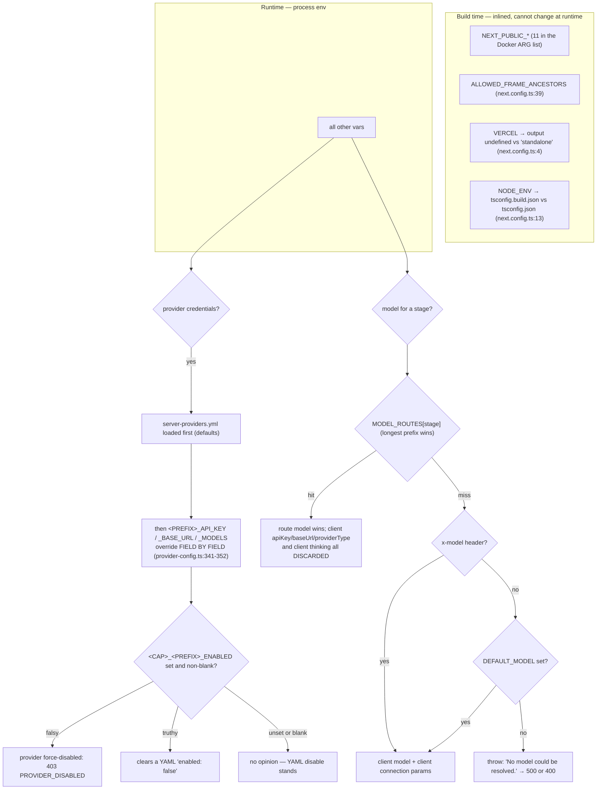
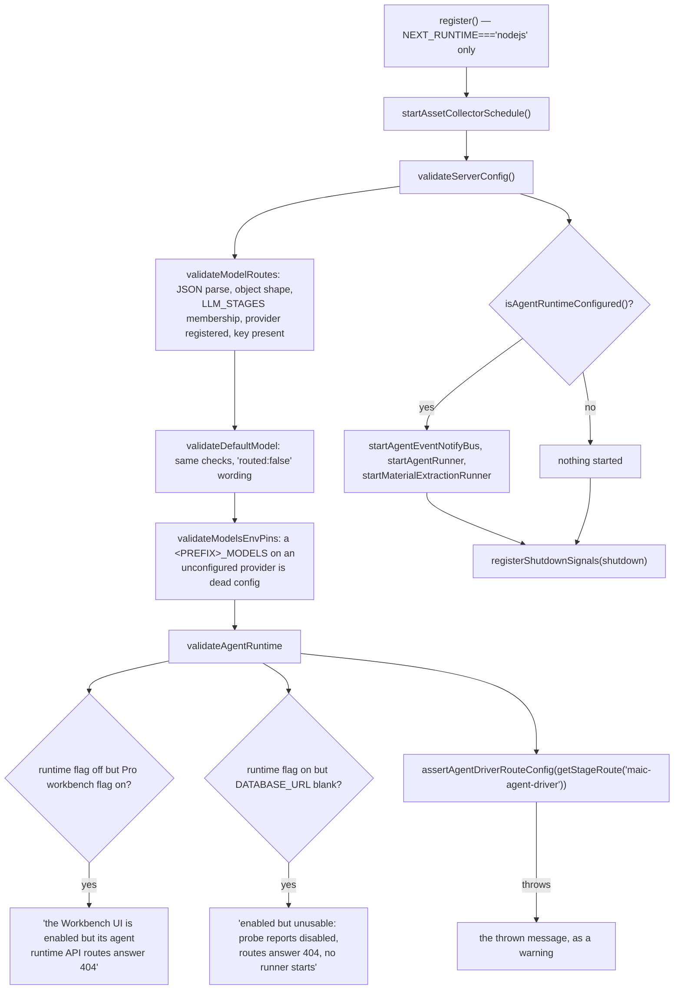

# Configuration

Every environment variable the Next.js app reads, what consumes it, whether it is
required, its default, and what happens when it is wrong. Boot validation and the
misconfiguration failure modes are at the end. The render-service, CI and eval
halves of the inventory live in
[`06b-configuration-render-service.md`](docs/15-cross-cutting/06b-configuration-render-service.md) —
the app never reads them.

**Sources:** an AST-free scan of every literal `process.env.X` / `process.env['X']`
read under `app/`, `lib/`, `components/`, `middleware.ts`, `instrumentation.ts`,
`next.config.ts`, `packages/` (91 distinct names), plus the two dynamic families
in [`lib/server/provider-config.ts:335-338`](lib/server/provider-config.ts#L335-L338) and [`:401-407`](lib/server/provider-config.ts#L401-L407) that a literal scan
cannot see; `lib/server/config-validation.ts`; `.env.example` (525 lines).

## Resolution precedence

`getStageRoute` resolves composite keys most-specific-first: `scene-content:quiz`
falls back to `scene-content` ([`lib/server/model-routes.ts:253-260`](lib/server/model-routes.ts#L253-L260)). There are 20
routable stages (`LLM_STAGES`, `:131-152`); five of them
(`pbl-chat`, bare `pbl-v2-runtime`, `generate-classroom`, `maic-agent`,
`maic-agent-driver`) have no `app/api/**` call site and are reached from `lib/**`.

## Gates and feature flags

`readBoolean` accepts exactly `'true'` or `'1'`; everything else including unset
is off ([`lib/config/feature-flags.ts:10-12`](lib/config/feature-flags.ts#L10-L12)).

| Var | Kind | Effect | Cited |
| --- | --- | --- | --- |
| `ACCESS_CODE` | runtime | Unset: middleware short-circuits to `next()`, `/api/access-code/status` reports `enabled:false`, and `POST /api/access-code/verify` returns `{valid:true}` unconditionally. Set: HMAC-signed `openmaic_access` cookie gate — 401 JSON for `/api/*`, pass-through for pages. Is itself the HMAC key. | [`middleware.ts:60-85`](middleware.ts#L60-L85), [`verify/route.ts:7-10`](app/api/access-code/verify/route.ts#L7-L10), [`status/route.ts:6-7`](app/api/access-code/status/route.ts#L6-L7), [`access-token.ts:6`](lib/server/access-token.ts#L6) |
| `OPENMAIC_AGENT_RUNTIME_ENABLED` | runtime, server-only | Intent flag for the durable runtime. On its own it starts nothing. | [`feature-flags.ts:19`](lib/config/feature-flags.ts#L19), [`instrumentation.ts:38`](instrumentation.ts#L38) |
| `DATABASE_URL` | runtime | Second half of `isAgentRuntimeConfigured()`; a whitespace-only value counts as absent. Also gates the asset-collector schedule and the `pool.end()` in the shutdown drain. Absent ⇒ the 26 runtime-gated route files answer plain 404 and `/api/persistence/*` answers `404 PERSISTENCE_NOT_CONFIGURED`. | [`feature-flags.ts:24`](lib/config/feature-flags.ts#L24), [`instrumentation.ts:82-88`](instrumentation.ts#L82-L88), [`asset-collector-schedule.ts:102-104`](lib/persistence/asset-collector-schedule.ts#L102-L104), [`persistence/[...path]/route.ts:271-274`](app/api/persistence/[...path]/route.ts#L271-L274) |
| `NEXT_PUBLIC_PRO_WORKBENCH_ENABLED` | **build** | Gates the home Pro badge, `/workspace`, `/workbench/new` and the middleware `/workbench*` 404. Implies `isMaicEditorEnabled()`. Gates no `/api` path. Absent from the Dockerfile ARG list. | [`feature-flags.ts:32-34`](lib/config/feature-flags.ts#L32-L34), [`middleware.ts:53-58`](middleware.ts#L53-L58), [`Dockerfile:51-61`](Dockerfile#L51-L61) |
| `NEXT_PUBLIC_MAIC_EDITOR_ENABLED` | **build** | Pro-mode editor toggle without the workbench; implied true by the flag above. Playwright sets it for the e2e webServer. | [`feature-flags.ts:47-48`](lib/config/feature-flags.ts#L47-L48), [`playwright.config.ts:35`](playwright.config.ts#L35) |
| `NEXT_PUBLIC_MAIC_EDITOR_RENDERER_ENABLED` | **build** | Selects `@openmaic/editor` instead of the legacy in-app canvas. Default off. Does not enable Pro mode. | [`feature-flags.ts:64-65`](lib/config/feature-flags.ts#L64-L65) |
| `NEXT_PUBLIC_MAIC_PLAYBACK_RENDERER_ENABLED` | **build** | Selects `@openmaic/renderer` for classroom playback. Default off. | [`feature-flags.ts:55-56`](lib/config/feature-flags.ts#L55-L56) |
| `NEXT_PUBLIC_PI_CHAT_ENABLED` | **build** | Selects the Pi classroom runtime **and** gates `POST /api/chat/pi` (404 `INVALID_REQUEST` when off). Also enables slide-element references in playback. Commented out in `.env.example`, so the shipped default is the LangGraph path. | [`feature-flags.ts:72-73`](lib/config/feature-flags.ts#L72-L73), [`app/api/chat/pi/route.ts:43-45`](app/api/chat/pi/route.ts#L43-L45) |
| `NEXT_PUBLIC_ENABLE_VIDEO_EXPORT` | **build** | Shows the export entry point. Nothing under `app/api/export-video/**` checks it. | [`feature-flags.ts:121-122`](lib/config/feature-flags.ts#L121-L122) |
| `NEXT_PUBLIC_ENABLE_PPTX_IMPORT` | **build** | Shows the PPTX import entry point; the import pipeline itself is unaffected. | [`feature-flags.ts:126-127`](lib/config/feature-flags.ts#L126-L127) |
| `NEXT_PUBLIC_SHOW_VOCATIONAL_TEST_UI` | **build** | Shows the experimental task-engine toggle. Explicitly *not* a security or routing gate. | [`feature-flags.ts:107-113`](lib/config/feature-flags.ts#L107-L113) |
| `OPENMAIC_ENABLE_VOCATIONAL` | runtime, server-only | Server-authoritative. Without it a request carrying `taskEngineMode` silently falls back to standard generation. | [`feature-flags.ts:97-105`](lib/config/feature-flags.ts#L97-L105) |
| `OPENMAIC_ENABLE_PI_NATIVE_CHILD_RUNTIME` | runtime, server-only | Selects the native vs legacy Pi child harness (default legacy); precondition for the native whiteboard and native web search. | [`feature-flags.ts:80-82`](lib/config/feature-flags.ts#L80-L82), [`chat/pi/route.ts:150`](app/api/chat/pi/route.ts#L150) |
| `OPENMAIC_ENABLE_PI_NATIVE_CHILD_SPOTLIGHT` | runtime, server-only | Native child spotlight capability. No effect on the legacy harness. | [`feature-flags.ts:88-90`](lib/config/feature-flags.ts#L88-L90) |
| `NEXT_PUBLIC_PERSISTENCE` | **build** | Must equal `'1'` (not `true`) *and* a `window` must exist before document+runtime storage switch from IndexedDB to `Http*Store`. Also one of four preconditions for the Pi native whiteboard. | [`bootstrap.ts:16`](lib/persistence/bootstrap.ts#L16), [`chat/pi/route.ts:169`](app/api/chat/pi/route.ts#L169) |
| `NEXT_RUNTIME` | set by Next | `'nodejs'` unlocks `register()`; anything else makes it a no-op. In middleware, `'edge'` makes the workbench gate check only the public flag. | [`instrumentation.ts:16`](instrumentation.ts#L16), [`middleware.ts:53-55`](middleware.ts#L53-L55) |
| `VERCEL` | build | Present ⇒ `output: undefined`; absent ⇒ `'standalone'` for `node server.js`. | [`next.config.ts:4`](next.config.ts#L4) |
| `NODE_ENV` | build + runtime | `'production'` selects `tsconfig.build.json`, adds `Secure` to both cookies, enables the client-base-URL SSRF checks in 8 route files plus `resolveModel`. `'test'` (or `VITEST`) makes `recordUsage` a no-op without an explicit `baseDir`. Read at 17 sites. | [`next.config.ts:13`](next.config.ts#L13), [`verify/route.ts:37`](app/api/access-code/verify/route.ts#L37), [`owner.ts:23`](lib/server/agent-runtime/owner.ts#L23), [`usage-storage.ts:100`](lib/server/usage-storage.ts#L100) |

## Security and egress

| Var | Required | Default | Effect |
| --- | --- | --- | --- |
| `ALLOWED_FRAME_ANCESTORS` | no | unset | Space-separated extras appended to `frame-ancestors 'self'`. **When set, `X-Frame-Options` is omitted entirely** because XFO has no allowlist form. Build-time; also a Docker/Compose build arg. ([`next.config.ts:39-51`](next.config.ts#L39-L51)) |
| `ALLOW_LOCAL_NETWORKS` | no | unset | `'true'`/`'1'` makes `validateUrlForSSRF` return `null` before the host, `isPrivateIP` and DNS checks, for all 13 calling route files. The URL-parse and http/https checks still run and still reject (`:255-263`). The agent's pinned-lookup path has no equivalent. ([`ssrf-guard.ts:266-269`](lib/server/ssrf-guard.ts#L266-L269)) |
| `TRUST_PROXY_HEADERS` | no | unset | Only the exact string `'true'` honours `x-forwarded-for` / `x-real-ip` for the render-service identity bucket; otherwise every caller collapses to `'direct'`. ([`export-video/render/route.ts:33-38`](app/api/export-video/render/route.ts#L33-L38)) |
| `PERSISTENCE_DEV_TOKEN` | when persistence is on | unset ⇒ 503 | `503 PERSISTENCE_DEV_TOKEN_MISSING` on every `/api/persistence/*`. Compared to the `Authorization` header via sha256 + `timingSafeEqual`. Must equal `NEXT_PUBLIC_PERSISTENCE_TOKEN`. Also gates the Pi native whiteboard and the whiteboard-visibility route. ([`persistence/[...path]/route.ts:275-281`](app/api/persistence/[...path]/route.ts#L275-L281), [`server-auth.ts:42-43`](lib/persistence/server-auth.ts#L42-L43)) |
| `NEXT_PUBLIC_PERSISTENCE_TOKEN` | with the above | unset | Bearer token sent alongside `x-learner-key`. **Compiled into the public bundle** — not a secret. ([`bootstrap.ts:31-39`](lib/persistence/bootstrap.ts#L31-L39)) |
| `ALLOW_MINERU_CLOUD_FALLBACK` | no | off | `'true'`/`'1'` lets a self-hosted MinerU selection fall back to MinerU Cloud. Default off: a self-hosted selection with no base URL 422s naming both remedies, so documents never silently leave the operator's infrastructure. ([`extract-document/route.ts:144-147`](app/api/extract-document/route.ts#L144-L147), [`:369`](app/api/extract-document/route.ts#L369), [`:375`](app/api/extract-document/route.ts#L375)) |
| `https_proxy` / `HTTPS_PROXY` / `http_proxy` / `HTTP_PROXY` | no | unset | First non-empty wins, in that order. Routes `proxyFetch` calls through an undici `ProxyAgent`. **14 files call `proxyFetch`**: three `export-video/**` routes (`render`, `render/[jobId]`, `render/[jobId]/download`), the render-service health probe ([`render-service.ts:51`](lib/server/render-service.ts#L51), which is how `export-video/capability` reaches the proxy — through `checkRenderServiceHealth`, not directly), `agent-runtime/scene-preview`, and all nine web-search backends. Ordinary provider calls do **not** use it. ([`proxy-fetch.ts:30-38`](lib/server/proxy-fetch.ts#L30-L38)) |
| `no_proxy` / `NO_PROXY` | no | unset | Comma-separated bypass list; `*` wildcard, optional `:port`, curl-style domain-suffix matching. Loopback always bypasses regardless. ([`proxy-fetch.ts:40-90`](lib/server/proxy-fetch.ts#L40-L90)) |

## Model routing and providers

| Var | Required | Default | Effect |
| --- | --- | --- | --- |
| `MODEL_ROUTES` | for the agent driver | unset | JSON object mapping one of the 20 `LLM_STAGES` keys to a model string or `{model, api?/dialect?, contextWindow?, thinking?}`. Unknown keys warn and are ignored. Unparseable JSON logs an error and the whole map is ignored. A routed stage beats `x-model` and discards the client's `apiKey`/`baseUrl`/`providerType`/thinking. ([`model-routes.ts:160-243`](lib/server/model-routes.ts#L160-L243), [`resolve-model.ts:63-81`](lib/server/resolve-model.ts#L63-L81)) |
| `DEFAULT_MODEL` | effectively yes | unset | Last resort. With no route and no `x-model`, `resolveModel` throws — there is **no** hardcoded vendor fallback. ([`resolve-model.ts:65-70`](lib/server/resolve-model.ts#L65-L70)) |
| `<PREFIX>_API_KEY` / `_BASE_URL` / `_MODELS` | per provider | unset | Read with computed keys for 7 sections: LLM (`LLM_ENV_MAP`), TTS (9 prefixes), ASR (5), PDF (3), image (7), video (6), web-search (9). Env overrides YAML field by field. The first `_MODELS` entry is authoritative over a client-selected model. ([`provider-config.ts:335-352`](lib/server/provider-config.ts#L335-L352)) |
| `<CAP>_<PREFIX>_ENABLED` | no | unset = "no opinion" | Force-off switch for tts/asr/image/video/web-search. Can only disable, never force-enable without credentials — except that an explicit `true` clears a YAML `enabled: false`. A disabled provider is 403 `PROVIDER_DISABLED` regardless of any client key. LLM and PDF deliberately excluded. ([`provider-config.ts:160-192`](lib/server/provider-config.ts#L160-L192), [`:386-408`](lib/server/provider-config.ts#L386-L408)) |
| `SEARXNG_BASE_URL` | for SearXNG | unset | The only accepted source; client-supplied SearXNG base URLs are always discarded. ([`web-search/route.ts:97-98`](app/api/web-search/route.ts#L97-L98)) |
| `TAVILY_API_KEY`, `EXA_API_KEY`, `BAIDU_API_KEY`, `BOCHA_API_KEY`, `BRAVE_API_KEY`, `WEB_SEARCH_CLAUDE_API_KEY`, `WEB_SEARCH_MINIMAX_API_KEY`, `WEB_SEARCH_DOUBAO_API_KEY` | per provider | unset | A provider needing a key with none configured returns `400 MISSING_API_KEY` naming the exact variable. ([`web-search/route.ts:196-218`](app/api/web-search/route.ts#L196-L218)) |
| `WEB_SEARCH_CLAUDE_MODELS` | no | unset | A server pin overrides any client `claudeModelId`. ([`web-search/route.ts:167-171`](app/api/web-search/route.ts#L167-L171)) |
| `BEDROCK_REGION` → `AWS_REGION` → `AWS_DEFAULT_REGION` | for Bedrock | first non-empty | Region resolution chain. Bedrock additionally must be server-managed or `resolveModel` throws. ([`lib/ai/providers.ts:1775-1777`](lib/ai/providers.ts#L1775-L1777), [`resolve-model.ts:101-103`](lib/server/resolve-model.ts#L101-L103)) |
| `AWS_BEARER_TOKEN_BEDROCK`, `BEDROCK_API_KEY`, `BEDROCK_BASE_URL`, `BEDROCK_MODELS` | for Bedrock | unset | Bedrock credentials and pin. (`provider-config.ts`) |
| `OPENAI_API_KEY`, `OPENAI_BASE_URL`, `IMAGE_OPENAI_BASE_URL` | no | unset | Direct reads alongside the computed family. (`provider-config.ts`) |
| `ALIDOCMIND_ACCESS_KEY_ID` / `_SECRET` / `ALIDOCMIND_BASE_URL` | for AliDocMind | base URL optional | An AK/SK **pair** is required; with only one, the provider is deleted from the config so it stays *unmanaged* rather than managed-with-no-credentials. Also the credential the media extractor's `availability()` probe checks, so absence makes selection fall through to local ffmpeg. ([`provider-config.ts:430-461`](lib/server/provider-config.ts#L430-L461), [`lib/document/extractors/media.ts:26-37`](lib/document/extractors/media.ts#L26-L37)) |
| `PDF_MINERU_BASE_URL`, `PDF_MINERU_BACKEND`, `PDF_MINERU_CLOUD_API_KEY`, `PDF_MINERU_CLOUD_BASE_URL` | per PDF provider | backend `'pipeline'`; cloud base `https://mineru.net/api/v4` | `PDF_MINERU_BACKEND` is the `backend` multipart field on `POST {baseUrl}/file_parse`. ([`lib/pdf/pdf-providers.ts:153-155`](lib/pdf/pdf-providers.ts#L153-L155), [`:654`](lib/pdf/pdf-providers.ts#L654), [`lib/pdf/constants.ts:8`](lib/pdf/constants.ts#L8), [`:34`](lib/pdf/constants.ts#L34)) |
| `DEFAULT_IMAGE_PROVIDER` | no | first enabled | Preferred provider for the agent's `generate_image`. Resolved through `enabledProviderIds`, so it cannot select a force-disabled provider or bypass the capability gate. ([`generate-image.ts:179-190`](lib/server/agent-runtime/generate-image.ts#L179-L190)) |
| `LLM_THINKING_DISABLED` | no | unset | Exactly `'true'` installs a global thinking-off override; a per-call config overrides it. ([`lib/ai/llm.ts:99-100`](lib/ai/llm.ts#L99-L100)) |
| `OPENAI_COMPAT_USE_STREAMING_CHAT` | no | unset | Exactly `'true'`, and only for provider `openai` on a *custom* base URL, switches to the streaming chat-completions compatibility path. ([`lib/ai/providers.ts:1838-1842`](lib/ai/providers.ts#L1838-L1842)) |
| `TTS_REQUEST_TIMEOUT_MS` | no | 30000 | Per-request TTS provider timeout. Non-finite or `<= 0` falls back to the default. ([`lib/audio/tts-providers.ts:152-158`](lib/audio/tts-providers.ts#L152-L158)) |
| `TTS_QWEN_VOICE_CLONE_MODEL` | no | unset | Server-only override of the Qwen voice-clone model, read through `resolveQwenVoiceCloneModel` — "Resolve the server-only Qwen VC model override without exposing env values to clients" ([`provider-config.ts:784-786`](lib/server/provider-config.ts#L784-L786)). No `NEXT_PUBLIC_` alias exists, so it is not inlined into the client bundle. |
| `IMAGE_MIN_PIXELS` | no | 0 (off) | Minimum-area floor; a request below it is scaled up while keeping its aspect ratio. ([`lib/server/image-sizing.ts:61`](lib/server/image-sizing.ts#L61)) |
| `PARALLEL_SCENE_CONCURRENCY` | no | 0 = serial | `> 1` enables bounded-parallel scene-*content* fetching (actions and TTS stay serial). `parseInt`, then clamped to `[0,10]`. Server-side because many keys have low per-key concurrency quotas. ([`provider-config.ts:1112-1116`](lib/server/provider-config.ts#L1112-L1116), consumed at [`lib/hooks/use-scene-generator.ts:689`](lib/hooks/use-scene-generator.ts#L689)) |

## Agent runtime and materials

| Var | Default | Effect |
| --- | --- | --- |
| `OPENMAIC_AGENT_RUNTIME_SCAN_INTERVAL_MS` | 1000 | Claim-scan period. ([`agent-runtime/config.ts:7`](lib/server/agent-runtime/config.ts#L7)) |
| `OPENMAIC_AGENT_RUNTIME_HEARTBEAT_MS` | 2000 | Lease heartbeat period. (`:9`) |
| `OPENMAIC_AGENT_RUNTIME_LEASE_TTL_MS` | 10000 | After this a running session is orphaned and reclaimable by another worker. (`:15`) |
| `OPENMAIC_AGENT_RUNTIME_MAX_CONCURRENT` | 2 | Sessions one app instance runs at once. (`:17`) |
| `OPENMAIC_AGENT_RUNTIME_MAX_ATTEMPTS` | 5 | Consecutive unattended starts/resumes before a verdict-only claim fails the session without calling the model. (`:19`) |
| `OPENMAIC_AGENT_TOOL_TIMEOUT_MS` | 600000 (10 min) | Default per-tool-call budget. The override map wins over it: `generate_scene`, `generate_actions` and `extract_material` are 15 min. This resolver **does** validate (finite and `> 0`, else the default), unlike `numberFromEnv` below. ([`lib/agent/runtime/tool-timeout.ts:31`](lib/agent/runtime/tool-timeout.ts#L31), [`:38-45`](lib/agent/runtime/tool-timeout.ts#L38-L45), [`:51-59`](lib/agent/runtime/tool-timeout.ts#L51-L59)) |
| `OPENMAIC_AGENT_SKILLS_DIR` | `<cwd>/skills/agent-runtime` | Where the skill listing and the builtin-skill zip builder read from; the loaded set is cached for the process lifetime. ([`config.ts:44`](lib/server/agent-runtime/config.ts#L44)) |
| `OPENMAIC_AGENT_MAX_UPLOAD_BYTES` | 50 MiB | Audio/video material ceiling → 413. (`:46`) |
| `MATERIALS_MAX_DOCUMENT_BYTES` | 50 MiB, `min`-ed with the above | Document/image ceiling. (`:48`) |
| `MATERIALS_MAX_COUNT_PER_OWNER` | 100 | Owner record quota → 429. (`:50`) |
| `MATERIALS_MAX_TOTAL_BYTES_PER_OWNER` | 2 GiB | Owner byte quota → 429. (`:52-55`) |
| `FETCH_URL_MIN_CONTENT_CHARS` | see code | Minimum extracted length before `fetch_url` treats a page as empty. ([`fetch-url.ts:412`](lib/server/agent-runtime/fetch-url.ts#L412)) |
| `FETCH_URL_BLOCKED_MARKERS` | unset | Extra markers that make fetched content count as blocked. ([`fetch-url.ts:417`](lib/server/agent-runtime/fetch-url.ts#L417)) |
| `OPENMAIC_AGENT_COMPACTION_ENABLED` | off | **Dead config.** Read into `agentRuntimeConfig.compaction`; a grep for `.compaction` across `lib/ app/ components/ tests/ eval/ e2e/` returns zero consumers. The comment at [`config.ts:20-26`](lib/server/agent-runtime/config.ts#L20-L26) admits the compaction runtime "lands in a later slice". |
| `OPENMAIC_AGENT_COMPACTION_RESERVE_TOKENS` | — | Dead config, same reason. (`:29-33`) |
| `OPENMAIC_AGENT_COMPACTION_KEEP_RECENT_TOKENS` | — | Dead config, same reason. (`:34-41`) |

`numberFromEnv` is `value ? Number(value) : fallback` ([`config.ts:2-3`](lib/server/agent-runtime/config.ts#L2-L3)) — so a
non-numeric value yields `NaN` rather than the default. Setting
`OPENMAIC_AGENT_RUNTIME_SCAN_INTERVAL_MS=fast` gives `setInterval(fn, NaN)`,
which Node coerces to 1 ms. No validation, no warning.

## Persistence, assets and export

| Var | Default | Effect |
| --- | --- | --- |
| `ASSET_S3_BUCKET` | unset | A valid general-purpose bucket name moves asset bytes to S3 (which can sign read URLs) and declares `writesOutsideRegistryDatabase`. Unset keeps bytes in the `asset_blobs.bytes` BYTEA column. Invalid names throw lazily so only asset requests fail. ([`asset-byte-store.ts:51-68`](lib/persistence/asset-byte-store.ts#L51-L68), [`:100-155`](lib/persistence/asset-byte-store.ts#L100-L155)) |
| `ASSET_BYTE_EGRESS` | unset = direct | `'redirect'` answers asset byte GETs with a 302 to a short-lived signed URL when the byte layer can sign. Unset, empty and `'direct'` keep byte-for-byte. Anything else warns and falls back. ([`persistence/[...path]/route.ts:43-49`](app/api/persistence/[...path]/route.ts#L43-L49)) |
| `ASSET_COLLECTION_ENABLED` | on | `'0'` or `'false'` disables reclamation in this process; anything else including unset leaves it on, because the shipped Compose deployment must be correct with no operator action. ([`asset-collector-schedule.ts:51-60`](lib/persistence/asset-collector-schedule.ts#L51-L60)) |
| `ASSET_COLLECTION_INTERVAL_MS` | 900000 | Collection period, 1000 ms floor. A non-safe-integer or below-floor value **warns and uses the default**. The first pass is one full interval after startup so a cold start does not race PostgreSQL. ([`asset-collector-schedule.ts:62-73`](lib/persistence/asset-collector-schedule.ts#L62-L73), [`:106-112`](lib/persistence/asset-collector-schedule.ts#L106-L112)) |
| `ASSET_COLLECTION_GRACE_MS` | 3600000 | Retention window for unreferenced bytes. Parsed in one place ([`asset-collection-grace.ts:17-29`](lib/persistence/asset-collection-grace.ts#L17-L29)) so the collector and the route agree — `ASSET_BYTE_EGRESS=redirect` is refused unless the grace is at least ten signed-URL lifetimes, and degrades to direct with a loud warning. ([`persistence/[...path]/route.ts:63-77`](app/api/persistence/[...path]/route.ts#L63-L77)) |
| `RENDER_SERVICE_URL` | unset | Presence is the on/off switch for one-click MP4 export; trailing slashes stripped. Unset ⇒ all four `export-video` routes report `501 PROVIDER_DISABLED` / `enabled:false`. Deliberately **not** SSRF-guarded. ([`render-service.ts:15-39`](lib/server/render-service.ts#L15-L39)) |
| `NEXT_PUBLIC_VIDEO_EXPORT_CTA_DESTINATION` | unset | Informational destination printed on exported Quiz/PBL covers. Empty or `'off'` disables silently; an invalid value logs one warning and disables it. ([`build-export-zip.ts:51-64`](lib/video-export-app/build-export-zip.ts#L51-L64)) |
| `LOG_LEVEL` | `info` | `debug` \| `info` \| `warn` \| `error`, case-insensitive. An unrecognised value silently becomes `info`. ([`lib/logger.ts:4-7`](lib/logger.ts#L4-L7)) |
| `LOG_FORMAT` | pretty | Exactly `'json'` switches to one-line JSON `{timestamp, level, tag, message}`. ([`lib/logger.ts:9-11`](lib/logger.ts#L9-L11)) |
| `npm_package_version` | `'0.1.0'` | Reported as `version` by `GET /api/health`; read once at module load. Also read by `lib/export/use-export-classroom.ts`. ([`health/route.ts:9`](app/api/health/route.ts#L9)) |
| `PORT` / `HOSTNAME` | 3000 / `0.0.0.0` | Set as `ENV` in the runner stage; the Playwright webServer uses 3002. ([`Dockerfile:89-90`](Dockerfile#L89-L90), [`playwright.config.ts:35`](playwright.config.ts#L35)) |
| `VITEST` | unset | Same as `NODE_ENV=test` for usage recording: suppresses appends to `data/usage` unless an explicit `baseDir` is given. Added after test rows were found in the live usage file. ([`usage-storage.ts:94-100`](lib/server/usage-storage.ts#L94-L100)) |
| `PATH` | inherited | Read by the local media extractor for ffmpeg discovery. (`lib/document/extractors/local-media.ts`) |
| `TEXMATH_ENDPOINT` | unset | Importer math-serializer endpoint. (`packages/@openmaic/importer/src/serializer/mathSerializer.ts`) |

## Boot validation

[`instrumentation.ts:28-29`](instrumentation.ts#L28-L29) calls `validateServerConfig()` once per server
instance. Everything it reports is a `console.warn` prefixed `[config]`; it never
throws, and a `try/catch` at [`config-validation.ts:203-212`](lib/server/config-validation.ts#L203-L212) guarantees that even
an unexpected error in validation cannot take the server down.

The one place the app *does* fail hard on config is
`assertAgentDriverRouteConfig`, and only when the route is actually used: the
`maic-agent-driver` stage must carry a provider-prefixed model id and an
`openai-completions`/`openai-responses` api, and must **not** set
`thinking.effort`; `DEFAULT_MODEL` is never consulted for the driver
([`lib/server/agent-runtime/agent-driver-model.ts:22-55`](lib/server/agent-runtime/agent-driver-model.ts#L22-L55)). At boot the failure is
downgraded to a warning ([`config-validation.ts:191-195`](lib/server/config-validation.ts#L191-L195)).

## Misconfiguration behaviour, ranked by how confusing it is

| Symptom | Cause | Where it is (or is not) explained |
| --- | --- | --- |
| Workbench UI visible, everything 404s | `NEXT_PUBLIC_PRO_WORKBENCH_ENABLED` without `OPENMAIC_AGENT_RUNTIME_ENABLED` | boot warning, [`config-validation.ts:179-183`](lib/server/config-validation.ts#L179-L183) |
| Runtime "enabled" but nothing runs | flag without `DATABASE_URL` | boot warning, `:186-190` |
| Every generation route 400s or 500s | no `MODEL_ROUTES` entry, no `x-model`, no `DEFAULT_MODEL` | request-time throw with a remedy in the message, [`resolve-model.ts:67-69`](lib/server/resolve-model.ts#L67-L69) |
| Provider reads as unconfigured despite a key | `<CAP>_<PREFIX>_ENABLED=false`, or a YAML `enabled: false` with no env opinion | 403 `PROVIDER_DISABLED`, no boot warning |
| `MODEL_ROUTES` silently ignored | invalid JSON | boot warning **and** a request-time `log.error` ([`model-routes.ts:237`](lib/server/model-routes.ts#L237)) |
| Asset redirect egress silently off | `ASSET_COLLECTION_GRACE_MS` < 10× signed-URL TTL | one-line `console.warn` naming both numbers |
| `/api/persistence/*` 503s | `DATABASE_URL` set but `PERSISTENCE_DEV_TOKEN` missing | error code `PERSISTENCE_DEV_TOKEN_MISSING`, no boot warning |
| Runner spins at 1 ms | non-numeric `OPENMAIC_AGENT_RUNTIME_*_MS` → `NaN` | **nothing** warns |
| Server providers all blank on a gated deployment | `ServerProvidersInit` 401s before the cookie exists | fixed by the `AccessCodeGuard` re-fetch, [`access-code-guard.tsx:45-54`](components/access-code-guard.tsx#L45-L54) |
| Container cannot enable Pro mode | `NEXT_PUBLIC_PRO_WORKBENCH_ENABLED` is not a Docker ARG | **nothing** warns |

## Open questions

- Whether the `NaN` coercion in `numberFromEnv` is intentional. Every other
  numeric parser in the repo ([`asset-collector-schedule.ts:62-73`](lib/persistence/asset-collector-schedule.ts#L62-L73),
  [`render-service/src/config.ts:8-13`](render-service/src/config.ts#L8-L13)) validates and falls back.
- [`next.config.ts:36`](next.config.ts#L36) sets `proxyClientMaxBodySize: '200mb'`, below the 300 MiB
  export-archive cap in [`app/api/export-video/render/route.ts:18`](app/api/export-video/render/route.ts#L18). Not traced to
  a decision.
- `.env.example` documents `NEXT_PUBLIC_PRO_WORKBENCH_ENABLED` at line 310, but
  no container build path can honour it. Either the ARG list or the example is
  wrong.
