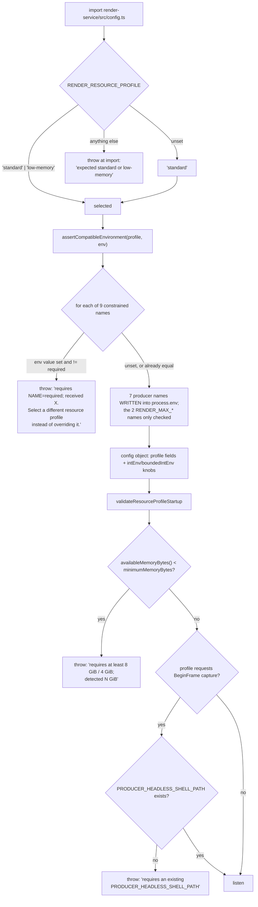
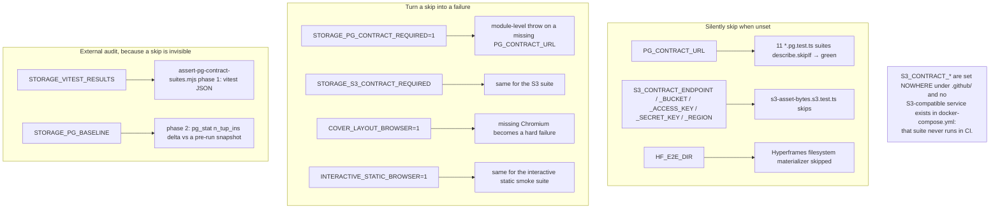

# Configuration: Render Service, CI and Eval

The second half of the env-var inventory. Nothing here is read by the Next.js
app: the render service is a separate process with its own `config.ts`, and the
CI and eval variables exist only in `.github/workflows/**`, `scripts/**`,
`tests/**` and `eval/**`. Split from
[`06-configuration.md`](./06-configuration.md) to keep both files readable.

**Sources:** `render-service/src/config.ts`, `render-service/src/resource-profile.ts`,
`render-service/docker-entrypoint.sh`, `render-service/Dockerfile`,
`docker-compose.yml:89-133`, `.github/workflows/{ci,storage-pg-contract,publish-packages,publish-openmaic-skill}.yml`,
`scripts/{assert-pg-contract-suites,check-package-version-bumps,ci-run-parallel}.*`,
`eval/*/runner.ts`, `tests/setup-env.ts`,
[`../appendix/research/media-audio-video/02g-interfaces-render-service.md`](../appendix/research/media-audio-video/02g-interfaces-render-service.md),
[`../appendix/research/quality-testing-ci-deps/04-dependencies-and-config.md`](../appendix/research/quality-testing-ci-deps/04-dependencies-and-config.md).

## Render service: the profile is the authority, not the knobs

`RENDER_RESOURCE_PROFILE` is resolved at **import** time, and
`assertCompatibleEnvironment` then does something unusual: for nine other
variables it either *writes* the profile's required value into `process.env` or
**throws** if the operator already set a conflicting one.

The two profiles (`resource-profile.ts:55-58`):

| | `standard` | `low-memory` |
| --- | --- | --- |
| capture policy | `prefer-beginframe` | `screenshot-only` |
| minimum memory | 8 GiB | 4 GiB |
| max parallel chunks | 4 | 1 |
| max preview pixels | 3840×2160 | 1920×1080 |
| max preview device scale | 2 | 1 |
| max chunk workers | 1 | 1 |

The nine constrained names — **not free knobs**: `PRODUCER_MAX_WORKERS`,
`PRODUCER_LOW_MEMORY_MODE`, `PRODUCER_FORCE_SCREENSHOT`,
`PRODUCER_BROWSER_GPU_MODE` (fixed to `software`, so SwiftShader keeps BeginFrame
eligible with no host GPU), `PRODUCER_ENABLE_BROWSER_POOL` (`false`),
`PRODUCER_EXPECTED_CHROMIUM_MAJOR` (`151`), `RENDER_REQUIRE_BEGINFRAME`,
`RENDER_MAX_CONCURRENCY`, `RENDER_MAX_CONCURRENT_EXTRACTIONS`
(`resource-profile.ts:60-105`).

## Render service: the real knobs

`intEnv` requires `> 0`; `intEnvAllowZero` accepts `0` as meaningful;
`boundedIntEnv` **throws** above the profile ceiling; `boolEnv` accepts
`true/1/on` and `false/0/off` and falls back on anything else
(`render-service/src/config.ts:8-41`).

| Var | Default | Effect |
| --- | --- | --- |
| `PORT` | 9000 | Listen port. Compose sets it explicitly. |
| `RENDER_CHUNK_EXECUTION` | `false` | Opt-in local plan → chunk → assemble path; the HTTP contract is unchanged either way. |
| `RENDER_CHUNK_COUNT` | 1 | Planned chunk count. |
| `RENDER_CHUNK_WORKERS` | profile `producerWorkers` | `boundedIntEnv` — **throws** above `maxChunkWorkers` (1 in both profiles). |
| `RENDER_MAX_PARALLEL_CHUNKS` | 1 | `boundedIntEnv` — throws above the profile ceiling (4 / 1). |
| `RENDER_CHUNK_SIZE_FRAMES` | 0 (off) | Fixed frame count per planned chunk. |
| `RENDER_TARGET_CHUNK_FRAMES` | 0 (off) | Target frame count for the producer planner. |
| `RENDER_MAX_JOBS_PER_USER` | **1** | Active (queued+running) jobs per client identity; `0` disables the guard. Compose sets `0` with a written rationale: without `TRUST_PROXY_HEADERS` every caller collapses to one identity, so a per-identity limit would throttle the whole deployment to a single render (`docker-compose.yml:111-117`). |
| `RENDER_MAX_QUEUE` | 20 | Global cap (pending + queued + running) before submits get `429 queue_full`. |
| `RENDER_JOB_TTL_MS` | 1800000 (30 min) | Finished-job record + artifact lifetime before the sweeper reaps them. |
| `RENDER_JOB_DEADLINE_MS` | 2700000 (45 min) | Hard per-job wall clock; exceeded ⇒ `deadline_exceeded`, so a hung job cannot hold a concurrency slot forever. |
| `RENDER_PREVIEW_TIMEOUT_MS` | 20000 | Synchronous preview deadline → 504. |
| `RENDER_PREVIEW_MAX_IN_FLIGHT` | 8 | Total admitted previews (buffering + executing); excess fast-fails. |
| `RENDER_PREVIEW_MAX_PER_USER` | 2 | Per-owner cap; `0` disables. Compose keeps it on because preview callers send a durable owner id in `x-openmaic-client`. |
| `RENDER_PREVIEW_MAX_JSON_BYTES` | 32 MiB | Preview JSON ceiling → 413. |
| `PRODUCER_TMP_PROJECT_DIR` | `/tmp/openmaic-renders` | Scratch root, created at boot before work is accepted (`render-service/src/main.ts:519`). |
| `RENDER_MAX_UPLOAD_BYTES` | 300 MiB | ZIP guard, on the declared compressed size. |
| `RENDER_MAX_ENTRIES` | 5000 | ZIP guard. |
| `RENDER_MAX_ENTRY_BYTES` | 200 MiB | ZIP guard, per entry. |
| `RENDER_MAX_EXPANDED_BYTES` | 512 MiB | ZIP guard, total expanded. |
| `RENDER_MAX_COMPRESSION_RATIO` | 200 | ZIP guard, per-entry expansion ratio. |
| `RENDER_EGRESS_LOCKDOWN` | `true` | When requested but iptables cannot be installed (not root, binary missing, rules fail) the entrypoint **exits non-zero** rather than serve a `/health: ok` that would advertise an unisolated renderer (`docker-entrypoint.sh:51-67`). |
| `RENDER_HOME` | `/app` | Resets `HOME` before `setpriv` drops privileges, so producer font caches do not resolve to `/root/.cache` and fail `EACCES`. `XDG_CACHE_HOME` derives from it. |
| `RENDER_SERVICE_NO_LISTEN` | unset | `'true'` suppresses `main()` so tests can import `createApp` without starting a server (`main.ts:541`). |
| `PUPPETEER_SKIP_DOWNLOAD` | set to `true` in the image and in the CI job | Skips the Chromium download; the render-service unit tests exercise unzip/admission/body caps and never launch a browser (`render-service/Dockerfile:20`, `.github/workflows/ci.yml:196-197`). |
| `PUPPETEER_EXECUTABLE_PATH` | unset | Read by `preview-renderer.ts` alongside `PRODUCER_HEADLESS_SHELL_PATH`. |
| `HF_STATIC_DEDUP` | Compose sets `false` | OpenMAIC's long slide exports exhaust the producer's 15 s static verification budget and disable dedup anyway, so the startup cost is skipped (`docker-compose.yml:107-110`). |
| `PRODUCER_PUPPETEER_PROTOCOL_TIMEOUT_MS` | Compose sets 900000 | CDP headroom for long compositions. |
| `RENDER_SERVICE_MEMORY_LIMIT` | Compose default `8g` | Container `mem_limit`. The low-memory profile needs `4g`. |

`shm_size: 2gb` is set because Chromium media/frame work exceeds Docker's 64 MiB
default shared-memory mount; it is a ceiling inside the cgroup, not an eager
allocation (`docker-compose.yml:128-130`).

## CI: gates that only fire when a variable is set

| Var | Where set | Effect |
| --- | --- | --- |
| `CI` | GitHub Actions | Playwright reads it for `forbidOnly`, retries (2 vs 0), workers (2 vs auto), reporter (`html` vs `list`), webServer command (`pnpm start` vs `pnpm dev`) and `reuseExistingServer` (`playwright.config.ts:6-30`). |
| `PG_CONTRACT_URL` | `storage-pg-contract.yml:32` | Present ⇒ the `*.pg.test.ts` suites run against that PostgreSQL; absent ⇒ every one `describe.skipIf`s to green. Also the connection `assert-pg-contract-suites.mjs` uses for its independent audit. |
| `STORAGE_PG_CONTRACT_REQUIRED` | `storage-pg-contract.yml:33` (`'1'`) | Turns a missing `PG_CONTRACT_URL` into a module-level throw. It covers only a *missing database* — it cannot fire if vitest stops collecting the modules, which is precisely why the external audit exists (`:47-52`). |
| `STORAGE_VITEST_RESULTS` | `:55` | Path passed to `vitest --outputFile.json`, then consumed as phase-1 input by the audit. Missing or non-JSON ⇒ exit 2. |
| `STORAGE_PG_BASELINE` | `:56` | Path for the pre-run `n_tup_ins` snapshot. Absent at audit time ⇒ exit 2, because counters from an earlier run against a non-ephemeral database would otherwise satisfy the check forever. |
| `S3_CONTRACT_ENDPOINT` / `_BUCKET` / `_ACCESS_KEY` / `_SECRET_KEY` / `_REGION`, `STORAGE_S3_CONTRACT_REQUIRED` | **nowhere** | Would enable the S3 asset-bytes contract suite. No `.github/` reference and no S3-compatible service in Compose, so it never runs. |
| `COVER_LAYOUT_BROWSER` | `ci.yml:274` (`'1'`) | Makes a missing Chromium a hard failure in the cover-card layout guardrail instead of a skip. Its exact value is pinned by a workflow meta-test. |
| `INTERACTIVE_STATIC_BROWSER` | `ci.yml:279` (`'1'`) | Same pattern for the interactive static HTML Chromium smoke suite; also pinned by the meta-test. |
| `HF_E2E_DIR` | `ci.yml:285`, `:292` | Output directory for the Hyperframes sample materializer; unset ⇒ skipped. CI points it at `${{ runner.temp }}` and then lints seven samples out of it. |
| `CI_PARALLEL_ANNOTATE` | `ci.yml:43` (`'0'`) | `'0'` suppresses the `::error::` annotation from `ci-run-parallel.sh:46`, which is what lets `ci.yml` assert the helper's expected-failure case without painting the check red. |
| `TEST_LOAD_LOCAL_ENV` | not set in CI | `'1'` makes `tests/setup-env.ts:23` read `.env.local` into `process.env` without overwriting existing keys. Unset (the CI and default state) keeps the suite hermetic — the docstring argues a local env file can only invent machine-specific failures. |
| `RENDERER_PERF_REPORT` | not set in CI | Read by `packages/@openmaic/editor/test/react/EditableSlideCanvas.performance.test.tsx`. |

## Release: the token boundary is a job boundary

| Var | Required | Notes |
| --- | --- | --- |
| `RELEASE_ARTIFACTS` | yes | Directory holding the packed tarballs and `SHA256SUMS`. Read by `verify-package-artifacts.mjs` three times, the tarball smoke test, and the publish loop (`publish-packages.yml:169`, `:183`, `:236`, `:270`, `:365`). |
| `RELEASE_PLAN_PATH` | yes | JSON written by `check-package-version-bumps.mjs --release` listing which `package@version` may be published; the publish loop skips anything not in the plan (`scripts/check-package-version-bumps.mjs:665`, `publish-packages.yml:364`, `:379-386`). |
| `NPM_TOKEN` | yes | npm publish credential. The workflow header states it must exist **only** as a `release`-environment secret and **not** also as a repository secret, because a repository secret is readable by a workflow on any branch (`publish-packages.yml:32-36`, used at `:362`). |
| `CLAWHUB_TOKEN` | yes | ClawHub publish credential in the `clawhub-release` environment; the workflow fails explicitly when empty and writes a `0600` config before use (`publish-openmaic-skill.yml:231-266`). |
| `SEMVER_PACKAGE_JSON`, `PREFLIGHT_FILE`, `PUBLISH_VERSION` | yes | The three inputs to `check-clawhub-version.mjs`. Any missing ⇒ "ClawHub version check environment is incomplete." and `exitCode 1` (`.github/scripts/check-clawhub-version.mjs:19-24`). |

## Eval harnesses: no defaults on purpose

`resolveEvalModel` deliberately introduces no default — every runner exits 1 with
an example model string when its variable is unset
(`eval/shared/resolve-model.ts:7-17`).

| Var | Default | Effect |
| --- | --- | --- |
| `EVAL_CHAT_MODEL`, `EVAL_SCORER_MODEL` | none | whiteboard-layout harness (`eval/whiteboard-layout/runner.ts:36-51`). |
| `EVAL_DIRECTOR_MODEL`, `EVAL_AGENT_MODEL`, `EVAL_JUDGE_MODEL` | none | orchestration harnesses (`eval/orchestration/runner.ts:55-64`). |
| `EVAL_INFERENCE_MODEL` | none | outline-language harness (`eval/outline-language/runner.ts:44-60`). |
| `EVAL_PBL_MODEL`, `EVAL_PBL_JUDGE_MODEL` | none | PBL planner harness. |
| `DEFAULT_MODEL` | none | Shared with the app; used **only** as a fallback in four eval runners when the harness-specific variable is unset. |
| `EVAL_SAMPLES` / `EVAL_DELTA` / `EVAL_END_THRESHOLD` / `EVAL_PASS_THRESHOLD` | 5 / 0.3 / 0.2 / — | Orchestration thresholds. Only the END threshold drives the exit code (`eval/orchestration/runner.ts:146-148`, `:187`). |
| `EVAL_ENABLE_THINKING`, `EVAL_PBL_THINKING`, `EVAL_PBL_THINKING_BUDGET` | off | Opt-in injection of `thinking:{enabled:true}` into the chat body so latency/quality tradeoffs can be measured without changing production defaults. |
| `EVAL_PBL_VARIANTS` / `_RUNS` / `_FILTER` / `_CONCURRENCY` / `_STAGGER_MS` / `_PORT` / `_JUDGE`, `EVAL_SCENARIO` | see each runner | Case selection, concurrency and judge on/off. |

Two scripts read their own variables and belong to neither group:
`scripts/probe-mineru-cloud.mjs` reads `MINERU_CLOUD_API_KEY` and
`MINERU_CLOUD_BASE_URL` — note the **absence** of the `PDF_` prefix the app uses,
so the probe does not share the app's configuration.

## Open questions

- Why `S3_CONTRACT_*` exists at all if nothing sets it. Either the suite should be
  deleted or Compose should gain a MinIO service under a profile.
- `scripts/probe-mineru-cloud.mjs`'s unprefixed variable names look like drift
  from `PDF_MINERU_CLOUD_API_KEY`. Not traced to a decision.
