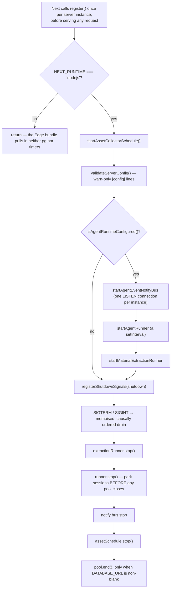
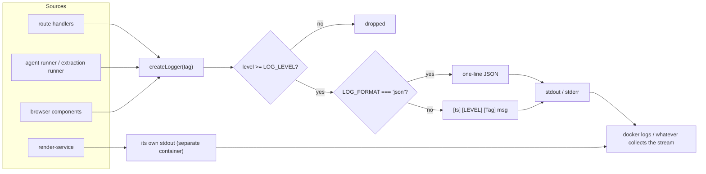
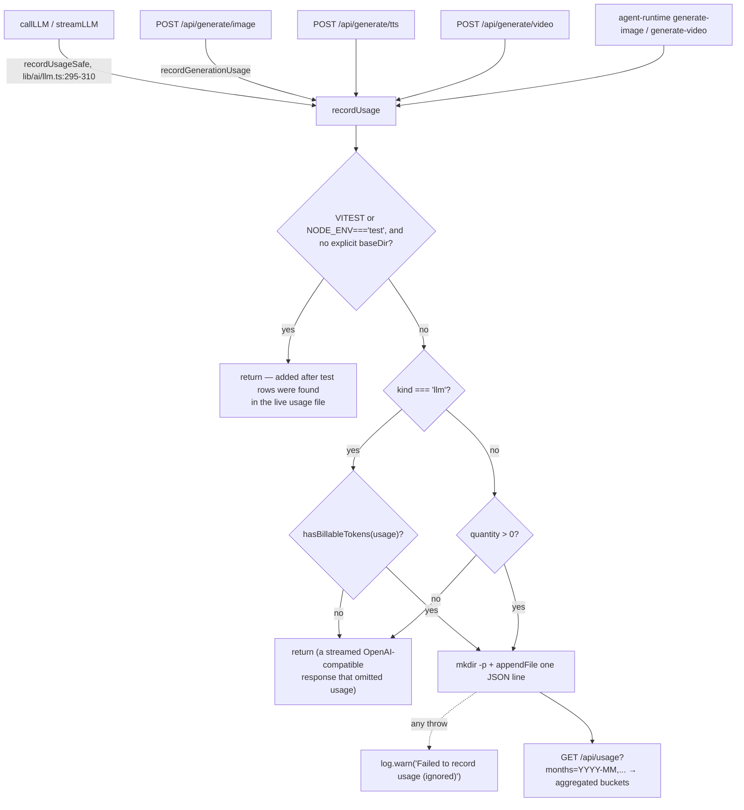

# Observability

What an operator can actually see today. The short answer: structured stdout
logs, two health endpoints, a JSONL usage ledger, and a durable per-session event
log the browser can replay. No metrics, no traces, no error aggregation.

**Sources:** `lib/logger.ts` (52 lines, the whole logging layer),
`instrumentation.ts`, `app/api/health/route.ts`, `render-service/src/main.ts:241-250`,
`lib/server/usage-storage.ts`, `app/api/usage/route.ts`, `lib/ai/llm.ts:295-310`,
`lib/agent-runtime/lifecycle.ts`, `app/api/agent/sessions/[id]/events/route.ts`,
`lib/store/persist-health.ts`, `app/api/materials/route.ts:150-169`,
[`../appendix/research/app-shell-and-routing/02a-interfaces-lifecycle-and-routing.md`](../appendix/research/app-shell-and-routing/02a-interfaces-lifecycle-and-routing.md),
[`../appendix/research/quality-testing-ci-deps/06b-quality-observations.md`](../appendix/research/quality-testing-ci-deps/06b-quality-observations.md).

## `instrumentation.ts` is not OpenTelemetry

Next's `instrumentation.ts` hook is conventionally where an OTel SDK is
registered. Here it is process-scoped **startup**, not telemetry. Verified: no
`@opentelemetry/*`, `@sentry/*`, `prom-client`, `pino` or `winston` entry exists in
the root `package.json`, and no source file under `app/`, `lib/`, `components/`,
`packages/`, `render-service/src/` or `scripts/` imports one. `@opentelemetry/api`
appears only as a transitive lockfile entry
(`render-service/package-lock.json`, `packages/docs/pnpm-lock.yaml`).

Every stage of the drain is individually `try`/`catch`ed and logs its own failure
prefix (`instrumentation.ts:63-92`), so one stuck subsystem cannot block the
others. The `process.once` calls live in a separate 15-line module
(`lib/server/register-shutdown-signals.ts`) purely so Turbopack's static Edge scan
never sees a Node API it cannot prove unreachable
(`instrumentation.ts:97-100`).

## Logging

`lib/logger.ts` is the whole layer: four levels, one tag per module, level check
per call, and a choice of pretty or JSON line format.

| | Value |
| --- | --- |
| Levels | `debug`(0) `info`(1) `warn`(2) `error`(3); `LOG_LEVEL` default `info`, unrecognised values silently become `info` |
| Format | `[ISO] [LEVEL] [Tag] message`, or one-line `{timestamp, level, tag, message}` when `LOG_FORMAT=json` |
| Sinks | `console.debug` / `console.log` / `console.warn` / `console.error` — stdout/stderr only |
| Adoption | 125 files call `createLogger`; 70 direct `console.*` calls remain in `app/`+`lib/`+`components/`, of which exactly **one** is `console.log` |
| Correlation | none built in. `app/api/materials/route.ts` mints its own `requestId` and echoes it as `x-request-id` (`:166`) — the only route that does |

There is no request-scoped logger, no trace id propagated across the browser →
route → agent-runner boundary, and no way to correlate a browser error with the
server log line it caused. `formatLine` JSON-stringifies non-string arguments, so
structured context arrives as an embedded JSON blob inside the `message` string
rather than as fields — even in `LOG_FORMAT=json` mode.

The browser half is a real gap: `createLogger` is isomorphic, so client code
using it writes to the **browser** console. Nothing ships those lines anywhere.

## Health endpoints

Two, both unauthenticated by design.

| Endpoint | Middleware-allowlisted | Body |
| --- | --- | --- |
| `GET /api/health` | yes, by exact path (`middleware.ts:66`) | `{ status:'ok', version, capabilities:{ webSearch, imageGeneration, videoGeneration, tts } }` — each capability true only when at least one non-force-disabled provider exists (`app/api/health/route.ts:12-23`) |
| `GET /health` on the render service | n/a (internal network) | `{ ok:true, accepting, resourceProfile, versions }` — **aggregate only**, deliberately never queue depths or per-identity data (`render-service/src/main.ts:241-250`) |

`version` comes from `npm_package_version` with a `'0.1.0'` fallback, read once at
module load. Neither endpoint reports database reachability, so
`GET /api/health` returns `ok` on a deployment whose PostgreSQL is down.

## Usage metering

The one persistent telemetry artefact. Append-only JSONL under
`data/usage/YYYY-MM.jsonl` (UTC month), which lands in the `openmaic-data` volume
in Compose.

A row carries `{id, createdAt, kind, source, providerId, modelId, modelString,
inputTokens, outputTokens, cacheReadTokens, cacheCreationTokens, reasoningTokens,
quantity?, unit?}` — **usage, no cost** (`lib/server/usage-storage.ts:41-59`).
`readUsageRecords` skips malformed lines and treats legacy rows without `kind` as
`'llm'`. Recording is fire-and-forget and never throws, because "a logging failure
must not break generation" (`:82-83`).

What is **not** metered: ASR. `UsageKind` includes `'asr'` and
`POST /api/transcription` never calls a recorder (grep for `usage` in that route
file returns nothing).

## The durable agent event log

The richest observability surface in the system, and it was built for the product
rather than for operators. `HOST_AGENT_LIFECYCLE` is a 13-name vocabulary
(`lib/agent-runtime/lifecycle.ts:37`) written to PostgreSQL as durable events; the
browser tails them over SSE with `Last-Event-ID` replay, a named `caught_up`
frame, a `degraded` signal when NOTIFY wakeup is unavailable, and a 25 s heartbeat
— and the stream deliberately does not close at `session_end`
(`app/api/agent/sessions/[id]/events/route.ts`).

An operator can read the same rows out of PostgreSQL. There is no aggregation, no
dashboard and no retention policy over them.

## Client-side signals

| Signal | Mechanism |
| --- | --- |
| Persistence unavailable / changes lost | `lib/store/persist-health.ts` — a framework-free one-way channel with two independent status lines per key (`unavailable` is current-state, `changes-lost` is historical and survives recovery), surfaced by `components/storage-health-notice.tsx`, mounted after `Toaster` so a mount-time toast has a host |
| Interactive-scene runtime errors | the iframe error shim buffers and replays errors on request; the host stores them per scene so the editor agent can diagnose a blank page (`InteractiveIframeHost.tsx:197-231`) |
| Access-code state | `GET /api/access-code/status`, fail-closed in the guard |
| Render progress / ETA | `lib/store/video-render.ts:121` polls the job and models an ETA |

None of these leaves the browser.

## What an operator actually has

| Question | Answerable today? |
| --- | --- |
| Is the app up? | Yes — `GET /api/health` |
| Is the render service up and accepting? | Yes — its `/health` |
| Is PostgreSQL reachable? | **No** — nothing probes it; failures surface as request errors |
| How many tokens did last month cost? | Yes — `GET /api/usage`, tokens only, no prices |
| How many images/videos/TTS characters? | Yes |
| How many ASR seconds? | **No** — not recorded |
| What is p95 latency of scene generation? | **No** — no timing metric anywhere |
| How many requests per route? | **No** |
| What is the error rate? | **No** — only individual log lines |
| Why did this user's session fail? | Partly — the durable agent event log, if it was an agent session |
| Which request produced this log line? | **No** — except on `POST /api/materials` |

## Named gaps

1. **No metrics of any kind.** No counters, no histograms, no `/metrics`. Latency,
   throughput and error rate are unobservable without parsing stdout.
2. **No tracing.** A generation run crosses browser → several routes → provider
   APIs → optionally the agent runner, with nothing correlating the hops.
3. **No error aggregation.** An unhandled exception becomes one stderr line.
4. **No database health check.** `/api/health` reports `ok` regardless.
5. **Browser logs go nowhere.** `createLogger` is isomorphic; the client half is
   write-only into the user's devtools.
6. **No log-line schema.** `LOG_FORMAT=json` gives four fields, with all context
   flattened into `message`, so a log pipeline cannot index on `stageId`,
   `ownerId` or `provider`.
7. **No coverage instrumentation.** Nine Vitest configs, zero coverage providers
   installed — so "is this control tested?" is unanswerable
   ([`../14-code-quality/index.md`](../14-code-quality/index.md)).
8. **`data/usage` grows forever.** The asset collector is the only reclamation
   job in the system; usage logs, documents, sessions, skills and materials only
   soft-delete or grow.

## Open questions

- Whether `LOG_FORMAT=json` is used anywhere in practice. It is documented at
  `.env.example:452` and read at `lib/logger.ts:10`, but nothing in Compose or the
  Dockerfile sets it.
- Whether the 70 remaining direct `console.*` calls are deliberate (they bypass
  `LOG_LEVEL` entirely, so a `LOG_LEVEL=error` deployment still gets them) or
  simply un-migrated.
