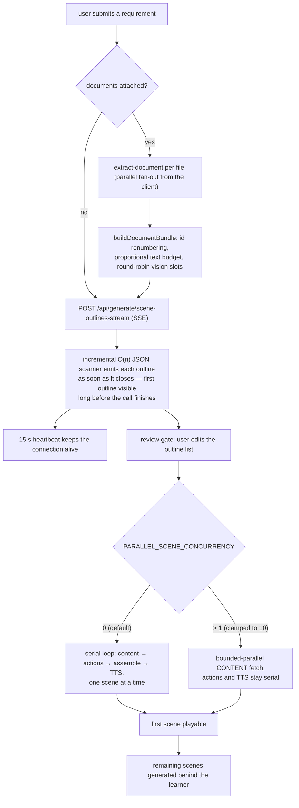
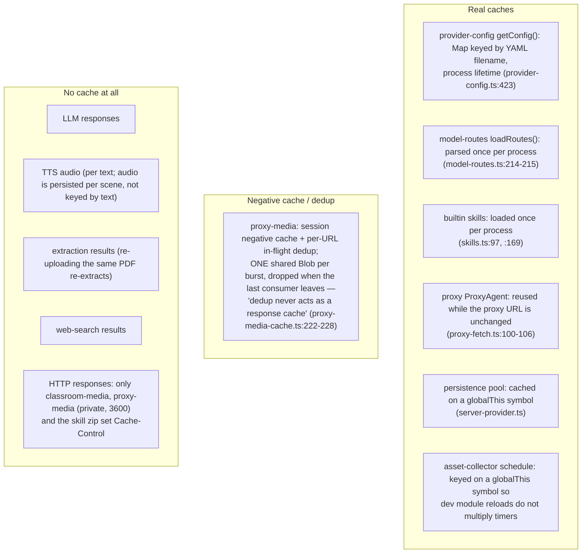
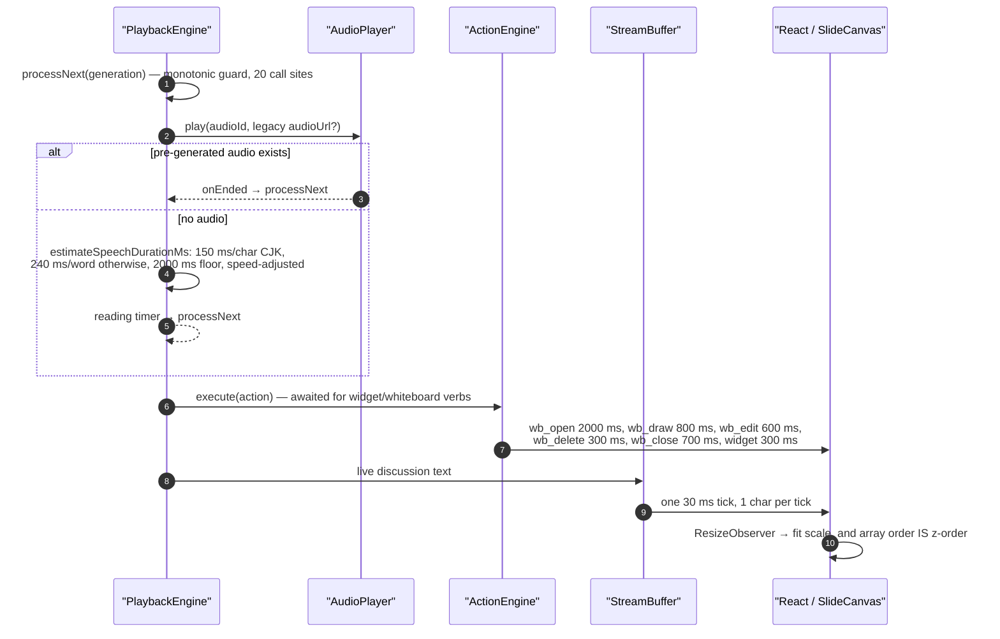

# Performance

Where the time and money actually go, what caching exists, why streaming is the
main latency strategy rather than caching, and the client-side pressure points.
Numbers here are the code's own constants and budgets, not measurements — nothing
in this repository measures latency (see
[`08-observability.md`](docs/15-cross-cutting/08-observability.md)).

**Sources:** `export const maxDuration` across 24 route files,
`lib/choreography/timing.ts`, [`lib/buffer/stream-buffer.ts:208`](lib/buffer/stream-buffer.ts#L208),
[`app/api/generate/scene-outlines-stream/route.ts:45-486`](app/api/generate/scene-outlines-stream/route.ts#L45-L486),
[`lib/server/provider-config.ts:1103-1116`](lib/server/provider-config.ts#L1103-L1116), [`lib/hooks/use-scene-generator.ts:689`](lib/hooks/use-scene-generator.ts#L689),
[`lib/media/proxy-media-cache.ts:200-280`](lib/media/proxy-media-cache.ts#L200-L280), `lib/store/video-render.ts`,
`render-service/src/config.ts`,
[`../appendix/research/media-audio-video/03b-flows-video-export.md`](docs/appendix/research/media-audio-video/03b-flows-video-export.md),
[`../appendix/research/generation-pipeline/`](docs/appendix/research/generation-pipeline/00-overview.md),
[`../appendix/research/classroom-runtime/03a-flows-playback.md`](docs/appendix/research/classroom-runtime/03a-flows-playback.md).

## Cost centres

| Centre | Unit cost | Fan-out | Bound |
| --- | --- | --- | --- |
| Outline LLM call | 1 call, streamed | once per course | `maxDuration = 300`, 512 KiB stream ceiling, 2 whole-stream retries |
| Scene content LLM call | 1 call per scene | N scenes | `maxDuration = 300`; per-type route via `scene-content:<type>` |
| Scene actions LLM call | 1 call per scene | N scenes | `maxDuration = 60` |
| TTS | 1 call per speech line | many per scene | `TTS_REQUEST_TIMEOUT_MS`, default 30 s |
| Image generation | 1 call per image | per scene | `maxDuration = 300` |
| Video generation | 1 call + polling | per scene | `maxDuration = 300`, `MAX_VIDEO_WAIT_MS = 5 min` ([`timing.ts:34`](lib/choreography/timing.ts#L34)) |
| Document extraction | 1 parse, possibly remote | per upload | 50 MiB cap; MinerU/AliDocMind round trips |
| PPTX export | pure client CPU | per export | none |
| MP4 render | a whole Chromium + FFmpeg pass | per export | `RENDER_JOB_DEADLINE_MS` 45 min, `RENDER_MAX_CONCURRENCY` fixed by profile |
| Large DSL documents | JSON parse + validate + normalise, on every read | every load | no size limit on a `Stage` document |

A course with 12 scenes therefore costs at minimum 1 + 12 + 12 = **25 LLM calls**
before any media or TTS. That is the dominant number in the system.

## Latency budget of one generation

The design decision that dominates perceived latency is **not** caching, it is
that the first scene is playable before the rest exist. Two mechanisms carry it:
the SSE outline stream with an incremental parser, and the client's
`generateRemaining` fan-out loop that runs behind playback
([`lib/hooks/use-scene-generator.ts:627`](lib/hooks/use-scene-generator.ts#L627)).

`PARALLEL_SCENE_CONCURRENCY` is deliberately server-side and default-off: "many
deployments use API keys with low per-key concurrency quotas, where a bursty
default would surface as 429s" ([`lib/server/provider-config.ts:1108-1110`](lib/server/provider-config.ts#L1108-L1110)). It is
`parseInt`-ed and clamped to `[0,10]`, and it parallelises **content only** —
actions and TTS remain serial.

## Streaming as the latency strategy

Ten routes stream. Six emit `text/event-stream` directly; four go through the
typed `createSSEResponse` helper, which also sets `X-Accel-Buffering: no` so an
nginx in front cannot buffer the stream flat (`lib/pbl/v2/api/sse.ts`). Two stream
bytes: `classroom-media` with HTTP Range support, and the MP4 download.

The outline route is the reference implementation of the pattern:

| Property | Value |
| --- | --- |
| Buffer ceiling | 512 KiB (`MAX_OUTLINE_STREAM_BYTES`, `:486`) — a runaway model cannot exhaust memory |
| Heartbeat | 15 s (`HEARTBEAT_INTERVAL_MS`, `:460`) |
| Retries | 2 whole-stream retries, with the abort signal propagated into `streamLLM` |
| Parse | O(n) incremental scanner (`:117`) rather than wait-then-`JSON.parse` |

The agent event stream goes further: `Last-Event-ID` replay, a named `caught_up`
frame, a `degraded` signal when NOTIFY wakeup is unavailable, serialised polling
with NOTIFY coalescing, a 25 s heartbeat, and it does not close at `session_end`.

## The caching that exists — and does not

There is no memoisation of an LLM call by prompt hash anywhere. Every retry, every
regeneration and every re-run of the same scene is a fresh paid call. That is
consistent with the product (courses are one-shot artefacts) but it means the
retry ladders in [`10-resilience.md`](docs/15-cross-cutting/10-resilience.md) are also cost ladders.

## Latency budget of one playback frame

Those literals live in `lib/choreography/timing.ts` precisely so the video
exporter dwells identically — the module is machine-enforced pure by a dedicated
eslint block ([`eslint.config.mjs:255-323`](eslint.config.mjs#L255-L323)), which is what stops the app engine and
the exporter from drifting.

The stream buffer's 30 ms/char pacing is a *deliberate* latency floor: a 300-char
utterance takes 9 s to reveal regardless of how fast the model produced it.

## Client-side pressure points

| File | Lines | Why it matters |
| --- | --- | --- |
| `lib/store/settings.ts` | 2248 | 91 fields, 42 setters, persist v4; hydrated on every page |
| `lib/workbench/session-store.ts` | 2173 | 840-line pure `foldEvent`, deliberately outside React so `Last-Event-ID` resumption is exact |
| `app/page.tsx` | 1896 | the whole home surface in one client component |
| `components/edit/PlaybackChromeRoot.tsx` | 1848 | owns the engine, audio player, TTS, chat ref, resume persistence and every keyboard handler |
| `app/generation-preview/page.tsx` | 1554 | drives the 6-step pipeline and the `previewPhase` machine |
| `lib/utils/chat-storage.ts` | 1455 | Dexie → RuntimeStore migration under a global shared lock plus two nested per-partition Web Locks |

Three files — `app/page.tsx` (1896), `app/generation-preview/page.tsx` (1554) and
`app/generation-preview/components/visualizers.tsx` (848, a child of the preview
route, not a route segment itself) — are 75% of the 5706 non-API source lines
under `app/`. There are six route segments in total (`app/page.tsx`,
`classroom/[id]`, `eval/whiteboard`, `generation-preview`, `workbench/new`,
`workspace`) and only two of them are server components (`/workspace`,
`/workbench/new`), both `force-dynamic`, so almost the entire product ships to
the browser.

Deliberate bundle mitigations that do exist:

- `serverExternalPackages` keeps `@earendil-works/pi-*`, `@openmaic/generation`
  and the two AWS SDK optional peers out of the bundle ([`next.config.ts:23-34`](next.config.ts#L23-L34)).
- The importer is loaded from a **static URL** (`/vendor/maic-importer/index.js`)
  with a runtime `HEAD` probe, because `pdfjs-dist`'s dynamic `require()` breaks
  Turbopack. Two guard scripts keep it from 404-ing silently:
  `scripts/sync-maic-importer.mjs` copies `packages/@openmaic/importer/dist` into
  `public/vendor/maic-importer/` during `postinstall`, and
  `scripts/assert-vendor-maic-importer.mjs` runs before `next build` and fails if
  the entry is absent. The directory is gitignored, so a fresh checkout has no
  copy of it and no size can be cited from the repository.
- The browser-safe extractor manifest mirrors provider metadata so client pages
  never pull `sharp` or `@alicloud` into the bundle.
- Fonts: the UI font comes from `@fontsource`'s stylesheet rather than `next/font`
  because only the stylesheet carries per-subset `unicode-range`; pointing
  `next/font` at one subset made Cyrillic and Vietnamese fall back mid-word
  ([`app/layout.tsx:16-29`](app/layout.tsx#L16-L29)).

## Video export

The heaviest single operation. Its cost is split deliberately: the browser always
compiles the timeline and builds the ZIP; only frame capture and encoding move to
the render service.

| Stage | Where | Bound |
| --- | --- | --- |
| `compileVideoTimeline` — 9 pure passes → IR schema v4 | browser | none |
| `collectVideoAssets` — Dexie reads, duration probes, slide PNGs | browser | none |
| `buildExportZip` — JSZip, plus 2.0 MiB of prebuilt fonts (20 KaTeX faces + Noto CJK/Cyrillic/Arabic) | browser | 300 MiB app-side cap |
| upload | streamed, unparsed | `MAX_UPLOAD_BYTES` 300 MiB, `SUBMIT_TIMEOUT_MS` 300 s |
| unzip | render service | 5 declared-size guards |
| capture + encode | render service | `RENDER_JOB_DEADLINE_MS` 45 min; concurrency 1 in both Compose profiles |
| poll + download | browser | ETA extrapolated from elapsed time and a smoothed recent-speed sample, suppressed below a floor percent because it is "too noisy to show" ([`lib/store/video-render.ts:37`](lib/store/video-render.ts#L37)) |

Fonts ship *inside* the ZIP because the render container has zero outbound
network — the isolation in [`01-trust-boundaries.md`](docs/15-cross-cutting/01-trust-boundaries.md)
buys correctness at the cost of a fatter archive.

## `maxDuration` distribution

24 of 69 route files declare one. `300` on the 13 streaming/generation routes
(`agent/owner-events`, `agent/sessions/[id]/events`, `chat/pi`,
`export-video/render`, `generate/image`, `generate/video`,
`generate/scene-content`, `generate/scene-outlines-stream`, `pbl/v2/evaluate`,
`pbl/v2/instructor`, `pbl/v2/open-task`, `pbl/v2/simulator`,
`stages/[id]/freshness`), `60` on five mid-weight ones (`chat`, `scene-actions`,
`proxy-media`, `transcription`, `pbl/v2/task/update`), `120` on
`agent-profiles`, `30` on five short ones (`azure-voices`, `generate/tts`,
`generate/voice`, `generate-classroom`, `verify-image-provider`). The 45 that
declare nothing take
the platform default — which on Vercel is far below 300 s, so an undeclared
long-running route is a latent timeout on that platform.

## Open questions

- No performance test, benchmark or budget exists anywhere. The one perf-adjacent
  artefact is `packages/@openmaic/editor/test/react/EditableSlideCanvas.performance.test.tsx`
  behind `RENDERER_PERF_REPORT`.
- Whether TTS output is ever reused for identical text. Audio is persisted per
  scene as an `AudioFileRecord` with a measured `duration`, but nothing keys it by
  text hash, so an edited-then-reverted line pays twice.
- `generate-classroom` declares `maxDuration = 30` and runs the actual work in
  `after()`. Whether the platform honours `after()` past the response is
  platform-dependent and not asserted anywhere.
