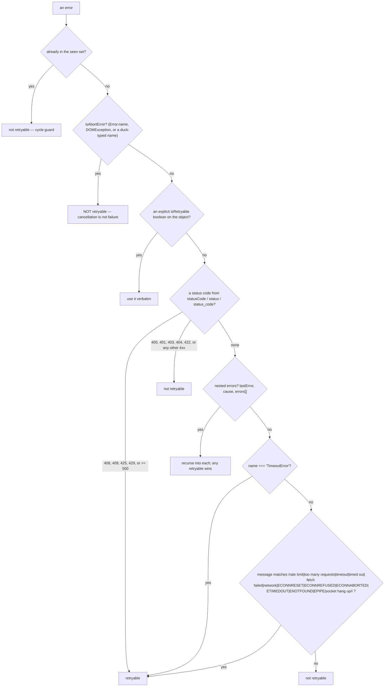
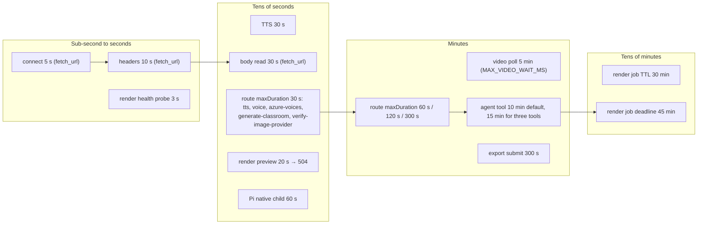
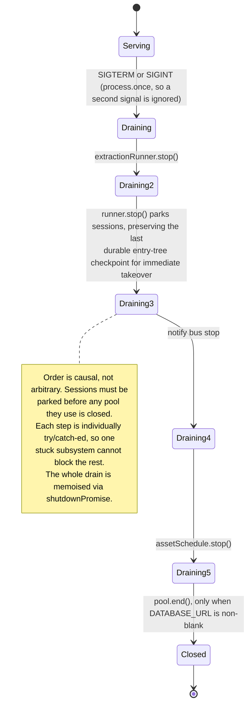

# Resilience

Timeouts, retries, aborts, partial-failure handling and idempotency, one row per
external dependency. The governing convention is stated in the generation
pipeline and holds nearly everywhere: **degrade, don't fail**.

**Sources:** `packages/@openmaic/generation/src/generation-retry.ts`,
[`lib/ai/llm.ts:264-276`](lib/ai/llm.ts#L264-L276), [`lib/audio/tts-providers.ts:145-218`](lib/audio/tts-providers.ts#L145-L218),
[`lib/server/agent-runtime/fetch-url.ts:62-67`](lib/server/agent-runtime/fetch-url.ts#L62-L67), `lib/agent/runtime/tool-timeout.ts`,
`lib/server/agent-runtime/{resume,tool-call-integrity,config}.ts`,
[`lib/whiteboard/runtime/store.ts:165-265`](lib/whiteboard/runtime/store.ts#L165-L265), [`app/api/materials/route.ts:231-330`](app/api/materials/route.ts#L231-L330),
`render-service/src/{config,render-coordinator}.ts`, [`instrumentation.ts:57-95`](instrumentation.ts#L57-L95),
`lib/media/proxy-media-cache.ts`,
[`../appendix/research/media-audio-video/05-failure-modes.md`](docs/appendix/research/media-audio-video/05-failure-modes.md),
[`../appendix/research/api-surface/05-failure-modes.md`](docs/appendix/research/api-surface/05-failure-modes.md),
[`../appendix/research/classroom-runtime/05-failure-modes.md`](docs/appendix/research/classroom-runtime/05-failure-modes.md).

## Per-dependency table

| Dependency | Timeout | Retry | Abort | Partial failure | Idempotency |
| --- | --- | --- | --- | --- | --- |
| LLM (any provider) | route `maxDuration` (30/60/120/300 s) | AI SDK built-in for network/5xx, **plus** an orthogonal `LLMRetryOptions.retries` (default **0**) for validation failure ([`lib/ai/llm.ts:264-276`](lib/ai/llm.ts#L264-L276)) | caller `AbortSignal` threaded into `streamLLM` | `parseJsonResponse` + a 4-attempt repair ladder; then `applyOutlineFallbacks` demotes unsupported outline types | none — every retry is a fresh paid call |
| Outline stream | 300 s, 15 s heartbeat | 2 **whole-stream** retries | abort propagated into `streamLLM` | 512 KiB buffer ceiling aborts a runaway model | none |
| Scene content / actions | 300 s / 60 s | `withGenerationRetry`: 5 retries, 1 s base, 16 s cap, exponential + 20% jitter | `throwIfAborted` before and after every attempt; abort is **never** retryable ([`generation-retry.ts:133`](packages/@openmaic/generation/src/generation-retry.ts#L133)) | malformed slide elements dropped individually; unmapped image ids remove their element; zero parsed actions fall back to a canned Action list | none |
| TTS provider | `TTS_REQUEST_TIMEOUT_MS`, default 30 s, via `AbortSignal.any([caller, timeout])` | none at this layer | caller signal aborts the in-flight fetch within seconds | **exception to degrade-don't-fail**: a scene's TTS failure fails the whole scene | none |
| Image / video provider | 300 s route budget; `MAX_VIDEO_WAIT_MS` 5 min for video polling | `withGenerationRetry` where the caller wraps it | per-run signal | unresolvable vision images are stripped from both prompt text and attachments | none |
| Asset URL from a provider | undici defaults | 5 redirect hops max, each re-SSRF-validated | `throwIfAborted` per hop | 502 on a bad hop | none |
| `proxy-media` | 60 s route budget | 5 redirect hops, each re-validated | caller signal raced per consumer | 25 MiB cap on both declared and actual size; 4xx forwarded as-is (permanent), 5xx collapsed to 502 | session negative cache: a permanent 4xx verdict is recorded once and shared by every caller |
| Agent `fetch_url` | connect 5 s, headers 10 s, body 30 s ([`fetch-url.ts:65-67`](lib/server/agent-runtime/fetch-url.ts#L65-L67)) | none | per-run signal raced against the body read | 5 MiB default byte cap; empty/blocked-content classification | at-least-once, so the tool must be idempotent |
| Agent tool call | `OPENMAIC_AGENT_TOOL_TIMEOUT_MS` default 600 s; per-tool overrides (`generate_scene`, `generate_actions`, `extract_material` at 15 min) win | the runner's resume path re-runs, it does not retry in place | per-session cancellation via PostgreSQL, observed by the runner | `repairOrphanedToolCalls` synthesises results for tool calls with no result so the transcript stays valid | **required** — [`resume.ts:34`](lib/server/agent-runtime/resume.ts#L34) states every tool in the system must be idempotent |
| Agent session | `OPENMAIC_AGENT_RUNTIME_LEASE_TTL_MS` 10 s → orphaned and reclaimable | `OPENMAIC_AGENT_RUNTIME_MAX_ATTEMPTS` 5 consecutive unattended starts/resumes, then a verdict-only claim fails the session **without calling the model** | cancellation is a durable row, not a connection | `planResume` reconstructs from the durable event log | claim/lease/event-order are all PostgreSQL-authoritative |
| PostgreSQL | `pg` pool defaults | none in app code | — | `getRuntimeStore` has a bounded fail-soft stage-deletion cascade; owner-bound reads degrade to `null` | revision companions are trigger-maintained with an explicit lock-order invariant |
| Whiteboard append | — | client retries on conflict | — | dry-run transition **before** any write, then post-commit re-verification | optimistic `expectedLastSeq`; mismatch throws `RuntimeAppendConflictError`; canonical SHA-256 digest makes a replayed append a no-op |
| Material upload | — | stale reservations older than 24 h reclaimed on the next upload | stream `controller.error` on cap trip | every failure branch calls `abandonOwnerMaterial`; byte object deleted **before** its reservation so a failure keeps the pointer | sha256 finalisation; reservation shrinks to actual bytes |
| Render service submit | `SUBMIT_TIMEOUT_MS` 300 s app-side | none | — | `501 PROVIDER_DISABLED` when unconfigured; `429 queue_full` / per-identity rejection **before** buffering | job ids are server-minted; no client-supplied key |
| Render job | `RENDER_JOB_DEADLINE_MS` 45 min → `deadline_exceeded`; `RENDER_JOB_TTL_MS` 30 min record+artifact life | none | deadline abort | `execution_failed` status with a failure payload | not idempotent — a resubmit is a new job |
| Render preview | `RENDER_PREVIEW_TIMEOUT_MS` 20 s → 504 | none | — | `previewMaxInFlight` 8 and `previewMaxPerUser` 2 fast-fail; 32 MiB JSON → 413 | — |
| Web search | provider defaults via `proxyFetch` | none | — | `400 MISSING_API_KEY` naming the exact env var | — |
| Document extraction | provider-dependent | none | — | registry order with a credential-aware `availability()` probe on the media side, so a missing AliDocMind AK/SK falls through to local ffmpeg | — |
| Browser persistence | — | capped recovery `[0, 250, 1000]` ms | — | `persist-health` channel raises `unavailable` / `changes-lost` / `recovered` | sealed `Outcome<T>` makes it impossible to read a backend result without feeding the state machine |

## The retry decision path

`isRetryableGenerationError` is the single classifier and it is ordered so that
the most authoritative signal wins.

`withGenerationRetry` then sleeps
`min(maxDelay, base * 2^(attempt-1)) + jitter`, where jitter is up to 20% of the
exponential delay ([`generation-retry.ts:166-175`](packages/@openmaic/generation/src/generation-retry.ts#L166-L175)). The sleep itself is
abort-aware: `defaultSleep` rejects with an `AbortError` on the caller's signal
rather than running to completion (`:27-46`). `throwIfAborted` runs at the top of
every attempt **and** immediately after a successful operation, so a cancellation
that lands during the call is not mistaken for a result.

`shouldRetryResult` is the second axis: a *successful* call whose result fails a
predicate also retries, which is how "the model returned valid JSON with the wrong
shape" is handled without inventing an error.

## Timeout ladder

## Partial failure: degrade, don't fail

Named degradations, each a deliberate choice:

| Failure | Degradation |
| --- | --- |
| A slide element fails validation | that element is dropped, the slide renders (`normalizeSlideWith({onInvalid:'drop'})`) |
| An image id has no mapping | the element referencing it is removed |
| Zero actions parsed for a scene | a canned Action list is substituted |
| A vision image cannot be resolved | stripped from both the prompt text and the attachments |
| Short-answer grading response unparseable | **50% partial credit is awarded silently** — and this branch has no test coverage |
| Render service unreachable | `enabled:false` / `501`, and the UI degrades to a local ZIP download |
| AliDocMind AK/SK absent | the cloud media provider reports unavailable and selection falls through to local ffmpeg |
| `ASSET_BYTE_EGRESS=redirect` with too short a grace | warns and degrades to direct byte egress rather than failing initialisation, because "the asset backend is optional, and its misconfiguration must never take document and runtime traffic down with it" |
| Server-provider fetch fails | the settings store keeps its existing values silently |
| Browser storage unusable | in-memory operation continues; the `persist-health` channel says so out loud |
| Boot config invalid | `[config]` warnings, never a throw |

Two deliberate **non**-degradations: a scene's TTS failure fails the whole scene,
and PBL scene generation throws `PBLGenerationError` rather than substituting
anything.

## Shutdown

A parked session is reclaimable by another instance after
`OPENMAIC_AGENT_RUNTIME_LEASE_TTL_MS`, so a rolling restart loses at most the
lease TTL of progress rather than the session.

## Cancellation in the classroom

The playback engine has no single clock — whichever of four mechanisms is live owns
the advance (pre-generated audio `onEnded`, per-sentence browser-TTS `onend`, a
reading timer sized by `estimateSpeechDurationMs`, or an awaited
`ActionEngine.execute`). Cancellation is therefore a **monotonic
`playbackGeneration` counter checked at 20 call sites**, not an `AbortController`.

Two browser-specific workarounds are load-bearing:

- Pause saves the remaining browser-TTS chunks and **cancels**, because Firefox's
  `speechSynthesis.pause` is broken; resume re-speaks from the current chunk
  ([`lib/playback/engine.ts:243-246`](lib/playback/engine.ts#L243-L246), [`:773`](lib/playback/engine.ts#L773)).
- Mode is set **before** stopping audio, because `cancel()` can fire `onend`
  synchronously (`:319`, `:459`).

## Idempotency summary

| Mechanism | Where |
| --- | --- |
| Required by contract, at-least-once execution | every agent tool ([`resume.ts:34`](lib/server/agent-runtime/resume.ts#L34)) |
| Canonical SHA-256 digest makes a replay a no-op | whiteboard runtime records |
| Optimistic `expectedLastSeq` | whiteboard append |
| sha256 content addressing | material bytes, asset blobs |
| Transcript dedupe as "the idempotence judge" | stage-writer patches ([`runner.ts:1690`](lib/server/agent-runtime/runner.ts#L1690)) |
| `readProvesCoverage` three-condition table | skill activation |
| Compensating writes on every failure branch | `POST /api/materials` |
| **Not idempotent** | render jobs, LLM calls, TTS calls, extraction |

## Open questions

- The default `LLMRetryOptions.retries` is `0`, so a route that does not pass
  retry options gets **no** validation retry — only the AI SDK's network retry.
  Which routes opt in is not enumerated here.
- The quiz-grade silent 50% fallback has no test. It is the one degradation whose
  failure is invisible to both the learner and the operator.
- Nothing bounds how many times a client may re-attempt a failed generation, so
  the retry ladders compose with client-side retries into an unbounded cost path.
  See [`09-performance.md`](docs/15-cross-cutting/09-performance.md).
