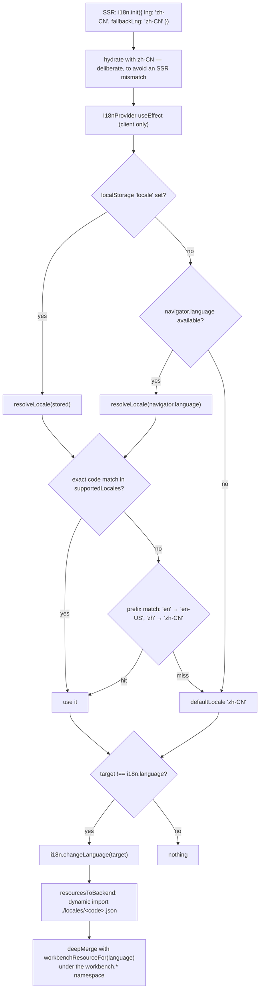
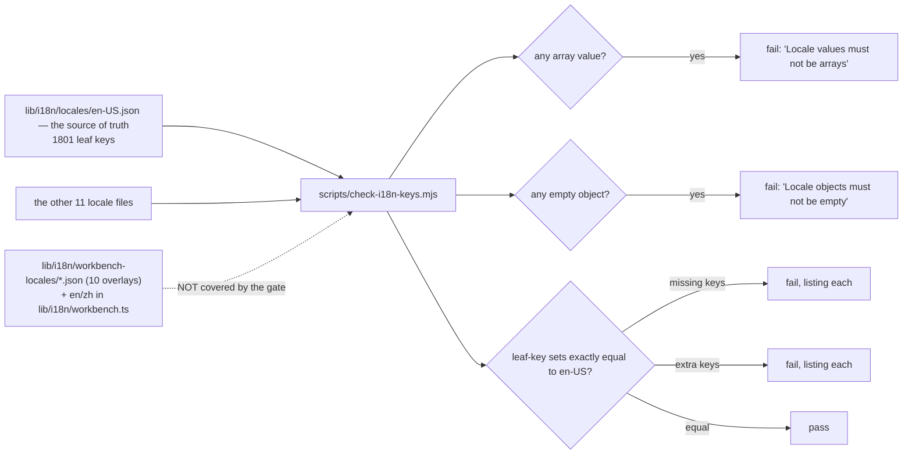
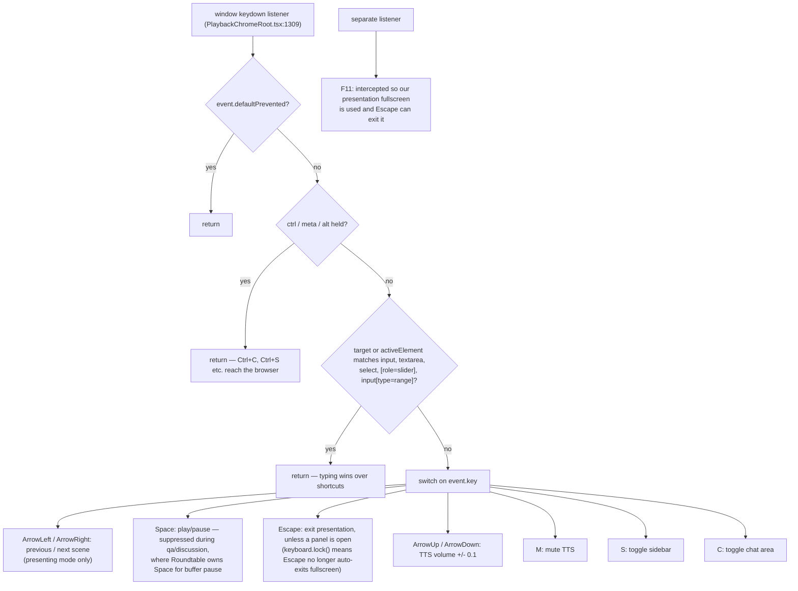

# Internationalisation and Accessibility

Two concerns with very different maturity. i18n is systematic and gate-enforced.
Accessibility is partial, uninstrumented and has three specific gaps that matter
for a product whose primary output is an animated, narrated lesson.

**Sources:** `lib/i18n/{config,locales,types}.ts`, `lib/i18n/locales/*.json` (12),
`lib/i18n/workbench-locales/*.json` (10), `lib/i18n/workbench.ts`,
`scripts/check-i18n-keys.mjs`, `lib/hooks/use-i18n.tsx`, `app/layout.tsx`,
`packages/@openmaic/generation/src/outline-generator.ts:20-21`,
`lib/choreography/timing.ts:86-95`, `components/edit/PlaybackChromeRoot.tsx:1308-1410`,
`lib/video-export/subtitles.ts`, `lib/video-export/emit-hyperframes/index.ts`,
[`../appendix/research/persistence-storage-state/01b-modules-app.md`](../appendix/research/persistence-storage-state/01b-modules-app.md).

## Supported locales

12, registered in one place (`lib/i18n/locales.ts`), default **`zh-CN`**
(`lib/i18n/types.ts:5`).

| Code | Label | Short | RTL |
| --- | --- | --- | --- |
| `zh-CN` | 简体中文 | CN | no (default) |
| `zh-TW` | 繁體中文 | TW | no |
| `en-US` | English | EN | no |
| `ja-JP` | 日本語 | JA | no |
| `ru-RU` | Русский | RU | no |
| `ar-SA` | العربية | AR | **yes** |
| `pt-BR` | Português (Brasil) | BR | no |
| `ko-KR` | 한국어 | KO | no |
| `es-MX` | Español (México) | ES | no |
| `fr-FR` | Français | FR | no |
| `vi-VN` | Tiếng Việt | VI | no |
| `de-DE` | Deutsch | DE | no |

## Locale resolution

Two consequences of resolving in a client `useEffect`: the first paint is always
`zh-CN`, and `localStorage` unavailability (privacy modes) silently keeps the
default — both `try`/`catch`ed with a comment (`use-i18n.tsx:37-46`).

`setLocale` writes `localStorage['locale']` and calls `changeLanguage`. Note this
is a *raw* `localStorage` key, not the account-scoped KV the settings store uses,
so locale does not participate in the persist-health machinery.

## The key-management contract

The gate enforces **exact** parity — an extra key fails just as hard as a missing
one — against `en-US.json`. Its `LOCALES_DIR` is
`lib/i18n/locales` only (`scripts/check-i18n-keys.mjs:4`), so the 10
`workbench-locales/` overlays and the TS-resident `en`/`zh` workbench copy are
outside its scope. `interpolation.escapeValue: false` is set globally
(`lib/i18n/config.ts:42`) — safe because React escapes children, but it means any
future `dangerouslySetInnerHTML` fed from a translation would be unescaped.

Adding a locale is documented in-file as two steps: create the JSON, add a
registry entry (`lib/i18n/locales.ts:11-14`). Nothing enforces that the workbench
overlay is added too.

## Output-language control

The UI locale and the **generated course language** are separate axes.

| Axis | Mechanism |
| --- | --- |
| UI chrome | i18next, resolved as above |
| Course content | `languageDirective`, produced by the outline call and threaded through every downstream prompt |
| Default directive | `'Teach in the language that matches the user requirement.'` (`outline-generator.ts:20-21`) — inference from the user's prose, not from the UI locale |
| PBL | `languageDirective` is the "SINGLE source of truth for content language" (`pbl/planner-core.ts:85`); a project falls back to `project.languageDirective \|\| project.language` |
| Narration timing | `estimateSpeechDurationMs` branches on a CJK character ratio: 150 ms/char above a 0.3 threshold, 240 ms/word otherwise, 2000 ms floor (`lib/choreography/timing.ts:86-95`) |

So a French UI with an English prompt produces an English course. That is a
deliberate design — the directive follows the *requirement*, not the chrome.

Known leak: hard-coded Chinese strings reach learners from parts of the generation
pipeline regardless of `languageDirective` (recorded in
[`../appendix/research/generation-pipeline/`](../appendix/research/generation-pipeline/00-overview.md)).

## Accessibility, as it actually is

### What exists

| Area | State |
| --- | --- |
| ARIA labelling | 204 `aria-label`, 122 `aria-hidden`, 36 `aria-invalid`, 23 `aria-expanded`, 12 `aria-pressed`, 11 `aria-selected`, 5 `aria-current`, 4 `aria-keyshortcuts` across `components/` + `app/` |
| Roles | 9 `role="group"`, 6 `role="img"`, 6 `role="alert"`, 4 `role="button"`, 3 `role="tablist"`/`"tab"`, 2 `role="switch"`/`"status"`/`"separator"`/`"option"`/`"menuitem"`/`"menu"` |
| Base primitives | shadcn/Radix components, which carry their own focus management and roles |
| Playback keyboard control | a full shortcut set (below) |
| Spoken content as text | every `SpeechAction` is mirrored into the chat panel via `addLectureMessage` and into `lectureSpeech` (`PlaybackChromeRoot.tsx:781-796`) |
| Exported video captions | `subtitles.srt` **and** `subtitles.vtt` sidecars from `toSrt`/`toVtt`, plus an optional burned-in band |
| Exported HTML text direction | `dir="auto"` on 8 emitted text nodes (`lib/video-export/emit-hyperframes/index.ts`) |
| Alt text | 72 `alt=` occurrences |
| Reduced motion, in the editor and workbench | 40 occurrences across 12 files. Six carry a `prefers-reduced-motion` media query or `matchMedia` check — `app/globals.css:572` (kills the ai-thinking shimmer), `components/workbench/workspace-shell.css:582`/`:1202`/`:1584`/`:1973`, `components/workbench/pro-swap.css:238`, `components/workbench/workspace/pro-popover-scope.css:199`, `lib/workbench/pro-swap.ts:96-97` (skips `startViewTransition`), `components/workbench/chat/autoscroll.ts:101`. Six consume motion's `useReducedMotion()` — `EditShell.tsx:280`, `FloatingInsertToolbar.tsx:68`, `SlideNavRail.tsx:68`, `ActionsBar.tsx:1084`, `ProBadge.tsx:33`, and `classroom-complete.tsx` (five hooks at `:82`/`:125`/`:244`/`:262`/`:318`, plus `MotionConfig reducedMotion="always"` at `:362`) |
| Screen-reader-only labelling | 35 `sr-only` usages across 23 files — icon-button labels (`ai-elements/plan.tsx:120`, `prompt-input.tsx:322`, `ui/dialog.tsx:69`, `ui/carousel.tsx:188`/`:218`), Radix-required dialog titles (`settings/index.tsx:737-738`, `RosterDialog.tsx:78` with a comment explaining the requirement), and one live-region status (`classroom-complete.tsx:369`, ``) |

### Playback keyboard map

The guard chain is careful: `defaultPrevented`, then modifiers, then a
form-control check on both `event.target` and `document.activeElement`. That is
better than most keyboard layers.

### The gaps

| Gap | Verified how | Why it matters here |
| --- | --- | --- |
| **Reduced motion stops at the authoring chrome** | of the 12 files that honour it (above), all but `classroom-complete.tsx` are editor, workbench or workspace surfaces. 17 files under `components/scene-renderers/`, plus `PlaybackChromeRoot.tsx`, carry animation or transition code; exactly one of the 18 checks. `animate.css` (imported globally, `app/layout.tsx:6`), `tw-animate-css` (`app/globals.css:2`) and GSAP in the exporter (`lib/video-export/emit-hyperframes/index.ts`, `public/vendor/gsap.min.js`) have no reduced-motion branch at all | the author gets the accommodation; the learner does not. A vestibular-sensitive learner has no way to opt out of spotlights, lasers, whiteboard draws or slide transitions — the animations that define the product's primary output. |
| **`<html lang>` is hardcoded `"en"` and never updated** | `app/layout.tsx:43`; nothing in `use-i18n.tsx` touches `document.documentElement` | a screen reader announces Chinese, Japanese, Arabic and Russian content with English phonetics. |
| **No `dir` management at all** | zero `dir=` in `components/`, `app/` or the renderer; only the exporter emits `dir="auto"` | `ar-SA` is a shipped locale rendered LTR. The one place RTL is handled is the *exported video*, not the app. |
| **No live captions in the classroom** | no `<track>` element anywhere; `role="alert"` appears 6 times, `aria-live` only 3 | narration text is visible in the chat panel but is not a caption track and is not announced as a live region, so a screen-reader user gets no synchronised transcript. |
| **No skip link, and landmarks are incidental** | zero matches for "skip to content" / `skipToContent` / `skipLink` across `components/`, `app/`, `lib/`. `<main>` appears in exactly two places (`app/workbench/new/client.tsx:112`, `:132` and `components/scene-renderers/pbl/v2/chat.tsx:531`); there is no `<nav>`, `role="navigation"` or `role="banner"` anywhere. Note this is *not* the same question as `sr-only`, which is used 35 times (above) for labelling, not structure | keyboard navigation into a 1848-line playback chrome has no shortcut past the chrome, and a screen reader gets no document outline to jump around with. |
| **`tabIndex` used 9 times** | grep count | for a product with a custom canvas, a chat panel, a sidebar and an iframe pool, that is a thin focus story. |
| **No a11y tooling in CI** | no `eslint-plugin-jsx-a11y` in `eslint.config.mjs` or `package.json`; no `axe` dependency | none of the above would be caught by a gate. |
| **Interactive scenes are model-authored** | the model has no a11y instructions traced in the prompts | an interactive widget's accessibility is whatever the LLM happened to emit. |

### One thing that is right and easy to miss

The UI font is loaded from `@fontsource`'s stylesheet rather than `next/font`,
with a 14-line comment explaining why: only the stylesheet carries per-subset
`unicode-range`, so pointing `next/font` at one subset file made Cyrillic (ru-RU)
and tone-marked Vietnamese fall back to an arbitrary OS font **mid-word**, and
declaring the other subsets as sibling faces without `unicode-range` does not fix
it because the browser just picks one (`app/layout.tsx:16-29`). That is a real
multilingual rendering bug found and fixed correctly.

## Open questions

- Whether the `zh-CN` default is intentional for an international audience or a
  historical artefact. `defaultLocale` is also the `fallbackLng`, so an untranslated
  key renders Chinese in every locale.
- Whether the exported video's `dir="auto"` was added for Arabic deliberately or
  came from the emitter's general text handling. The app not having it suggests the
  former was a local fix.
- No a11y audit, manual or automated, is recorded anywhere in the repository.

## Related

- [`../10-persistence-and-state/index.md`](../10-persistence-and-state/index.md) — the i18n resource loading and the KV scopes.
- [`../08-classroom-runtime/index.md`](../08-classroom-runtime/index.md) — the playback chrome that owns the keyboard map.
- [`../09-media-and-export/index.md`](../09-media-and-export/index.md) — subtitle emission and the burn-in band.
