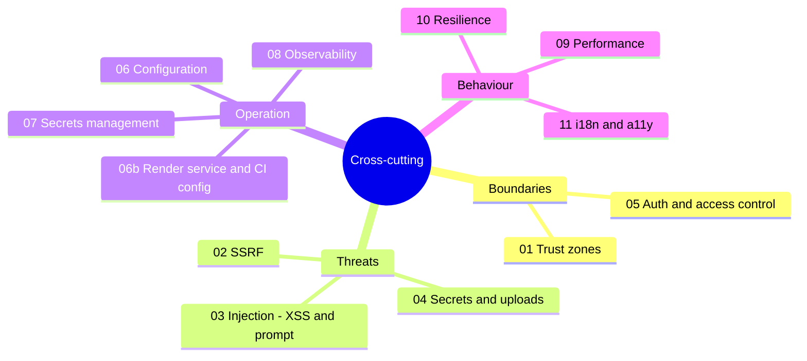

# Cross-Cutting Concerns

The concerns that do not belong to one component: trust boundaries, the named
threats and the controls that exist against them, authentication, configuration,
secrets, observability, performance, resilience, i18n and accessibility. Every
claim here is anchored to a file and line in this repository; where a control is
absent the absence is stated rather than glossed.

**Who this is for:** a staff engineer who has read [`../02-container-view/index.md`](docs/02-container-view/index.md)
and [`../03-app-and-api/index.md`](docs/03-app-and-api/index.md) and now needs to know what the system
does about the things no single component owns — and what it does not do.

**Scope:** the Next.js app (`app/`, `lib/`, `components/`, `middleware.ts`,
`instrumentation.ts`, `next.config.ts`), the publishable SDKs under
`packages/@openmaic/*`, the standalone `render-service/`, and the deployment
artefacts (`Dockerfile`, `docker-compose.yml`, `.env.example`).

**Sources:** the code paths cited per section, plus the evidence packs
[`../appendix/research/api-surface/`](docs/appendix/research/api-surface/00-overview.md),
[`../appendix/research/app-shell-and-routing/`](docs/appendix/research/app-shell-and-routing/00-overview.md),
[`../appendix/research/persistence-storage-state/`](docs/appendix/research/persistence-storage-state/00-overview.md),
[`../appendix/research/media-audio-video/`](docs/appendix/research/media-audio-video/00-overview.md),
[`../appendix/research/quality-testing-ci-deps/`](docs/appendix/research/quality-testing-ci-deps/00-overview.md),
[`../appendix/research/classroom-runtime/`](docs/appendix/research/classroom-runtime/00-overview.md),
[`../appendix/research/ai-provider-layer/`](docs/appendix/research/ai-provider-layer/00-overview.md).

## Topic overview

Each section maps onto a concrete artefact in the codebase. The diagram is the
map: which file in this topic explains which piece of the system.

```mermaid
flowchart TD
  subgraph Edge["Ingress edge"]
    MW["middleware.ts — the ONE auth gate<br/>plus the /workbench 404"]
    CSP["next.config.ts headers() — frame-ancestors,<br/>the only CSP the app emits"]
  end
  subgraph Boot["Process lifecycle"]
    INS["instrumentation.ts — startup, runners, drain<br/>(not OpenTelemetry)"]
    CV["lib/server/config-validation.ts — warn-only boot checks"]
    FF["lib/config/feature-flags.ts — 14 gates over one strict readBoolean"]
  end
  subgraph Egress["Outbound controls"]
    SG["lib/server/ssrf-guard.ts — 13 route files"]
    FU["agent-runtime/fetch-url.ts — strict + pinned DNS"]
    PF["lib/server/proxy-fetch.ts — 15 callers"]
  end
  subgraph Cred["Credentials"]
    PC["lib/server/provider-config.ts — 7 env families,<br/>YAML defaults, env override, force-disable"]
    RM["lib/server/resolve-model.ts — MODEL_ROUTES over x-model over DEFAULT_MODEL"]
  end
  subgraph Runtime["Runtime properties"]
    LG["lib/logger.ts — 4 levels, stdout only"]
    US["lib/server/usage-storage.ts — JSONL ledger"]
    GR["generation-retry.ts + choreography/timing.ts"]
    I18["lib/i18n — 12 locales, 1801 keys, one parity gate"]
  end

  MW --> S05["05 Auth and access control"]
  CSP --> S01["01 Trust boundaries"]
  MW --> S01
  INS --> S08["08 Observability"]
  CV --> S06["06 Configuration"]
  FF --> S06
  SG --> S02["02 SSRF"]
  FU --> S02
  PF --> S06
  PC --> S07["07 Secrets management"]
  RM --> S06
  LG --> S08
  US --> S08
  GR --> S10["10 Resilience"]
  GR --> S09["09 Performance"]
  I18 --> S11["11 i18n and a11y"]
  S01 --> S03["03 Injection"]
  S01 --> S04["04 Secrets and uploads"]
```

## Sections

| File | Covers |
| --- | --- |
| [`01-trust-boundaries.md`](docs/15-cross-cutting/01-trust-boundaries.md) | The eight trust zones, every crossing, and the control at each crossing. |
| [`02-threat-ssrf.md`](docs/15-cross-cutting/02-threat-ssrf.md) | `validateUrlForSSRF` vs the pinned-lookup path, the 13 calling route files, `ALLOW_LOCAL_NETWORKS`, and the TOCTOU gap. |
| [`03-threat-injection.md`](docs/15-cross-cutting/03-threat-injection.md) | Unsanitised `dangerouslySetInnerHTML` on model-authored HTML, the interactive-scene sandbox, and the nonce-fenced untrusted-content discipline in the agent runtime. |
| [`04-threat-secrets-and-uploads.md`](docs/15-cross-cutting/04-threat-secrets-and-uploads.md) | Server keys vs `NEXT_PUBLIC_*` bundle inlining; MIME allowlists, byte caps, owner quotas and the ZIP-bomb guards. |
| [`05-auth-and-access-control.md`](docs/15-cross-cutting/05-auth-and-access-control.md) | `ACCESS_CODE` end to end, the three non-composing identity mechanisms, and what a self-hoster must add before exposing this. |
| [`06-configuration.md`](docs/15-cross-cutting/06-configuration.md) | The verified env-var inventory, resolution precedence, boot validation and misconfiguration behaviour. |
| [`06b-configuration-render-service.md`](docs/15-cross-cutting/06b-configuration-render-service.md) | The render-service and CI/eval halves of the inventory, kept separate because the app never reads them. |
| [`07-secrets-management.md`](docs/15-cross-cutting/07-secrets-management.md) | Where credentials live per deployment mode, the path from store to provider call, and the two places a secret can still reach a log. |
| [`08-observability.md`](docs/15-cross-cutting/08-observability.md) | `lib/logger.ts`, `instrumentation.ts` (not OpenTelemetry), `/api/health`, JSONL usage metering, and the named gaps. |
| [`09-performance.md`](docs/15-cross-cutting/09-performance.md) | Cost centres, the caches that exist, streaming as a latency strategy, and client-side pressure points. |
| [`10-resilience.md`](docs/15-cross-cutting/10-resilience.md) | Timeouts, retries, aborts, partial-failure and idempotency per external dependency. |
| [`11-i18n-and-a11y.md`](docs/15-cross-cutting/11-i18n-and-a11y.md) | 12 locales, the key-parity gate, output-language control; then keyboard/ARIA/captions/motion as they actually are. |

## Reading order

Read [`01-trust-boundaries.md`](docs/15-cross-cutting/01-trust-boundaries.md) first — every other
section in this topic is a zoom on one crossing it names. Sections 02–04 are the
threat treatments for the crossings that carry attacker-controlled data;
sections 05–07 are the operator's controls; sections 08–11 are runtime
properties.

## Three facts that shape everything here

1. **There is exactly one authentication gate in the whole HTTP surface**, and it
   is a shared password, not a user identity ([`middleware.ts:60-85`](middleware.ts#L60-L85)). No route
   re-checks it. Multi-tenant isolation does not exist; see
   [`05-auth-and-access-control.md`](docs/15-cross-cutting/05-auth-and-access-control.md).
2. **There is no rate limiting anywhere under `app/api/**`.** The four routes
   that can emit `429` do so relaying an upstream limit or enforcing an owner
   storage quota, never a request rate.
3. **Almost every control is a documented, commented decision.** The codebase
   states its threat model inline — [`lib/persistence/server-auth.ts:1-13`](lib/persistence/server-auth.ts#L1-L13),
   [`lib/server/render-service.ts:25-35`](lib/server/render-service.ts#L25-L35), [`app/api/export-video/render/route.ts:23-32`](app/api/export-video/render/route.ts#L23-L32),
   [`components/scene-renderers/InteractiveIframeHost.tsx:145-155`](components/scene-renderers/InteractiveIframeHost.tsx#L145-L155). Where a
   control is missing it is usually missing silently, which is why this topic
   enumerates absences explicitly.

## Related topics

- [`../03-app-and-api/index.md`](docs/03-app-and-api/index.md) — the routes these controls wrap.
- [`../12-api-reference/index.md`](docs/12-api-reference/index.md) — per-endpoint gates and status codes.
- [`../14-code-quality/index.md`](docs/14-code-quality/index.md) — the test coverage (and non-coverage) of these controls.
- [`../17-deployment-view/index.md`](docs/17-deployment-view/index.md) — the Compose/Docker topology the network controls assume.
- [`../README.md`](docs/README.md) — the set root.
