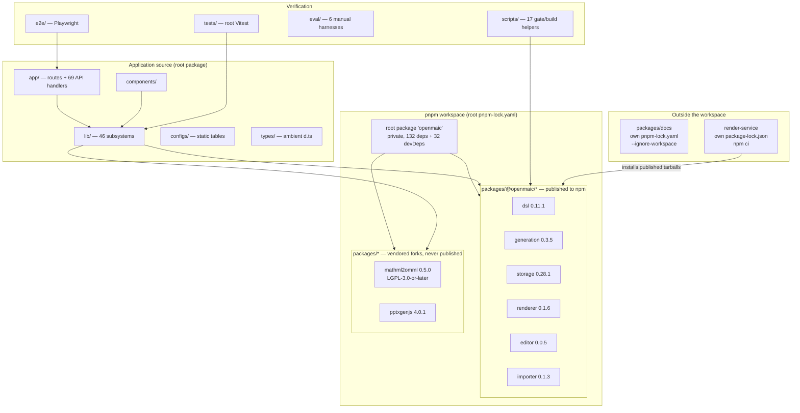
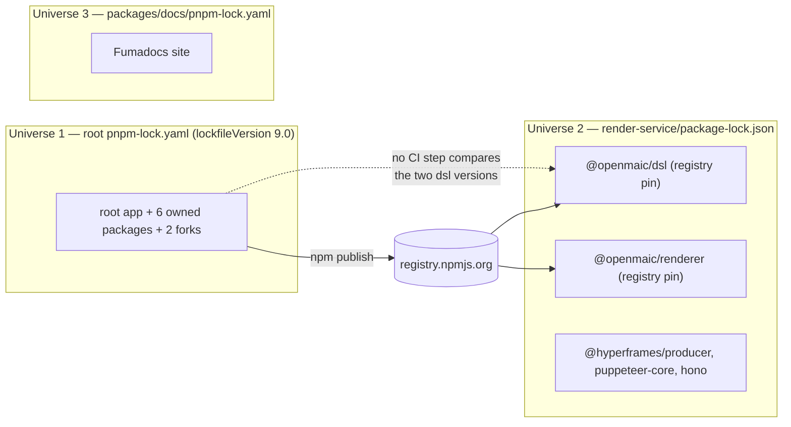

# Monorepo Layout and Workspace Composition

Where every kind of code lives, what each top-level directory is chartered to
hold, and how the pnpm workspace is composed. The workspace is deliberately
narrow: only `packages/*` and `packages/@openmaic/*` are members, and two of the
repository's largest build inputs (`packages/docs`, `render-service`) are
deliberately outside it.

**Sources:** `pnpm-workspace.yaml`, `package.json`, `tsconfig.json:33-41`,
`tsconfig.build.json:4-15`, `.prettierignore`, `eslint.config.mjs`,
`.gitignore`, `next.config.ts:5-15`, `render-service/package.json`,
`packages/docs/package.json`, and every `packages/*/package.json`. Evidence:
[`quality-testing-ci-deps/01b`](../appendix/research/quality-testing-ci-deps/01b-modules-ci-and-build.md),
[`quality-testing-ci-deps/04`](../appendix/research/quality-testing-ci-deps/04-dependencies-and-config.md).

## Top-level directories

File counts are tracked files (`git ls-files`), measured at commit `c2c9553a`.

| Directory | Tracked files | Charter |
| --- | --- | --- |
| `app/` | 86 | Next.js App Router. Six user-facing routes plus `app/api/**` (69 `route.ts` files). `app/page.tsx` alone is 79 KB. See [`../03-app-and-api/index.md`](../03-app-and-api/index.md). |
| `components/` | 365 | React components, organised by feature (`chat/`, `classroom/`, `edit/`, `workbench/`, …) with `ui/` holding the shadcn primitives. |
| `lib/` | 674 | All domain code. 46 subdirectories, one per subsystem (`ai/`, `agent-runtime/`, `choreography/`, `video-export/`, `pbl/`, `whiteboard/`, …). Server-only code is segregated under `lib/server/`. |
| `packages/@openmaic/` | 579 | The six owned, publishable packages: `dsl`, `generation`, `storage`, `renderer`, `editor`, `importer`. |
| `packages/mathml2omml/` | 35 | Vendored fork of `mathml2omml` 0.5.0, LGPL-3.0-or-later (`packages/mathml2omml/package.json`). One-character upstream fix. |
| `packages/pptxgenjs/` | 15 | Vendored fork of `pptxgenjs` 4.0.1. Local delta is `addFormula`/OMML support. No `LICENSE` file in the package directory. |
| `packages/docs/` | 62 | Standalone Fumadocs site. **Excluded from the workspace** with the reason inline in `pnpm-workspace.yaml`; own `pnpm-lock.yaml`, own `next.config.mjs`, own `tsconfig.json`. |
| `render-service/` | 46 | Standalone Node + Chromium + FFmpeg MP4 render service. Own `package-lock.json`, installed with `npm ci`. Outside the pnpm workspace entirely. |
| `tests/` | 680 | The root Vitest suite. Mirrors `lib/` and `app/` structure across 47 subdirectories. |
| `e2e/` | 24 | Playwright: 15 specs under `e2e/tests/`, one fixture module pair under `e2e/fixtures/`, three page objects under `e2e/pages/`. |
| `eval/` | 39 | Six manual LLM eval harnesses (`tsx` entry points) across four directories, plus `eval/shared/` reporting helpers. Five of the six results directories are gitignored (`.gitignore:76-80`); `eval/pbl-v2-planner/results/` is not. |
| `scripts/` | 17 | Build, gate and asset-generation helpers. Interface is argv + exit code; only `openmaic-packages.mjs` exports anything importable. |
| `skills/` | 50 | Markdown skill definitions. `skills/openmaic/` is a downloadable skill for an *external* host agent; `skills/agent-runtime/` holds 23 in-product skills for the durable agent runtime. |
| `configs/` | 13 | Static lookup tables for the legacy in-app slide renderer/editor (`shapes.ts` is 74 KB of OOXML preset geometry, `symbol.ts` 26 KB). No logic, no imports of `lib/`. |
| `types/` | 2 | Two ambient `.d.ts` declarations only: `web-extraction-vendors.d.ts`, `web-speech.d.ts`. |
| `public/` | — | Static assets. `public/vendor/maic-importer` is **gitignored** (`.gitignore:37`) and produced by `postinstall`. |
| `assets/` | 24 | README media (13 GIF/PNG demos) plus `interactive_mode/` and `voxcpm/` reference material. Not shipped by the app. |
| `community/` | 1 | A single `feishu.md`. |
| `.github/` | 11 | Five workflows, two publish helper scripts, two issue templates plus `config.yml`, one PR template. |
| `docs/` | — | This documentation set. **Tracked** — the `/docs` entry was removed from `.gitignore` so that CI can see the set and `scripts/check-docs-links.mjs` can gate it ([`07-quality-gates.md`](./07-quality-gates.md) §Gate 6). Before that change it was untracked, which is how eighteen dead internal links survived unnoticed. |

## The workspace globs

`pnpm-workspace.yaml` is three lines of `packages:`:

| Glob | Members matched |
| --- | --- |
| `packages/*` | `packages/@openmaic` (no manifest, so not a member), `packages/mathml2omml`, `packages/pptxgenjs`, `packages/docs` |
| `packages/@openmaic/*` | the six owned packages |
| `!packages/docs` | negation, with the inline reason "standalone docs sub-app: own lockfile, build, deploy" |

`render-service` is not named by any glob, so it never joins the workspace. That
is what forces its own `npm ci`, its own `typecheck`/`test` scripts, and its own
CI job (`.github/workflows/ci.yml:189-223`).

## Three separate dependency universes

The render service consumes `@openmaic/dsl` and `@openmaic/renderer` from the
registry, not through the workspace link. It can therefore run against an older
serialized DSL revision than the app that feeds it, and no workflow step compares
the two. See [`08-ci-workflows.md`](./08-ci-workflows.md) for what CI does and
does not check across the boundary.

## Tooling scope: what each tool sees

The three scope declarations do not agree, and the disagreements are load-bearing.

| Tool | Config | Includes | Excludes |
| --- | --- | --- | --- |
| root `tsc --noEmit` | `tsconfig.json:25-41` | `**/*.ts`, `**/*.tsx`, `**/*.mts` | `node_modules`, `dist`, `packages/*/src`, `packages/docs`, `openclaw`, `e2e`, `render-service` |
| production typecheck | `tsconfig.build.json:4-15` | inherits `include` | the above **plus** `tests`, `eval`, `packages/@openmaic/*/test` |
| Prettier | `.prettierignore` | everything else | both vendored forks, `packages/@openmaic/*/dist/`, `packages/@openmaic/importer/src1/`, `packages/docs/`, `.next/`, `out/`, `*.min.*`, and **all `*.md`, `*.yml`, `*.yaml`** |
| ESLint | `eslint.config.mjs` `globalIgnores` | the whole tree except `globalIgnores` — no root-level `files` restriction is declared, so `configs/`, `types/`, `middleware.ts`, `instrumentation.ts` and the root `*.config.{ts,mjs}` files are linted too | `.next/`, `out/`, `build/`, `next-env.d.ts`, both vendored forks, `packages/docs/`, `packages/@openmaic/*/dist/` and `.../node_modules/`, `packages/@openmaic/importer/src1/`, `public/vendor/`, `.claude/`, `.superpowers/`, `.worktrees/`, `.scratch/`, `e2e/`, `render-service/` |

Two consequences worth internalising:

1. **`packages/@openmaic/*/src` is inside the root `tsc` run.** The exclude entry
   is `packages/*/src` — a single `*` segment, so it resolves to
   `packages/@openmaic/src` (nonexistent) and `packages/mathml2omml/src`, not to
   `packages/@openmaic/dsl/src`. `tsconfig.build.json` confirms the reading by
   separately excluding `packages/@openmaic/*/test`, which would be redundant if
   the sibling `src` glob already covered the tree. So `npx tsc --noEmit`
   type-checks the owned packages' sources *and* their tests, while the
   production build config (`next.config.ts:13` selects `tsconfig.build.json`
   when `NODE_ENV === 'production'`) does not.
2. **Workflow YAML is neither format-checked nor lint-checked.** `.prettierignore`
   excludes `*.yml`/`*.yaml`, and ESLint does not process YAML at all. What pins
   workflow content instead is a set of Vitest meta-tests that parse the YAML
   with `js-yaml` — `tests/workflows/ci-video-export-contract.test.ts` and
   `tests/workflows/publish-packages-workflow.test.ts`. See
   [`06-testing-and-evals.md`](./06-testing-and-evals.md).
3. **`e2e/` is checked by nothing.** Excluded from `tsconfig.json:39` and listed in
   ESLint's `globalIgnores` (`eslint.config.mjs:53`, "Playwright e2e tests (not
   React code)"), with no `e2e/tsconfig.json` and no `tsc` step in any workflow. The 24 files there are compiled only by Playwright's own transpiler
   at run time.

## Cross-boundary escape hatches

Three mechanisms move bytes across the layout boundaries at build time, all
documented in [`03-build-pipeline.md`](./03-build-pipeline.md):

| Mechanism | From | To | Why |
| --- | --- | --- | --- |
| `scripts/sync-maic-importer.mjs` | `packages/@openmaic/importer/dist` | `public/vendor/maic-importer` (gitignored) | the bundle has dynamic `require()` from `pdfjs-dist` that Turbopack rejects, so it is served as a static asset and imported by runtime URL |
| `next.config.ts:15` `transpilePackages` | `mathml2omml`, `pptxgenjs`, `@openmaic/importer` | the Next build graph | the forks ship untranspiled or CJS-flavoured output |
| `next.config.ts:5-11` `outputFileTracingIncludes` | `lib/server/agent-runtime/import-pptx-worker.mjs`, `skills/openmaic/**`, `skills/agent-runtime/**` | the standalone bundle | files reached only through dynamic paths that tracing cannot see |

## Open questions

- `openclaw` appears in both `tsconfig.json:38` and `.gitignore:9-10` but no such
  directory exists in the tree. Inferred: a removed sub-app whose exclusions were
  never cleaned up. Not verified against history.
- `CONTRIBUTING.md:164-174` describes `packages/` as holding only
  "mathml2omml, pptxgenjs" and does not mention `packages/@openmaic/` at all,
  even though the same file's release section (line 132) discusses publishing
  from there. The project-structure block is stale; which layout the maintainers
  consider canonical is not recorded anywhere else.
