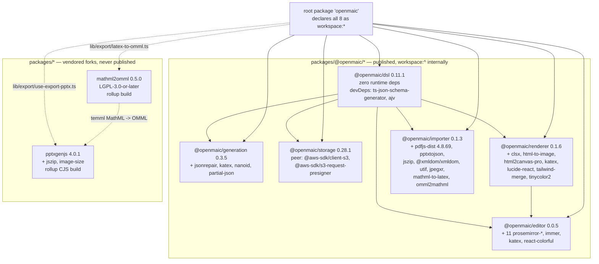
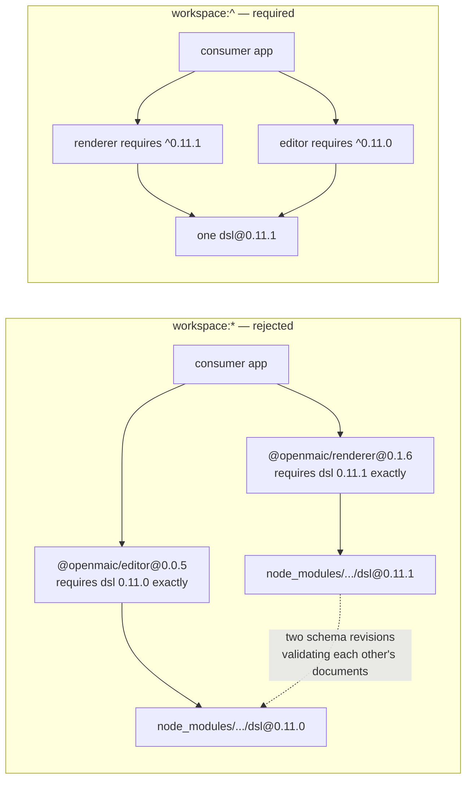
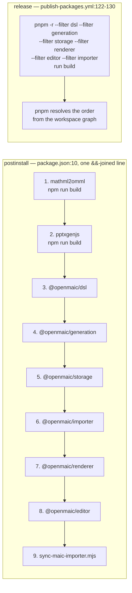
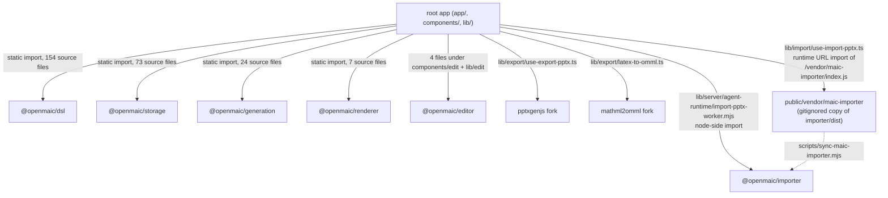

# Workspace Package Dependency Graph and Build Order

The eight workspace members, who depends on whom, why every internal edge is
declared `workspace:^` and never `workspace:*`, and the topological order that
`postinstall` therefore has to walk. `@openmaic/dsl` is the root of the graph and
the only package with zero runtime dependencies.

**Sources:** every `packages/*/package.json`, `scripts/openmaic-packages.mjs:34-43`,
`scripts/check-internal-dependency-ranges.mjs:8-48`, `package.json:10`,
`.github/workflows/publish-packages.yml:119-130`, `next.config.ts:15,23-34`.
Evidence:
[`quality-testing-ci-deps/01b`](../appendix/research/quality-testing-ci-deps/01b-modules-ci-and-build.md),
[`dsl-renderer-editor`](../appendix/research/dsl-renderer-editor/00-overview.md).

## The graph

Arrow direction is "is depended on by". `@openmaic/dsl` has five direct
dependents; `@openmaic/renderer` has exactly one internal dependent
(`@openmaic/editor`). Nothing in `packages/@openmaic/*` depends on either fork,
and neither fork depends on anything in the workspace — the `mathml2omml` →
`pptxgenjs` edge is a *call-site* relationship in
`lib/export/use-export-pptx.ts:4,27,1047`, the one module that imports both
`pptxgenjs` and `latexToOmml` (defined in `lib/export/latex-to-omml.ts`, which
imports only `temml` and `mathml2omml`) and feeds the OMML into
`pptxSlide.addFormula({…})`. It is not a manifest edge.

## Internal edge table

`INTERNAL_DEPENDENTS` in `scripts/openmaic-packages.mjs:37-43` is the single
declaration of this table, and `scripts/check-internal-dependency-ranges.mjs:103-134`
cross-checks it against the manifests **in both directions** so deleting an entry
is a failure, not an exemption.

| Package | Internal dependencies | Declared as | Peer dependencies |
| --- | --- | --- | --- |
| `dsl` | — | — | — |
| `generation` | `@openmaic/dsl` | `workspace:^` | — |
| `storage` | `@openmaic/dsl` | `workspace:^` | `@aws-sdk/client-s3`, `@aws-sdk/s3-request-presigner` |
| `renderer` | `@openmaic/dsl` | `workspace:^` | `echarts`, `motion`, `react`, `react-dom`, `shiki`, `tailwindcss` |
| `editor` | `@openmaic/dsl`, `@openmaic/renderer` | `workspace:^` | `react`, `react-dom` |
| `importer` | `@openmaic/dsl` | `workspace:^` | — |

The root manifest declares all six owned packages and both forks as
`workspace:*` (`package.json:74-79,114,129`). That form is fine there because the
root package is `private: true` and is never published, so its ranges are never
resolved by a consumer.

## Why `workspace:^` and never `workspace:*` inside the family

pnpm publishes `workspace:*` as an **exact** pin. A consumer that installs two
`@openmaic` dependents released at different times would then get two copies of
`@openmaic/dsl` — and the dsl carries the schema, the validators and both version
constants, so a document produced against one instance can be validated by the
other's schema revision (`scripts/check-internal-dependency-ranges.mjs:12-17`).

The rule is enforced three times, at three different strengths:

| Enforcement | Where | What it inspects | When |
| --- | --- | --- | --- |
| Source-level range check | `scripts/check-internal-dependency-ranges.mjs` | the manifests in the working tree | `ci.yml:88-89`, before `pnpm install` |
| Packed-manifest check | `scripts/smoke-test-package-tarballs.mjs` (`assertDeduplicableDslRange`) | `package/package.json` read back out of the packed `.tgz` | `publish-packages.yml:234-237`, release path only |
| Format-version escape rule | `scripts/check-package-version-bumps.mjs` (`checkDslFormatVersionRule`) | `DSL_VERSION` / `RUNTIME_DSL_VERSION` in `packages/@openmaic/dsl/src/version.ts` at both revisions | every PR and every push |

`peerDependencies` and `optionalDependencies` are rejected outright for owned
packages (`FORBIDDEN_FIELDS`, `check-internal-dependency-ranges.mjs:48`), and so
is `devDependencies` (lines 140-150): a devDependency satisfies the workspace
link while the published tarball declares no dependency at all.

The accepted limitation is written into the gate at lines 36-42: a caret
deduplicates *within one 0.x line only*. A consumer mixing a dependent requiring
`^0.5.0` with one requiring `^0.6.0` still installs two dsl lines. What keeps the
caret meaningful is the format-version escape rule, which requires a
serialized-format change to cross the dependents' caret boundary.

## Build order

The graph admits several valid topological orders. Two are actually used, and
they differ.

Both orders satisfy the two hard constraints — `dsl` before its five dependents,
`renderer` before `editor` — and the two forks are order-independent because
nothing in the family consumes them. The `postinstall` chain additionally puts
`importer` before `renderer`, which the graph does not require; the reason is not
recorded.

Step 9 is not a build: `scripts/sync-maic-importer.mjs` copies
`packages/@openmaic/importer/dist` into `public/vendor/maic-importer`, so it must
follow step 6 and cannot precede it. See
[`03-build-pipeline.md`](./03-build-pipeline.md).

## Build tool per package

Not uniform, and the differences matter when a build breaks.

| Package | Build command (from its `package.json` `scripts.build`) | Emits |
| --- | --- | --- |
| `dsl` | `rm dist` → `tsc -p tsconfig.json` → `node scripts/gen-schema.mjs` | `dist/` + three JSON Schema artifacts under `schema/` (its `exports` map declares `.` and `./schema/*`) |
| `generation` | `rm dist` → `tsc -p tsconfig.json` | `dist/`; `files` also ships `templates`, `snippets`, `prompts-pbl` |
| `storage` | `rm dist` → `tsc -p tsconfig.json` | `dist/` |
| `renderer` | `generate-fonts-css.mjs` → `generate-katex-fonts.mjs` → `rm dist` → `rollup -c` → `tsc --emitDeclarationOnly --declarationDir dist` | `dist/` **plus tracked, publishable `fonts.css`** |
| `editor` | `rm dist` → `rollup -c` → `tsc --emitDeclarationOnly --declarationDir dist` | `dist/core/index.js` (its `main`) |
| `importer` | `rm dist` → `rollup -c` → `tsc --emitDeclarationOnly` | `dist/index.cjs` (`main`) + `dist/index.js` (`module`) |
| `mathml2omml` | `rollup -c` → copy `src/index.d.ts` to `dist/` | `dist/` |
| `pptxgenjs` | `rollup -c --bundleConfigAsCjs` | `dist/pptxgen.cjs.js`, `dist/pptxgen.es.js` |

Two of the nine `postinstall` steps invoke `npm run build` rather than
`pnpm run build` — the two vendored forks, which keep their upstream npm-style
scripts (`package.json:10`).

`renderer` is the only package whose build writes files that are both **tracked
and publishable**. That is the reason both `ci.yml:107-121` and
`publish-packages.yml:143-157` diff the tree against `$GITHUB_SHA` after the
build: a stale committed `fonts.css` becomes a PR failure rather than a release
that ships bytes absent from the commit.

## How the root app consumes each member

`@openmaic/importer` is the only member with two consumption paths. The browser
path deliberately does **not** go through the bundler: `lib/import/use-import-pptx.ts`
does a bundler-ignored URL import of `/vendor/maic-importer/index.js`, because
the bundle contains dynamic `require()` from `pdfjs-dist` that Turbopack rejects
as a hard "Module not found" error (`scripts/sync-maic-importer.mjs:5-9`). The
server path imports the workspace package normally, and `next.config.ts:15`
lists `@openmaic/importer` in `transpilePackages` alongside both forks.

`@openmaic/generation` is additionally listed in `next.config.ts:23-34`
`serverExternalPackages`, together with the two `@earendil-works` agent packages
and both optional `@aws-sdk` peers of `@openmaic/storage`, because those do a
runtime `import(specifier)` with a computed specifier that webpack cannot
statically analyse.

## Open questions

- The `postinstall` order builds `importer` before `renderer`; the release
  workflow's `--filter` list is dsl, generation, storage, renderer, editor,
  importer. Neither order is wrong, but nothing records why they differ.
- `@openmaic/editor` declares no `license` field in its `package.json`, unlike
  its five siblings, although an MIT `LICENSE` file is present and listed in
  `files`. npm will therefore publish it with no SPDX identifier. Whether that is
  deliberate is not recorded.
