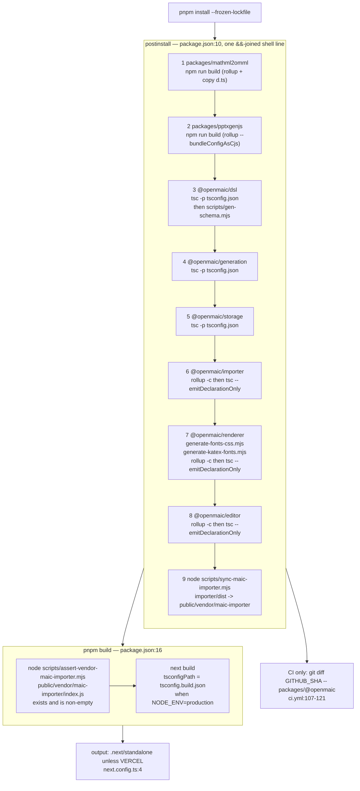
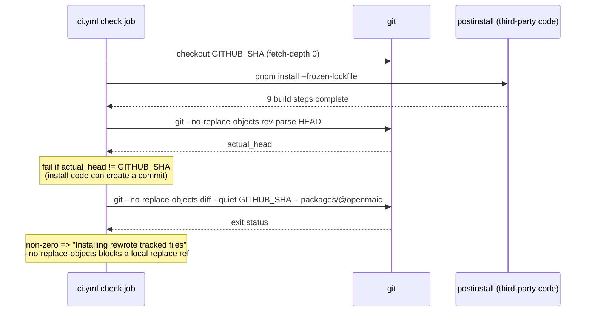
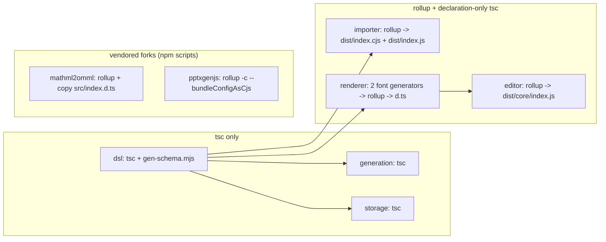
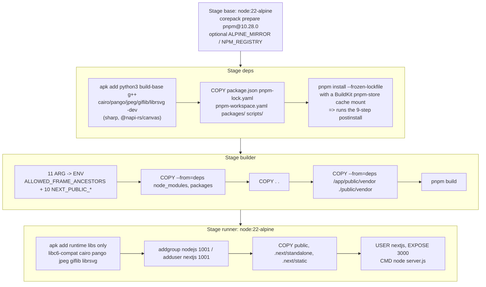

# Build Pipeline

The full build in execution order: the nine-step `postinstall` chain and why each
step sits where it does, `next build` with its pre-build vendor assertion,
per-package builds, and the three generated-asset scripts that are *not* in any
automated chain.

**Sources:** [`package.json:9-33`](package.json#L9-L33), `scripts/sync-maic-importer.mjs`,
`scripts/assert-vendor-maic-importer.mjs`, `packages/@openmaic/dsl/scripts/gen-schema.mjs`,
`packages/@openmaic/renderer/scripts/generate-fonts-css.mjs`,
`packages/@openmaic/renderer/scripts/generate-katex-fonts.mjs`,
`scripts/generate-video-export-{katex,noto-cjk,noto-script-fonts}.mjs`,
`next.config.ts`, `Dockerfile`, `vercel.json`, [`.github/workflows/ci.yml:91-121`](.github/workflows/ci.yml#L91-L121),
[`.github/workflows/publish-packages.yml:117-157`](.github/workflows/publish-packages.yml#L117-L157). Evidence:
[`quality-testing-ci-deps/04`](docs/appendix/research/quality-testing-ci-deps/04-dependencies-and-config.md),
[`media-audio-video`](docs/appendix/research/media-audio-video/00-overview.md).

## The whole build, in order



### Why the order is what it is

| Step | Ordering constraint | Consequence of violating it |
| --- | --- | --- |
| 1, 2 (forks) | none from the graph — nothing in `packages/@openmaic` imports either | free to move; they are first only by convention |
| 3 (`dsl`) | must precede 4-8 | five dependents resolve `@openmaic/dsl` through the workspace link and need its `dist/` + `dist/schema/` |
| 4, 5 (`generation`, `storage`) | after `dsl` only | order between them is arbitrary |
| 6 (`importer`) | after `dsl`; must precede step 9 | step 9 copies `importer/dist`, so a reversal produces an empty `public/vendor/maic-importer` and `pnpm build` then fails at `assert-vendor` |
| 7 (`renderer`) | after `dsl`; must precede 8 | `@openmaic/editor` declares `@openmaic/renderer` as a dependency |
| 8 (`editor`) | after `renderer` | — |
| 9 (sync) | after 6 | see above |

Properties of the chain itself, all readable from [`package.json:10`](package.json#L10):

- **Nine `&&`-joined steps, strictly sequential, no parallelism, no idempotence
  check.** It re-runs in full on every `pnpm install`.
- **Written with relative `cd`s** — `cd packages/mathml2omml`, then
  `cd ../pptxgenjs`, `cd ../@openmaic/dsl`, `cd ../generation`, …, finally
  `cd ../../..`. Renaming or reordering a package directory silently redirects a
  build to the wrong place rather than failing.
- **Two steps use `npm run build`, seven use `pnpm run build`.** The two vendored
  forks keep their upstream npm-style scripts.
- **It runs third-party build code**, which is the stated reason the release
  pipeline confines install and build to the token-free `validate` job
  ([`publish-packages.yml:78-81`](.github/workflows/publish-packages.yml#L78-L81)).

It runs in six places: locally on `pnpm install`, in [`ci.yml:91`](.github/workflows/ci.yml#L91) (the `check`
job) and [`ci.yml:239`](.github/workflows/ci.yml#L239) (the `e2e` job's own install), in
[`storage-pg-contract.yml:44`](.github/workflows/storage-pg-contract.yml#L44), in [`publish-packages.yml:117`](.github/workflows/publish-packages.yml#L117), and in the Docker
`deps` stage ([`Dockerfile:46`](Dockerfile#L46)). The `e2e` one matters: its `sync-maic-importer`
step produces the vendor bundle that `pnpm build` at [`ci.yml:328`](.github/workflows/ci.yml#L328) then asserts
against via `assert-vendor-maic-importer.mjs`.

### The install-rewrote-tracked-files check

Two of the nine steps write files that are **tracked and publishable**:
`renderer`'s `generate-fonts-css.mjs` regenerates `packages/@openmaic/renderer/fonts.css`,
and `generate-katex-fonts.mjs` regenerates
`packages/@openmaic/renderer/src/snapshot/katex-fonts-embed.ts`. Both carry a
`GENERATED FILE — do not edit by hand` header naming the regeneration command.

[`ci.yml:107-121`](.github/workflows/ci.yml#L107-L121) therefore diffs the tree after install, and the reference point
is deliberately `$GITHUB_SHA` rather than `HEAD` or the index:



[`publish-packages.yml:143-157`](.github/workflows/publish-packages.yml#L143-L157) runs the same check with no pathspec — whole tree —
after the release build, and [`publish-packages.yml:338-350`](.github/workflows/publish-packages.yml#L338-L350) runs it a third time
in the token-bearing job even though that job installs and builds nothing
("defence in depth after repository code has run").

## `next build` and the vendor assertion

`pnpm build` is exactly `node scripts/assert-vendor-maic-importer.mjs && next build`
([`package.json:16`](package.json#L16)). The assertion is 36 lines and checks one thing: that
`public/vendor/maic-importer/index.js` exists and is a non-empty file.

Why it is a build-time gate rather than a runtime check: the browser PPTX import
path loads the parser by **runtime URL** (`/vendor/maic-importer/index.js`), so a
missing file 404s, the 404 HTML is parsed as JavaScript, and the user sees an
opaque `SyntaxError`. The script's error message names the exact recovery
commands ([`assert-vendor-maic-importer.mjs:28-33`](scripts/assert-vendor-maic-importer.mjs#L28-L33)):

```
pnpm --filter @openmaic/importer build && pnpm run sync:maic-importer
```

`public/vendor/maic-importer` is gitignored ([`.gitignore:37`](.gitignore#L37)), so it exists only
after `postinstall` has run — which is why the Docker `builder` stage re-copies
it out of the `deps` stage *after* `COPY . .` ([`Dockerfile:74-77`](Dockerfile#L74-L77)), rather than
relying on the source checkout.

### Build-time TypeScript config swap

[`next.config.ts:12-14`](next.config.ts#L12-L14) selects the tsconfig by `NODE_ENV`:

| `NODE_ENV` | tsconfig | Type-checks `tests/`, `eval/`, `packages/@openmaic/*/test`? |
| --- | --- | --- |
| anything but `production` | `tsconfig.json` | yes |
| `production` | `tsconfig.build.json` | no |

So `next build` never fails on a test-only type error, while
`npx tsc --noEmit` (the CI linter step, [`ci.yml:130`](.github/workflows/ci.yml#L130)) does.

### Output mode

[`next.config.ts:4`](next.config.ts#L4) — `output: process.env.VERCEL ? undefined : 'standalone'`.
The `standalone` bundle is what [`Dockerfile:105-106`](Dockerfile#L105-L106) copies into the runner
stage; on Vercel the platform builds its own output and `vercel.json` supplies
only `installCommand: pnpm install`, `buildCommand: pnpm build`, and a
300-second `maxDuration` for `app/api/**/*.ts`.

`outputFileTracingIncludes` ([`next.config.ts:5-11`](next.config.ts#L5-L11)) force-adds three paths that
tracing cannot discover: `lib/server/agent-runtime/import-pptx-worker.mjs`,
`skills/openmaic/**`, `skills/agent-runtime/**`.

## Per-package builds

Each owned package can be built alone with `pnpm --filter @openmaic/<name> run build`.
Every one begins by removing `dist` through an inline `node -e` `rmSync`, so no
build is incremental and none can inherit a stale artefact.



`@openmaic/dsl`'s second build step is the only codegen inside a published
package: `scripts/gen-schema.mjs` runs `ts-json-schema-generator` (a
devDependency, so the package keeps zero runtime deps —
[`gen-schema.mjs:1-5`](packages/@openmaic/dsl/scripts/gen-schema.mjs#L1-L5)) over the TS contract and emits three artefacts, one per
root type in its `ROOTS` map ([`gen-schema.mjs:15-19`](packages/@openmaic/dsl/scripts/gen-schema.mjs#L15-L19)):

| Root type | Emitted file |
| --- | --- |
| `Stage` | `stage.schema.json` |
| `SerializedScene` | `scene.schema.json` |
| `Action` | `action.schema.json` |

Four PBL definitions (`PBLProject`, `PBLMilestone`, `PBLMicrotask`,
`PBLThreadSeat`) are deliberately re-opened with `additionalProperties: true`
([`gen-schema.mjs:21-24`](packages/@openmaic/dsl/scripts/gen-schema.mjs#L21-L24)) because historical stored documents carry app-owned
runtime fields on those nodes. The package's `exports` map declares `.` and
`./schema/*`, so consumers can import the schema files directly.

## Generated assets that no automated chain regenerates

Three root scripts exist behind `gen:*` names and are invoked by **nothing** — no
workflow, no `postinstall`, no `pnpm build`. Their outputs are committed
TypeScript modules plus committed WOFF2 binaries under
`public/vendor/video-export/fonts/`.

| Script | `package.json` name | Emits | Assertion inside |
| --- | --- | --- | --- |
| `scripts/generate-video-export-katex.mjs` | `gen:video-export-katex` | `lib/video-export/emit-hyperframes/katex-assets.ts` + 20 KaTeX WOFF2 files into `public/vendor/video-export/fonts/` | throws unless exactly 20 `@font-face` rules yield a WOFF2 (`:36-38`) |
| `scripts/generate-video-export-noto-cjk.mjs` | `gen:video-export-noto-cjk` | `lib/video-export/emit-hyperframes/noto-cjk-assets.ts` + Noto Sans SC and Noto Sans KR WOFF2 | face list is a literal two-entry table (`:7-22`) |
| `scripts/generate-video-export-noto-script-fonts.mjs` | `gen:video-export-noto-script-fonts` | `lib/video-export/emit-hyperframes/noto-script-font-assets.ts` + Noto Sans / Noto Sans Arabic WOFF2 | reads the fonts through `node_modules/@fontsource/...` paths |

All three read from `node_modules` (`require.resolve('katex/package.json')`,
`node_modules/@fontsource/<pkg>/files/...`) and format their output with
`prettier`, so the emitted files satisfy `pnpm check` without a second pass. The
two `@fontsource` packages they read are **exact-pinned** devDependencies
(`@fontsource/noto-sans` `5.3.0`, `@fontsource/noto-sans-arabic` `5.3.0`) and
`fontkit` is pinned at `2.0.4`, because these scripts compare output *bytes*.

The reason these assets are prebuilt and shipped inside the export ZIP is that
the render container has zero outbound network (see
[`../09-media-and-export/index.md`](docs/09-media-and-export/index.md) and
[`docker-compose.yml:72-78`](docker-compose.yml#L72-L78)).

**Inferred:** because no gate regenerates them, a `katex` or `@fontsource` version
bump that changes font bytes would leave the committed modules stale and nothing
in CI would notice. The 20-face assertion only fires when the script is run by
hand.

## The Docker build path



Step C4 is the load-bearing ordering detail. `public/vendor/maic-importer` is
gitignored ([`.gitignore:37`](.gitignore#L37)), so a clean checkout does not contain it, and Docker
does not read `.gitignore` — meaning `COPY . .` brings whatever happens to be in
the developer's working tree, or nothing at all in CI. Copying the directory back
out of the `deps` stage immediately after `COPY . .` makes the result
deterministic. Without step C4, `pnpm build`'s first command
(`assert-vendor-maic-importer.mjs`) fails on any clean context.

The eleven build args are all values that must exist **at build time**: ten
`NEXT_PUBLIC_*` flags inlined into the browser bundle plus
`ALLOWED_FRAME_ANCESTORS`, which [`next.config.ts:38-56`](next.config.ts#L38-L56) reads inside `headers()`.

## Open questions

- `NEXT_PUBLIC_PRO_WORKBENCH_ENABLED` is read at `lib/config/feature-flags.ts` and
  documented in `.env.example`, but is not among the eleven `Dockerfile` build
  args nor the `docker-compose.yml` `build.args` list. Because `NEXT_PUBLIC_*` is
  inlined by `next build`, putting it in `.env.local` reaches the runtime process
  but not the compiled bundle, so the Docker/compose path cannot enable the Pro
  workbench. Whether that is deliberate is not recorded.
- No step anywhere verifies the three `gen:video-export-*` outputs against a fresh
  regeneration, unlike `renderer`'s two generated files which the post-install
  diff covers.
