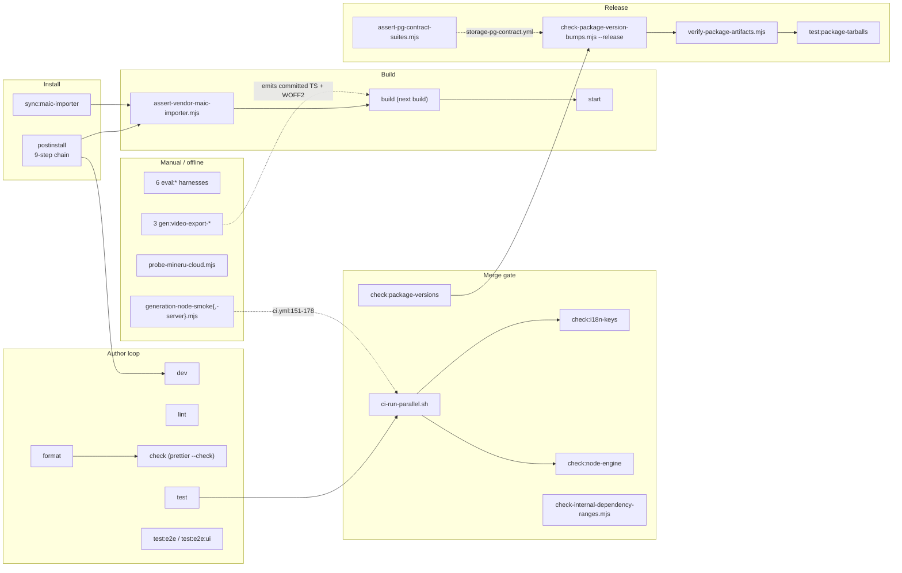
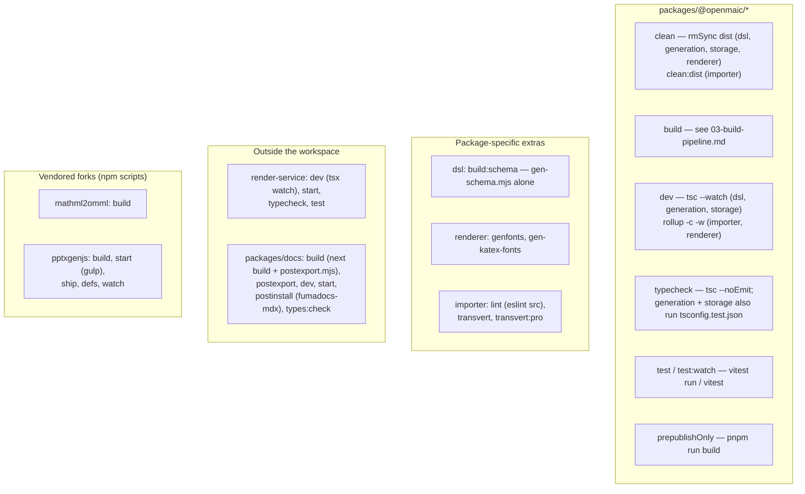

# Scripts Inventory

Every file in `scripts/`, every root `package.json` script, and every
per-package script — with the lifecycle stage each belongs to and when a
developer actually runs it. `scripts/` is 17 files; only one of them
(`openmaic-packages.mjs`) is an importable module, the rest are CLIs whose
interface is argv plus an exit code.

**Sources:** [`package.json:9-33`](package.json#L9-L33), all 17 files under `scripts/`, every
`packages/*/package.json` `scripts` block, `render-service/package.json`,
`packages/docs/package.json`. Evidence:
[`quality-testing-ci-deps/01b`](docs/appendix/research/quality-testing-ci-deps/01b-modules-ci-and-build.md),
[`quality-testing-ci-deps/02b`](docs/appendix/research/quality-testing-ci-deps/02b-interfaces-gate-contracts.md).

## Root `package.json` scripts

24 entries. Grouped by the stage a developer is in when they run them.

| Script | Command | When a developer runs it |
| --- | --- | --- |
| `postinstall` | the nine-step build chain — see [`03-build-pipeline.md`](docs/16-development-view/03-build-pipeline.md) | never by hand; pnpm runs it |
| `dev` | `next dev` | every working session; serves on 3000 |
| `build` | `node scripts/assert-vendor-maic-importer.mjs && next build` | before `pnpm start`, or to reproduce the CI e2e job |
| `start` | `next start` | after `build`, to test the production bundle |
| `lint` | `eslint` | before every commit ([`CONTRIBUTING.md:87-89`](CONTRIBUTING.md#before-you-submit-a-pr) suggests `pnpm lint --fix`) |
| `check` | `prettier . --check` | before every commit |
| `format` | `prettier . --write` | before every commit; step 1 of the pre-PR checklist |
| `test` | `vitest run` | the root suite; 666 test files under `tests/` |
| `test:e2e` | `playwright test` | Playwright over `e2e/tests`; needs a build or a dev server |
| `test:e2e:ui` | `playwright test --ui` | interactive spec debugging |
| `test:package-tarballs` | `node scripts/smoke-test-package-tarballs.mjs` | rarely; the release path calls it with an artefact directory |
| `check:i18n-keys` | `node scripts/check-i18n-keys.mjs` | after touching `lib/i18n/locales/*.json` |
| `check:node-engine` | `node scripts/check-node-engine-contract.mjs` | after adding or bumping a production dependency |
| `check:package-versions` | `node scripts/check-package-version-bumps.mjs` | after changing anything under `packages/@openmaic/*` (needs a base ref argument) |
| `sync:maic-importer` | `node scripts/sync-maic-importer.mjs` | after rebuilding `@openmaic/importer` alone, without a full install |
| `gen:video-export-katex` | `node scripts/generate-video-export-katex.mjs` | after a `katex` version bump |
| `gen:video-export-noto-cjk` | `node scripts/generate-video-export-noto-cjk.mjs` | after a `@fontsource/noto-sans-{sc,kr}` bump |
| `gen:video-export-noto-script-fonts` | `node scripts/generate-video-export-noto-script-fonts.mjs` | after a `@fontsource/noto-sans{,-arabic}` bump |
| `eval:pbl-v2-planner` | `tsx eval/pbl-v2-planner/runner.ts` | manually, with `EVAL_PBL_MODEL` set |
| `eval:whiteboard` | `tsx eval/whiteboard-layout/runner.ts` | manually |
| `eval:outline-language` | `tsx eval/outline-language/runner.ts` | manually |
| `eval:orchestration` | `tsx eval/orchestration/runner.ts` | manually |
| `eval:orchestration:answering` | `tsx eval/orchestration/answering-runner.ts` | manually |
| `eval:orchestration:answer-content` | `tsx eval/orchestration/answer-content-runner.ts` | manually |

Notably absent from the pre-PR checklist in [`CONTRIBUTING.md:83-92`](CONTRIBUTING.md#before-you-submit-a-pr): `pnpm test`.
The document lists `format`, `lint --fix` and `npx tsc --noEmit` only.

## Script → lifecycle stage

## `scripts/` file by file

| File | Lines | Interface | Purpose | Invoked by |
| --- | --- | --- | --- | --- |
| `openmaic-packages.mjs` | 205 | ES module, 7 exports | The single `OPENMAIC_PACKAGES` list, `INTERNAL_DEPENDENTS` map, and `assertPackageListIsComplete()` which cross-checks disk **and** `publish-packages.yml`'s own enumerations as exact sets | imported by 4 scripts |
| `check-package-version-bumps.mjs` | 685 | `<base-ref>` or `--release` | Diff mode: a package whose publishable inputs changed must have its version increased. Release mode: consults the npm registry and refuses to reuse or downgrade | [`ci.yml:59-79`](.github/workflows/ci.yml#L59-L79), `publish-packages.yml:114-115,375` |
| `check-internal-dependency-ranges.mjs` | 159 | no args | An owned package may appear as another's dependency exactly once, in `dependencies`, as `workspace:^` | [`ci.yml:88-89`](.github/workflows/ci.yml#L88-L89) |
| `check-node-engine-contract.mjs` | 73 | no args | `semver.minVersion(root engines.node)` must satisfy every installed direct production dependency's own `engines.node` | [`ci.yml:93-94`](.github/workflows/ci.yml#L93-L94) via `check:node-engine` |
| `check-i18n-keys.mjs` | 114 | no args | Exact leaf-key set equality across `lib/i18n/locales/*.json` against `en-US.json`; rejects arrays and empty objects as locale values | [`ci.yml:131`](.github/workflows/ci.yml#L131) via `check:i18n-keys` |
| `assert-pg-contract-suites.mjs` | 319 | `--capture-baseline <f>` or `<vitest-json> --baseline <f>` | Two-phase audit that `@openmaic/storage`'s `*.pg.test.ts` suites really hit PostgreSQL | `storage-pg-contract.yml:59,63`, `publish-packages.yml:217,221` |
| `verify-package-artifacts.mjs` | 116 | `[--write] <artifact-dir>` | Computes/verifies `SHA256SUMS` over the packed tarballs; reads each tarball's **packed** `package.json` back out with `tar -xzOf` | `publish-packages.yml:179,184,274,373` |
| `smoke-test-package-tarballs.mjs` | 206 | `<artifact-dir>` (shifts a leading bare `--`) | Installs the packed tarballs into a temp dir and asserts each dependent publishes `@openmaic/dsl` as a deduplicable caret | [`publish-packages.yml:237`](.github/workflows/publish-packages.yml#L237) via `test:package-tarballs` |
| `ci-run-parallel.sh` | 58 | `NAME COMMAND [NAME COMMAND …]` | Runs pairs concurrently, buffers each to `${RUNNER_TEMP}/ci-parallel-$$/<i>.log`, replays them in argument order as Actions groups, exits 1 if any child failed | [`ci.yml:41-50`](.github/workflows/ci.yml#L41-L50) (self-test), [`ci.yml:125-131`](.github/workflows/ci.yml#L125-L131) |
| `assert-vendor-maic-importer.mjs` | 36 | no args | `public/vendor/maic-importer/index.js` exists and is non-empty | first half of `pnpm build` |
| `sync-maic-importer.mjs` | 34 | no args | Copies `packages/@openmaic/importer/dist` → `public/vendor/maic-importer` | last step of `postinstall`; also `sync:maic-importer` |
| `generate-video-export-katex.mjs` | — | no args | Emits `lib/video-export/emit-hyperframes/katex-assets.ts` + 20 KaTeX WOFF2 into `public/vendor/video-export/fonts/`; throws unless exactly 20 faces are found | nothing automated |
| `generate-video-export-noto-cjk.mjs` | — | no args | Emits `noto-cjk-assets.ts` + Noto Sans SC/KR WOFF2 | nothing automated |
| `generate-video-export-noto-script-fonts.mjs` | — | no args | Emits `noto-script-font-assets.ts` + Noto Sans / Noto Sans Arabic WOFF2 with OFL licence text | nothing automated |
| `generation-node-smoke-server.mjs` | 103 | `--port <n>` | A fake OpenAI-compatible endpoint returning a canned outline, scene-content and actions payload; also serves `/health` | [`ci.yml:151-178`](.github/workflows/ci.yml#L151-L178) |
| `generation-node-smoke.mjs` | 109 | `--requirement --endpoint --model [--api-key]` | A pure-Node consumer of `@openmaic/generation` + `@openmaic/dsl` that runs outlines → content → actions → `buildCompleteScene` → `validateScene` and prints JSON | [`ci.yml:173-178`](.github/workflows/ci.yml#L173-L178) |
| `probe-mineru-cloud.mjs` | 138 | env `MINERU_CLOUD_API_KEY`, reads `tmp/samples/` | Manual developer probe of which file formats MinerU Cloud accepts | nothing; documented in its own docstring |

### Exit-code contracts

| Script | 0 | 1 | 2 |
| --- | --- | --- | --- |
| `ci-run-parallel.sh` | all children succeeded | a child failed | bad usage (odd argument count) |
| `check-package-version-bumps.mjs` | gate passed | gate failure | usage error, no git worktree, or a non-definitive registry answer |
| `assert-pg-contract-suites.mjs` | audit passed | gate failure | unreadable input |
| `check-internal-dependency-ranges.mjs`, `check-node-engine-contract.mjs`, `check-i18n-keys.mjs`, `assert-vendor-maic-importer.mjs` | pass | fail | — |
| `verify-package-artifacts.mjs`, `smoke-test-package-tarballs.mjs` | pass | non-zero via `node:assert/strict` | — |

[`check-package-version-bumps.mjs:61-69`](scripts/check-package-version-bumps.mjs#L61-L69) refuses to run outside a git worktree with
exit 2, and its release mode treats *any* non-definitive registry answer —
transient error, auth failure, unparseable body — as exit 2 rather than reading
"unknown" as "never published".

### The publishable-input definition

[`check-package-version-bumps.mjs:8-53`](scripts/check-package-version-bumps.mjs#L8-L53) defines "publishable input" as
"file under the package directory", minus per-package ignore lists:

| Scope | Ignored files | Ignored directories |
| --- | --- | --- |
| all six packages (`commonIgnoredInputs`, `:8-11`) | `.gitignore`, `vitest.config.ts` | `docs/`, `test/` |
| `importer` override (`:31-47`) | the common two plus `.babelrc.cjs`, `.eslintignore`, `.eslintrc.cjs`, `DESIGN.md`, `SKILL.md`, `favicon.ico`, `index.html` | the common two plus `scripts/`, `src1/` |

The ignore map is built from `OPENMAIC_PACKAGES` (`:51-53`) rather than spelled
out, "so a new package cannot be silently exempt from this gate by being absent
here".

The `KNOWN LIMITATION` at lines 16-30 is worth reading before trusting the gate:
`renderer` and `importer` inline their dependency graph through Rollup, and `dsl`'s
shipped JSON schema is generated by the lockfile's `ts-json-schema-generator`, so
a *toolchain bump alone* can change any tarball with no diff under the package
directory. The gate is "a merge-time guard against the common case, not a proof of
byte equality" (`:30`).

## Per-package scripts

Details that matter when a CI step fails:

- **`typecheck` is not uniform.** `dsl`, `renderer` and `editor` run a single
  `tsc --noEmit`. `generation` and `storage` chain a second pass over
  `tsconfig.test.json`, which is why `ci.yml:145-146,183-184` runs them
  separately. The comment at [`ci.yml:181-184`](.github/workflows/ci.yml#L181-L184) gives the reason for storage: its
  device-scope guard is written as `@ts-expect-error` probes in the tests, "and a
  probe nothing type-checks proves nothing".
- **`importer` has no `typecheck` script at all**, which is why
  [`publish-packages.yml:223-225`](.github/workflows/publish-packages.yml#L223-L225) omits it from the typecheck `--filter` list, and
  why [`openmaic-packages.mjs:132-139`](scripts/openmaic-packages.mjs#L132-L139) checks `--filter` loosely rather than as an
  exact set.
- **Every owned package declares `prepublishOnly: pnpm run build`.** The release
  workflow suppresses it — `pnpm pack --config.ignore-scripts=true`
  ([`publish-packages.yml:176`](.github/workflows/publish-packages.yml#L176)) — because the build already happened in a verified
  step, and `npm publish … --ignore-scripts` (`:409`) keeps lifecycle scripts out
  of the token-bearing job.
- **`packages/docs` has its own `postinstall`** (`fumadocs-mdx`), which is one
  reason it is excluded from the workspace.
- **`mathml2omml` and `pptxgenjs` keep upstream tooling** — biome, husky, jest,
  gulp — none of which the repository's own gates ever invoke.

## Open questions

- `scripts/probe-mineru-cloud.mjs` reads samples from `tmp/samples/`, a directory
  that does not exist in the repository and is not created by any script. How the
  samples are meant to be obtained is not recorded.
- `packages/@openmaic/importer` declares a `lint` script (`eslint src --ext …`) but
  has no ESLint config of its own; the root `eslint.config.mjs` lints
  `packages/@openmaic/*/src` already. Whether the package script is still reachable
  was not verified.
