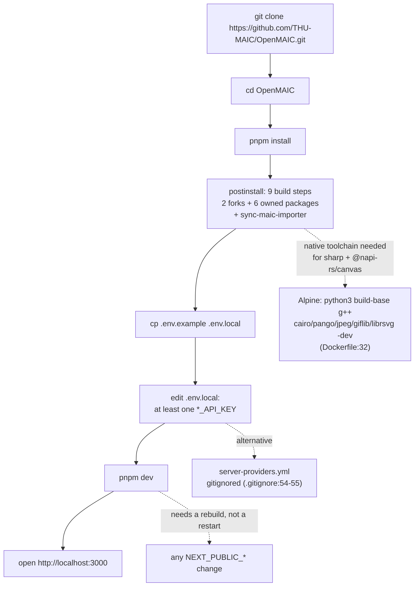
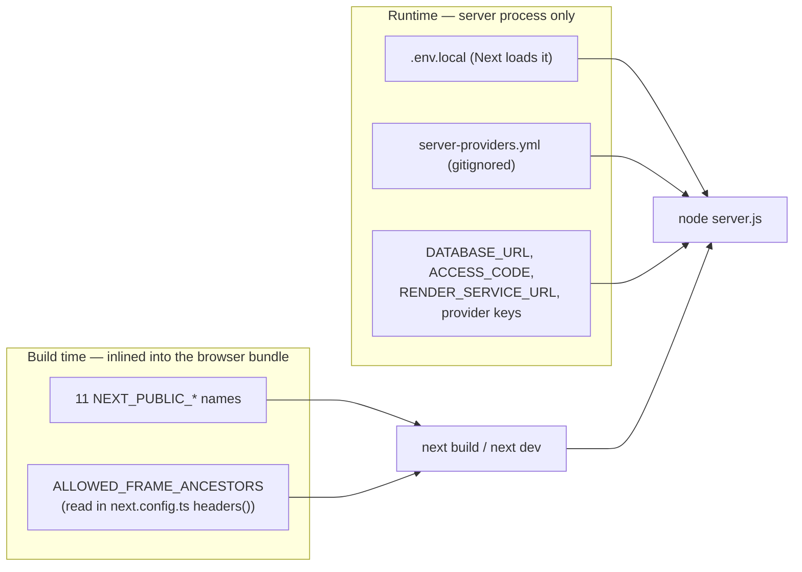
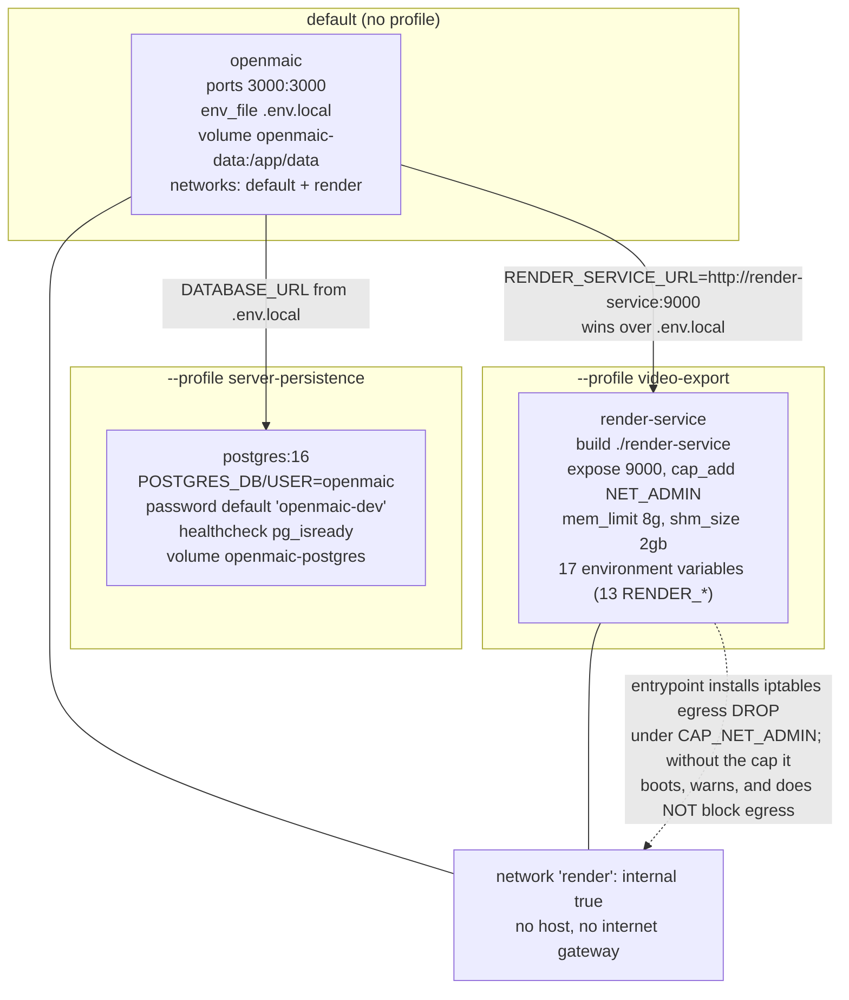

# Local Development

Prerequisites, the first-run command sequence, what the dev server does and does
not pick up, and the three `docker compose` profiles. The shortest path to a
working app is four commands; everything after that is opting into an optional
subsystem.

**Sources:** `README.md:104-360`, `CONTRIBUTING.md:25-47`, `package.json:6-8,15-17,209`,
`.nvmrc`, `.env.example`, `docker-compose.yml`, `Dockerfile`,
`playwright.config.ts:23-36`, `next.config.ts`, `vercel.json`,
`lib/config/feature-flags.ts:33`, `lib/server/config-validation.ts:181`.

## Prerequisites

| Requirement | Declared where | Value |
| --- | --- | --- |
| Node.js | `package.json:6-8` `engines.node` | `>=22.19.0` |
| Node.js (tool hint) | `.nvmrc` | `22` |
| pnpm | `package.json:209` `packageManager` | `pnpm@10.28.0` with an embedded sha512 integrity hash |
| pnpm (doc floor) | `README.md:109` | `>= 10` |
| Provider credentials | `.env.example` | at least one LLM key; all 124 uncommented assignments are optional |

`corepack` is the intended activation path — `Dockerfile:21-22` does
`corepack enable && corepack prepare pnpm@10.28.0 --activate`, and the
`packageManager` hash makes any other pnpm version detectable.

The Node engine floor is not decorative: `pnpm check:node-engine`
(`scripts/check-node-engine-contract.mjs`) fails CI if `>=22.19.0` starts below
any installed direct production dependency's own `engines.node`. See
[`07-quality-gates.md`](./07-quality-gates.md).

## First run



The four commands from `README.md:111-123,283-289` verbatim:

```bash
git clone https://github.com/THU-MAIC/OpenMAIC.git
cd OpenMAIC
pnpm install
cp .env.example .env.local        # then add at least one provider key
pnpm dev                          # http://localhost:3000
```

`pnpm install` is not cheap on a cold checkout: it runs the nine-step
`postinstall` chain described in [`03-build-pipeline.md`](./03-build-pipeline.md),
which builds two vendored forks and all six owned packages before the dev server
can start. `pnpm.ignoredBuiltDependencies` (`package.json:203-207`) suppresses
`sharp` and `unrs-resolver` install scripts, so `sharp` resolves prebuilt
binaries rather than compiling.

### Configuration surface

`.env.example` is 525 lines: 124 uncommented `KEY=` assignments plus 87
commented-out examples. Eleven distinct `NEXT_PUBLIC_*` names appear there.



The distinction is the single most common local-setup mistake. A `NEXT_PUBLIC_*`
flag added to `.env.local` while `pnpm dev` is running does nothing until the dev
server restarts, and in a production image it does nothing at all unless it was
passed as a Docker build arg (`Dockerfile:51-72`).

Two flags are also cross-checked at boot: `lib/server/config-validation.ts:181`
emits a warning when `NEXT_PUBLIC_PRO_WORKBENCH_ENABLED` is set but
`OPENMAIC_AGENT_RUNTIME_ENABLED` is not, because the Workbench UI would render
while its API routes answer 404.

## Ports

| Port | Process | Set where |
| --- | --- | --- |
| 3000 | `next dev` / `next start` / the Docker image | Next default; `Dockerfile:90` `ENV PORT=3000`, `docker-compose.yml:22-23` maps `3000:3000` |
| 3002 | Playwright's web server | `playwright.config.ts:35` `env: { PORT: '3002' }`, `use.baseURL` at `:13` |
| 5432 | PostgreSQL under the `server-persistence` profile, container-internal only | `docker-compose.yml:46-64` declares no `ports:`/`expose:`, so nothing is published to the host and `DATABASE_URL` must reach it as `postgres:5432`. 5432 is published to the host only by the CI service containers (`storage-pg-contract.yml:24-25`, `publish-packages.yml:91-92`) |
| 9000 | `render-service` under the `video-export` profile | `docker-compose.yml:83-90`, reached as `http://render-service:9000` |
| 43127 | the generation Node-consumer smoke server in CI | `ci.yml:155` |

`pnpm test:e2e` locally reuses an existing server on 3002 if one is running
(`playwright.config.ts:30` `reuseExistingServer: !process.env.CI`) and otherwise
starts `pnpm dev` with `PORT=3002` and `NEXT_PUBLIC_MAIC_EDITOR_ENABLED=true`. So
a locally-running `pnpm dev` on 3000 does **not** satisfy Playwright — the port
differs deliberately.

## The dev server

`pnpm dev` is bare `next dev` (`package.json:15`), with no port flag and no
`--turbopack`/`--webpack` override. Two consequences documented elsewhere in the
tree:

- **The bundler is Turbopack.** `scripts/sync-maic-importer.mjs:5-9` exists
  precisely because Turbopack rejects the dynamic `require()` patterns inside the
  importer bundle as a hard "Module not found: Can't resolve `<dynamic>`" error;
  and `lib/server/register-shutdown-signals.ts` exists to keep two `process.once`
  calls out of the graph Turbopack statically scans for Edge compatibility.
- **`instrumentation.ts` runs once per server instance**, before serving. It
  starts the asset-collector timer, warn-only config validation, the agent runner,
  the material-extraction runner and the LISTEN bus — all behind a
  `NEXT_RUNTIME === 'nodejs'` guard. A local dev session therefore has a live
  agent runner if `OPENMAIC_AGENT_RUNTIME_ENABLED` and `DATABASE_URL` are set. See
  [`../05-agent-runtime/index.md`](../05-agent-runtime/index.md).

`next build` type-checks with `tsconfig.build.json` when `NODE_ENV=production`
and with `tsconfig.json` otherwise (`next.config.ts:12-14`), so `pnpm dev` sees
test-file type errors that `pnpm build` does not.

## The `docker compose` path

Three service definitions, two of them behind profiles, so the default
`docker compose up --build` starts exactly one container.



| Command | Containers started |
| --- | --- |
| `docker compose up --build` | `openmaic` only |
| `docker compose --profile server-persistence up --build` | `openmaic` + `postgres` |
| `docker compose --profile video-export up --build` | `openmaic` + `render-service` |

Details that bite:

- **`env_file: .env.local` is not optional.** Compose fails if the file is absent,
  which is why `README.md:321-323` puts `cp .env.example .env.local` before
  `docker compose up`.
- **`RENDER_SERVICE_URL` is set in the compose `environment:` block**, so it wins
  over any value in `.env.local` (`docker-compose.yml:26-33`). The comment there is
  explicit that setting the URL does not by itself advertise a working render: the
  app probes the service's `/health` and degrades to the ZIP-download path when
  the `video-export` profile is off.
- **The PostgreSQL password default is labelled development-only**
  (`docker-compose.yml:53-55`), overridable via `PERSISTENCE_POSTGRES_PASSWORD`.
- **`NEXT_PUBLIC_*` must be supplied as compose build args**, not through
  `.env.local`. `docker-compose.yml:8-21` plumbs ten of them plus
  `ALLOWED_FRAME_ANCESTORS`. The server-persistence example at
  `README.md:368-372` demonstrates the pattern: `NEXT_PUBLIC_PERSISTENCE=1
  NEXT_PUBLIC_PERSISTENCE_TOKEN=… docker compose --profile server-persistence up --build`.
- **Slow-network mirrors** are two optional build args, `ALPINE_MIRROR` (hostname,
  no scheme) and `NPM_REGISTRY` (full URL), both empty by default
  (`Dockerfile:6-7`, `README.md:326-360`). Both are trailing-slash-stripped in a
  shell loop. `README.md:335-337` warns against embedding credentials in them,
  because Docker records build args in image metadata.

## Optional subsystems

Each of these is documented in `README.md` as an "Optional:" subsection and is
off by default. They matter locally because each adds either a container, a
self-hosted service, or a build-time flag.

| Subsystem | `README.md` | What it needs locally |
| --- | --- | --- |
| Lemonade (local LLM/image/TTS/ASR) | `:185` | a running Lemonade endpoint |
| FunASR (local ASR) | `:200` | a running FunASR server |
| Local audio/video extraction | `:220` | `ffmpeg` plus an ASR provider |
| `ACCESS_CODE` (shared deployments) | `:297` | one env var; adds an HMAC cookie gate in `middleware.ts` to every page and API route |
| Server-backed persistence | `:362` | `--profile server-persistence`, `DATABASE_URL`, `PERSISTENCE_DEV_TOKEN`, and the build-time `NEXT_PUBLIC_PERSISTENCE` pair |
| Agent workbench and runtime | `:448` | `OPENMAIC_AGENT_RUNTIME_ENABLED` + a non-empty `DATABASE_URL` + the build-time `NEXT_PUBLIC_PRO_WORKBENCH_ENABLED` |
| MP4 video export | `:478` | `--profile video-export` and `NEXT_PUBLIC_ENABLE_VIDEO_EXPORT` |
| MinerU (document parsing) | `:490` | a self-hosted MinerU or a cloud API key |
| VoxCPM2 (self-hosted TTS) | `:496` | a running VoxCPM backend |

`README.md:390-397` is worth reading before any non-localhost use of server
persistence: `NEXT_PUBLIC_PERSISTENCE_TOKEN` is compiled into the public bundle
and therefore provides "no confidentiality and no user isolation whatsoever".

## Working on `render-service`

It is outside the pnpm workspace, so the root commands do not touch it:

```bash
cd render-service
npm ci                 # its own package-lock.json
npm run typecheck      # tsc --noEmit
npm test               # vitest run
npm run dev            # tsx watch src/main.ts
```

CI mirrors exactly this in its own job (`ci.yml:189-223`) with
`PUPPETEER_SKIP_DOWNLOAD=true`, because the unit tests exercise unzip, admission
and body-cap boundaries and never launch a browser.

## Working on `packages/docs`

Also outside the workspace, and its install must say so:

```bash
cd packages/docs
pnpm install --frozen-lockfile --ignore-workspace
pnpm build             # next build && node scripts/postexport.mjs
```

`docs-build.yml` is path-filtered to `packages/docs/**` and runs only that.

## Open questions

- Nothing in the repository pins a local PostgreSQL version for the app-level
  `*.pg.test.ts` suites; only CI sets `PG_CONTRACT_URL`. Running those suites
  locally requires reading `storage-pg-contract.yml` to discover the variable.
- `README.md:109` says pnpm `>= 10` while `packageManager` pins `10.28.0` exactly.
  Whether a newer 10.x is supported is not stated.
