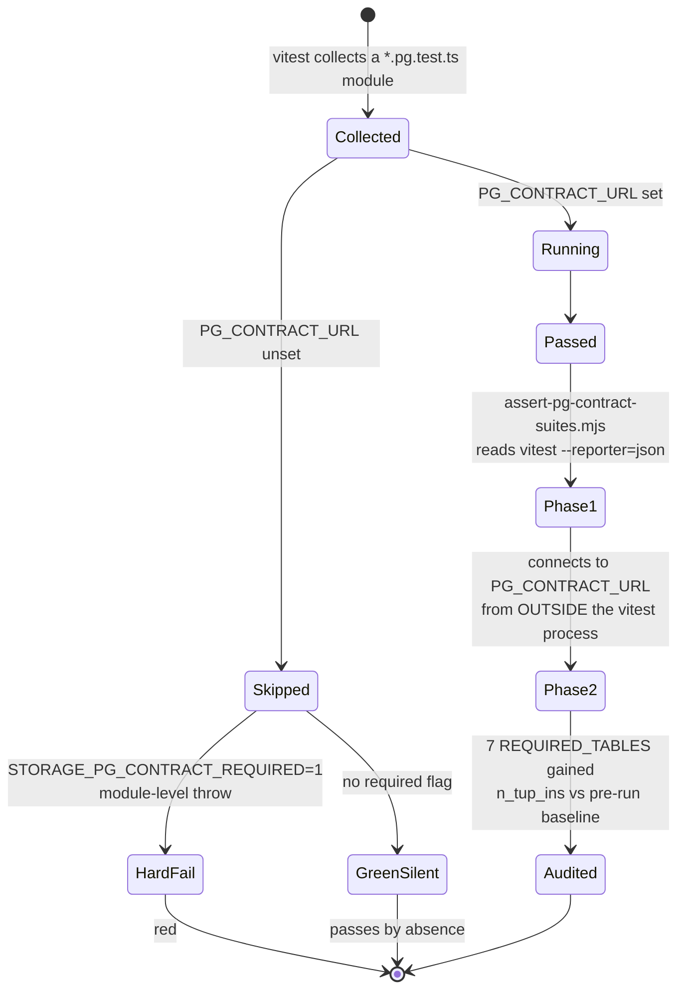

# Testing and Evals

Every test command, what it covers, and where it runs. There are **nine Vitest
projects** (one root, six per-package, one for `render-service`, one dead), one
Playwright project, and **four eval harness directories exposing six `pnpm eval:*` runner
scripts**, all manual and gating nothing.

That "four directories, six scripts" phrasing is the canonical one for this set, because
both numbers are true and citing either alone reads as a contradiction:
`ls eval/` → `orchestration`, `outline-language`, `pbl-v2-planner`, `whiteboard-layout`,
`shared` (four harnesses plus a reporting helper), while
`grep -c '"eval:' package.json` → 6, because `eval/orchestration` ships three runners
(`runner.ts`, `answering-runner.ts`, `answer-content-runner.ts`).
[`../14-code-quality/06-eval-harnesses.md`](../14-code-quality/06-eval-harnesses.md) counts
directories; this file counts both and is the reconciliation.

**Sources:** `vitest.config.ts`, `vitest.eval.config.ts`, `tests/setup-env.ts`,
all six `packages/@openmaic/*/vitest.config.ts`, `render-service/vitest.config.ts`,
`playwright.config.ts`, `scripts/assert-pg-contract-suites.mjs:61-81`,
`.github/workflows/ci.yml:136-187,268-333`,
`.github/workflows/storage-pg-contract.yml`, `eval/**`. Evidence:
[`quality-testing-ci-deps/01a`](../appendix/research/quality-testing-ci-deps/01a-modules-test-harnesses.md),
[`quality-testing-ci-deps/02b`](../appendix/research/quality-testing-ci-deps/02b-interfaces-gate-contracts.md).

## Test layers and their commands

```mermaid
flowchart TD
  subgraph L1["Layer 1 — root Vitest (vitest.config.ts)"]
    A1["pnpm test<br/>= vitest run<br/>include: tests/**/*.test.ts (666 files)<br/>alias @ -> repo root<br/>setupFiles tests/setup-env.ts"]
  end
  subgraph L2["Layer 2 — per-package Vitest, 6 independent projects"]
    B1["pnpm --filter @openmaic/dsl test (7 files)"]
    B2["pnpm --filter @openmaic/generation test (26)"]
    B3["pnpm --filter @openmaic/storage test (32)"]
    B4["pnpm --filter @openmaic/renderer test (14)"]
    B5["pnpm --filter @openmaic/editor test (49)"]
    B6["pnpm --filter @openmaic/importer test (12)"]
  end
  subgraph L3["Layer 3 — standalone service"]
    C1["cd render-service && npm test<br/>16 files, environment node"]
  end
  subgraph L4["Layer 4 — Chromium-required Vitest"]
    D1["vitest run tests/video-export/cover-card-layout.browser.test.ts<br/>COVER_LAYOUT_BROWSER=1"]
    D2["vitest run tests/video-export/interactive-static-html.browser.test.ts<br/>INTERACTIVE_STATIC_BROWSER=1"]
    D3["vitest run tests/video-export/e2e-materialize.test.ts<br/>HF_E2E_DIR set, then hyperframes lint x7"]
  end
  subgraph L5["Layer 5 — Playwright"]
    E1["pnpm test:e2e = playwright test<br/>15 specs, 1 chromium project, baseURL :3002"]
    E2["pnpm test:e2e:ui"]
  end
  subgraph L6["Layer 6 — contract suites (need real infrastructure)"]
    F1["11 *.pg.test.ts, describe.skipIf(!PG_CONTRACT_URL)"]
    F2["1 *.s3.test.ts, keyed on S3_CONTRACT_ENDPOINT"]
  end
  subgraph L7["Layer 7 — manual LLM evals, gate nothing"]
    G1["6 eval:* scripts, tsx runners"]
  end

  A1 --> CI1["ci.yml check job"]
  B1 --> CI1
  B2 --> CI1
  B3 --> CI1
  B6 --> CI1
  B4 -.->|"only on the release path"| REL["publish-packages.yml validate"]
  B5 -.->|"only on the release path"| REL
  C1 --> CI2["ci.yml render-service job"]
  D1 --> CI3["ci.yml e2e job"]
  D2 --> CI3
  D3 --> CI3
  E1 --> CI3
  F1 --> PGW["storage-pg-contract.yml"]
  F2 -.->|"no workflow sets its env vars"| NEVER["never runs"]
  G1 -.->|"no workflow invokes them"| MANUAL["developer shell only"]
```

Note which per-package suites `ci.yml` runs: `importer`, `dsl`, `generation`,
`storage` (`ci.yml:139-149,186-187`). `renderer` and `editor` are tested **only**
on the release path (`publish-packages.yml:213-216`).

## Root Vitest project

`vitest.config.ts` is 14 lines. `test.include` is exactly
`['tests/**/*.test.ts']` (line 11) — one glob, no `exclude`, no `environment`, no
`coverage`, no `pool` tuning, no timeout override.

| Property | Value | Consequence |
| --- | --- | --- |
| `resolve.alias['@']` | repo root | `tests/**` imports `@/lib/...`, `@/app/api/.../route`, `@/components/...` directly, so route handlers are unit-testable as plain functions |
| `test.include` | `tests/**/*.test.ts` | `.test.tsx` is **not** matched. Measured: zero `.test.tsx` files exist under `tests/`, so nothing is currently lost — but a React test added there would be collected by nothing and pass by absence |
| default environment | `node` | a component test needing a DOM must declare `// @vitest-environment jsdom` per file or take its DOM by injection |
| `setupFiles` | `tests/setup-env.ts` | see below |

`tests/setup-env.ts` (41 lines) exists to **not** load `.env.local` (line 23).
Its docstring records the reasoning: loading it unconditionally cannot make a
test pass — CI has no `.env.local` — "it can only invent failures that exist on
one machine and nowhere else". Opt back in with `TEST_LOAD_LOCAL_ENV=1`.
Shell-exported variables are untouched either way; the parser splits on the first
`=`, skips blanks and `#` comments, and never overwrites an existing key.

`tests/` holds 680 tracked files: 666 `*.test.ts` plus 14 helpers, across 47
subdirectories that mirror `lib/` and `app/`.

### Meta-tests: the suite testing its own tooling

Seven suites assert on infrastructure rather than product code. They are the
reason a workflow or lint-config edit can fail a *test* rather than only a job.

| Suite | What it pins |
| --- | --- |
| `tests/lint-llm-entry-guard.test.ts` | Runs the **real** ESLint against the real `eslint.config.mjs` on in-memory text across a bypass-form × extension × path matrix. Line 67 makes an ESLint-ignored path return a sentinel rather than an empty array, so an ignored path can never look like a pass |
| `tests/workflows/ci-video-export-contract.test.ts` | Parses `.github/workflows/ci.yml` with `js-yaml` and asserts specific step `env` blocks and shell bodies, including `COVER_LAYOUT_BROWSER` and `INTERACTIVE_STATIC_BROWSER` |
| `tests/workflows/publish-packages-workflow.test.ts` | Same technique against the release workflow |
| `tests/ci/check-clawhub-version.test.ts` | Exercises `.github/scripts/check-clawhub-version.mjs` |
| `tests/ci/publish-openmaic-skill.test.ts` | Exercises the ClawHub publish shell script's argument and divergence paths |
| `tests/security/iframe-sandbox.test.ts` | Regex-scans source for a `sandbox=` value combining `allow-scripts` with `allow-same-origin` |
| `tests/packages/editor-manifest.test.ts` | Pins `@openmaic/editor`'s manifest shape |

Because `.prettierignore` excludes `*.yml`/`*.yaml` and ESLint does not read YAML,
these meta-tests are the **only** automated check on workflow content.

## Per-package Vitest projects

All six use `include: ['test/**/*.test.ts']` (or `.{ts,tsx}` for `renderer` and
`editor`). Three add a source alias so the suite runs on a clean checkout with no
`dist` build:

| Package | `resolve.alias` | `environment` | `setupFiles` |
| --- | --- | --- | --- |
| `dsl` | `@openmaic/dsl` → `./src/index.ts` | default (node) | — |
| `generation` | `@openmaic/generation` → `./src/index.ts` | `node` | — |
| `storage` | `@openmaic/storage` → `./src/index.ts`, `@openmaic/dsl` → `../dsl/src/index.ts` | `node` | `./test/setup.ts` |
| `renderer` | — | default | `./test/setup.ts` |
| `editor` | — | default | `./test/setup.ts` |
| `importer` | — | default | — |

`storage`'s config comment states the design: the backends take their `Storage` /
`IDBFactory` **by injection**, so `test/setup.ts` only shims the few browser
globals the backends touch (IndexedDB, `URL.createObjectURL`, `crypto.subtle`) and
each test passes fresh isolated instances rather than leaning on ambient globals.

## The dead config

`vitest.eval.config.ts` (14 lines) is identical to the root config except
`include: ['tests/**/*.eval.test.ts']`. Measured: **zero** `*.eval.test.ts` files
exist anywhere, and the string `vitest.eval.config` appears in no `package.json`
script, no workflow and no document. It is unreferenced configuration. It is not
related to `eval/` — those are `tsx` entry points, not a Vitest project.

## Contract suites gated on real infrastructure

Eleven `*.pg.test.ts` files exist. Six live in `packages/@openmaic/storage/test/`,
five in the app's `tests/`. All guard with `describe.skipIf(!contractUrl)`.

| Suite | Audited by `REQUIRED_SUITES`? | Runs against a database in CI? |
| --- | --- | --- |
| `packages/@openmaic/storage/test/pg-document-store.pg.test.ts` | yes | `storage-pg-contract.yml`, `publish-packages.yml` |
| `packages/@openmaic/storage/test/pg-runtime-store.pg.test.ts` | yes | same |
| `packages/@openmaic/storage/test/pg-scene-revision.pg.test.ts` | yes | same |
| `packages/@openmaic/storage/test/pg-agent-session-store.pg.test.ts` | no | runs (job-wide `PG_CONTRACT_URL`), execution not asserted |
| `packages/@openmaic/storage/test/pg-agent-session-material.pg.test.ts` | no | same |
| `packages/@openmaic/storage/test/pg-asset-store.pg.test.ts` | no | same |
| `tests/lib/whiteboard/runtime-store.pg.test.ts` | no | invoked explicitly at `storage-pg-contract.yml:67` |
| `tests/agent-runtime/event-notify.pg.test.ts` | no | **never** — `pnpm test` has no postgres service |
| `tests/agent-runtime/park-attempt-budget.pg.test.ts` | no | **never** |
| `tests/agent-runtime/session-events-live.pg.test.ts` | no | **never** |
| `tests/persistence/owner-materials.pg.test.ts` | no | **never** |
| `packages/@openmaic/storage/test/s3-asset-bytes.s3.test.ts` | n/a | **never** — no workflow sets `S3_CONTRACT_ENDPOINT` or `STORAGE_S3_CONTRACT_REQUIRED` |

`REQUIRED_TABLES` (`assert-pg-contract-suites.mjs:73-81`) is the seven tables
created by `DOCUMENT_PG_SCHEMA` and `RUNTIME_PG_SCHEMA`: `document_stages`,
`document_scenes`, `document_outlines`, `document_stage_revision`,
`document_scene_revision`, `runtime_sessions`, `runtime_records`. The list is
deliberately hand-written rather than parsed out of the schema sources, "because
deriving it from the code under test would let that code narrow its own audit"
(`:67-72`).

Phase 2 counts `pg_stat`'s `n_tup_ins` as a **delta against a baseline captured
before the run**, not an absolute — the suites clean up after themselves, so
surviving rows would prove nothing, and an absolute count would let a
non-ephemeral database satisfy the check forever (`:31-37`). The script states
what it does not prove: that the built `PgDocumentStore`/`PgRuntimeStore` were the
code that inserted the rows (`:45-50`).

## Chromium-required Vitest suites

Two suites need the compiler *and* a real browser, so they live in the `e2e` job
rather than `check`:

| Suite | Gate variable | Set at | Behaviour without it |
| --- | --- | --- | --- |
| `tests/video-export/cover-card-layout.browser.test.ts` | `COVER_LAYOUT_BROWSER=1` | `ci.yml:273-274` | a missing Chromium is a skip; with the flag it is a hard failure |
| `tests/video-export/interactive-static-html.browser.test.ts` | `INTERACTIVE_STATIC_BROWSER=1` | `ci.yml:278-279` | same |
| `tests/video-export/e2e-materialize.test.ts` | `HF_E2E_DIR=<dir>` | `ci.yml:285` | the filesystem materializer is skipped |

`e2e-materialize.test.ts` writes seven Hyperframes sample projects, and
`ci.yml:289-311` then runs `hyperframes lint` over each of `quiz`, `pbl-v2`,
`pbl-legacy`, `pbl-dense`, `mixed`, `arabic`, `interactive-static`. It requires
both a zero exit status **and** the literal string `0 errors, 0 warnings`, because
Hyperframes 0.7.60 reports warning-only lint with exit status zero
(`ci.yml:287-288`).

## Playwright

15 specs under `e2e/tests`, one `chromium` project (`devices['Desktop Chrome']`).

| Setting | Value | Line | Stated reason |
| --- | --- | --- | --- |
| `testDir` | `./e2e/tests` | 4 | — |
| `fullyParallel` | `true` | 5 | — |
| `forbidOnly` | `!!process.env.CI` | 6 | — |
| `retries` | `CI ? 2 : 0` | 7 | — |
| `workers` | `CI ? 2 : undefined` | 10 | "Two workers fit a 4-core runner" |
| `reporter` | `CI ? 'html' : 'list'` | 11 | — |
| `use.baseURL` | `http://localhost:3002` | 13 | — |
| `use.trace` | `'on-first-retry'` | 14 | — |
| `use.screenshot` | `'only-on-failure'` | 15 | — |
| `webServer.command` | `CI ? 'pnpm start' : 'pnpm dev'` | 28 | CI builds in a dedicated step |
| `webServer.reuseExistingServer` | `!process.env.CI` | 30 | — |
| `webServer.timeout` | `120_000` | 31 | "covers startup, not the (much slower) build" |
| `webServer.env` | `PORT=3002`, `NEXT_PUBLIC_MAIC_EDITOR_ENABLED=true` | 35 | build-time flag; in CI it must be set on `pnpm build` too |

The fixture surface is one fixture. `e2e/fixtures/base.ts` extends Playwright's
`test` with `mockApi` and **unconditionally** stubs `/api/server-providers`,
because the root layout calls it on every page load. `e2e/fixtures/mock-api.ts`
stubs four endpoints; `mockSceneActions(stageId?)` reads `stageId` out of the
request body when the caller supplies none, so a spec can assert against a
dynamically generated stage id. Three page objects live in `e2e/pages/`.

`e2e/**` is excluded from `tsconfig.json:39` and listed in ESLint's `globalIgnores`
(`eslint.config.mjs:53`), has no `e2e/tsconfig.json`, and gets no `tsc` step in any
workflow.

## Duration

No workflow records step timings, and no `--reporter` writes durations to an
artefact, so per-suite duration is not determinable from the repository. What the
repository *does* pin is job budgets and one contention decision:

| Job | `timeout-minutes` |
| --- | --- |
| `ci.yml` `check` | 15 |
| `ci.yml` `render-service` | 10 |
| `ci.yml` `e2e` | 15 |
| `storage-pg-contract.yml` | 10 |

`ci.yml:133-135` states the one measured fact about test timing in the tree:
running root Vitest alongside the storage package on a 4-core runner made
5-second-timeout tests flake — "CPU contention, not a product regression" — so all
test steps in `check` are deliberately sequential. Only the four linters run in
parallel, and only because they share no state (`ci.yml:123`).

The parallel-linter step's comment records the other number: sequentially those
four were "~2 minutes; the slowest (ESLint) is the new bound" (`ci.yml:123-124`).

## Four harness directories, six runner scripts

Six `eval:*` entry points (`package.json:28-33`) across four `eval/` directories:
`orchestration` contributes three of them. None is wired into any workflow. Each
is a `tsx` entry point behind a `package.json` script, each requires a model string
from the environment with no default, and each writes a timestamped markdown + JSON
report under `eval/<name>/results/<model>/<timestamp>/` via `eval/shared/run-dir.ts`
and `eval/shared/markdown-report.ts`. Five of the six results directories are
gitignored (`.gitignore:76-80`); `eval/pbl-v2-planner/results/`
(`eval/pbl-v2-planner/runner.ts:33`) is not, so running that harness leaves
untracked report files that `git status` surfaces and `git add -A` would commit.

| Harness | Script | Scenarios | Scoring | Exit gate |
| --- | --- | --- | --- | --- |
| `eval/pbl-v2-planner` | `eval:pbl-v2-planner` | 23 (`scenarios/test-cases.json`) | 12-dimension LLM judge + `redLines` + a separate completability judge | `runner.ts:919` — `process.exit(allPassed ? 0 : 1)`; usage errors exit 2 |
| `eval/whiteboard-layout` | `eval:whiteboard` | 6 (one JSON per subject) | VLM rubric, 5 dimensions plus `overall` and `issues[]` | **none** — writes a report and returns; exits 1 only on no-scenarios or a fatal throw (`runner.ts:356,393`) |
| `eval/orchestration` (premature END) | `eval:orchestration` | 5 (`scenarios/premature-end.json`) | **deterministic**, no judge: the production `parseDirectorDecision` → END rate | `runner.ts:187` — `allPostFixPass` |
| `eval/orchestration` (answering) | `eval:orchestration:answering` | 7 (`scenarios/answering.json`) | — | `answering-runner.ts:402` — `overallPass` |
| `eval/orchestration` (answer content) | `eval:orchestration:answer-content` | 12 (`scenarios/answer-content.json`) | LLM judge (`answer-content-judge.ts`) | `answer-content-runner.ts:516` — `overallPass` |
| `eval/outline-language` | `eval:outline-language` | 50 (`scenarios/language-test-cases.json`) | LLM-as-judge, binary `pass` | `runner.ts:168` — requires **100 %** (`passed === results.length`) |

Two design decisions worth copying into any new harness:

- `eval/orchestration/judge.ts:1-8` argues *against* an LLM judge where the verdict
  is binary and derivable from production parsing code. `answering-runner.ts:14`
  records the same decision for itself ("per-decision classification
  (deterministic, no LLM judge)"); the other four harnesses use judges because
  their verdicts are not binary.
- `eval/orchestration/judge.ts:25-30` excludes errored samples from the END-rate
  denominator, naming the failure mode it guards: an API failure such as a provider
  `Forbidden` would otherwise "masquerade as deterministic END behavior".

Five test files under `tests/eval/` unit-test the harness plumbing itself
(`resolve-model`, `run-dir`, the outline-language reporter, and two
prompt-integrity tests over the PBL judge prompt markdown).

## Open questions

- **Coverage is unknowable.** No coverage provider is installed anywhere — no
  `@vitest/coverage-v8`, and no `coverage` block in any of the nine Vitest configs.
- Four app-level `*.pg.test.ts` suites and the one `*.s3.test.ts` suite are
  collected by their projects but never run against real infrastructure in any
  workflow. Whether that is deliberate is not recorded.
- `vitest.eval.config.ts` matches zero files and is referenced nowhere. Whether it
  is a leftover or a placeholder for planned work is not recorded.
- The six eval harnesses have no committed baseline, so a regression is only
  visible by comparing two manual runs by hand.
