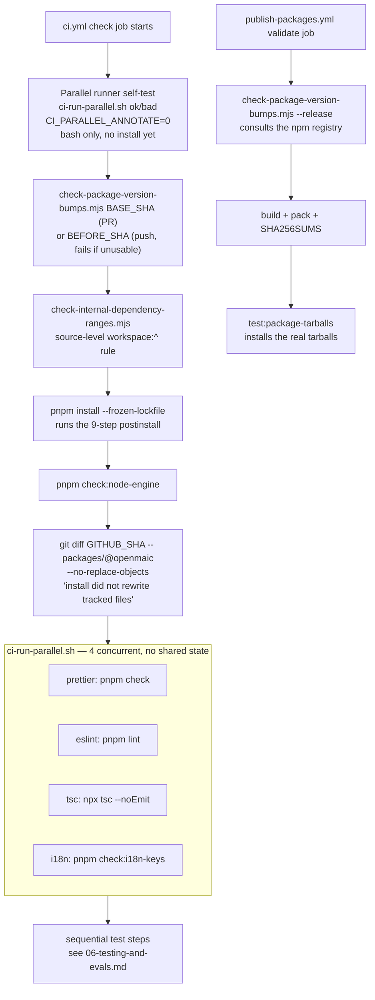
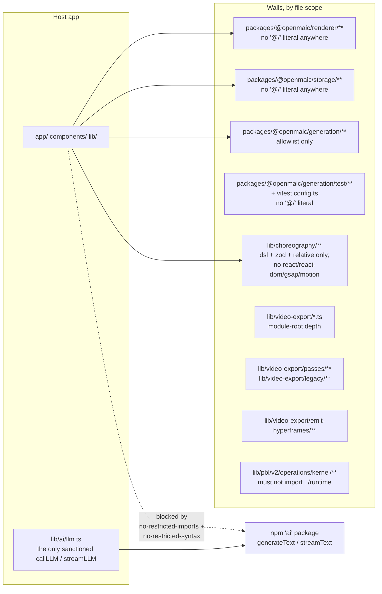
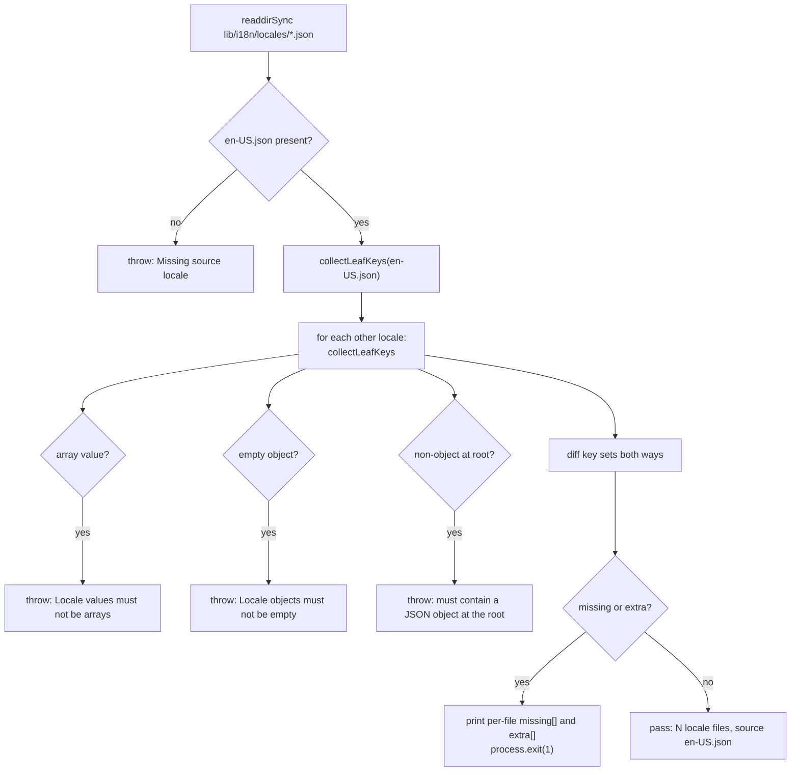
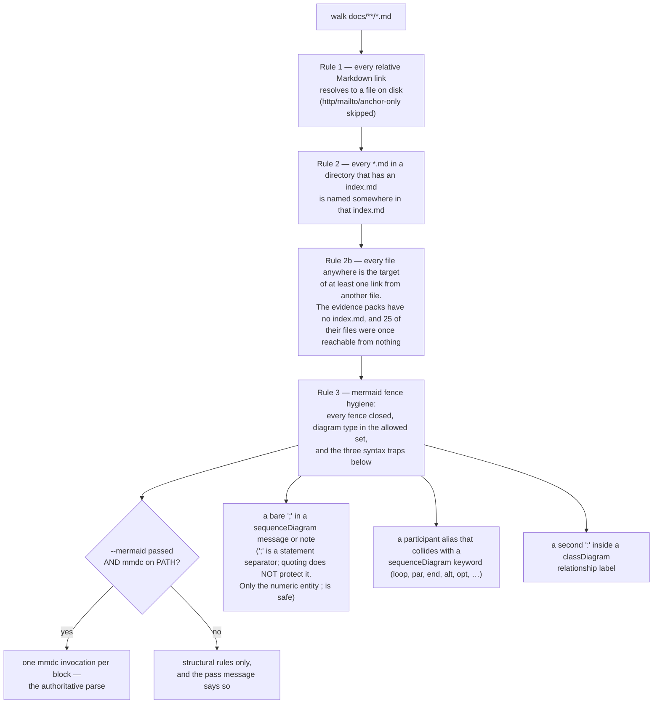

# Quality Gates

Nine gates decide whether a change may land. This file covers the six that read
the working tree — Prettier, ESLint, `tsc --noEmit`, `check:i18n-keys`,
`check:node-engine`, and the documentation-set check — plus the order the `check`
job runs everything in. The three package-scoped gates live in
[`07b-version-and-release-gates.md`](./07b-version-and-release-gates.md).

The ninth, `scripts/check-docs-links.mjs`, is the newest and the only one **with no
`package.json` script and no workflow step**; §Gate 6 states exactly why, and what does
run it today.

**Sources:** `.prettierrc`, `.prettierignore`, `eslint.config.mjs` (670 lines),
`tsconfig.json`, `tsconfig.build.json`, `scripts/check-i18n-keys.mjs`,
`scripts/check-node-engine-contract.mjs`, `scripts/ci-run-parallel.sh`,
`.github/workflows/ci.yml:38-137`. Evidence:
[`quality-testing-ci-deps/01b`](../appendix/research/quality-testing-ci-deps/01b-modules-ci-and-build.md),
[`quality-testing-ci-deps/02b`](../appendix/research/quality-testing-ci-deps/02b-interfaces-gate-contracts.md),
[`quality-testing-ci-deps/05`](../appendix/research/quality-testing-ci-deps/05-failure-modes.md).

## The gate sequence

Order in the `check` job is not arbitrary: the cheapest checks and the ones that
must run **before** any third-party install code run first.

Two ordering decisions carry their reasons in the workflow:

- The **parallel-runner self-test runs before `pnpm install`** so a broken helper
  fails in seconds rather than after a full install (`ci.yml:38-40`). It asserts
  both the success case and the expected-failure case, with
  `CI_PARALLEL_ANNOTATE=0` so the deliberate failure does not paint a fake
  `::error::` annotation.
- The **source-level dependency-range check runs before install** too
  (`ci.yml:83-89`), because the stronger tarball form "installs five package
  tarballs, so it runs only on the release path. This is the cheap source-level
  form, here so that a pull request restoring `workspace:*` fails at review time
  rather than at release time, after a version number has already been spent."

## Gate 1 — Prettier (`pnpm check` / `pnpm format`)

`.prettierrc`: 100-column `printWidth`, 2-space `tabWidth`, `semi: true`,
`singleQuote: true`, `quoteProps: 'as-needed'`, `jsxSingleQuote: false`,
`trailingComma: 'all'`, `bracketSpacing: true`, `bracketSameLine: false`,
`arrowParens: 'always'`, `proseWrap: 'preserve'`, `endOfLine: 'lf'`.

**Fails as:** `prettier . --check` prints the offending file list and exits
non-zero. Recovery is `pnpm format`.

**Does not cover:** `*.md`, `*.yml`, `*.yaml`, both vendored forks,
`packages/@openmaic/*/dist/`, `packages/@openmaic/importer/src1/`,
`packages/docs/`, `.next/`, `out/`, `*.min.js`, `*.min.css`,
`lib/export/svg-arc-to-cubic-bezier.d.ts`, and `pnpm-lock.yaml`.

`prettier` is **exact-pinned** at `3.8.1` in `devDependencies`, because it formats
the tree and three `gen:*` scripts run it programmatically to format their
generated output — a version drift would rewrite committed bytes.

## Gate 2 — ESLint (`pnpm lint`)

670 lines, 15 config entries: two inherited spreads
(`eslint-config-next/core-web-vitals`, `.../typescript`), one `globalIgnores`, one
repo-wide rule tweak (`:58`), nine module-boundary walls (`:97`, `:122`, `:146`,
`:195`, `:254`, `:348`, `:419`, `:498`, `:539`), and two blocks implementing the
single-LLM-entry-point guard (`:608`, `:650`).

`globalIgnores` (`eslint.config.mjs:30-57`) — each entry with an inline reason:

| Ignored | Reason given |
| --- | --- |
| `.next/**`, `out/**`, `build/**`, `next-env.d.ts` | eslint-config-next defaults, restated because the override replaces them |
| `packages/docs/**`, `packages/mathml2omml/**`, `packages/pptxgenjs/**` | third-party / vendored, not our code |
| `packages/@openmaic/*/dist/**`, `.../node_modules/**`, `packages/@openmaic/importer/src1/**` | lint the source, skip build output and the vendored legacy reference |
| `public/vendor/**` | the generated importer bundle copied in by `postinstall` |
| `.claude/**`, `.superpowers/**`, `.worktrees/**`, `.scratch/**` | local tooling files |
| `e2e/**` | "Playwright e2e tests (not React code)" |
| `render-service/**` | own package, tsconfig and Node-only deps; linted under `render-service/` |

### The nine boundary walls

ESLint here is not a style checker — it is where module boundaries are
machine-enforced.

Mechanics stated in the file's own comments and worth internalising before editing
it:

- **Flat config REPLACES a rule's options per key; it does not merge them.** That
  drives the whole structure. `AI_SDK_DYNAMIC_IMPORT_BAN` (`:13`) is a shared array
  spread into every block that sets `no-restricted-syntax`, precisely so a
  repo-wide block would not silently drop those blocks' own boundaries.
- **A dynamic `import()` is an `ImportExpression`, which `no-restricted-imports`
  cannot see.** Hence both rule families, and the static-import guard uses
  `@typescript-eslint/no-restricted-imports` rather than the base rule.
- **The `@/` ban is a string-prefix match**, `Literal[value=/^@\//]` plus
  `TemplateElement[value.cooked=/^@\//]` (`:205-213`), which makes it complete
  against every single-literal module-reference form. Out of scope, and named as
  such: a specifier assembled entirely from non-`@/` pieces, and relative parent
  escapes.
- **`lib/video-export` is split into three file scopes** because a single `../`
  means different things at different depths: from a module-root file it escapes
  the module, from `passes/` it stays inside.
- **The LLM guard's `files` glob is every linted extension**
  (`**/*.{ts,tsx,js,jsx,mjs,cjs}`, `:609,651`), not just `.ts`/`.tsx`, after review
  caught `app/api/route.js` and `scripts/*.mjs` being free to import the SDK.

**Fails as:** an ESLint error with the wall's own long message. The
`lib/video-export/passes` message, for example, names the architectural reason:
"Live app state enters only through the injected TimingProbe / AssetSource".

`tests/lint-llm-entry-guard.test.ts` runs the **real** ESLint against this real
config over a bypass-form × extension × path matrix, so narrowing a wall's scope
fails a *test*, not just a lint run.

## Gate 3 — `tsc --noEmit`

CI runs the **root** config (`ci.yml:130`), i.e. the one that includes `tests/`,
`eval/`, and `packages/@openmaic/*/src` and `test`. `next build` uses
`tsconfig.build.json` instead when `NODE_ENV=production`, so the two disagree by
design — see [`01-monorepo-layout.md`](./01-monorepo-layout.md).

Two package-scoped typechecks run separately because the root run does not cover
their test trees the way the packages need:

| Step | Command | Reason (`ci.yml:180-184`) |
| --- | --- | --- |
| `TypeScript (generation)` | `pnpm --filter @openmaic/generation run typecheck` | chains `tsc -p tsconfig.test.json --noEmit` |
| `TypeScript (storage, incl. tests)` | `pnpm --filter @openmaic/storage run typecheck` | the device-scope guard is written as `@ts-expect-error` probes in its tests, "and a probe nothing type-checks proves nothing" |

`strict: true` is on (`tsconfig.json:7`), with `isolatedModules`,
`moduleResolution: 'bundler'`, and `skipLibCheck: true`.

## Gate 4 — `check:i18n-keys`

`scripts/check-i18n-keys.mjs` (114 lines) reads every `*.json` under
`lib/i18n/locales`, takes `en-US.json` as the source, and requires **exact leaf-key
set equality** in both directions.

**Fails as:** a per-file listing of every missing and every extra key, then exit 1.
An **extra** key fails just as hard as a missing one, so a translator cannot leave
a stale key behind.

**Does not cover:** the TS-resident workbench copy that
`lib/i18n/config.ts` deep-merges over the JSON locale trees under `workbench.*`.
The gate reads only `lib/i18n/locales`. See
[`../10-persistence-and-state/index.md`](../10-persistence-and-state/index.md).

## Gate 5 — `check:node-engine`

`scripts/check-node-engine-contract.mjs` (73 lines). Reads the root
`engines.node` (`>=22.19.0`), takes `semver.minVersion` of it, then for every
**direct production dependency** reads
`node_modules/<name>/package.json` and compares against that dependency's own
`engines.node` minimum.

**Fails as:** one bullet per offending dependency —
`root engines.node ">=22.19.0" starts at 22.19.0, below <dep>@<version>
engines.node "<range>" (minimum <v>)` — then exit 1. An unreadable installed
manifest is also a failure, with the message "Run pnpm install before this check".

**Passes with:** a count, `root minimum <v> satisfies <N> engine-constrained
direct production dependencies`.

**Does not cover:** `devDependencies`, transitive dependencies, or the workspace
packages' own `engines` fields.

## Gate 6 — the documentation-set check

`scripts/check-docs-links.mjs` walks `docs/**/*.md` and asserts four things, in
increasing order of how often each has actually broken:

**Why rule 3 exists as a regex at all.** The authoritative check is the real Mermaid
parser, but `@mermaid-js/mermaid-cli` pulls a headless browser, which is too heavy for
a lint gate. So the three failure classes that have actually broken blocks in this set
are detected statically, and `--mermaid` opts into the full parse where `mmdc` is
available. Those three classes accounted for **all 19** non-parsing blocks found the
first time this set was audited.

`--mermaid` launches one `mmdc`, and therefore one headless browser, per block, serially:
budget about a second each, roughly fifteen minutes over the whole set. It is a pre-merge or
nightly check. The default mode is milliseconds, which is why the four rules were chosen to
be the ones that matter without it.

**Fails as:** one line per problem, `path:line — message`, then exit 1.

**Passes with:** a count of files and mermaid blocks, and an explicit statement of
whether the full parse ran.

**What runs it today:** `node scripts/check-docs-links.mjs`, invoked by hand. **There is
deliberately no `package.json` script yet, and no workflow step.** Adding a script to the
root manifest shifts every line below it, and roughly thirty `package.json:<line>`
citations across this set point into that file — so the npm entry belongs in the same
change as the CI job, whose author can re-derive those citations once instead of twice.

What *did* change to make the gate possible: `docs/` was removed from `.gitignore`, so the
set is tracked and a `paths:`-filtered job can see it. Previously CI physically could not.

**Does not cover:** whether a `path:line` citation still resolves to the symbol named
beside it. That is the set's largest remaining unverified claim class, and checking it
would need a TypeScript program rather than a file walk.

**Does not cover:** whether a `path:line` citation still resolves to the symbol named
beside it. That is the set's largest remaining unverified claim class, and checking it
would need a TypeScript program rather than a file walk.

## The three package-scoped gates

Gates 7, 8 and 9 — `check:package-versions`, the internal dependency-range check,
and the packed tarball smoke test — are about what a *published* tarball declares
rather than about the working tree. They have their own file:
[`07b-version-and-release-gates.md`](./07b-version-and-release-gates.md).

## Open questions

- No licence-scanning step exists in any workflow and no `license-checker`-style
  dependency is installed, so a future copyleft addition would surface nowhere.
  The already-present LGPL-3.0-or-later `mathml2omml` fork is bundled into the
  MIT-licensed app via `lib/export/latex-to-omml.ts`, and no file in the repository
  records a decision about it.
- Nothing verifies the three `gen:video-export-*` outputs against a fresh
  regeneration, unlike `renderer`'s two generated files, which the post-install
  tree diff covers.
- `middleware.ts` — the HMAC access-code gate that fronts every page and API route
  — has no test suite anywhere in `tests/`.
