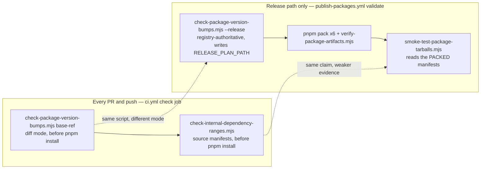
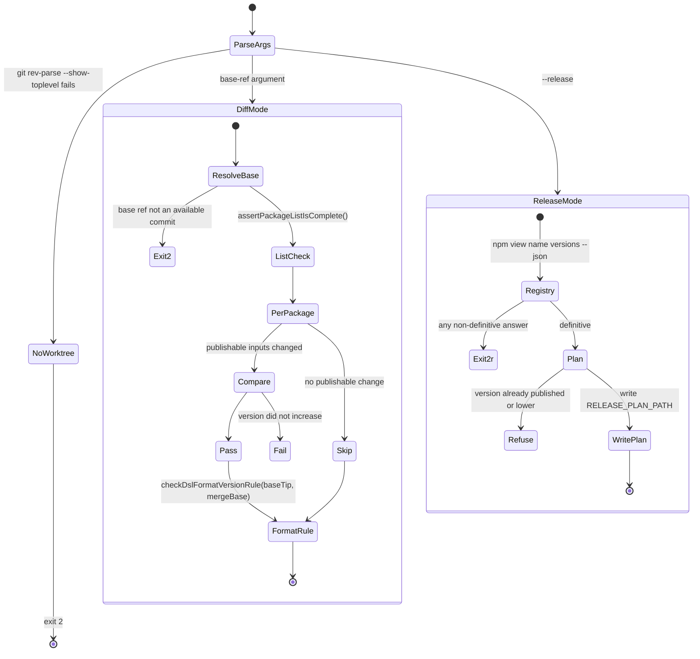
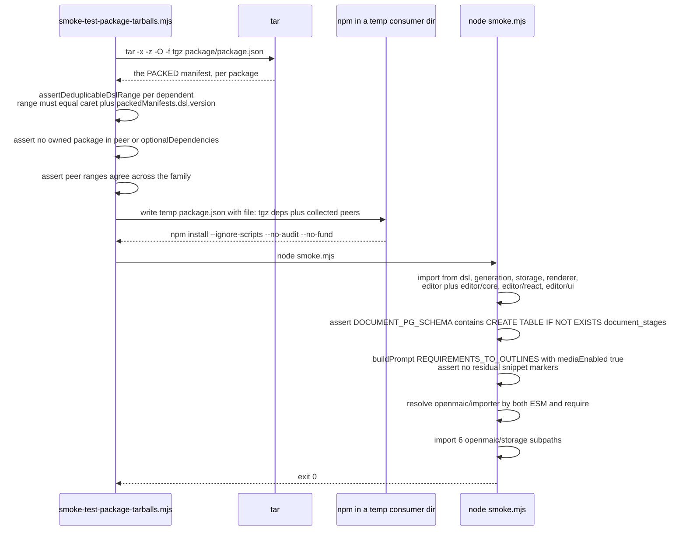

# Version and Release Gates

The three gates that govern what a *published* tarball declares, rather than what
the working tree looks like: `check:package-versions` (two modes),
`check-internal-dependency-ranges`, and the packed tarball smoke test. Continues
[`07-quality-gates.md`](./07-quality-gates.md), which covers the five tree-hygiene
gates.

**Sources:** `scripts/check-package-version-bumps.mjs` (685 lines),
`scripts/check-internal-dependency-ranges.mjs` (159),
`scripts/smoke-test-package-tarballs.mjs` (206),
`scripts/openmaic-packages.mjs:17-33`, `.github/workflows/ci.yml:59-89`,
`.github/workflows/publish-packages.yml:114-237`. Evidence:
[`quality-testing-ci-deps/01b`](../appendix/research/quality-testing-ci-deps/01b-modules-ci-and-build.md),
[`quality-testing-ci-deps/05`](../appendix/research/quality-testing-ci-deps/05-failure-modes.md).

## Where the three sit



The pairing is deliberate. `ci.yml:83-87` states it: the tarball smoke test proves
the claim about "the bytes that would actually be published, but it installs five
package tarballs, so it runs only on the release path. This is the cheap
source-level form, here so that a pull request restoring `workspace:*` fails at
review time rather than at release time, after a version number has already been
spent."

## Gate 6 — `check:package-versions`

`scripts/check-package-version-bumps.mjs`, 685 lines, two modes.



### Diff mode — the merge-time gate

For each package whose **publishable inputs** changed between `<base-ref>` and
`HEAD`, the manifest version must have increased (`runDiffMode`, `:441`).
"Publishable input" means "file under the package directory" minus the ignore
lists documented in [`04-scripts-inventory.md`](./04-scripts-inventory.md).

**Fails as** exactly the message `CONTRIBUTING.md:136-138` quotes:

```
<package>: publishable package inputs changed but version did not increase (0.11.0 -> 0.11.0)
```

Other failure branches: the manifest was removed; the version string is
unparseable at either revision; the shared package list itself has drifted. A
package that did not exist at the base ref is reported as new and skipped.

### The dsl serialized-format escape rule

`checkDslFormatVersionRule` (`:308`) is the subtlest gate in the repository.
`@openmaic/dsl` owns two serialized-format constants in
`packages/@openmaic/dsl/src/version.ts`. Dependents declare it `workspace:^`,
published as a caret — so **any version the caret admits reaches them with no
release of their own**. The rule therefore requires a format change to be
accompanied by a dsl version increase that *escapes* the dependents' caret:

| Current dsl version | Caret admits | Required escape | Level |
| --- | --- | --- | --- |
| `1.4.2` | `>=1.4.2 <2.0.0` | `2.0.0` | MAJOR |
| `0.5.1` | `>=0.5.1 <0.6.0` | `0.6.0` | MINOR |
| `0.0.3` | only `0.0.3` | `0.0.4` | PATCH |

Expressed as "escape the caret" rather than a fixed level so the rule stays
correct across the 1.0 boundary (`:270-272`). The worked failure it prevents is
spelled out at `:290-295`: dsl 0.5.1 moving `DSL_VERSION` `0.1.0` → `0.2.0` would
let installation A stamp `dslVersion: '0.2.0'` rows that installation B —
lockfile-pinned to dsl 0.5.0 — hard-fails to read, from *the same published storage
version*.

It uses **two** git references deliberately (`:485-497`): the merge base answers
"did this branch move a format constant", and the base tip answers "which caret
must the bump escape". It **fails closed** (`:303-306`): if the constants cannot be
located at either revision while dsl changed at all, that is an error, not a pass.
It also treats *ambiguity* as an error — during a half-finished rename both
candidate files can exist, so taking the first match could compare the wrong file
and pass (`:316-323`).

### Release mode — the pre-publish gate

Consults the npm registry via `npm view <name> versions --json --registry https://registry.npmjs.org`
(`registryVersions`, `:515`) and refuses to reuse or downgrade a published version.
It writes the surviving plan to `RELEASE_PLAN_PATH`.

`registryVersions` returns "does not exist" **only** for a definitive answer.
"a transient error, an auth or proxy failure, an unparseable body, a registry that
is not the one we publish to — exits non-zero, because reading 'unknown' as 'never
published' would skip the checks below entirely" (`:506-514`).

## Gate 7 — internal dependency ranges

`scripts/check-internal-dependency-ranges.mjs` (159 lines). An owned `@openmaic`
package may appear as another's dependency **exactly once, in `dependencies`, as
`workspace:^`**.

| Violation | Message shape |
| --- | --- |
| any other range | `declares dependencies."@openmaic/dsl" as "workspace:*". Use "workspace:^" …` |
| `peerDependencies` / `optionalDependencies` entry | `An owned @openmaic package may be declared exactly once, in dependencies` |
| `devDependencies` entry | `a devDependency is not published as a constraint, so it would satisfy the workspace link while the tarball declared no dependency on it at all` |
| `INTERNAL_DEPENDENTS` entry with no matching manifest declaration | `no longer declares any owned @openmaic dependency … this check must not go quiet on its own` |
| manifest declaration with no `INTERNAL_DEPENDENTS` entry | `is absent from INTERNAL_DEPENDENTS … so nothing checks how it is published` |

The `assertPackageListIsComplete()` call is **first and fatal** (`:55-60`): "every
check below reads this list, so if the list itself is wrong there is nothing
meaningful to say about what it contains."

The rationale for `workspace:^` over `workspace:*` is in
[`02-package-dependency-graph.md`](./02-package-dependency-graph.md).

## Gate 8 — the packed tarball smoke test

`scripts/smoke-test-package-tarballs.mjs` (206 lines), release path only
(`publish-packages.yml:234-237`). It is the strongest form of the dependency-range
claim because it inspects the bytes that would actually be published.



What each assertion catches:

| Assertion | Failure it prevents |
| --- | --- |
| `range === '^' + dslVersion` | `workspace:*` publishing as an exact pin → duplicate dsl copies |
| no owned package in `peerDependencies`/`optionalDependencies` | a second published constraint pinning dsl exactly while `dependencies` reads as a caret |
| peer ranges agree across the family | two packages declaring incompatible `react`/`echarts` peers; an intersection is not synthesised because it is unsafe for ranges containing `\|\|` |
| `generationPrompt.system` has no `{{snippet:` left | a missing packaged `snippets/` directory — snippet inlining runs before conditional pruning, so it throws even for pruned blocks |
| six `@openmaic/storage` subpath imports | a broken `exports` map: `runtime/http`, `document/http`, `document/pg`, `runtime/pg`, `server`, `server/reference` |
| `@openmaic/importer` resolves under both `import.meta.resolve` and `createRequire` | a dual-format `main`/`module` mismatch |
| four `@openmaic/editor` entries | `.`, `./core`, `./react`, `./ui` all resolving from the tarball |

Optional peers are installed only for `renderer` (`installOptionalPeersFor`,
`:101`), because the smoke program executes the renderer root, whose optional chart
and highlighting peers are imported by that entry.

## The stated threat model for all of these

`scripts/openmaic-packages.mjs:17-33` is the design statement, and it applies to
every gate in both files:

> This list, and the checks built on it, are configuration held in the same
> repository as the code they check. Anyone who can merge a change to `scripts/`
> can also edit the gate itself. […] That is fine, because it is not the threat
> these gates are for. They exist to catch MISTAKES — a package added in one place
> and forgotten in another, a dependency range that publishes differently from how
> it reads, a test suite that stops running without anyone noticing.

Three limitations are labelled `KNOWN LIMITATION` inside the gate that has them:

| Limitation | Where |
| --- | --- |
| "publishable input == file under the package directory" under-approximates: a toolchain bump alone can change a tarball with no diff under the package directory | `check-package-version-bumps.mjs:16-30` |
| a caret deduplicates within one 0.x line only | `check-internal-dependency-ranges.mjs:36-42`, restated at `smoke-test-package-tarballs.mjs:52-56` |
| the release job's pack/upload/test filesystem race | `publish-packages.yml:227-233`, see [`08b-release-workflows.md`](./08b-release-workflows.md) |

## Open questions

- Nothing checks that `render-service`'s registry-pinned `@openmaic/dsl` and
  `@openmaic/renderer` versions track the workspace copies, so the render service
  can run against an older serialized DSL revision than the app that feeds it.
- The publishable-input definition treats the lockfile as out of scope, and the gate
  says so explicitly. No gate compares packed tarball bytes across two builds of the
  same version.
