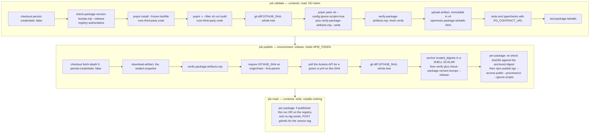
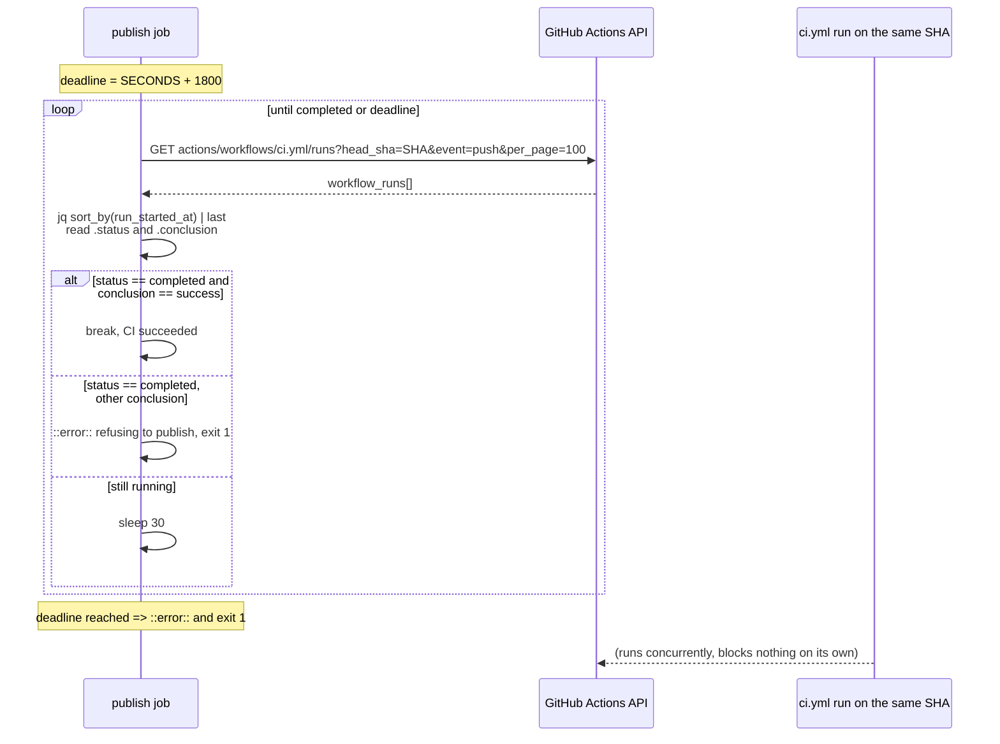
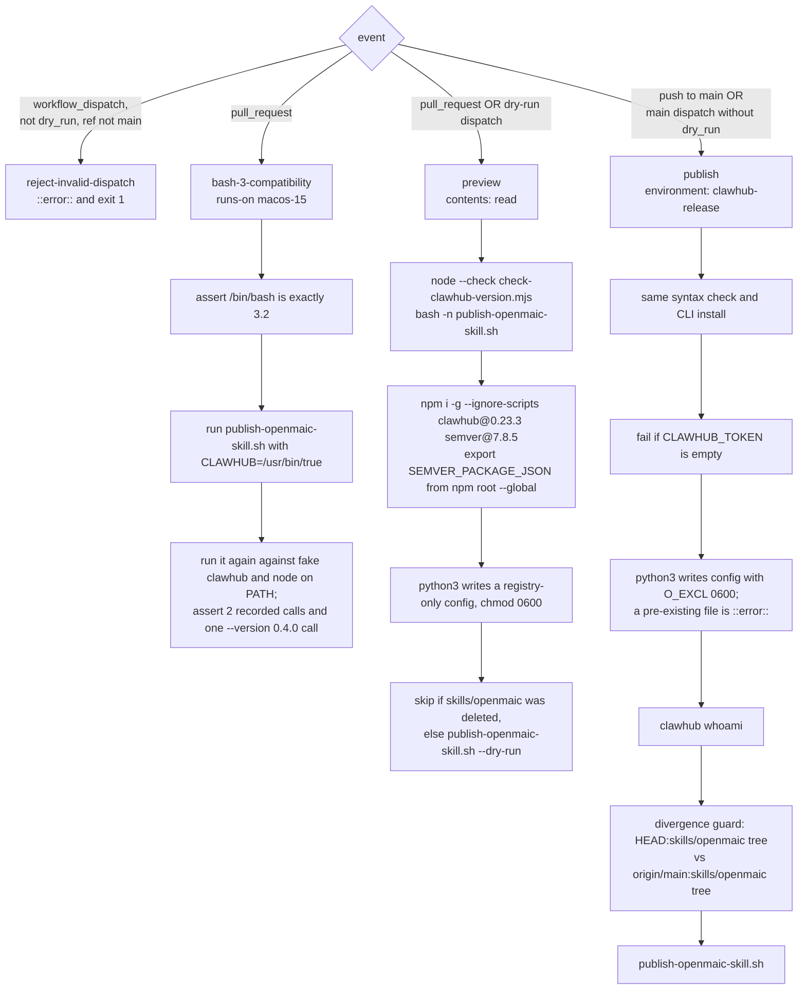
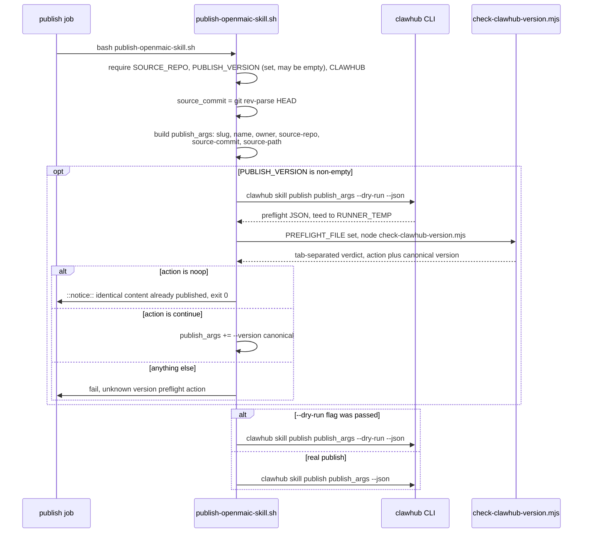

# Release Workflows

The two publish workflows and the `.github/scripts` helpers they drive.
`publish-packages.yml` makes its security boundary a **job** boundary: install,
build and pack run with `contents: read` and no token; the only job that can read
`NPM_TOKEN` neither installs nor builds. Continues
[`08-ci-workflows.md`](./08-ci-workflows.md), which covers the trigger graph and the
three merge-path workflows.

**Sources:** `.github/workflows/publish-packages.yml` (472 lines),
`.github/workflows/publish-openmaic-skill.yml` (312),
`.github/scripts/check-clawhub-version.mjs` (109),
`.github/scripts/publish-openmaic-skill.sh` (58),
`scripts/openmaic-packages.mjs:122-205`, `scripts/verify-package-artifacts.mjs`,
`tests/workflows/publish-packages-workflow.test.ts`,
`tests/ci/check-clawhub-version.test.ts`, `tests/ci/publish-openmaic-skill.test.ts`.
Evidence:
[`quality-testing-ci-deps/01b`](../appendix/research/quality-testing-ci-deps/01b-modules-ci-and-build.md),
[`quality-testing-ci-deps/03`](../appendix/research/quality-testing-ci-deps/03-flows.md).

## `publish-packages.yml` — the release security boundary

The boundary claim, stated at `:66-71`: "package installation, builds and packing
happen only in `validate`, before any job can read `NPM_TOKEN`. `publish` receives
immutable tarballs and verifies their digests before giving those exact files to
npm. This structurally removes build-code tampering with the git index, validated
bytes differing from published bytes, and build code rewriting enforcement scripts
before the token-bearing step uses them: the token-bearing job runs neither install
nor build code."

The `validate` job additionally runs a `postgres:16` service (`:85-97`), because
"storage's PostgreSQL contract suites skip themselves without a database.
Publishing storage without ever running them would ship the one backend whose
behaviour only a real PostgreSQL can confirm."

### Why the upload happens before the tests

`:159-166`: "Seal the checked build before any repository test code runs. Uploading
immediately after packing makes the publish input immutable before the tests or
smoke test can write to their local copies. `needs: validate` still prevents
publication unless every later validation step passes."

`pnpm pack --config.ignore-scripts=true` is used rather than a flag because
"pnpm pack does not accept `--ignore-scripts`", and the config form suppresses
`prepack` and `prepare` while still letting pnpm resolve `workspace:^` in the packed
manifest (`:164-166`).

### Defences in the token-bearing job, and what each one is for

| Defence | Line | Threat |
| --- | --- | --- |
| `environment: release` with a main-only deployment branch rule | `:247` | a branch-local edit of this file collecting the token |
| `NPM_TOKEN` must not also be a repository secret | `:34-36` | a repository secret is readable by a workflow on any branch |
| `--first-parent` reachability check, not plain reachability | `:284-296` | plain reachability accepts every intermediate commit of every merged branch, "including states no reviewer ever saw, such as a bad tree reverted by the next commit in the same pull request" |
| identify the CI run by **workflow file + event**, not check-run display name | `:307-310` | "names are not unique, and any other workflow or app publishing a check with the same name could otherwise stand in for a red version gate" |
| `grep -cx` counted, not `grep -qx` piped | `:288-291` | `grep -q` exits at the first match, `git rev-list` dies of SIGPIPE, and `pipefail` turns a *found* commit into a failure once main's history outgrows the pipe buffer |
| `trusted_digests="$(< SHA256SUMS)"` read into a parent shell scalar before any repository script runs | `:370-373` | "A child process can alter files, but it cannot rewrite its parent shell's scalar" |
| per-package sequential publish rather than one recursive publish | `:352-357` | a recursive publish dying partway leaves earlier packages on the registry with nothing recording it; per-package publishing makes a re-run resume exactly where it stopped |
| the registry preflight sits *inside* the token-bearing step, immediately before the loop | `:357-358` | minimising the race window between "the version is unpublished" and the publish |
| `npm publish --ignore-scripts` | `:409` | publish lifecycle scripts executing in the token-bearing job |
| every action pinned to a full commit SHA with a version comment | `:63-65,99-105` | "A full commit SHA is the only immutable GitHub Action reference" |
| `persist-credentials: false` on every checkout | `:101,260,434` | leaving a git credential in a job that does not need one |

The one labelled `KNOWN LIMITATION` (`:227-233`): the tarball smoke test reads the
**writable local directory**, not the uploaded snapshot. Because upload already
happened, a test process could replace a poisoned local tarball with a valid one and
make the smoke test pass while `publish` downloads the poisoned snapshot, whose own
`SHA256SUMS` can still be internally consistent. "This cannot be closed while
packing, uploading, and testing share one job and filesystem; closing it requires a
separate packing-only job that runs no tests."

### The cross-workflow CI requirement

`:298-300`: "Being on main is not the same as having passed the gate. `ci.yml` runs
concurrently with this workflow on a push to main and blocks nothing, so wait for CI
on this exact commit and require it to be green."

### Why tags are an output, not a trigger

`:9-20` states the release model: "THE ONLY RELEASE INPUT IS A VERSION BUMP THAT
LANDED ON MAIN." Which packages go out is decided by comparing manifests against
the registry, never by how the run was triggered. `@openmaic/<name>@<version>` tags
are written **after** a package lands on the registry, "because tags can be created
by anyone with write access on any commit, including commits that never reached
main."

The `mark` job additionally **reconciles** rather than only marking this run's
publishes (`:415-423`): a marker that failed to write previously is retried here,
"which the release plan alone could never do, because a version already on the
registry is excluded from it." Its loop takes three branches per package — published
in this run (no registry propagation wait needed), already on the registry, or
absent (nothing to mark) — and it never moves an existing tag, only logs where it
points. Tags are created through the GitHub API with `GITHUB_TOKEN`, and GitHub does
not start new workflow runs from `GITHUB_TOKEN` writes.

### The workflow's package list is cross-checked from outside

`scripts/openmaic-packages.mjs:141-205` reads this YAML **textually** (it runs
before `pnpm install`, so no YAML parser is available) and compares:

| Enumeration | Compared as |
| --- | --- |
| `on.push.paths` | an exact **set** against `OPENMAIC_PACKAGES` |
| every `for pkg in …;` loop (build, pack, publish, tag) | an exact **set** each |
| every `--filter "@openmaic/<name>"` | loosely — each package must appear somewhere, and no filter may name an unknown package |

Full-line comments are stripped first (`:143-146`) so a commented-out trigger path
cannot satisfy the check while quietly disabling a package's release. The `paths:`
match is scoped to the `paths:` block itself (`:148-151`) so it does not pick up
`packages/@openmaic/$pkg/package.json` inside the shell loops. The loose `--filter`
treatment is explained at `:132-139`: "individual steps legitimately filter subsets,
as the typecheck step does by omitting importer. A textual check cannot tell a
deliberate subset from an accidental one; converting the workflow to a matrix
would, and is a larger change than this."

## `publish-openmaic-skill.yml`

Four conditional jobs, publishing `skills/openmaic` to the ClawHub registry.

Notable properties:

- **The preview job checks out the PR head repository** (`:126-130`), so it executes
  fork-authored scripts — which is exactly why it receives no secrets, holds
  `contents: read`, and disables persisted checkout credentials (`:10-11`).
- **`bash-3-compatibility` runs on `macos-15`** and asserts `/bin/bash` reports
  exactly `3.2` before exercising the publish script, because macOS ships Bash 3.2
  and contributors run the script locally. It then re-runs the script against a fake
  `clawhub` and a fake `node` placed on `PATH`, and asserts the recorded call log has
  exactly two lines including a `--version 0.4.0` call.
- **The divergence guard has asymmetric behaviour by event** (`:280-311`): on
  `workflow_dispatch` a divergence is `::error::` + exit 1; on `push` it is
  `::notice::` + exit 0 (skip). Three divergences are checked — the skill deleted at
  HEAD, removed from `main`, or its tree hash differing from `main`'s.
- **Deleting `skills/openmaic` does not unpublish anything** (`:12-13`): "that
  registry lifecycle action must be performed manually in ClawHub."
- **The workflow asks not to be a required check** (`:8-9`) because it is
  path-filtered; it should be required only through rules scoped to those paths.

## The two `.github/scripts` helpers

`publish-openmaic-skill.sh` (58 lines) validates its three environment inputs, then
builds a fixed `publish_args` array pinning `--slug openmaic --name OpenMAIC
--owner wyuc` plus provenance (`--source-repo`, `--source-commit`,
`--source-path skills/openmaic`). It parses the verdict with
`IFS=$'\t' read -r action canonical_version extra` and treats a non-empty `extra`,
an empty action or an empty version as an invalid decision — so a malformed verdict
fails rather than being partially interpreted.

`check-clawhub-version.mjs` (109 lines) has an **environment-only** interface
(`SEMVER_PACKAGE_JSON`, `PREFLIGHT_FILE`, `PUBLISH_VERSION`) and its stdout is a
tab-separated verdict consumed by the shell, not JSON. Everything is wrapped in a
`UserFacingError` class (`:4-8`) so an unexpected internal error surfaces as a
generic message rather than leaking a stack trace into the log. It loads `semver`
through `createRequire(SEMVER_PACKAGE_JSON)` — the globally installed, exact-pinned
`semver@7.8.5` — and fails with "Unable to load the pinned SemVer dependency" if
that resolution fails.

Its verdict logic rejects prerelease and build-metadata versions outright, requires
the preflight object to carry `status`/`version`/`fingerprint`/`latestVersion`,
returns `noop` when the registry reports unchanged content at the same canonical
version, fails when content is unchanged at the same SemVer *precedence* but with
different build metadata, and otherwise requires `semver.gt(canonical, latest)`.

Both helpers have dedicated test suites — `tests/ci/check-clawhub-version.test.ts`
and `tests/ci/publish-openmaic-skill.test.ts` — and both are re-syntax-checked in
the workflow itself with `node --check` and `bash -n` before use.

## Security posture, publish workflows versus merge-path workflows

| Property | `publish-packages.yml` | `publish-openmaic-skill.yml` | the three merge-path workflows |
| --- | --- | --- | --- |
| Actions pinned to a commit SHA | yes | yes | no (`@v4` tags) |
| explicit `permissions:` block | per job (`contents:read` / `actions:read`+`id-token:write` / `contents:write`) | per job (`contents: read` on all four; `publish` adds `environment: clawhub-release` at `:193`, not wider permissions) | none, inherits the repository default |
| `persist-credentials: false` | every checkout | every checkout | no |
| holds a secret | `NPM_TOKEN`, `release` environment only | `CLAWHUB_TOKEN`, `clawhub-release` environment only | none |
| runs install or build code | in `validate` only | no (only global CLI installs, `--ignore-scripts`) | yes |
| `--ignore-scripts` on installs | on `npm publish` | on the global `clawhub`/`semver` install | no |

## Open questions

- Both publish workflows depend on GitHub Environment configuration —
  deployment-branch rules limited to `main`, and the token stored as an
  *environment* secret rather than a repository secret. Neither is visible in the
  tree; the workflows only document the requirement in comments
  (`publish-packages.yml:29-36`, `publish-openmaic-skill.yml:3-7`).
- `--owner wyuc` is hard-coded in `publish-openmaic-skill.sh:27`. Nothing records
  what happens if that ClawHub account changes hands.
- The `KNOWN LIMITATION` pack/upload/test race is documented but open; the stated fix
  (a separate packing-only job that runs no tests) is not implemented.
