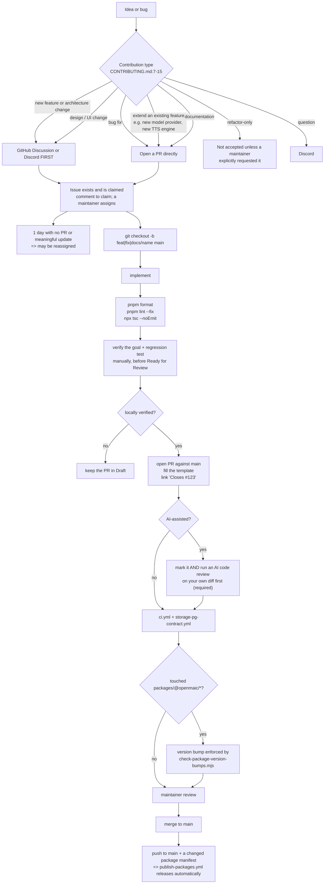
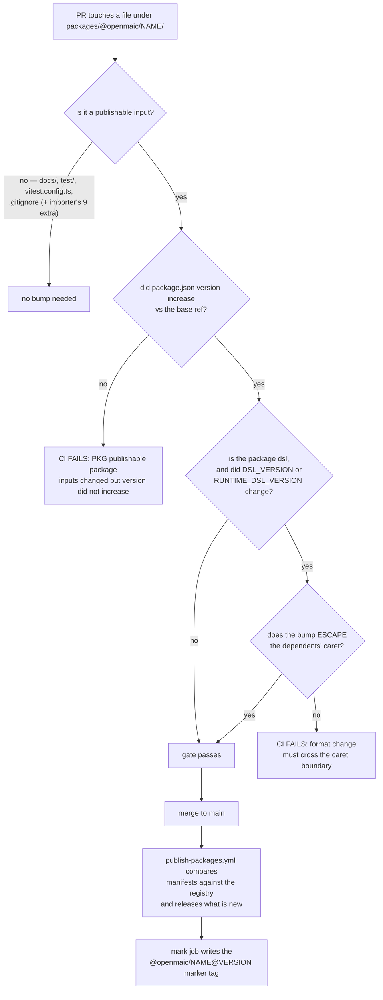
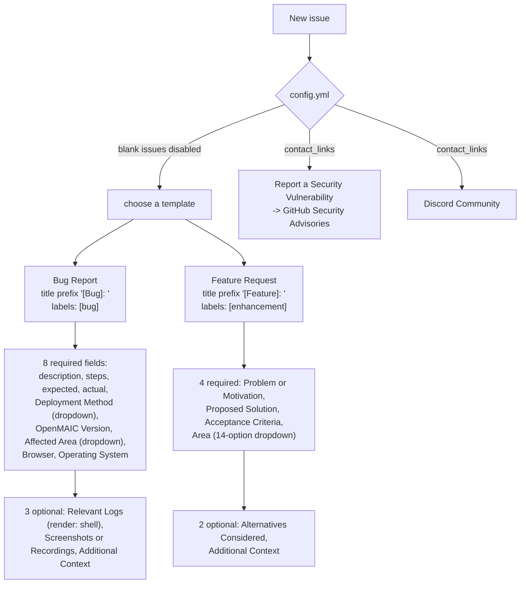

# Contribution Conventions

Branch names, commit format, PR requirements, version-bump discipline for
published packages, changelog format, and the issue/PR templates. Two rules here
are machine-enforced (the package version bump, and i18n key parity); the rest
are review conventions.

**Sources:** `CONTRIBUTING.md`, `SECURITY.md`, `CHANGELOG.md`,
`.github/pull_request_template.md`, `.github/ISSUE_TEMPLATE/bug_report.yml`,
`.github/ISSUE_TEMPLATE/feature_request.yml`, `.github/ISSUE_TEMPLATE/config.yml`,
`.github/workflows/ci.yml:59-89`, `scripts/check-package-version-bumps.mjs`.

## The contribution lifecycle

## Branch and commit conventions

| Convention | Value | Source |
| --- | --- | --- |
| Base branch | `main` — `git checkout -b feat/your-feature main` | `CONTRIBUTING.md:51-54` |
| Branch prefixes | `feat/`, `fix/`, `docs/` | `CONTRIBUTING.md:55-58` |
| Commit format | Conventional Commits: `<type>(<scope>): <short description>` with optional body and footer | `CONTRIBUTING.md:108-118` |
| Commit types | `feat`, `fix`, `docs`, `refactor`, `test`, `chore`, `ci`, `perf`, `style` | `CONTRIBUTING.md:120` |

The recent history follows it: `test(video-export): assert narration audio reaches
the assembler (#16)`, `fix(instrumentation): move shutdown signal handlers to a
node-only module (#8)`, `feat(ai): declare capabilities for OpenAI-compatible
gateway models (#6)`. The trailing `(#N)` is GitHub's squash-merge suffix, not a
documented convention.

Nothing enforces the commit format — there is no commitlint, no husky hook, no
workflow step that parses commit messages. The `packages/mathml2omml` fork carries
`husky` and `lint-staged` in its own `devDependencies`, but those are upstream
artefacts and the repository's own gates never invoke them.

Branches that appear in CI triggers beyond `main` — `feat/maic-editor-v0`,
`feat/maic-editor-v1`, `runtime-server-backend`,
`integration/kv-asset-server-backend`, `integration/agent-workbench` — are long-lived
integration branches, and `ci.yml:5-9` explains that they carry both a push and a
pull-request trigger because a PR run "only ever proves one part merged into the
branch".

## PR requirements

Hard requirements from `CONTRIBUTING.md:99-106`:

- **Every PR must link an issue** with `Closes #123` or `Fixes #456`. "PRs without
  a linked issue will not be reviewed." If no issue exists, create one first.
- **One concern per PR.**
- **Fill out the PR template.**
- **Screenshots for UI changes**, before/after.
- **CI must pass before requesting review.**
- **All UI text must be internationalized** — no hardcoded user-facing strings.

Plus the local-verification gate at `:89-97`: before moving a PR out of Draft you
**must** verify the goal, manually regression-test related flows, and run the local
checks. "If you have not completed local verification, keep your PR in Draft
status."

### The PR template

`.github/pull_request_template.md` has five sections. The `Verification` section is
the unusual one:

| Section | Fields |
| --- | --- |
| Summary | free text |
| Related Issues | `Closes #`, `Fixes #`, `Related to #` |
| Changes | bullet list |
| Type of Change | 6 checkboxes: bug fix, new feature, breaking change, documentation, refactoring, CI/CD or build |
| Verification → Steps to reproduce / test | numbered list |
| Verification → What you personally verified | "What did you test beyond CI? Include edge cases checked **and anything you did NOT verify**." |
| Verification → Evidence | 3 checkboxes: `CI passes (pnpm check && pnpm lint && npx tsc --noEmit)`, manually tested locally, screenshots/recordings attached |
| Checklist | 4 checkboxes: coding style, self-review, documentation updated, no new warnings |

Note the `CI passes` checkbox spells out only three commands and omits `pnpm test`,
matching the same omission in `CONTRIBUTING.md:76-85`.

### AI-assisted PRs

`CONTRIBUTING.md:154-162` accepts them under three conditions: **mark it** in the
title or description, **run an AI code review on your own diff first** and address
the findings ("This is **required** for AI-assisted PRs to avoid dumping large
amounts of unreviewed generated code on maintainers"), and accept responsibility —
"understand the code, not just the prompt". They are held to the same quality
standard as any other PR.

## Version-bump discipline for published packages

This is the one convention CI enforces, and `CONTRIBUTING.md:130-152` documents it.

Choosing the number is explicitly a human judgement (`CONTRIBUTING.md:142-148`):

| Level | Meaning |
| --- | --- |
| patch | a fix that changes no documented behaviour |
| minor | new behaviour that existing consumers can ignore |
| major | anything an existing consumer must react to |

Below `1.0.0`, "a **minor** bump signals a breaking change and a **patch** bump
signals a compatible change, following common 0.x semver practice; the **major**
rule applies from `1.0.0`." All six packages are currently below 1.0.0.

`CONTRIBUTING.md:150` singles out the dsl: "It is the contract the other packages
and downstream deployments validate against, so a change that narrows what an
existing document may contain is a breaking change even when the diff looks small."

And `:152`: "You never publish anything yourself. […] That tag is a marker, not a
trigger: pushing one does not release anything."

**One factual drift to know about:** `CONTRIBUTING.md:132` says "**Four** packages
under `packages/@openmaic/` are published to npm: `dsl`, `storage`, `renderer`, and
`importer`." The real list is **six** — `OPENMAIC_PACKAGES` at
`scripts/openmaic-packages.mjs:34` and the six trigger paths at
`publish-packages.yml:42-47` both include `generation` and `editor`. A contributor
following the document would not expect a bump to be required for those two.

## Changelog

`CHANGELOG.md` is 332 lines, hand-written, and declares "The format is based on
[Keep a Changelog](https://keepachangelog.com/en/1.1.0/)" (`:5`). Nine released
versions are recorded, newest first:

| Version | Date |
| --- | --- |
| 1.0.0 | 2026-08-27 |
| 0.3.2 | 2026-08-14 |
| 0.3.1 | 2026-07-21 |
| 0.3.0 | 2026-06-28 |
| 0.2.2 | 2026-06-02 |
| 0.2.1 | 2026-04-26 |
| 0.2.0 | 2026-04-20 |
| 0.1.1 | 2026-04-14 |
| 0.1.0 | 2026-03-26 |

Entry discipline, readable from the 1.0.0 section:

- Grouped under `### Features` and similar Keep-a-Changelog headings, not by
  Conventional Commit type.
- **Every claim carries one or more PR links** in full
  `[#1206](https://github.com/THU-MAIC/OpenMAIC/pull/1206)` form. A single bullet
  routinely cites five to fifteen PRs.
- Themed bullets lead with a bolded subsystem name (`**Agent workbench (Pro mode)**`,
  `**Durable agent runtime**`, `**Pluggable persistence**`) and describe the
  user-visible outcome, not the diff.

There is no `[Unreleased]` section, no automated changelog generator, and no CI step
that checks a PR touched `CHANGELOG.md`. It is a maintainer-curated release
document, not a per-PR obligation — which is consistent with `CONTRIBUTING.md`
never mentioning it.

Note the versions here track the **application**, not the packages. The root
`package.json` says `"version": "1.0.0"` and is `private: true`; the six
`@openmaic/*` packages version independently (0.11.1, 0.28.1, 0.3.5, 0.1.6, 0.1.3,
0.0.5) and appear in `CHANGELOG.md` only as narrative.

## Issue templates

`blank_issues_enabled: false` (`.github/ISSUE_TEMPLATE/config.yml:1`), so every
issue goes through one of the two forms or one of the two contact links.

The feature form's `Acceptance Criteria` field is required and its placeholder is a
checkbox list (`- [ ] A user can …`, `- [ ] The system shows …`,
`- [ ] Existing … continues to work`), so a request has to state observable
outcomes rather than a desired implementation.

The bug form's two dropdowns are the interesting part, because they encode the
project's own view of its deployment surface and its subsystem map:

| `Deployment Method` options | `Affected Area` options |
| --- | --- |
| Local development (`npm run dev` / `pnpm dev` / `yarn dev`) | Classroom generation |
| Vercel deployment | Playback / presentation |
| Docker | Editor / canvas |
| Other | Import / export |
| | Model / provider integration |
| | Storage / persistence |
| | Deployment / infrastructure |
| | Documentation |
| | Other |

The feature form has its own `Area` dropdown with **14** options rather than 9 — the
bug list plus `Multi-agent interaction`, `Quiz / Assessment`,
`Interactive simulations`, `OpenClaw integration` and `UI / UX`. The two lists are
maintained independently and have already diverged.

Both forms open with a markdown block asking the reporter to search for duplicates,
and the bug form additionally asks them to "remove API keys, access tokens,
personal data, and other secrets from logs, screenshots, or recordings" — repeated a
second and third time on the Logs and Screenshots fields.

## Issue claiming

`CONTRIBUTING.md:17-23`: comment on an issue to claim it, a maintainer assigns it,
and if **no PR or meaningful update** (a WIP commit or a progress comment) appears
within **1 day** the issue may be reassigned. If an issue is already assigned,
contact the assignee first.

## Security reporting

`SECURITY.md` plus the `config.yml` contact link both route to GitHub Security
Advisories, never a public issue. Supported versions are `main` and the latest
release; older versions are not. Acknowledgement is promised within 48 hours, and a
confirmed vulnerability is closed out with a published GitHub Security Advisory
crediting the reporter unless they prefer anonymity.

`CONTRIBUTING.md:189-191` repeats the same rule.

## Environment-variable changes

`CONTRIBUTING.md:63-70` makes updating `.env.example` a **same-PR** requirement for
any operator-facing variable, and requires documenting whether it is optional, its
safe default or example value, and whether it is read at build time or runtime.
Variables used only by tests, CI or internal scripts are explicitly exempt, "but
their owning file or documentation must make that limited scope clear" — which is
why `TEST_LOAD_LOCAL_ENV` and `PG_CONTRACT_URL` do not appear in the template.

No gate checks this. Nothing compares the set of `process.env.*` reads in the tree
against `.env.example`.

## Open questions

- `CONTRIBUTING.md:132` names four published packages where the code has six. Which
  is intended is not recorded; the code is authoritative because
  `publish-packages.yml`'s enumerations are cross-checked against
  `OPENMAIC_PACKAGES` in both directions.
- `CONTRIBUTING.md:164-174` "Project Structure" lists `packages/` as holding only
  the two vendored forks and does not mention `packages/@openmaic/`,
  `render-service/`, `tests/`, `e2e/`, `eval/`, `scripts/` or `skills/`.
- The commit convention is documented but unenforced. Whether the maintainers want
  a commitlint step is not recorded anywhere.
- No `CODEOWNERS` file exists, so review routing is manual.
