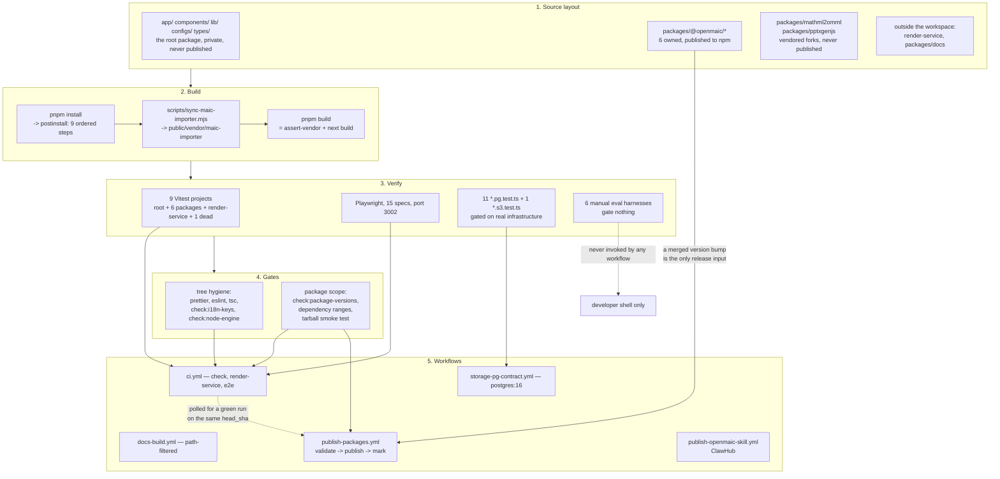

# Development View (4+1): Monorepo, Build, Testing, CI

The 4+1 development view answers "where does code live, how is it built, and what
must be true before it lands". For OpenMAIC that means one pnpm workspace with
eight member packages (six owned, two vendored forks), a nine-step `postinstall`
build chain, nine Vitest projects, one Playwright project, six manual LLM eval
harnesses, and eight enforced gates spread across five GitHub Actions workflows
and 17 `scripts/` helpers.

## Who this is for

A staff engineer who has just cloned the repository and needs to (a) run it,
(b) change a publishable package without breaking a downstream deployment, and
(c) predict which CI job will reject the change and why.

## Topic overview

## What this topic covers

- The physical layout of the repository and the pnpm workspace composition.
- The workspace dependency graph and the build order it forces.
- The `postinstall` chain, `next build`, and the generated-asset scripts.
- Every `scripts/` helper and every `package.json` script, with the lifecycle
  stage each belongs to.
- First-run local development, including the `docker compose` path.
- Every test command and eval harness.
- The eight quality gates and how each one fails.
- The GitHub Actions workflow graph and the `.github/scripts` helpers.
- Contribution conventions: branch names, commit format, version-bump
  discipline, issue and PR templates.

## Sources

Primary code read for this topic: `package.json`, `pnpm-workspace.yaml`,
`tsconfig.json`, `tsconfig.build.json`, `vitest.config.ts`,
`vitest.eval.config.ts`, `playwright.config.ts`, `eslint.config.mjs`,
`.prettierrc`, `.prettierignore`, `next.config.ts`, `vercel.json`, `Dockerfile`,
`.dockerignore`, `docker-compose.yml`, `.nvmrc`, `.gitignore`, `.env.example`,
`CONTRIBUTING.md`, `README.md`, `SECURITY.md`, `CHANGELOG.md`,
all five files under `.github/workflows/`, both files under `.github/scripts/`,
`.github/ISSUE_TEMPLATE/*`, `.github/pull_request_template.md`, all 17 files
under `scripts/`, every `packages/*/package.json` and
`packages/@openmaic/*/vitest.config.ts`, and `render-service/{package.json,vitest.config.ts}`.

Evidence packs:
[`quality-testing-ci-deps`](../appendix/research/quality-testing-ci-deps/00-overview.md)
(primary),
[`persistence-storage-state`](../appendix/research/persistence-storage-state/00-overview.md),
[`media-audio-video`](../appendix/research/media-audio-video/00-overview.md),
[`app-shell-and-routing`](../appendix/research/app-shell-and-routing/00-overview.md).

## Section files

| File | Contents |
| --- | --- |
| [`01-monorepo-layout.md`](./01-monorepo-layout.md) | Every top-level directory with its charter; the pnpm workspace globs, the three dependency universes, and what each tool's scope actually covers |
| [`02-package-dependency-graph.md`](./02-package-dependency-graph.md) | The workspace dependency graph including vendored forks, the `workspace:^` rule, the build order it forces, and the per-package build tool |
| [`03-build-pipeline.md`](./03-build-pipeline.md) | The nine-step `postinstall` chain and its ordering constraints, `next build` and the pre-build vendor assertion, per-package builds, the generated-asset scripts, the four-stage Docker build |
| [`04-scripts-inventory.md`](./04-scripts-inventory.md) | All 17 `scripts/` helpers with their exit-code contracts, all 24 root `package.json` scripts, every per-package script, mapped to lifecycle stage |
| [`05-local-development.md`](./05-local-development.md) | Prerequisites, the first-run command sequence, ports, the dev server, the three `docker compose` profiles, and the optional subsystems |
| [`06-testing-and-evals.md`](./06-testing-and-evals.md) | Nine Vitest projects, the meta-tests, Playwright, the contract suites gated on real infrastructure, and the six eval harnesses |
| [`07-quality-gates.md`](./07-quality-gates.md) | The gate sequence, then the five tree-hygiene gates: prettier, ESLint's nine boundary walls, `tsc`, `check:i18n-keys`, `check:node-engine` |
| [`07b-version-and-release-gates.md`](./07b-version-and-release-gates.md) | `check:package-versions` in both modes plus the dsl format-escape rule, the internal dependency-range check, the packed tarball smoke test, and the shared threat model |
| [`08-ci-workflows.md`](./08-ci-workflows.md) | The trigger and concurrency graph, then `ci.yml`'s three jobs, `storage-pg-contract.yml` and `docs-build.yml` |
| [`08b-release-workflows.md`](./08b-release-workflows.md) | `publish-packages.yml`'s job-boundary security model and its twelve defences, the cross-workflow CI poll, `publish-openmaic-skill.yml`, and both `.github/scripts` helpers |
| [`09-contribution-conventions.md`](./09-contribution-conventions.md) | Branch/commit conventions, PR requirements, version-bump discipline, changelog format, issue and PR templates, security reporting |

`07` and `08` are each split into two files because the single file exceeded the
350-line budget; both halves are registered above.

## Related topics

- [`../17-deployment-view/index.md`](../17-deployment-view/index.md) — what the
  build output becomes at runtime.
- [`../13-dependencies/index.md`](../13-dependencies/index.md) — the dependency
  inventory and licence posture this view only touches.
- [`../14-code-quality/index.md`](../14-code-quality/index.md) — the measured
  quality assessment; this view documents the machinery, not the verdict.
- [`../02-container-view/index.md`](../02-container-view/index.md) — the runtime
  containers that the workspace packages compile into.
- [`../07-dsl-renderer-editor/index.md`](../07-dsl-renderer-editor/index.md) — why
  `@openmaic/dsl`'s two version constants carry the release-gate weight they do.
- [`../18-decisions/03-dsl-as-the-serialized-contract.md`](../18-decisions/03-dsl-as-the-serialized-contract.md)
  — the decision record for the version-bump gate, including the four ways that gate is
  hardened against passing by accident.
- [`../glossary.md`](../glossary.md) — the canonical vocabulary.
- [`../README.md`](../README.md) — the documentation set root.
