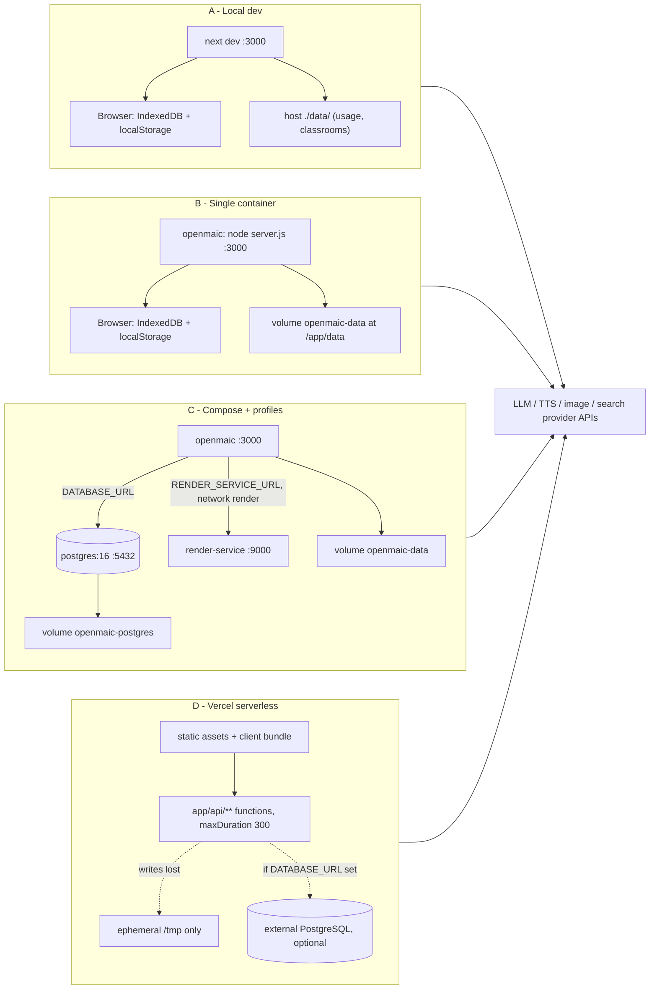
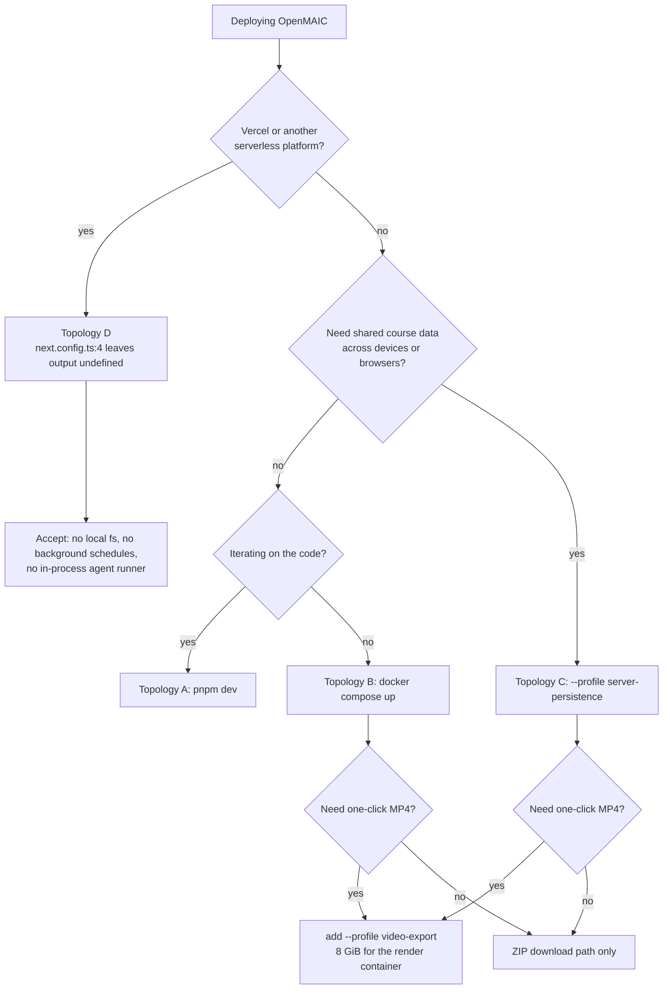

# Deployment Topologies: What Is Actually Supported

Four topologies exist in shipped configuration. They are not four scales of the
same thing — they differ in which optional subsystems are present, and six
capability classes disappear entirely in the serverless one. This section is the
map; each topology gets its own section file afterwards.

**Sources:** `package.json:15-17`, `next.config.ts:4`, `docker-compose.yml`,
`vercel.json`, `Dockerfile`, `render-service/Dockerfile`, `README.md:283-489`,
`instrumentation.ts`, `lib/config/feature-flags.ts`,
`lib/server/render-service.ts`, `lib/server/classroom-storage.ts:6-7`,
`lib/server/materials/bytes.ts:33`, `lib/server/usage-storage.ts:10`;
evidence packs
[`quality-testing-ci-deps`](../appendix/research/quality-testing-ci-deps/00-overview.md),
[`media-audio-video`](../appendix/research/media-audio-video/00-overview.md),
[`persistence-storage-state`](../appendix/research/persistence-storage-state/00-overview.md).

## The four topologies

| # | Name | Start command | Processes | External services |
| --- | --- | --- | --- | --- |
| A | Local development | `pnpm dev` (`package.json:15`) | 1 (`next dev`) | LLM/media provider APIs over the internet |
| B | Single-container self-host | `docker compose up --build` (`README.md:323`) | 1 (`node server.js`, `Dockerfile:112`) | provider APIs |
| C | Compose with profiles | `docker compose --profile server-persistence --profile video-export up --build` | up to 3 | provider APIs, plus PostgreSQL 16 and Chromium/FFmpeg **inside** the stack |
| D | Vercel / serverless | Vercel build from `vercel.json` | N ephemeral functions + static edge | provider APIs; an **external** PostgreSQL if server persistence is wanted |

Topologies A and B are the same logical shape — one Node process, browser-side
storage — and differ only in whether Next runs in dev mode against the working
tree or as a prebuilt standalone server. C is B plus opt-in containers. D is a
different execution model, and section
[`04-serverless-vercel.md`](./04-serverless-vercel.md) is dedicated to what it
cannot do.

## Side-by-side

The dotted edges in D are the two that do not behave like their counterparts in
A/B/C: filesystem writes vanish between invocations, and PostgreSQL has to be
somebody else's managed service because nothing in the repository provisions one
outside Compose.

## Feature completeness

A capability is "yes" only when the shipped configuration for that topology
makes it work with no extra operator wiring.

| Capability | Gate in code | A | B | C | D |
| --- | --- | --- | --- | --- | --- |
| Course generation from a prompt (browser-driven) | — | yes | yes | yes | yes |
| Browser-local course storage (IndexedDB / localStorage) | default backend | yes | yes | yes | yes |
| Server-backed documents + runtime (PostgreSQL) | `NEXT_PUBLIC_PERSISTENCE` at build **and** `DATABASE_URL` at run | opt-in | opt-in | yes with `server-persistence` | needs external DB |
| Durable agent runtime + Pro workbench | `isAgentRuntimeConfigured()` (`lib/config/feature-flags.ts:23`) plus `MODEL_ROUTES` route for `maic-agent-driver` | opt-in | **not via compose build args** | **not via compose build args** | no (see below) |
| Asset byte reclamation | `startAssetCollectorSchedule()` (`instrumentation.ts:21`), needs `DATABASE_URL` | opt-in | opt-in | yes | no schedule survives |
| Video export as a project ZIP | browser-only compile + JSZip | yes | yes | yes | yes |
| One-click MP4 render | `RENDER_SERVICE_URL` + a healthy `/health` (`lib/server/render-service.ts:47`) | manual standalone service | no | yes with `video-export` | needs an externally hosted render service |
| Headless `POST /api/generate-classroom` | writes `data/classroom-jobs/` (`lib/server/classroom-storage.ts:7`) and runs in `after()` (`app/api/generate-classroom/route.ts:48`) | yes | yes | yes | no |
| `GET /api/classroom-media/...` file serving | reads `data/classrooms/<id>/` | yes | yes | yes | no |
| Usage metering JSONL | `data/usage/YYYY-MM.jsonl` (`lib/server/usage-storage.ts:10,17`) | yes | yes | yes | no (writes discarded) |
| Agent material uploads | `LocalMaterialByteStore` rooted at `process.cwd()/data` (`lib/server/materials/bytes.ts:33`) | opt-in | opt-in | opt-in | no |
| Site password gate | `ACCESS_CODE` in `middleware.ts:60` | yes | yes | yes | yes |

### The two build-argument gaps

Both are real and both are checkable in one file each.

1. **`NEXT_PUBLIC_PRO_WORKBENCH_ENABLED` is not a Docker build argument.**
   `Dockerfile:51-72` declares eleven `ARG`s and mirrors them into `ENV`;
   the workbench flag read by `isProWorkbenchEnabled()`
   (`lib/config/feature-flags.ts:33`) is not among them, and
   `docker-compose.yml:5-21` passes the same eleven. A Compose-built image
   therefore always has the workbench entry point compiled out, even with
   `OPENMAIC_AGENT_RUNTIME_ENABLED=true` and a `DATABASE_URL` at runtime —
   `middleware.ts:56` returns a 404 for `/workbench*` and
   `app/workspace/page.tsx` redirects to `/`. Enabling it requires adding the
   `ARG`/`ENV` pair, or building the image outside Compose.
2. **`NEXT_PUBLIC_PERSISTENCE_TOKEN` is baked into the public bundle.**
   `Dockerfile:53` and `:64` accept and inline it. `README.md:390-402` states
   plainly that it provides "no confidentiality and no user isolation
   whatsoever" and that `lib/persistence/server-auth.ts` must be replaced before
   production. Topology C's `server-persistence` profile is a
   trusted-network/single-user arrangement by design, not a multi-tenant one.

## What decides the topology

`next.config.ts:4` is the hinge: `output: process.env.VERCEL ? undefined :
'standalone'`. Every non-Vercel build produces `.next/standalone/server.js`,
which is what `Dockerfile:105` copies and `Dockerfile:112` runs. A Vercel build
skips standalone output and lets the platform adapter split `app/api/**` into
functions per `vercel.json:6-10`.

## Ports and listeners

| Topology | Listener | Port | Set by |
| --- | --- | --- | --- |
| A | `next dev` | 3000 | Next default |
| A (e2e) | `next dev` under Playwright | 3002 | `playwright.config.ts:35` |
| B, C | `openmaic` container | 3000 → host 3000 | `Dockerfile:90` `ENV PORT=3000`, `docker-compose.yml:22-23` |
| C | `postgres` | 5432, **not published** | `docker-compose.yml:46-64` declares no `ports` |
| C | `render-service` | 9000, `expose` only | `docker-compose.yml:83-84` |
| standalone render | `tsx src/main.ts` | 9000 | `render-service/src/config.ts:47` |

Only the app is reachable from the host. `postgres` has no `ports` mapping and
`render-service` uses `expose`, so both are Compose-network-internal;
`render-service` additionally sits on a network declared `internal: true`
(`docker-compose.yml:142-143`), which has no route to the host or the internet.

## Where to go next

- [`02-local-dev.md`](./02-local-dev.md) — topology A in detail.
- [`03-docker-compose.md`](./03-docker-compose.md) — topologies B and C.
- [`04-serverless-vercel.md`](./04-serverless-vercel.md) — topology D and its
  hard limits.
- [`05-render-service-deployment.md`](./05-render-service-deployment.md) — the
  render service, in Compose or standalone.
- [`07-scaling-and-state.md`](./07-scaling-and-state.md) — why none of these
  topologies is `replicas: 3` without work.

## Open questions

- No Kubernetes manifests, Helm chart, or Terraform exists in the repository, so
  "topology C at N replicas" is undocumented rather than unsupported. The
  in-process state inventory in [`07-scaling-and-state.md`](./07-scaling-and-state.md)
  is the closest thing to a specification.
- Nothing in the repository pins a reverse proxy or TLS terminator.
  `TRUST_PROXY_HEADERS` (`.env.example:491`,
  `app/api/export-video/render/route.ts:34`) is the only acknowledgement that
  one might exist, and it changes exactly one behaviour: render-service client
  identity derivation.
