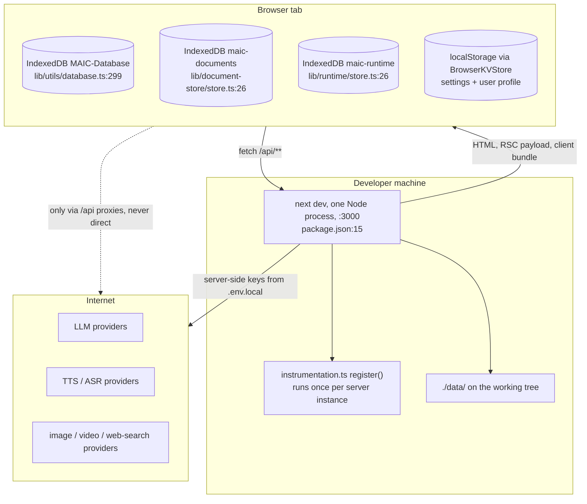
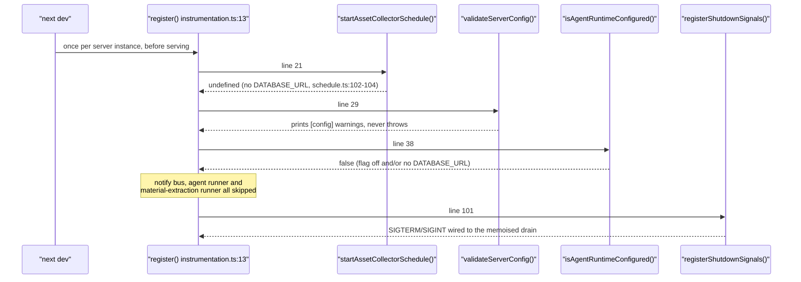

# Local Development Topology

One Node process, one port, and storage that lives almost entirely inside the
browser. Nothing is mocked: every provider call is a real HTTPS request with
your own key. What is missing is missing, not faked — and knowing which
subsystem is simply absent is the difference between "broken" and "not
configured".

**Sources:** `package.json:6-8,15`, `.nvmrc`, `playwright.config.ts:23-36`,
`instrumentation.ts`, `lib/persistence/bootstrap.ts:15-17,41-75`,
`lib/utils/database.ts:299-322`, `lib/document-store/store.ts:26`,
`lib/runtime/store.ts:26`, `lib/server/usage-storage.ts:10,100`,
`lib/server/classroom-storage.ts:6-7`, `lib/server/materials/bytes.ts:33`,
`lib/persistence/asset-collector-schedule.ts:102-104`,
`lib/config/feature-flags.ts`, `tests/setup-env.ts`, `.env.example:460-526`,
`README.md:283-305`; evidence pack
[`persistence-storage-state`](../appendix/research/persistence-storage-state/00-overview.md).

## Prerequisites, exactly

| Requirement | Value | Source |
| --- | --- | --- |
| Node | `>=22.19.0` | `package.json:7` |
| Node (nvm hint) | `22` | `.nvmrc` |
| Package manager | `pnpm@10.28.0` (with lockfile hash) | `package.json:209` |
| Config file | `.env.local` (Next loads it; not in git) | `.dockerignore:20-21` excludes `.env*` from images |
| Minimum config to be useful | one LLM provider key + optionally `DEFAULT_MODEL` | `.env.example:8-48`, `:409` |

`pnpm install` triggers the nine-step `postinstall` chain
(`package.json:10`) that builds both vendored forks, all six `@openmaic/*`
packages, and then runs `scripts/sync-maic-importer.mjs` to place the importer
bundle under `public/vendor/`. A dev server started before that chain completes
will 404 the importer bundle at runtime.

## The process picture

The dotted browser-to-internet edge is deliberate: the browser never calls a
provider directly. Media fetches funnel through `/api/proxy-media`, and every
generation step is a route on the same origin.

## What `instrumentation.ts` does in a default dev run

`register()` (`instrumentation.ts:13`) returns early unless
`process.env.NEXT_RUNTIME === 'nodejs'` (`:16`), then does four things. In a
bare `.env.local` with only an LLM key, three of them are no-ops.

So in a default dev session the only live background work is signal handling.
Turn on `DATABASE_URL` and you additionally get a 15-minute asset-collection
timer (`asset-collector-schedule.ts:172`); turn on
`OPENMAIC_AGENT_RUNTIME_ENABLED` too and you get a dedicated PostgreSQL `LISTEN`
connection plus two scan timers (`instrumentation.ts:44-51`).

## Ports

| Port | Process | Set by |
| --- | --- | --- |
| 3000 | `next dev` | Next default; `README.md:289` |
| 3002 | `next dev` under Playwright | `playwright.config.ts:29,35` (`env: { PORT: '3002' }`) |

The e2e server is a *second* dev server on a different port with
`NEXT_PUBLIC_MAIC_EDITOR_ENABLED=true` injected
(`playwright.config.ts:35`), and `reuseExistingServer: !process.env.CI`
(`:30`) means a local `pnpm test:e2e` will attach to an already-running :3002
rather than starting one. Running the app on 3002 by hand without that flag and
then running e2e will silently test a build with the editor disabled.

## Storage in local dev

| What | Where | Lifetime |
| --- | --- | --- |
| Courses, scenes, audio/image/media byte rows, chat sessions, folders, playback state | IndexedDB `MAIC-Database` (latest schema version 17, 16 version blocks declared — 13 is skipped, `lib/utils/database.ts:328-562`) | until the origin's site data is cleared |
| Course documents (packaged store) | IndexedDB `maic-documents` | same |
| Learner runtime records (whiteboard, chat partitions) | IndexedDB `maic-runtime` | same |
| Settings (91 fields, persist v4) and user profile | `localStorage` via `BrowserKVStore` | same |
| Usage metering | `./data/usage/YYYY-MM.jsonl` (`lib/server/usage-storage.ts:10,17`) | until deleted by hand |
| Headless-generated classrooms | `./data/classrooms/<id>.json` plus `media/` and `audio/` subdirectories | same |
| Headless generation job rows | `./data/classroom-jobs/` (`lib/server/classroom-storage.ts:7`) | same |
| Agent material bytes | `./data/` via `LocalMaterialByteStore` (`lib/server/materials/bytes.ts:33`) | same |

`./data/` is in `.dockerignore:33`, so nothing you accumulate locally leaks into
an image. It is the same relative path the container mounts as a volume — see
[`03-docker-compose.md`](./03-docker-compose.md).

Flipping the browser onto server-backed storage is a **build-time** decision even
in dev: `isBrowserPersistenceEnabled()` reads
`process.env.NEXT_PUBLIC_PERSISTENCE === '1'`
(`lib/persistence/bootstrap.ts:16`), which Next inlines. Changing it requires
restarting `next dev`, and the module-level `if` at `:41` runs the two
`assert*Configurable()` preflights before either `configure*` call so a
half-switched app is impossible (`:62-74`).

## What is absent, and what that looks like

Nothing in the dev topology is a stub or an in-memory fake. The subsystems below
are simply not running, and each one reports its absence in a specific,
recognisable way.

| Subsystem | Off because | Observable symptom |
| --- | --- | --- |
| PostgreSQL documents/runtime | no `DATABASE_URL`, `NEXT_PUBLIC_PERSISTENCE` unset | everything stays in IndexedDB; no error |
| Durable agent runtime + `/workbench` | `isAgentRuntimeConfigured()` false (`lib/config/feature-flags.ts:23`) | `/workbench*` returns a plain-text 404 from `middleware.ts:57`; `/workspace` `redirect('/')` at `app/workspace/page.tsx:35`; `/api/agent/sessions*` answer 404 |
| One-click MP4 export | no `RENDER_SERVICE_URL` | `GET /api/export-video/capability` returns `{ success: true, enabled: false }` (`app/api/export-video/capability/route.ts:14-15`, envelope from `apiSuccess`); the export menu offers ZIP only |
| Asset byte reclamation | no `DATABASE_URL` | nothing to reclaim; the schedule returns `undefined` |
| Site password gate | no `ACCESS_CODE` | `middleware.ts:61-63` passes everything through |
| Self-hosted model endpoints (Ollama, VoxCPM, local MinerU) | SSRF guard blocks private addresses | set `ALLOW_LOCAL_NETWORKS=true` (`.env.example:461-463`) — a **global** switch affecting 13 routes |

The last row is the one that bites: a locally hosted model is indistinguishable
from an SSRF attempt, and the only lever is repository-wide.

## Test-time divergence

Two deliberate differences between a dev server and a `vitest` run are worth
knowing before you debug a "works in dev, fails in test" report:

- `tests/setup-env.ts:23` does **not** load `.env.local` unless
  `TEST_LOAD_LOCAL_ENV=1`. The docstring's reasoning (`:6-10`) is that a local
  env file cannot make a test pass — CI has none — it can only invent
  machine-specific failures.
- `lib/server/usage-storage.ts:100` returns early when `process.env.VITEST` or
  `NODE_ENV === 'test'` is set unless an explicit `baseDir` is passed, so no
  test appends to the real `data/usage/` log.

## Cross-links

- [`../16-development-view/05-local-development.md`](../16-development-view/05-local-development.md)
  — the first-run command sequence and toolchain.
- [`03-docker-compose.md`](./03-docker-compose.md) — the same shape as a
  container, with `./data` promoted to a named volume.
- [`../10-persistence-and-state/index.md`](../10-persistence-and-state/index.md)
  — what each browser database actually holds.

## Open questions

- The dev server's bundler is not pinned by a flag in `package.json:15`
  (`next dev`, no `--turbo`/`--webpack`). Two source comments —
  `next.config.ts:16-22` and `lib/server/register-shutdown-signals.ts:5-10` —
  describe working around Turbopack's static Edge scan, which implies Turbopack
  is what dev uses on Next 16.2.11, but no file in the repository states it.
- `lib/utils/database.ts:300` names the constant `_DATABASE_VERSION = 17` with a
  leading underscore, which normally marks an unused binding; the `this.version(n)`
  ladder in the constructor is what Dexie actually acts on. Whether 17 is
  authoritative or vestigial was not determined from this file alone.
