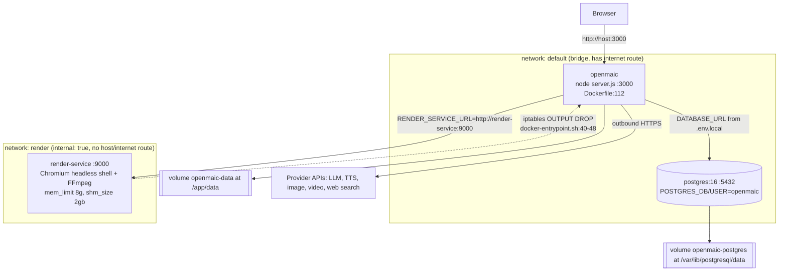
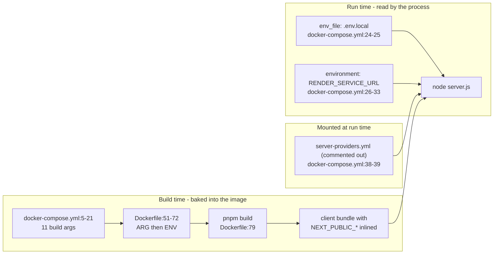
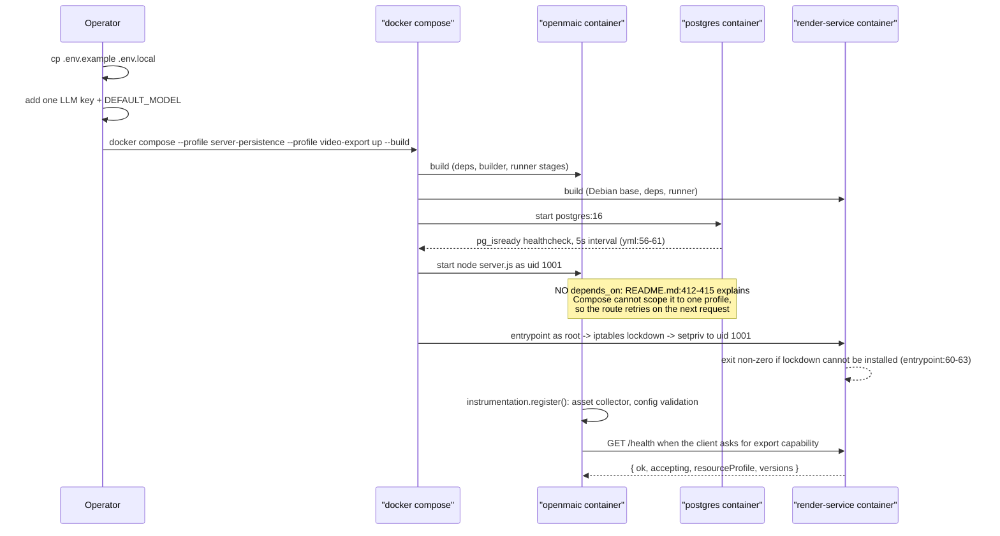

# Docker Compose Self-Host Topology

`docker-compose.yml` is the reference self-host deployment and, per
`lib/persistence/asset-collector-schedule.ts:6-9`, the deployment the code
assumes exists: three services, two networks, two named volumes, two
profiles. A bare `docker compose up` starts exactly one container.

**Sources:** `docker-compose.yml`, `Dockerfile:82-112`, `.dockerignore`,
`README.md:318-489`, `lib/server/provider-config.ts:219,417,423`,
`lib/persistence/asset-collector-schedule.ts:6-17,102-121`,
`lib/server/render-service.ts`, `render-service/docker-entrypoint.sh`,
`.env.example:460-526`, `instrumentation.ts:82-95`.

## Services

| Service | Image | Profile | Published | Restart |
| --- | --- | --- | --- | --- |
| `openmaic` | built from `./Dockerfile` | none (always) | `3000:3000` (`:22-23`) | `unless-stopped` |
| `postgres` | `postgres:16` (`:47`) | `server-persistence` (`:48-49`) | none — `expose`-less, network-only | `unless-stopped` |
| `render-service` | built from `./render-service` (`:80`) | `video-export` (`:81-82`) | `expose: 9000` only (`:83-84`) | `unless-stopped` |

`openmaic` is attached to **both** networks (`docker-compose.yml:34-36`);
`render-service` only to `render` (`:131-132`). The dashed edge is the one that
does not exist at runtime: the render container's entrypoint installs an
`iptables` OUTPUT policy of `DROP` with exceptions only for loopback and
`ESTABLISHED,RELATED` (`render-service/docker-entrypoint.sh:40-48`), so
Chromium cannot open a connection back to `openmaic` even though they share a
network.

## Profiles and what each one costs

| Command | Containers | Extra RAM | Enables |
| --- | --- | --- | --- |
| `docker compose up --build` | 1 | — | everything browser-resident |
| `docker compose --profile server-persistence up --build` | 2 | PostgreSQL working set | server documents + runtime, asset registry, asset reclamation, the agent-runtime prerequisite |
| `docker compose --profile video-export up --build` | 2 | 8 GiB ceiling (`mem_limit`, `:127`) + 2 GiB `/dev/shm` (`:130`) | one-click MP4 render |
| both profiles | 3 | both | all of the above |

The 8 GiB is a ceiling inside the selected profile's cgroup, not an eager
allocation (`docker-compose.yml:128-130`), but the `standard` resource profile
*checks* for 8 GiB of host/cgroup memory before listening
(`render-service/README.md:187-189`). Dropping to
`RENDER_RESOURCE_PROFILE=low-memory` with `RENDER_SERVICE_MEMORY_LIMIT=4g`
lowers the requirement to 4 GiB and fixes screenshot capture
(`docker-compose.yml:124-127`).

## Environment: three separate delivery mechanisms

This is the part that most often goes wrong, because the same variable name can
mean different things depending on which mechanism carries it.

1. **Build arguments** — eleven of them, listed at `docker-compose.yml:5-21`,
   declared at `Dockerfile:51-61` and promoted to `ENV` at `:62-72` so
   `next build` can inline them. Changing any `NEXT_PUBLIC_*` value requires a
   rebuild, not a restart. `NEXT_PUBLIC_PRO_WORKBENCH_ENABLED` is **not** in
   this list — see [`01-topologies-overview.md`](./01-topologies-overview.md#the-two-build-argument-gaps).
2. **`env_file: .env.local`** (`:24-25`) — every runtime variable: provider
   keys, `DEFAULT_MODEL`, `MODEL_ROUTES`, `DATABASE_URL`, `ACCESS_CODE`,
   `ALLOW_LOCAL_NETWORKS`, `ASSET_*`. Compose treats a missing `.env.local` as an
   error, so this file must exist even if empty.
3. **The `environment:` block** (`:26-33`) sets exactly one variable:
   `RENDER_SERVICE_URL=http://render-service:9000`. Its comment (`:27-32`)
   states that this **wins over** any `RENDER_SERVICE_URL` in `.env.local`, and
   that setting it does not by itself advertise a working render — the capability
   probe in `lib/server/render-service.ts:47-60` still has to reach `/health`.

`server-providers.yml` is read from `process.cwd()`
(`lib/server/provider-config.ts:219`, filename at `:417`) and cached in a
module-level `Map` (`:423`), so it is parsed once per process and a change needs
a container restart. `.dockerignore:22` excludes `server-providers*.yml` from
the build context, which is precisely why `docker-compose.yml:38-39` offers a
read-only bind mount instead.

## Volumes

| Volume | Mount | Holds |
| --- | --- | --- |
| `openmaic-data` | `/app/data` (`:40`) | `usage/YYYY-MM.jsonl`, `classrooms/<id>.json` plus per-classroom `media/` and `audio/`, `classroom-jobs/`, agent material bytes |
| `openmaic-postgres` | `/var/lib/postgresql/data` (`:63`) | all 20 declared tables: documents + revision companions, runtime records, asset registry and BYTEA blobs, agent sessions and event log, materials, stage meta |

`render-service` has **no volume**. Its scratch and artifacts live in
`/tmp/openmaic-renders` (`render-service/Dockerfile:79`,
`render-service/src/config.ts:98`), and finished jobs are reaped after
`RENDER_JOB_TTL_MS` (default 30 minutes, `config.ts:83`). A restart loses every
job record, because `InMemoryJobStore` is a `Map`
(`render-service/src/job-store.ts:25-26`).

## First boot

Order-sensitive details:

- **No `depends_on`.** `README.md:412-415`: Compose cannot attach `depends_on`
  to `openmaic` for an optional profile only without affecting the default
  deployment, so startup relies on the embedded persistence route retrying on
  the next request. The asset collector makes the same assumption explicitly —
  its first pass is one interval away rather than immediate so a cold start does
  not race PostgreSQL coming up
  (`lib/persistence/asset-collector-schedule.ts:169-174`).
- **`PERSISTENCE_POSTGRES_PASSWORD` only initialises an empty data directory**
  (`README.md:404-410`). Changing it later does not rotate an existing
  `openmaic-postgres` volume; you either `down -v` or `ALTER ROLE openmaic WITH
  PASSWORD ...` and update `DATABASE_URL`.
- **Server persistence needs both halves.** `README.md:381-388`: a build with
  `NEXT_PUBLIC_PERSISTENCE=1` must be deployed with a working `DATABASE_URL` and
  `PERSISTENCE_DEV_TOKEN`, and `NEXT_PUBLIC_PERSISTENCE_TOKEN` must match that
  server token *at build time*. Mismatched, the browser selects HTTP persistence
  and the home page shows a persistence-unavailable toast instead of an
  empty library.
- **The default PostgreSQL password is `openmaic-dev`**
  (`docker-compose.yml:55`), flagged in the file as a development default only.

## Shutdown

`SIGTERM` reaches `node server.js` (PID 1 of the container) and
`registerShutdownSignals` (`instrumentation.ts:101`) runs the memoised drain in
a fixed causal order: material-extraction runner, agent runner, notify bus,
asset collector, then `pool.end()` (`instrumentation.ts:59-92`). Each step is
individually try/caught so one failing drain cannot skip the rest. The comment
at `:60-62` states the ordering reason — sessions are parked before any pool
they use closes, preserving the last durable entry-tree checkpoint for immediate
takeover.

`render-service` under `SIGTERM` has no equivalent drain: in-flight renders die
with the process and their job records go with the `Map`.

## Cross-links

- [`06-dockerfiles.md`](./06-dockerfiles.md) — what the two builds actually
  produce.
- [`05-render-service-deployment.md`](./05-render-service-deployment.md) — the
  `video-export` profile in depth.
- [`08-operations-runbook.md`](./08-operations-runbook.md) — backup surface for
  both volumes and the upgrade sequence.
- [`../16-development-view/05-local-development.md`](../16-development-view/05-local-development.md)
  — the same two profiles from the developer's side.

## Open questions

- No healthcheck is declared on `openmaic` or `render-service`
  (`docker-compose.yml`); only `postgres` has one (`:56-61`). Both services
  expose a health endpoint (`/api/health`, `/health`), so the omission looks
  like an oversight rather than a decision, but nothing in the repository says so.
- `render-service` runs `tsx src/main.ts` (`docker-entrypoint.sh:72,74`) — a
  TypeScript loader in the production entrypoint rather than a compiled build.
  `render-service/package.json` has a `typecheck` script but no `build`, so this
  appears deliberate; the reason is not recorded.
