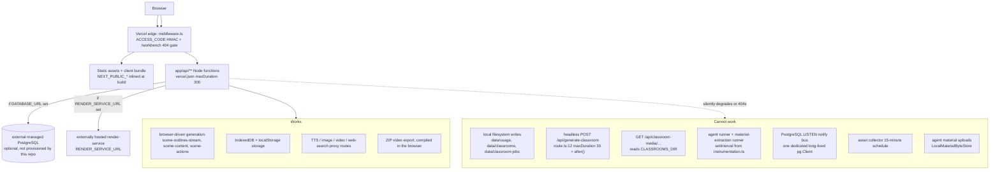
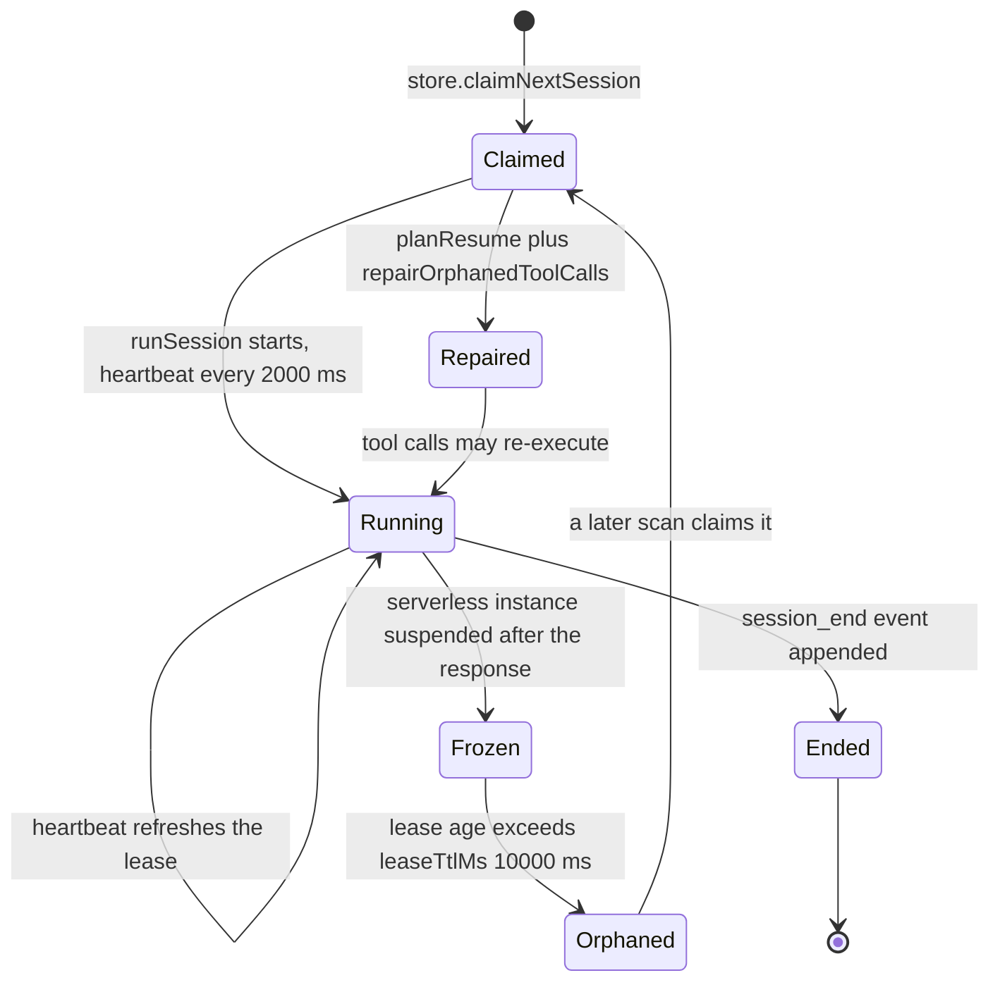

# Vercel / Serverless Topology and Its Hard Limits

Deploying to Vercel works and is advertised ([`README.md:307-316`](README.md#vercel-deployment)), but it is a
strictly smaller product. Six capability classes cannot work under serverless
constraints, and for each one there is a specific file and line that makes it
impossible. This section names them.

**Sources:** `vercel.json`, [`next.config.ts:4-37`](next.config.ts#L4-L37), `instrumentation.ts`,
`middleware.ts`, [`app/api/generate-classroom/route.ts:12,48`](app/api/generate-classroom/route.ts#L12),
[`lib/server/classroom-storage.ts:6-7,21-29`](lib/server/classroom-storage.ts#L6-L7),
[`app/api/classroom-media/[classroomId]/[...path]/route.ts:63`](app/api/classroom-media/[classroomId]/[...path]/route.ts#L63),
[`lib/server/usage-storage.ts:10,131-132`](lib/server/usage-storage.ts#L10), [`lib/server/materials/bytes.ts:33-55`](lib/server/materials/bytes.ts#L33-L55),
[`lib/server/agent-runtime/config.ts:7-19`](lib/server/agent-runtime/config.ts#L7-L19),
[`lib/server/agent-runtime/runner.ts:1892`](lib/server/agent-runtime/runner.ts#L1892),
[`lib/server/material-extraction/runner.ts:78`](lib/server/material-extraction/runner.ts#L78),
[`lib/server/agent-runtime/event-notify-bus.ts:1-17`](lib/server/agent-runtime/event-notify-bus.ts#L1-L17),
[`lib/persistence/asset-collector-schedule.ts:172`](lib/persistence/asset-collector-schedule.ts#L172),
[`lib/persistence/server-provider.ts:30-34`](lib/persistence/server-provider.ts#L30-L34),
[`app/api/agent/sessions/[id]/events/route.ts:19-23,44-47`](app/api/agent/sessions/[id]/events/route.ts#L19-L23),
[`app/api/export-video/render/route.ts:15,18`](app/api/export-video/render/route.ts#L15),
[`lib/server/render-service.ts:25-39`](lib/server/render-service.ts#L25-L39), [`Dockerfile:32,96`](Dockerfile#L32); evidence packs
[`api-surface`](docs/appendix/research/api-surface/00-overview.md),
[`app-shell-and-routing`](docs/appendix/research/app-shell-and-routing/00-overview.md).

## The whole of `vercel.json`

```json
{
  "framework": "nextjs",
  "installCommand": "pnpm install",
  "buildCommand": "pnpm build",
  "functions": { "app/api/**/*.ts": { "maxDuration": 300 } }
}
```

Eleven lines. Four facts follow from it plus `next.config.ts`:

1. `pnpm install` runs the nine-step `postinstall` chain ([`package.json:10`](package.json#L10)),
   so the six `@openmaic/*` packages, both vendored forks, and
   `public/vendor/maic-importer/` are built during install, not committed.
2. `pnpm build` is `node scripts/assert-vendor-maic-importer.mjs && next build`
   ([`package.json:16`](package.json#L16)) — the vendor assertion is a build gate on Vercel too.
3. [`next.config.ts:4`](next.config.ts#L4) reads `process.env.VERCEL` and sets `output: undefined`,
   so no `.next/standalone/server.js` is produced. The platform adapter splits
   `app/api/**` instead.
4. The 300-second ceiling applies to the whole API glob. **24 routes declare
   their own `maxDuration`** as route segment config, and one of them declares a
   *lower* number than the glob: [`app/api/generate-classroom/route.ts:12`](app/api/generate-classroom/route.ts#L12) sets
   `30`.

No route anywhere declares `runtime = 'edge'`; 29 declare `'nodejs'` explicitly
and 40 declare nothing. Everything is a Node function.

## Deployment shape, with unsupported paths marked



## The six classes, concretely

### 1. Long-running work scheduled after the response

`app/api/generate-classroom/route.ts` returns `202` with a `pollUrl` and then
runs the entire course generation inside `after()` (`:48`):

```ts
after(() => runClassroomGenerationJob(jobId, body, baseUrl));
```

That job is a serial loop over every scene with an LLM call per stage plus
optional TTS — minutes of work. The route declares `maxDuration = 30` (`:12`),
lower than the `vercel.json` glob's 300. Whichever number the platform honours,
neither is enough. And the job's state lives in `data/classroom-jobs/`
([`lib/server/classroom-storage.ts:7`](lib/server/classroom-storage.ts#L7)), so the poll endpoint on a different
function instance cannot read it.

The browser-driven generation path is unaffected: it drives step-by-step from
`lib/hooks/use-scene-generator.ts` with one request per scene, each comfortably
inside 300s.

### 2. The local filesystem

Four write sites and one read site, all rooted at `process.cwd()`:

| Path | Written by | Read by |
| --- | --- | --- |
| `data/usage/YYYY-MM.jsonl` | [`lib/server/usage-storage.ts:131-132`](lib/server/usage-storage.ts#L131-L132) (`fs.mkdir` + `fs.appendFile`) | usage analytics |
| `data/classrooms/<id>.json` | [`lib/server/classroom-storage.ts:21-29`](lib/server/classroom-storage.ts#L21-L29) (temp file + `fs.rename`) | `readClassroom` ([`:48`](lib/server/classroom-storage.ts#L48)) |
| `data/classrooms/<id>/{media,audio}/` | headless generation | [`app/api/classroom-media/[classroomId]/[...path]/route.ts:63`](app/api/classroom-media/[classroomId]/[...path]/route.ts#L63) |
| `data/classroom-jobs/` | [`lib/server/classroom-storage.ts:7`](lib/server/classroom-storage.ts#L7) | the `[jobId]` poll route |
| `data/<material key>` | `LocalMaterialByteStore.put` ([`lib/server/materials/bytes.ts:37-46`](lib/server/materials/bytes.ts#L37-L46)) | `get` ([`:48`](lib/server/materials/bytes.ts#L48)) |

`writeJsonFileAtomic` uses `${filePath}.${process.pid}.${Date.now()}.tmp` then
`fs.rename` (`:25-28`) — atomicity within one filesystem, which a serverless
invocation does not share with the next one. The failure mode is not an error:
the write succeeds, the response says `202`, and the data is gone.

`fs` reads that *do* work are the ones the build traces:
[`next.config.ts:5-11`](next.config.ts#L5-L11) adds `lib/server/agent-runtime/import-pptx-worker.mjs`,
`skills/openmaic/**` and `skills/agent-runtime/**` to
`outputFileTracingIncludes`, and [`lib/media/comfyui-workflows.ts:81`](lib/media/comfyui-workflows.ts#L81) /
[`lib/server/skill-export.ts:8-9`](lib/server/skill-export.ts#L8-L9) read from `public/` and `skills/`,
which are read-only build output.

### 3. In-process background schedules

`instrumentation.ts` installs four things that need a process that outlives a
request:

| Schedule | Installed at | Cadence |
| --- | --- | --- |
| Asset collector | [`instrumentation.ts:21`](instrumentation.ts#L21) → [`asset-collector-schedule.ts:172`](lib/persistence/asset-collector-schedule.ts#L172) | `setInterval`, 15 min default |
| PostgreSQL `LISTEN` notify bus | [`instrumentation.ts:44`](instrumentation.ts#L44) | one dedicated `pg.Client`, held open |
| Agent session runner | [`instrumentation.ts:49`](instrumentation.ts#L49) → [`runner.ts:1892`](lib/server/agent-runtime/runner.ts#L1892) | `setInterval`, `scanIntervalMs` = 1000 ms |
| Material-extraction runner | [`instrumentation.ts:51`](instrumentation.ts#L51) → [`material-extraction/runner.ts:78`](lib/server/material-extraction/runner.ts#L78) | `setInterval`, same 1000 ms |

[`instrumentation.ts:4-8`](instrumentation.ts#L4-L8) states the design constraint directly: `register` is
the only place in the app where a background schedule can live, because a route
module has no such guarantee.

The agent runner is the sharpest case. It heartbeats a session lease every
`heartbeatIntervalMs` = 2000 ms and treats a lease older than
`leaseTtlMs` = 10000 ms as orphaned ([`agent-runtime/config.ts:9-15`](lib/server/agent-runtime/config.ts#L9-L15)). A frozen
function instance stops heartbeating, another claim path adopts the session, and
recovery runs `planResume` + `repairOrphanedToolCalls`. Tool execution is
at-least-once **by design** — every tool is written to be idempotent — but a
platform that freezes instances between invocations turns the exceptional path
into the normal one.



### 4. Streaming duration

Ten routes stream; six emit `text/event-stream` directly and four go through
`createSSEResponse`. The comment at
[`app/api/agent/sessions/[id]/events/route.ts:44-47`](app/api/agent/sessions/[id]/events/route.ts#L44-L47) is explicit about who the
budget is for:

> Self-hosted `next start` does not enforce maxDuration; it remains useful to
> Vercel's build adapter. EventSource resumes durable events with Last-Event-ID.
> The 25s heartbeat prevents idle intermediaries from ending the stream early.

That route survives a cut: the stream deliberately does not close at
`session_end` (`:19-23`), and a client reconnects with `Last-Event-ID` through
the same replay path. Two SSE routes do **not** have durable replay behind them
and therefore lose work on a cut:

| Route | `maxDuration` | On a cut |
| --- | --- | --- |
| `app/api/agent/sessions/[id]/events` | 300 | reconnect + replay by `Last-Event-ID`, no loss |
| `app/api/agent/owner-events` | 300 | same replay discipline |
| `app/api/generate/scene-outlines-stream` | 300 | partial JSON discarded; the route's own 3-attempt loop restarts the whole stream |
| `app/api/chat/pi` | 300 | the browser owns the loop and re-posts full state; the in-flight turn is lost |

### 5. Large request bodies

[`next.config.ts:36`](next.config.ts#L36) sets `experimental.proxyClientMaxBodySize: '200mb'`, and the
render-submit route caps its own upload at 300 MiB
([`app/api/export-video/render/route.ts:18`](app/api/export-video/render/route.ts#L18)) with a 300-second forwarding budget
(`:15,21`) sized explicitly for "uploading up to MAX_UPLOAD_BYTES over a slow
link" (`:11-14`). Materials uploads are capped at 50 MiB
([`lib/server/agent-runtime/config.ts:46,48`](lib/server/agent-runtime/config.ts#L46)).

*Inferred:* a 300 MiB streamed multipart body forwarded through a serverless
function is well outside the request-body sizes such platforms typically accept,
so the MP4 submit path is the first thing to test on a serverless deployment
rather than assumed working. Nothing in the repository states a serverless body
limit, so this is not a verified claim.

### 6. Native runtime dependencies

[`Dockerfile:32`](Dockerfile#L32) installs `python3 build-base g++ cairo-dev pango-dev jpeg-dev
giflib-dev librsvg-dev` to build `sharp` and `@napi-rs/canvas`, and
[`Dockerfile:96`](Dockerfile#L96) installs the matching runtime libraries into the final image.
[`next.config.ts:23-34`](next.config.ts#L23-L34) marks five packages `serverExternalPackages` — including
`@aws-sdk/client-s3` and `@aws-sdk/s3-request-presigner`, whose comment
(`:27-31`) notes that without the static anchor in
`lib/persistence/asset-byte-store.ts` "S3 mode and redirect egress cannot resolve
their SDK in the shipped deployment". These are packaging constraints that a
serverless build has to satisfy on its own terms; the repository only encodes the
container answer.

## What still works, and works well

| Capability | Why it survives |
| --- | --- |
| Browser-driven course generation | one bounded request per scene; the orchestration lives in `lib/hooks/use-scene-generator.ts` in the browser |
| IndexedDB + localStorage storage | zero server state; the default backend |
| `ACCESS_CODE` gate | `middleware.ts` uses a hand-rolled Web Crypto HMAC verifier precisely for Edge compatibility (`:17`) |
| Provider proxy routes (TTS, image, video, web search, `proxy-media`) | request-scoped, no shared state |
| ZIP video export | compiled and packaged entirely in the browser |
| MP4 export **relay** | the app only forwards and polls (`app/api/export-video/**`); the render itself is somebody else's container |
| Server persistence against a managed PostgreSQL | `getServerPersistenceProvider` caches on a `globalThis` symbol ([`lib/persistence/server-provider.ts:30-34`](lib/persistence/server-provider.ts#L30-L34)), so a warm instance reuses its pool |

`RENDER_SERVICE_URL` is deliberately exempt from the SSRF guard
([`lib/server/render-service.ts:25-35`](lib/server/render-service.ts#L25-L35)) because it is operator-supplied trusted
config meant to point at an internal service — which also means a serverless
deployment can point it at a publicly reachable render host without setting
`ALLOW_LOCAL_NETWORKS`.

## Cross-links

- [`07-scaling-and-state.md`](docs/17-deployment-view/07-scaling-and-state.md) — the same state
  inventory framed as a horizontal-scaling problem rather than a platform one.
- [`../12-api-reference/index.md`](docs/12-api-reference/index.md) — per-endpoint
  `maxDuration` and streaming behaviour.
- [`../05-agent-runtime/index.md`](docs/05-agent-runtime/index.md) — why the
  durable runtime needs a resident process.

## Open questions

- Route segment `maxDuration = 30` on [`app/api/generate-classroom/route.ts:12`](app/api/generate-classroom/route.ts#L12)
  versus `maxDuration: 300` for the same glob in [`vercel.json:6-10`](vercel.json#L6-L10): which wins
  is platform behaviour, not repository behaviour, and no comment resolves it.
- [`middleware.ts:53`](middleware.ts#L53) branches on `process.env.NEXT_RUNTIME !== 'edge'` to decide
  whether it can inspect server-only variables, with the comment "A Node-hosted
  middleware uses the same gate as startup" (`:52`). Which runtime the middleware
  actually gets on Vercel is not stated anywhere in the repository, so whether
  the `/workbench` 404 gate consults `isAgentRuntimeConfigured()` there is
  undetermined.
- The repository contains no serverless-specific storage adapter for the four
  `data/` paths. Whether those routes are intended to be unreachable on Vercel or
  simply have not been ported is not recorded.
