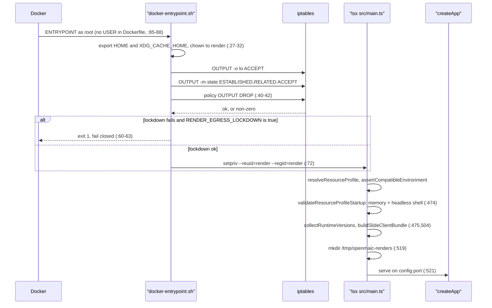
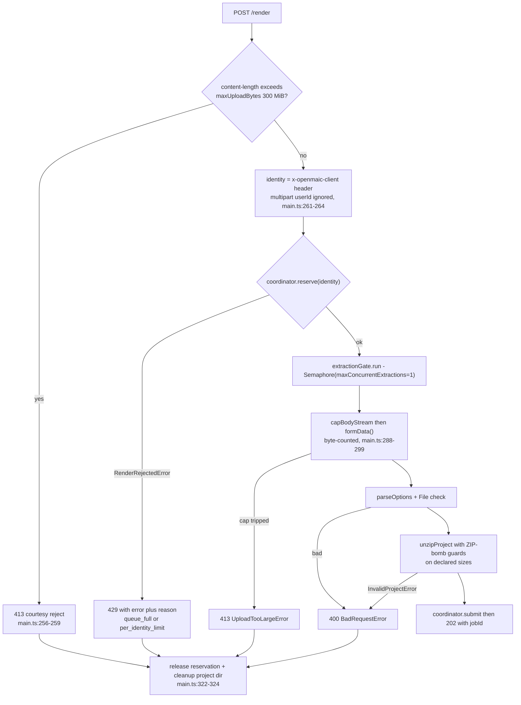
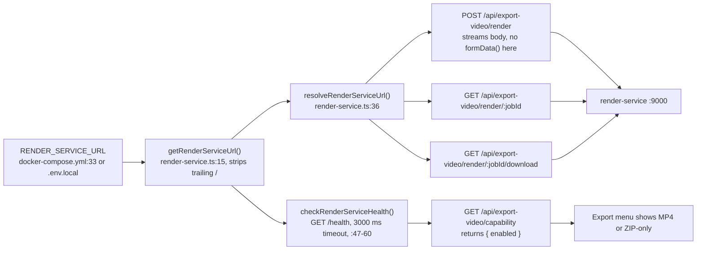

# render-service as a Separate Deployable

The only part of OpenMAIC that is a second process by necessity rather than
convenience. It needs Node 22, Chromium's old headless shell, and FFmpeg, and it
executes untrusted uploaded HTML — none of which belongs in the Next.js runtime
(`render-service/README.md:8-10`). It is entirely optional: with no
`RENDER_SERVICE_URL` the app degrades to a ZIP download and never mentions MP4.

**Sources:** `render-service/Dockerfile`,
`render-service/docker-entrypoint.sh`, `render-service/package.json`,
`render-service/src/config.ts`, `render-service/src/main.ts:229-521`,
`render-service/src/resource-profile.ts`, `render-service/src/job-store.ts`,
`render-service/src/artifact-store.ts`, `render-service/README.md`,
`docker-compose.yml:66-133`, `lib/server/render-service.ts`,
`app/api/export-video/**/route.ts`, `lib/store/video-render.ts:121-190`;
evidence pack
[`media-audio-video`](../appendix/research/media-audio-video/00-overview.md).

## The image

| Layer | Contents | Line |
| --- | --- | --- |
| Base | `node:22.22.2-bookworm-slim` pinned by **digest**, not tag | `Dockerfile:8` |
| APT source | one dated, signed `snapshot.debian.org` archive (`DEBIAN_SNAPSHOT=20260731T162426Z`) so exact versions stay installable after they rotate out of live mirrors | `:18,31-35` |
| Binaries | `chromium-common` + `chromium-headless-shell` `151.0.7922.71-1~deb12u1`, `ffmpeg` `7:5.1.9-0+deb12u1`, `iptables` `1.8.9-2`, `ca-certificates` | `:10-13,39-43` |
| Fonts | `fonts-liberation`, `fonts-noto-core`, `fonts-noto-color-emoji`, `fonts-noto-cjk` | `:14-17,44-47` |
| Deps | `npm ci --omit=dev` against `package-lock.json` in a cached stage | `:53-55` |
| App | `src/` copied as TypeScript; run through `tsx` | `:68`, `docker-entrypoint.sh:72` |

Debian rather than Alpine is a deliberate call recorded at `Dockerfile:4-7`:
`@hyperframes/producer` drives Chromium via puppeteer, and Chromium plus its
shared libraries are far simpler on glibc than on musl. The *headless shell* —
not regular Chromium — is required because producer's BeginFrame capture needs
it; regular Chromium exposes the resolver path but then rejects
`HeadlessExperimental.beginFrame` and silently falls back to screenshots
(`Dockerfile:5-7`).

The entrypoint is baked with a CRLF-stripping `sed` before `chmod +x`
(`Dockerfile:75-76`) so a clone made before `.gitattributes` landed cannot
produce a `#!/bin/sh\r` shebang failure at container start.

## Startup sequence: root, then not

Three fail-closed checks happen before the listener exists:

1. `resolveResourceProfile` (`resource-profile.ts:107`) rejects an unknown
   `RENDER_RESOURCE_PROFILE`, and `assertCompatibleEnvironment` (`:75`) throws if
   any of nine producer/concurrency variables is set to something other than what
   the profile requires — with the message "Select a different resource profile
   instead of overriding it" (`:100`).
2. `validateResourceProfileStartup` (`:138`) refuses to start if
   `min(totalmem, cgroup memory.max, cgroup memory.limit_in_bytes)` is below the
   profile's floor (`:129-136,147-154`), and — for the BeginFrame profile — if
   `PRODUCER_HEADLESS_SHELL_PATH` does not exist on disk (`:156-165`).
3. The egress lockdown (`docker-entrypoint.sh:51-67`), whose comment states the
   reason for failing closed: `/health` would still report healthy, so the app
   would advertise MP4 rendering while Chromium could reach the app.

## HTTP interface

| Method + path | Purpose | Declared at |
| --- | --- | --- |
| `GET /health` | `{ ok, accepting, resourceProfile, versions }` — aggregate only, never queue depths or per-identity data | `main.ts:241-250` |
| `POST /render` | multipart `project` ZIP + `fps`, `quality`, `format` → `202 { jobId }` | `main.ts:252-331` |
| `POST /preview` | JSON scene + stage context + viewport → synchronous PNG | `main.ts:333-417` |
| `GET /render/:jobId` | status, progress, `framesRendered`/`totalFrames`, metrics, `done` | `main.ts:419-433` |
| `DELETE /render/:jobId` | cancel queued/running | `main.ts:435-439` |
| `GET /render/:jobId/download` | stream the MP4, or `302` to a presigned URL | `main.ts:441-466` |

`parseOptions` (`main.ts:201-214`) accepts `fps` in 1..120, `quality` in
`draft|standard|high`, and `format` `mp4` only.

### Admission before buffering

The ordering is the security boundary, documented verbatim at
`main.ts:216-228`. `POST /render`:

Requests beyond the extraction permit wait with the request body **unconsumed**,
backpressured on the socket rather than held in RAM (`main.ts:279-282`). That is
what keeps a near-cap burst from OOMing the box, given `maxConcurrentExtractions`
is fixed at 1 by both profiles (`resource-profile.ts:26-30`).

### Archive guards, enforced before decompression

| Knob | Default | Line |
| --- | --- | --- |
| `RENDER_MAX_UPLOAD_BYTES` | 300 MiB | `config.ts:102` |
| `RENDER_MAX_ENTRIES` | 5000 | `config.ts:104` |
| `RENDER_MAX_ENTRY_BYTES` | 200 MiB | `config.ts:106` |
| `RENDER_MAX_EXPANDED_BYTES` | 512 MiB | `config.ts:108` |
| `RENDER_MAX_COMPRESSION_RATIO` | 200 | `config.ts:110` |

## Resource profiles

| | `standard` | `low-memory` |
| --- | --- | --- |
| Capture policy | `prefer-beginframe` | `screenshot-only` |
| Minimum memory | 8 GiB | 4 GiB |
| Producer workers | 1 | 1 |
| `maxConcurrency` | 1 | 1 |
| `maxConcurrentExtractions` | 1 | 1 |
| `maxPreviewPixels` | 3840×2160 | 1920×1080 |
| `maxPreviewDeviceScaleFactor` | 2 | 1 |
| `maxParallelChunks` ceiling | 4 | 1 |

Both are defined at `resource-profile.ts:55-58`. `requireBeginFrame` is `false`
in both (`:45`) — the standard profile *prefers* BeginFrame but permits
producer's screenshot fallback for compatibility-sensitive compositions such as
iframe GenUI. No host GPU is used or requested: `PRODUCER_BROWSER_GPU_MODE` is
forced to `software` (`:68`), and the comment notes SwiftShader keeps BeginFrame
eligible without passthrough.

Other lifecycle bounds: `RENDER_JOB_TTL_MS` 30 min (`config.ts:83`),
`RENDER_JOB_DEADLINE_MS` 45 min (`:88`), `RENDER_MAX_QUEUE` 20 (`:81`),
`RENDER_PREVIEW_TIMEOUT_MS` 20 s (`:90`), `RENDER_PREVIEW_MAX_IN_FLIGHT` 8
(`:92`), `RENDER_PREVIEW_MAX_PER_USER` 2 (`:94`).

## How the app finds it

Four discovery facts that matter operationally:

- `RENDER_SERVICE_URL` **skips the SSRF guard** on purpose
  (`lib/server/render-service.ts:25-35`): the guard exists to stop
  user-controlled URLs reaching internal hosts, and this URL is *meant* to point
  at one. Running the guard here would force `ALLOW_LOCAL_NETWORKS` on globally.
- Configured is not the same as available. `checkRenderServiceHealth` probes
  `/health` with a 3-second timeout and returns `false` rather than throwing
  (`:47-60`), so a set-but-unstarted service reports MP4 disabled and the menu
  shows only ZIP (`app/api/export-video/capability/route.ts:6-11`).
- The capability endpoint **never leaks the service URL** to the client
  (`capability/route.ts:11`) — it answers `{ success: true, enabled }` only,
  because `apiSuccess` spreads the payload alongside `success: true`
  (`lib/server/api-response.ts:68-69`).
- Client identity is derived by the app, not the service:
  `clientIdentity()` (`app/api/export-video/render/route.ts:33-38`) honours
  `x-forwarded-for`/`x-real-ip` **only** when `TRUST_PROXY_HEADERS === 'true'`,
  otherwise every caller collapses to the literal string `direct`. That is why
  `docker-compose.yml:117` sets `RENDER_MAX_JOBS_PER_USER=0` — a per-identity
  limit over one shared bucket would throttle the whole deployment to a single
  render.

## Scaling

Three swap points exist so the service can move from one OSS host to a
horizontally-scaled deployment without changing the HTTP contract or the app
(`render-service/README.md:245-261`):

| Seam | Shipped implementation | Replacement | Effect |
| --- | --- | --- | --- |
| `RenderExecutor` (`src/render-executor.ts`) | `InProcessExecutor` over HyperFrames producer | bounded local or remote executor | render work leaves the request process |
| `JobStore` (`src/job-store.ts`) | `InMemoryJobStore` — a `Map` plus a 60 s TTL sweeper (`:25-40,72-80`) | `RedisJobStore` | any replica can serve poll/download |
| `ArtifactStore` (`src/artifact-store.ts`) | `LocalDiskArtifactStore` — a `Map` of job id → path, no copying (`:27-42`) | `S3ArtifactStore` whose `locate` returns `{ kind: 'url' }` | download route `302`s the browser to storage, bypassing the proxy |

Until those are swapped, the service is **strictly single-replica**: a job
submitted to replica A is a 404 on replica B, and the app's download route
already handles the `302` case (`app/api/export-video/render/[jobId]/download/route.ts:39-43`)
in anticipation of the S3 seam.

Standalone operation is documented at `render-service/README.md:185-200` and
requires the operator to isolate the network themselves — the service needs no
outbound access at all because the export ZIP bundles every asset and GSAP at
build time (`docker-entrypoint.sh:4-7`).

## Cross-links

- [`03-docker-compose.md`](./03-docker-compose.md) — the `video-export` profile
  and the `internal: true` network.
- [`06-dockerfiles.md`](./06-dockerfiles.md) — the build stages side by side.
- [`../09-media-and-export/index.md`](../09-media-and-export/index.md) — the
  browser half of the pipeline that produces the ZIP.

## Open questions

- `render-service/README.md:164-165` references
  `scripts/egress-smoke.sh <image>` as the end-to-end assertion of the egress
  boundary. Whether that script runs in CI was not determined from the
  render-service tree alone.
- No graceful-shutdown handler exists in `render-service/src/main.ts`. A
  `SIGTERM` during a render loses the job record with the `Map` and leaves the
  project dir under `/tmp/openmaic-renders` until the container's filesystem
  goes. Whether that is acceptable-by-design or unfinished is not recorded.
