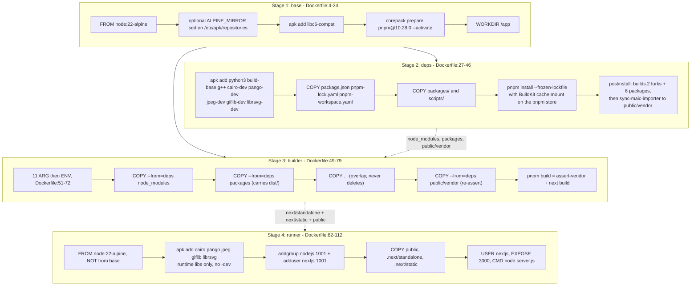
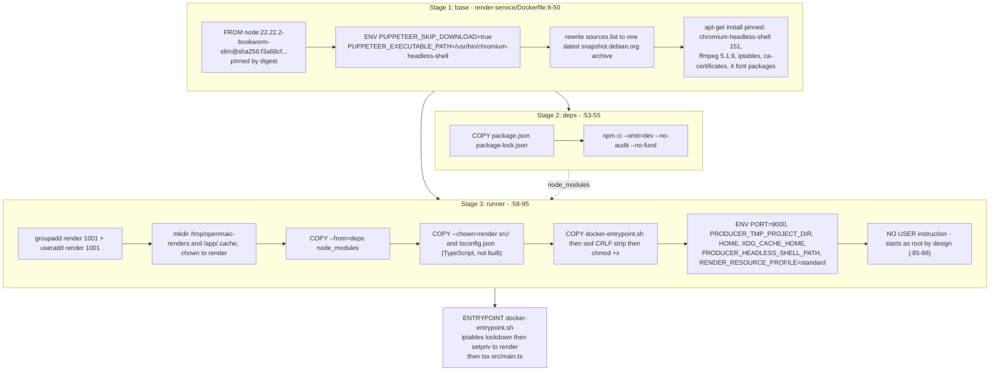

# The Two Dockerfiles

Two images, two base distributions, two dependency managers, two privilege
models. `Dockerfile` builds the Next.js app on Alpine with pnpm and runs as an
unprivileged user from the first instruction. `render-service/Dockerfile` builds
the MP4 renderer on Debian with npm and deliberately starts as root so its
entrypoint can install an egress lockdown before dropping privileges.

**Sources:** `Dockerfile`, `.dockerignore`, `render-service/Dockerfile`,
`render-service/.dockerignore`, `render-service/docker-entrypoint.sh`,
[`next.config.ts:4-37`](next.config.ts#L4-L37), [`package.json:10,16`](package.json#L10), [`docker-compose.yml:3-21,80`](docker-compose.yml#L3-L21),
[`packages/@openmaic/generation/src/prompts/loader.ts:5-13`](packages/@openmaic/generation/src/prompts/loader.ts#L5-L13),
[`README.md:326-360`](README.md#slow-network--china-build-acceleration).

## App image: four stages

### The three COPY subtleties in the builder

Ordering at [`Dockerfile:74-77`](Dockerfile#L74-L77) is load-bearing and easy to break:

1. `COPY --from=deps /app/packages ./packages` (`:75`) brings the **built**
   `packages/*/dist` from the deps stage, produced by the nine-step `postinstall`
   chain ([`package.json:10`](package.json#L10)).
2. `COPY . .` (`:76`) then overlays the host tree. Docker `COPY` adds and
   overwrites but never deletes, and [`.dockerignore:9`](.dockerignore#L9) excludes `dist`, so the
   host copy has no `dist` to clobber — the built output survives.
3. `COPY --from=deps /app/public/vendor ./public/vendor` (`:77`) re-asserts the
   importer bundle *after* the overlay, because `scripts/sync-maic-importer.mjs`
   generated it in the deps stage and it is not in git. Without this line
   `pnpm build`'s first half, `scripts/assert-vendor-maic-importer.mjs`
   ([`package.json:16`](package.json#L16)), fails the build.

### Mirror hygiene in the runner

[`Dockerfile:92-99`](Dockerfile#L92-L99) backs up `/etc/apk/repositories` to `/tmp`, applies the
`ALPINE_MIRROR` substitution, installs, then **restores** the original file. So
a China-accelerated build ([`README.md:326-345`](README.md#slow-network--china-build-acceleration)) does not ship an image whose apk
configuration points at a third-party mirror. The `deps` and `base` stages do not
restore, because they never reach the final image.

[`README.md:335-337`](README.md#slow-network--china-build-acceleration) warns explicitly: use public mirror endpoints only, no
credentials in `ALPINE_MIRROR`/`NPM_REGISTRY`, because Docker may record build
arguments in image metadata or provenance.

## What is baked in versus supplied at run time

| Category | Item | Mechanism |
| --- | --- | --- |
| Baked | `.next/standalone/server.js` and its traced `node_modules` | [`next.config.ts:4`](next.config.ts#L4) `output: 'standalone'`; [`Dockerfile:105`](Dockerfile#L105) |
| Baked | `.next/static` and all of `public/` including `public/vendor/maic-importer/` | [`Dockerfile:104,106`](Dockerfile#L104) |
| Baked | `lib/server/agent-runtime/import-pptx-worker.mjs`, `skills/openmaic/**`, `skills/agent-runtime/**` | [`next.config.ts:5-11`](next.config.ts#L5-L11) `outputFileTracingIncludes` |
| Baked | every `NEXT_PUBLIC_*` value in the eleven-arg list, inlined into the client bundle | [`Dockerfile:52-72`](Dockerfile#L52-L72) |
| Baked | the CSP `frame-ancestors` value from `ALLOWED_FRAME_ANCESTORS` | [`next.config.ts:38-56`](next.config.ts#L38-L56); [`.env.example:465-467`](.env.example#L465-L467) says "then rebuild the app" |
| Baked | native runtime libraries for `sharp` and `@napi-rs/canvas` | [`Dockerfile:96`](Dockerfile#L96) |
| Run time | provider keys, `DEFAULT_MODEL`, `MODEL_ROUTES`, `DATABASE_URL`, `ACCESS_CODE`, `ALLOW_LOCAL_NETWORKS`, `ASSET_*`, `RENDER_SERVICE_URL` | `env_file` / `environment` in Compose |
| Mounted | `/app/data` — usage JSONL, classrooms, classroom-jobs, material bytes | volume `openmaic-data` |
| Mounted (optional) | `/app/server-providers.yml` read-only | [`docker-compose.yml:38-39`](docker-compose.yml#L38-L39); excluded from the context by [`.dockerignore:22`](.dockerignore#L22) |

### What `.dockerignore` keeps out

`node_modules`, `.pnpm-store`, `.next`, `out`, `build`, `dist`, `.git`,
`.idea`, `.vscode`, every `.env*` except `.env.example`,
`server-providers*.yml`, `assets`, root `*.md`, `*.pdf`, `*.pem`, `.vercel`,
`coverage`, `logs`, `data`, `docs`, `.claude`, and — importantly —
`render-service` (`:37-39`, "built as its own image ... never part of the main
app image").

*Inferred:* `*.md` at [`.dockerignore:26`](.dockerignore#L26) is not recursive, because a single `*`
in a Docker ignore pattern does not cross a path separator. Root `README.md` and
`CHANGELOG.md` are excluded, while the nested prompt markdown — the templates
under `lib/prompts/templates/`, the PBL prompts under `lib/pbl/v2/prompts/`, and
`packages/@openmaic/generation/{snippets,prompts-pbl}/*.md` — stays in the build
context. That distinction is what makes the generation pipeline work in the
image at all.

## Render-service image: three stages

### Deliberate departures from the app image

| Aspect | App image | Render image | Reason recorded at |
| --- | --- | --- | --- |
| Base distro | `node:22-alpine` (tag) | `node:22.22.2-bookworm-slim` (**digest**) | [`render-service/Dockerfile:4-7`](render-service/Dockerfile#L4-L7) — Chromium on glibc, not musl |
| Package manager | pnpm 10.28.0 via corepack | `npm ci` against `package-lock.json` | `render-service/package.json` is outside the pnpm workspace |
| Version pinning | ranges in `package.json` | every apt package pinned to an exact version from one dated snapshot | `:26-30` — exact versions stay installable after mirror rotation |
| Ship compiled? | yes, `next build` output | no, `src/*.ts` run through `tsx` | [`render-service/Dockerfile:91-94`](render-service/Dockerfile#L91-L94) names `main.ts` explicitly, because producer auto-starts its own server if the entry path ends in `/src/server.ts` |
| Privilege at start | `USER nextjs` ([`Dockerfile:108`](Dockerfile#L108)) | root, then `setpriv --reuid=render` | [`render-service/Dockerfile:85-88`](render-service/Dockerfile#L85-L88) — `CAP_NET_ADMIN` is needed for the lockdown |
| Chromium sandbox | n/a | `--no-sandbox` in a container, hence dropping to non-root | [`render-service/Dockerfile:60`](render-service/Dockerfile#L60) |

The entrypoint's `sed -i 's/\r$//'` before `chmod +x`
([`render-service/Dockerfile:70-76`](render-service/Dockerfile#L70-L76)) exists because clones made before
`.gitattributes` landed hold a CRLF copy, and a `#!/bin/sh\r` shebang fails at
container start with a message that blames the script rather than the
interpreter.

## Build commands

| Goal | Command |
| --- | --- |
| Both images via Compose | `docker compose up --build` (render-service needs `--profile video-export`) |
| App image alone | `docker build -t openmaic:local .` ([`README.md:349-354`](README.md#slow-network--china-build-acceleration)) |
| App image behind a mirror | add `--build-arg ALPINE_MIRROR=... --build-arg NPM_REGISTRY=...` |
| Render image alone | `docker build -t openmaic-render:local ./render-service` |

The pnpm store BuildKit cache ([`Dockerfile:38`](Dockerfile#L38), `id=pnpm-store`) is reused by the
same builder across builds and is a performance optimisation only —
[`README.md:358-360`](README.md#slow-network--china-build-acceleration) states it is not required for a correct build. Neither
`ALPINE_MIRROR` nor `NPM_REGISTRY` accelerates Docker Hub pulls
([`README.md:356-358`](README.md#slow-network--china-build-acceleration)).

## Cross-links

- [`03-docker-compose.md`](docs/17-deployment-view/03-docker-compose.md) — how these images are wired
  together.
- [`05-render-service-deployment.md`](docs/17-deployment-view/05-render-service-deployment.md) — what
  the render image does once it boots.
- [`../16-development-view/03-build-pipeline.md`](docs/16-development-view/03-build-pipeline.md)
  — the `postinstall` chain the deps stage runs.

## Open questions

- `@openmaic/generation` is listed in `serverExternalPackages`
  ([`next.config.ts:26`](next.config.ts#L26)), and its prompt loader resolves Markdown at run time from
  `import.meta.url` ([`packages/@openmaic/generation/src/prompts/loader.ts:13`](packages/@openmaic/generation/src/prompts/loader.ts#L13))
  rather than importing it. `outputFileTracingIncludes` ([`next.config.ts:5-11`](next.config.ts#L5-L11))
  names only the pptx worker and the two `skills/` trees, not the generation
  prompts. Whether Next's tracing carries those `.md` files into
  `.next/standalone` — and therefore into the runner stage, which copies nothing
  else from the source tree — could not be determined without running a build.
- Neither image declares a `HEALTHCHECK`, and `docker-compose.yml` declares one
  only for `postgres`. Both services have a health endpoint, so the omission
  appears unintentional but is not commented anywhere.
- The `deps` stage installs a full native toolchain ([`Dockerfile:32`](Dockerfile#L32)) but
  [`package.json:204-207`](package.json#L204-L207) lists `sharp` and `unrs-resolver` under
  `pnpm.ignoredBuiltDependencies`, meaning their install scripts are skipped.
  Which consumer still needs `cairo-dev`/`pango-dev` at build time —
  `@napi-rs/canvas`, most likely — is not stated in the Dockerfile beyond the
  comment "Native build tools for sharp, @napi-rs/canvas" (`:31`).
