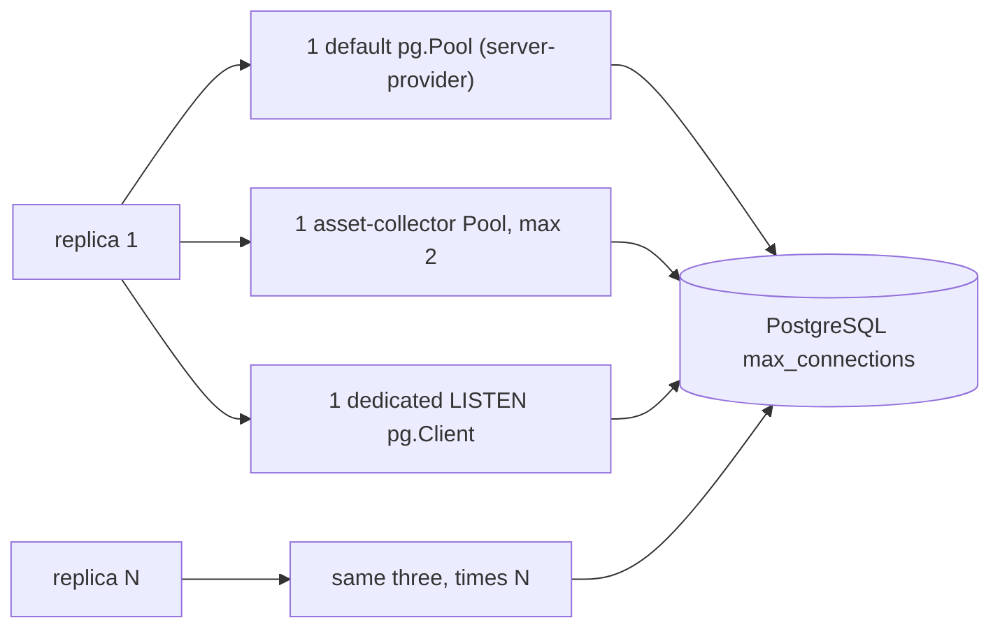
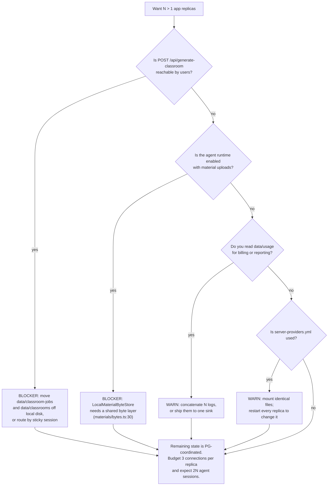

# Scaling, In-Process State, and Long-Running Endpoints

OpenMAIC splits cleanly in two. Where PostgreSQL is the authority — agent
sessions, documents, runtime records, the asset registry — horizontal scaling is
designed for and commented on. Where the local filesystem is the authority —
usage logs, headless classrooms, material bytes — a second replica is a
correctness bug, not a capacity increase.

**Sources:** [`lib/persistence/server-provider.ts:25-34,70-90`](lib/persistence/server-provider.ts#L25-L34),
[`lib/persistence/asset-collector-schedule.ts:11-17,75-78,94-104,120,147-174`](lib/persistence/asset-collector-schedule.ts#L11-L17),
[`lib/server/agent-runtime/event-notify-bus.ts:1-17,58-69`](lib/server/agent-runtime/event-notify-bus.ts#L1-L17),
[`lib/server/agent-runtime/runner.ts:1863,1892`](lib/server/agent-runtime/runner.ts#L1863),
[`lib/server/agent-runtime/config.ts:7-19`](lib/server/agent-runtime/config.ts#L7-L19),
[`lib/server/material-extraction/runner.ts:31,78`](lib/server/material-extraction/runner.ts#L31),
[`lib/server/provider-config.ts:417-423`](lib/server/provider-config.ts#L417-L423), [`lib/server/materials/bytes.ts:57-66`](lib/server/materials/bytes.ts#L57-L66),
[`lib/server/classroom-storage.ts:6-29`](lib/server/classroom-storage.ts#L6-L29), [`lib/server/usage-storage.ts:10,131-132`](lib/server/usage-storage.ts#L10),
`render-service/src/job-store.ts`, [`render-service/src/artifact-store.ts:27-42`](render-service/src/artifact-store.ts#L27-L42),
[`render-service/src/config.ts:79-94`](render-service/src/config.ts#L79-L94),
[`app/api/export-video/render/route.ts:33-38`](app/api/export-video/render/route.ts#L33-L38), `instrumentation.ts`,
all 24 routes declaring `maxDuration`; evidence packs
[`api-surface`](docs/appendix/research/api-surface/00-overview.md),
[`persistence-storage-state`](docs/appendix/research/persistence-storage-state/00-overview.md).

## Stateful versus stateless paths

```mermaid
flowchart TD
  req["Inbound request"]

  subgraph stateless["Stateless - safe on any replica"]
    direction TB
    s1["generate/scene-outlines-stream, scene-content, scene-actions"]
    s2["generate/tts, generate/image, generate/video"]
    s3["chat, chat/pi (browser owns the loop, re-posts full state)"]
    s4["proxy-media, web-search, transcription"]
    s5["verify-* probes, health, server-providers"]
    s6["persistence catch-all route - PostgreSQL is the authority"]
    s7["stages, folders, materials metadata - PostgreSQL"]
  end

  subgraph pgowned["Coordinated through PostgreSQL - safe with caveats"]
    direction TB
    p1["agent/sessions/** - claim + lease + heartbeat in PG"]
    p2["agent/sessions/:id/events - durable log + Last-Event-ID replay"]
    p3["asset collector - per-blob FOR UPDATE lock"]
    p4["material-extraction runner - same claim pattern"]
  end

  subgraph nodeaffine["Node-affine - a second replica breaks these"]
    direction TB
    n1["generate-classroom + :jobId poll<br/>data/classroom-jobs on local disk"]
    n2["classroom-media/:id/*<br/>reads data/classrooms on local disk"]
    n3["materials byte GET/PUT<br/>LocalMaterialByteStore under process.cwd()/data"]
    n4["usage metering<br/>append-only data/usage/YYYY-MM.jsonl"]
  end

  req --> stateless
  req --> pgowned
  req --> nodeaffine

  pg[("PostgreSQL")]
  disk[["local disk /app/data"]]
  pgowned --> pg
  stateless -.->|"only when DATABASE_URL is set"| pg
  nodeaffine --> disk
  disk -.->|"one replica only"| warn["sticky routing or single instance required"]
```

## App-process state inventory

| # | State | Where | Scope | Behaviour at N replicas |
| --- | --- | --- | --- | --- |
| 1 | pg `Pool` + `PgRuntimeStore`/`PgDocumentStore`/`PgAssetStore` | `globalThis[Symbol.for('openmaic.persistence.provider')]` ([`server-provider.ts:30-34`](lib/persistence/server-provider.ts#L30-L34)) | one per process, keyed on the connection string ([`:74-77`](lib/persistence/server-provider.ts#L74-L77)) | N pools; PostgreSQL `max_connections` is the binding constraint |
| 2 | Asset-collector timer + a `max: 2` pool | `globalThis[Symbol.for('openmaic.asset-collector.schedule')]` ([`asset-collector-schedule.ts:75-78,120`](lib/persistence/asset-collector-schedule.ts#L75-L78)) | one per process | **Safe.** `:13-17` states several instances may run it at once; each blob is re-checked and locked `FOR UPDATE` in its own transaction, so collectors serialize on the row. The comment ends "please do not add" a distributed lock |
| 3 | `LISTEN` client + in-process fanout `Map<string, Set<Subscriber>>` | [`event-notify-bus.ts:58-69`](lib/server/agent-runtime/event-notify-bus.ts#L58-L69) | one dedicated `pg.Client` per instance | **Safe by construction.** [`:12-17`](lib/server/agent-runtime/event-notify-bus.ts#L12-L17): NOTIFY is deliberately a *lossy* wakeup; every SSE route and the runner keep fallback polls and converge anyway. Cost is +1 connection per replica |
| 4 | Agent session runner scan timer + claimed sessions | [`runner.ts:1892`](lib/server/agent-runtime/runner.ts#L1892), installed from [`instrumentation.ts:49`](instrumentation.ts#L49) | `maxConcurrent` = 2 per instance ([`agent-runtime/config.ts:17`](lib/server/agent-runtime/config.ts#L17)) | **Safe.** PostgreSQL is the authority for claims, leases, ordering, cancellation and recovery. Total concurrency becomes 2N |
| 5 | Material-extraction runner scan + heartbeat timers | [`material-extraction/runner.ts:31,78`](lib/server/material-extraction/runner.ts#L31) | per instance | same claim/lease pattern as #4 |
| 6 | `server-providers.yml` parse cache | `_configs: Map` ([`provider-config.ts:423`](lib/server/provider-config.ts#L423)) | per process, read from `process.cwd()` ([`:219`](lib/server/provider-config.ts#L219)) | consistent only if every replica mounts the same file; a change needs a restart everywhere |
| 7 | `LocalMaterialByteStore` singleton | [`materials/bytes.ts:57-61`](lib/server/materials/bytes.ts#L57-L61), root `process.cwd()/data` | per process, per filesystem | **Broken.** Bytes written on replica A 404 on replica B while the PostgreSQL metadata row says the material exists |
| 8 | Headless classroom documents and job rows | `data/classrooms/`, `data/classroom-jobs/` ([`classroom-storage.ts:6-7`](lib/server/classroom-storage.ts#L6-L7)) | per filesystem | **Broken.** `POST /api/generate-classroom` returns a `pollUrl` that only works if the poll lands on the same replica |
| 9 | Usage metering JSONL | `data/usage/YYYY-MM.jsonl` ([`usage-storage.ts:10`](lib/server/usage-storage.ts#L10)) | per filesystem | **Fragmented.** N partial logs; analysis must concatenate them |
| 10 | Render client identity | `'direct'` literal unless `TRUST_PROXY_HEADERS === 'true'` ([`export-video/render/route.ts:34`](app/api/export-video/render/route.ts#L34)) | per request | one shared bucket, which is why `RENDER_MAX_JOBS_PER_USER=0` in Compose |

Rows 2-5 carry explicit multi-instance reasoning in the source. Rows 7-9 carry
none, which is itself informative: the filesystem paths predate the PostgreSQL
work and were never revisited.

### Connection budget

[`server-provider.ts:72`](lib/persistence/server-provider.ts#L72) constructs `new Pool({ connectionString })` with no
`max`, so the `pg` default applies; [`asset-collector-schedule.ts:120`](lib/persistence/asset-collector-schedule.ts#L120) pins
`max: 2`; `event-notify-bus.ts` holds one `Client` (not a pool member) per
instance. Sizing PostgreSQL for N replicas means budgeting all three.

## Render-service state inventory

Every one of these is per-process, and none of the shipped implementations is
shared. The service is single-replica until the three seams are swapped
(see [`05-render-service-deployment.md`](docs/17-deployment-view/05-render-service-deployment.md#scaling)).

| State | Implementation | Consequence at N replicas |
| --- | --- | --- |
| Job records | `InMemoryJobStore` — a `Map` plus a 60 s TTL sweeper ([`job-store.ts:25-40,72-80`](render-service/src/job-store.ts#L25-L40)) | a job submitted to A is `404 Job not found` on B ([`main.ts:421`](render-service/src/main.ts#L421)) |
| MP4 artefacts | `LocalDiskArtifactStore` — a `Map` of id → path under `/tmp/openmaic-renders` ([`artifact-store.ts:27-42`](render-service/src/artifact-store.ts#L27-L42)) | download only works on the rendering replica |
| Queue depth (`RENDER_MAX_QUEUE`, default 20) | `RenderCoordinator` reservations | the cap becomes 20 **per replica**, not deployment-wide |
| Per-identity cap (`RENDER_MAX_JOBS_PER_USER`) | counted from the local `Map` ([`job-store.ts:64-70`](render-service/src/job-store.ts#L64-L70)) | a user can hold N × the limit by hitting different replicas |
| Extraction permit | `Semaphore(maxConcurrentExtractions)` fixed at 1 ([`main.ts:512`](render-service/src/main.ts#L512), [`resource-profile.ts:29`](render-service/src/resource-profile.ts#L29)) | RAM ceiling is per replica, which is the point |
| Preview gates (`RENDER_PREVIEW_MAX_IN_FLIGHT` 8, `..._PER_USER` 2) | `PreviewGate` counters ([`main.ts:236-237`](render-service/src/main.ts#L236-L237)) | same per-replica multiplication |

## Long-running and streaming endpoints

24 routes declare `maxDuration`. The distribution:

| Declared budget | Count | Routes |
| --- | --- | --- |
| 300 s | 13 | `agent/owner-events`, `agent/sessions/[id]/events`, `chat/pi`, `export-video/render`, `generate/image`, `generate/scene-content`, `generate/scene-outlines-stream`, `generate/video`, `pbl/v2/evaluate`, `pbl/v2/instructor`, `pbl/v2/open-task`, `pbl/v2/simulator`, `stages/[id]/freshness` |
| 120 s | 1 | `generate/agent-profiles` |
| 60 s | 5 | `chat`, `generate/scene-actions`, `pbl/v2/task/update`, `proxy-media`, `transcription` |
| 30 s | 5 | `azure-voices`, `generate-classroom`, `generate/tts`, `generate/voice`, `verify-image-provider` |

Ten routes stream SSE — six set `Content-Type: text/event-stream` directly and
four go through `createSSEResponse` (`lib/pbl/v2/api/sse.ts`, which also sets
`X-Accel-Buffering: no`):

| Route | SSE mechanism | Resumable? |
| --- | --- | --- |
| `app/api/agent/sessions/[id]/events` | direct (`:296`) | **yes** — `Last-Event-ID` replay against the durable log; the stream deliberately does not close at `session_end` (`:19-23`); 25 s heartbeat (`:58`) |
| `app/api/agent/owner-events` | direct (`:319`) | yes — same replay discipline |
| `app/api/chat/pi` | direct (`:288`) | no, but the browser owns the loop and re-posts full state each iteration |
| `app/api/chat` | direct (`:191`) | no |
| `app/api/generate/scene-outlines-stream` | direct (`:704`) | no — the route's own 3-attempt loop restarts the whole stream; 512 KiB buffer ceiling; 15 s heartbeat |
| `app/api/stages/[id]/freshness` | direct (`:146`) | no |
| `app/api/pbl/v2/{instructor,open-task,evaluate,simulator}` | `createSSEResponse`; 15 s heartbeat | no — PBL v2 is stateless-server: the client POSTs the whole project and applies `project_patch` events |

Two routes stream **bytes** rather than events:
`app/api/classroom-media/[classroomId]/[...path]` (with HTTP Range support) and
`app/api/export-video/render/[jobId]/download`, whose comment (`:27-29`) notes it
bounds only the time to obtain response headers, never the body stream, so a
large MP4 over a slow connection is not truncated.

[`app/api/agent/sessions/[id]/events/route.ts:44-45`](app/api/agent/sessions/[id]/events/route.ts#L44-L45) records the operative fact
about all of these numbers: **"Self-hosted `next start` does not enforce
maxDuration; it remains useful to Vercel's build adapter."** On a self-hosted
deployment the effective limits are the reverse proxy's read timeout and the
client's patience, not these declarations.

## Ranked: what to fix before adding a replica

One thing horizontal scaling does **not** fix: there is **zero rate limiting
anywhere in `app/api/**`**. Adding replicas multiplies capacity and multiplies
provider spend at the same rate. The only admission control in the system lives
in `render-service` (`RENDER_MAX_QUEUE`, `RENDER_MAX_JOBS_PER_USER`, the preview
gates) and in per-owner material quotas
([`lib/server/agent-runtime/config.ts:50-55`](lib/server/agent-runtime/config.ts#L50-L55)).

## Cross-links

- [`04-serverless-vercel.md`](docs/17-deployment-view/04-serverless-vercel.md) — the same inventory as
  a platform-compatibility problem.
- [`08-operations-runbook.md`](docs/17-deployment-view/08-operations-runbook.md) — which of these
  states to back up.
- [`../05-agent-runtime/index.md`](docs/05-agent-runtime/index.md) — the lease,
  claim, and recovery protocol that makes rows 4-5 safe.
- [`../15-cross-cutting/index.md`](docs/15-cross-cutting/index.md) — the missing
  rate-limiting layer.

## Open questions

- No load balancer, sticky-session, or session-affinity configuration exists in
  the repository, so "route `/api/generate-classroom` to one replica" is a
  recommendation derived from the code, not a documented deployment mode.
- `OPENMAIC_AGENT_RUNTIME_MAX_CONCURRENT` defaults to 2 per instance
  ([`agent-runtime/config.ts:17`](lib/server/agent-runtime/config.ts#L17)) with no deployment-wide ceiling anywhere. Whether
  PostgreSQL claim contention or provider rate limits bind first at large N was
  not determined.
