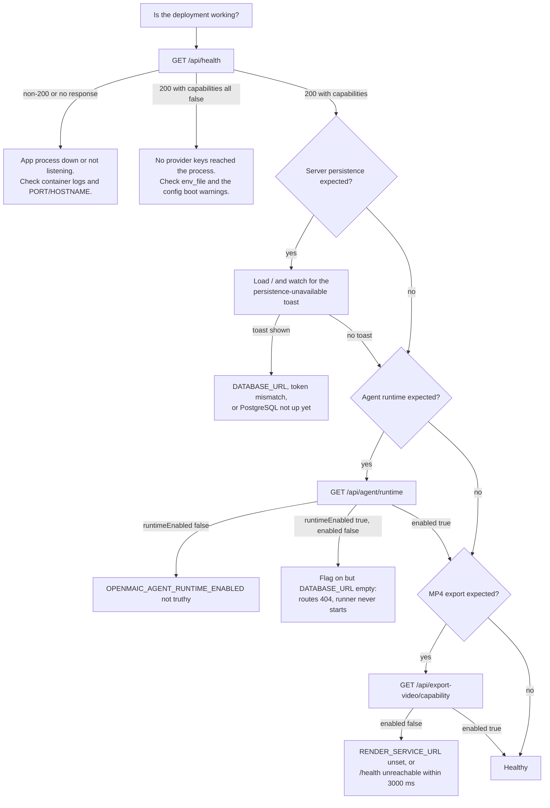
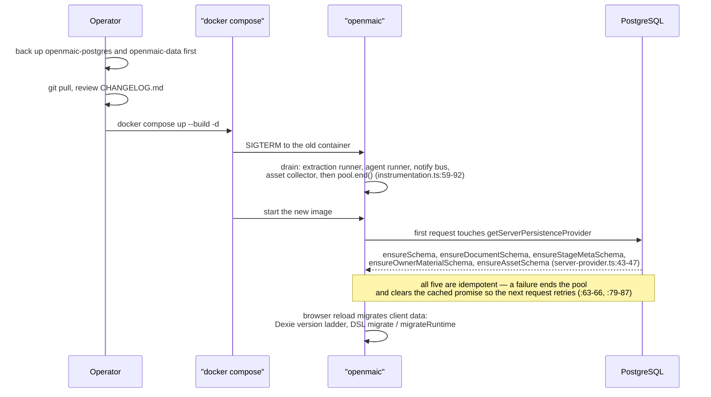

# Operations Runbook

Health endpoints, the signals that actually mean something, what has to be backed
up, how to upgrade without losing a course, and a triage tree for the failures
this system produces in practice. Everything here is derived from shipped code —
where a procedure does not exist, this section says so rather than inventing one.

**Sources:** `app/api/health/route.ts`, `middleware.ts:60-68`,
`app/api/agent/runtime/route.ts`, `app/api/export-video/capability/route.ts`,
`render-service/src/main.ts:241-250`, `docker-compose.yml:56-64`,
`lib/logger.ts`, `lib/server/config-validation.ts:1-46`,
`lib/store/persist-health.ts:13-24`, `lib/persistence/server-provider.ts:36-67`,
`lib/persistence/asset-collector-schedule.ts:147-174`, `instrumentation.ts:57-95`,
`lib/server/usage-storage.ts:10`, `lib/server/classroom-storage.ts:6-7`,
`README.md:404-427`, `.env.example:517-520`.

## Health and capability endpoints

| Endpoint | Answers | Auth |
| --- | --- | --- |
| `GET /api/health` | `{ success: true, status: 'ok', version, capabilities: { webSearch, imageGeneration, videoGeneration, tts } }` (`health/route.ts:12-23`) | **allowlisted** past the `ACCESS_CODE` gate (`middleware.ts:66`) |
| `GET /api/agent/runtime` | `{ enabled, runtimeEnabled }` — usability versus intent (`runtime/route.ts:21-24`) | behind the gate |
| `GET /api/export-video/capability` | `{ success: true, enabled }` after a live 3 s probe of the render service (`capability/route.ts:14-15`) | behind the gate |
| `GET /api/server-providers` | the provider configuration the browser mirrors one-way into settings | behind the gate |
| `GET /health` (render-service, port 9000) | `{ ok, accepting, resourceProfile, versions }` (`main.ts:241-250`) | none; network-isolated instead |
| `pg_isready -U openmaic -d openmaic` | PostgreSQL liveness, 5 s interval, 10 retries | Compose-internal (`docker-compose.yml:56-61`) |

`GET /api/health` is a **liveness plus capability** report, not a readiness
probe: it does not touch PostgreSQL, so it answers `ok` while the database is
still starting. A capability is reported available only when at least one
provider is enabled and not force-disabled (`health/route.ts:17-21`).

The leading `success: true` on those two rows is not decoration: both routes
return through `apiSuccess`, which is `NextResponse.json({ success: true,
...data })` (`lib/server/api-response.ts:68-69`), so a monitoring assertion has
to match the envelope, not the bare payload. `GET /api/agent/runtime` does
**not** use the helper — it calls `Response.json` directly
(`runtime/route.ts:21`), so its body really is the two-field object shown above.

## Signals worth watching

### Server logs

`lib/logger.ts` gives every subsystem a tagged logger. `LOG_LEVEL` (default
`info`) and `LOG_FORMAT=json` (`.env.example:451-452`) are the two knobs;
`formatLine` (`:13-26`) emits `{ timestamp, level, tag, message }` as JSON or
`[timestamp] [LEVEL] [tag] message` as text.

| Signal | Emitted by | Means |
| --- | --- | --- |
| `[config] ...` warnings at boot | `validateServerConfig` via `lib/server/config-validation.ts:44-46` | model routing misconfiguration: unparseable `MODEL_ROUTES`, unroutable stage key, unregistered provider prefix, provider with no key, bare model id, `<PREFIX>_MODELS` on an unconfigured provider, runtime flag without `DATABASE_URL`, runtime flag without a valid `maic-agent-driver` route, workbench build flag without the server flag. **Warnings only — the app starts regardless** (`:23-24`) |
| `[instrumentation] Agent runtime startup failed` | `instrumentation.ts:54` | the runner/notify-bus/extraction-runner block threw; the app still serves, the runtime does not |
| `Asset collection pass failed; retrying on the next interval` | `asset-collector-schedule.ts:163` | transient: unreachable database, revoked bucket credential, lock timeout. Only alarming if it repeats every interval |
| `Asset collector reclaimed N unreferenced blob(s)` | `asset-collector-schedule.ts:157` | reclamation is working; silence means nothing was eligible |
| `[instrumentation] ... drain failed` (four variants) | `instrumentation.ts:65,70,75,80` | a shutdown step failed; the remaining steps still ran |
| `[render-service] egress lockdown active` | `docker-entrypoint.sh:64` | expected on every render-service start |
| `[render-service] WARNING: egress lockdown DISABLED` | `docker-entrypoint.sh:66` | somebody set `RENDER_EGRESS_LOCKDOWN=false`; Chromium can reach the Docker network |
| `[render-service] FATAL: ...` | `docker-entrypoint.sh:53,57,61` | the container exited rather than run unisolated |
| `[ServerProviderConfig] Failed to load server-providers.yml` | `provider-config.ts:226` | malformed YAML; the loader returns `{}` and falls back to env vars |
| `Render service health check failed` | `lib/server/render-service.ts:57` | logged at `info`, so invisible at default level when `LOG_LEVEL=warn` |

### Browser-side signals

Two are visible to users and worth asking about in a bug report:

- The **persistence-unavailable toast** on `/`. `README.md:385-388` describes the
  exact condition: a build with `NEXT_PUBLIC_PERSISTENCE=1` deployed without a
  working `DATABASE_URL`/`PERSISTENCE_DEV_TOKEN`, or a
  `NEXT_PUBLIC_PERSISTENCE_TOKEN` that does not match. The page keeps the prior
  course list rather than misleadingly showing an empty library.
- The **`persist-health` channel** (`lib/store/persist-health.ts:13-19`) with
  three statuses: `unavailable` (storage unusable right now, resolvable),
  `changes-lost` (edits made while it was down are gone — final, survives later
  recoveries, cleared only by user acknowledgement at `:118-121`), and
  `recovered`. `StorageHealthNotice` in the root layout renders these.
- A `caught_up` SSE frame carrying `degraded: true` on
  `app/api/agent/sessions/[id]/events` is not authoritative and asks the client
  to schedule a full reconciliation (`:14-16`). Repeated `degraded` frames point
  at the store, not the browser.

## Backup surface

```mermaid
erDiagram
    OPENMAIC_POSTGRES_VOLUME ||--o{ DOCUMENT_TABLES : contains
    OPENMAIC_POSTGRES_VOLUME ||--o{ RUNTIME_TABLES : contains
    OPENMAIC_POSTGRES_VOLUME ||--o{ ASSET_TABLES : contains
    OPENMAIC_POSTGRES_VOLUME ||--o{ AGENT_SESSION_TABLES : contains
    OPENMAIC_POSTGRES_VOLUME ||--o{ STAGE_META : contains
    OPENMAIC_POSTGRES_VOLUME ||--o{ OWNER_MATERIALS : contains
    OPENMAIC_DATA_VOLUME ||--o{ USAGE_JSONL : contains
    OPENMAIC_DATA_VOLUME ||--o{ CLASSROOMS_DIR : contains
    OPENMAIC_DATA_VOLUME ||--o{ CLASSROOM_JOBS_DIR : contains
    OPENMAIC_DATA_VOLUME ||--o{ MATERIAL_BYTES : contains
    HOST_CONFIG ||--o{ ENV_LOCAL : contains
    HOST_CONFIG ||--o{ SERVER_PROVIDERS_YML : contains
    S3_BUCKET ||--o{ ASSET_BLOBS : "when ASSET_S3_BUCKET is set"
    BROWSER_ORIGIN ||--o{ INDEXEDDB : "not backed up by any server procedure"
    BROWSER_ORIGIN ||--o{ LOCALSTORAGE : "settings and profile"
```

| Item | Backup method | Notes |
| --- | --- | --- |
| `openmaic-postgres` volume | `pg_dump`, or volume snapshot with the container stopped | the only authoritative store for courses in topology C |
| `openmaic-data` volume | file-level copy | `data/usage/*.jsonl` is append-only; `data/classrooms/` holds headless-generated course JSON **and** its media/audio files |
| `.env.local` | out of band; contains every provider secret | excluded from images by `.dockerignore:20-21` |
| `server-providers.yml` | out of band | excluded from images by `.dockerignore:22`; bind-mounted read-only |
| S3 bucket when `ASSET_S3_BUCKET` is set | object-store versioning / replication | the PostgreSQL asset registry and the bucket must be restored **together**, or the registry references keys that are gone |
| Browser IndexedDB / localStorage | **no server-side procedure exists** | in topologies A and B this is where the courses live. Clearing site data is data loss |

Retention reality (from the
[`persistence-storage-state`](../appendix/research/persistence-storage-state/00-overview.md)
pack, verified against `asset-collector-schedule.ts`): `AssetCollector` is the
**only** reclamation job in the system. Documents, agent sessions, skills,
materials and usage logs soft-delete or grow without bound. Raise
`ASSET_COLLECTION_GRACE_MS` deliberately — `README.md:420-423` calls it "the
retention window a user's deleted bytes actually get" (default 1 hour).

## Upgrade and migration

There is **no migration tool and no migration command**. Schema provisioning is
idempotent and happens on first use.

Order-of-operations rules that are load-bearing:

1. **Back up before rebuilding.** `docker compose up --build` replaces the
   container; the volumes survive, but a bad build plus a schema addition is not
   trivially reversible because nothing records a downgrade path.
2. **Rebuild, do not restart, to change a `NEXT_PUBLIC_*` flag or
   `ALLOWED_FRAME_ANCESTORS`.** Those are compiled in
   (`Dockerfile:52-72`, `next.config.ts:38-56`).
3. **Restart to change `server-providers.yml`.** The parse is cached in a
   module-level `Map` (`provider-config.ts:423`).
4. **Rotating the PostgreSQL password does not work through
   `PERSISTENCE_POSTGRES_PASSWORD`** once the volume exists
   (`README.md:404-410`): either `docker compose --profile server-persistence
   down -v` and lose the data, or `ALTER ROLE openmaic WITH PASSWORD '...'` and
   update `DATABASE_URL`.
5. **Two independent DSL version ladders** exist — `DSL_VERSION 0.3.0` on
   `dslVersion` and `RUNTIME_DSL_VERSION 0.1.0` on `runtimeDslVersion` — kept
   apart by a cross-line guard that throws on an undecidable envelope. Course
   documents migrate on read, in the browser, not by an operator action. See
   [`../07-dsl-renderer-editor/index.md`](../07-dsl-renderer-editor/index.md).

## Triage decision tree

```mermaid
flowchart TD
  sym["A symptom is reported"] --> c{"What is broken?"}

  c -->|"Whole site 401s or shows a code prompt"| a1["ACCESS_CODE is set.<br/>middleware.ts:77-82 returns 401 for /api/*,<br/>pages pass through so the modal can render.<br/>/api/health is allowlisted (:66)"]

  c -->|"/workbench 404s or /workspace bounces to /"| a2["Both gates must be on:<br/>NEXT_PUBLIC_PRO_WORKBENCH_ENABLED at BUILD<br/>and isAgentRuntimeConfigured() at RUN.<br/>Compose passes no build arg for the first."]

  c -->|"Export menu offers ZIP only"| a3{"GET /api/export-video/capability"}
  a3 -->|"enabled false"| a3a["Is RENDER_SERVICE_URL set?<br/>Is the video-export profile up?<br/>Does /health answer inside 3000 ms?"]
  a3a --> a3b["Check render-service logs for<br/>FATAL egress lockdown or<br/>the resource-profile memory assertion"]

  c -->|"MP4 submit returns 413"| a4["Two caps: app 300 MiB<br/>(export-video/render/route.ts:18)<br/>and service RENDER_MAX_UPLOAD_BYTES 300 MiB.<br/>Both enforced on real streamed bytes."]

  c -->|"MP4 submit returns 429"| a5["Read the JSON reason:<br/>queue_full = RENDER_MAX_QUEUE exhausted;<br/>per_identity_limit = RENDER_MAX_JOBS_PER_USER.<br/>Compose sets the latter to 0 for a reason."]

  c -->|"Render job 404s on poll"| a6["InMemoryJobStore is a Map:<br/>the service restarted, the 30-minute TTL<br/>reaped it, or there is more than one replica."]

  c -->|"Course list empty after enabling persistence"| a7["Token/DB mismatch. README.md:381-388.<br/>The toast is the intended signal;<br/>the prior list is deliberately retained."]

  c -->|"Agent session hangs at start"| a8["MODEL_ROUTES must route maic-agent-driver<br/>to provider:model with api or dialect of<br/>openai-completions / openai-responses.<br/>There is intentionally no fallback."]

  c -->|"Agent tool ran twice"| a9["Expected. Recovery is planResume +<br/>repairOrphanedToolCalls; execution is<br/>at-least-once and tools are idempotent.<br/>Look for lease expiry: leaseTtlMs 10000 ms."]

  c -->|"Self-hosted model refuses to connect"| a10["SSRF guard. Set ALLOW_LOCAL_NETWORKS=true.<br/>Global switch across 13 routes — do not<br/>enable on a public deployment."]

  c -->|"Disk filling up"| a11{"Which path?"}
  a11 -->|"data/usage"| a11a["Append-only JSONL, one file per month.<br/>No rotation exists. Archive by hand."]
  a11 -->|"data/classrooms"| a11b["Headless-generated courses plus media.<br/>No reclamation job exists."]
  a11 -->|"PostgreSQL asset_blobs"| a11c["Is the collector running?<br/>Look for the 'reclaimed N blob(s)' line.<br/>ASSET_COLLECTION_ENABLED=0 disables it."]
  a11 -->|"/tmp/openmaic-renders"| a11d["Reaped with the job after RENDER_JOB_TTL_MS.<br/>A hard restart orphans the directories."]

  c -->|"Generation works in the browser but POST /api/generate-classroom does not"| a12["It writes data/classroom-jobs and runs in after().<br/>Needs a writable, persistent, single filesystem."]
```

## What does not exist

Stating these plainly is more useful than a procedure invented for the document:

- No metrics endpoint, no Prometheus exposition, no first-party OpenTelemetry.
  `instrumentation.ts` is Next's startup hook, not OTel — no `@opentelemetry/*`
  import exists anywhere in the repository.
- No `HEALTHCHECK` in either Dockerfile, and none in `docker-compose.yml` for
  `openmaic` or `render-service`.
- No log rotation for `data/usage/*.jsonl`.
- No rate limiting in `app/api/**`.
- No backup, restore, or migration script under `scripts/`.
- No graceful-shutdown handler in `render-service/src/main.ts`.

## Cross-links

- [`07-scaling-and-state.md`](./07-scaling-and-state.md) — which of these states
  is per-replica.
- [`03-docker-compose.md`](./03-docker-compose.md) — the volumes and profiles
  referenced above.
- [`../14-code-quality/index.md`](../14-code-quality/index.md) — the measured
  view of the gaps listed in "What does not exist".
- [`../15-cross-cutting/index.md`](../15-cross-cutting/index.md) — logging,
  access control, and egress policy in one place.

## Open questions

- `docker-compose.yml` sets `restart: unless-stopped` on all three services but
  declares no `HEALTHCHECK` for the app, so Docker restarts only on process exit
  — a wedged-but-alive process is not detected. Whether that is acceptable was
  not recorded anywhere.
- An issued access token does not expire. The token carries a timestamp
  (`access-token.ts:5-7`) and there are two independent verifiers of it —
  `middleware.ts:18-44` (Edge, WebCrypto) for the gated surface and
  `verifyAccessToken` (`lib/server/access-token.ts:11-24`, Node `createHmac`) for
  the allowlisted `access-code/status` route — and neither compares that
  timestamp to now. Both do compare the signature in constant time, so the gap is
  expiry, not forgery. There is no rotation procedure for `ACCESS_CODE` beyond
  changing the value, which invalidates every existing cookie by changing the
  HMAC key.
