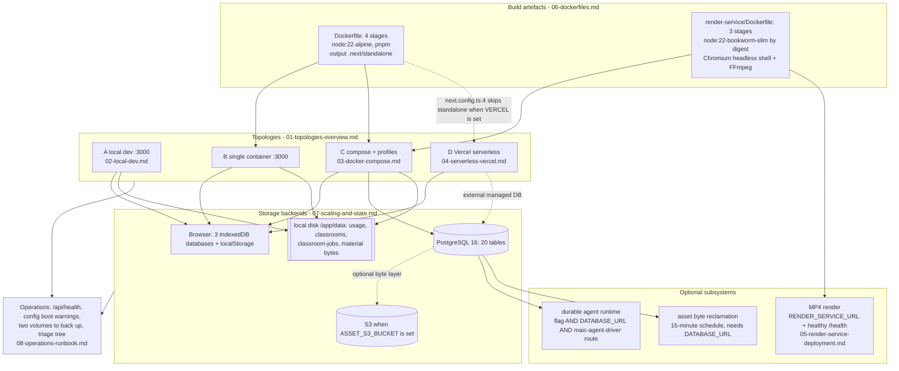

# Physical / Deployment View (4+1)

The 4+1 physical view answers "what processes run where, on which ports, over
which storage, and which features silently disappear when a piece is missing".
OpenMAIC has exactly **two build artefacts** (`Dockerfile` → the Next.js app,
`render-service/Dockerfile` → the MP4 renderer) and **four supported
topologies**, distinguished less by machine count than by which of three
optional subsystems — PostgreSQL persistence, the durable agent runtime, and
MP4 rendering — are present.

The load-bearing facts of this topic:

- [`next.config.ts:4`](next.config.ts#L4) sets `output: 'standalone'` **unless** `process.env.VERCEL`
  is set. One config, two fundamentally different runtime shapes.
- Three subsystems write to the **local filesystem under `process.cwd()`**
  (`data/classrooms`, `data/classroom-jobs`, `data/usage`, `data/` material
  bytes). None of them is object-storage backed.
- `instrumentation.ts` installs **four process-scoped background schedules**.
  A serverless function has no place to put them.
- The `NEXT_PUBLIC_*` flags are **compiled into the browser bundle**, so a
  chunk of the deployment topology is fixed at `docker build` time, not at
  `docker run` time.

## The whole physical view on one page

## Who this is for

A staff engineer who has to stand OpenMAIC up somewhere real: pick a topology,
size the boxes, decide what to back up, and answer "why is the Export Video
menu only offering a ZIP download?" without reading 69 route files.

## What this topic covers

- The four topologies actually supported by shipped configuration, compared on
  process count, external dependencies, and feature completeness.
- The local development topology: what runs, on which port, against which
  storage, and which subsystems are absent rather than stubbed.
- The `docker-compose.yml` self-host topology: three services, two networks,
  two named volumes, two profiles, and the first-boot sequence.
- The Vercel/serverless topology and the concrete features that cannot work
  there — with the file and line that makes each one impossible.
- `render-service` as an independent deployable: image contents, HTTP
  interface, admission control, resource profiles, and capability discovery.
- Both Dockerfiles stage by stage: what is baked in, what is mounted, and
  which build arguments exist (and which conspicuously do not).
- In-process state and what it costs at horizontal scale; the long-running and
  streaming endpoints, with their declared `maxDuration` budgets.
- An operations runbook: health checks, signals worth watching, the backup
  surface, upgrade and migration steps, and a triage decision tree.

## Sources

Primary code and configuration read for this topic: `Dockerfile`,
`docker-compose.yml`, `.dockerignore`, `render-service/Dockerfile`,
`render-service/.dockerignore`, `render-service/docker-entrypoint.sh`,
`render-service/package.json`, `render-service/src/config.ts`,
`render-service/src/main.ts`, `render-service/src/job-store.ts`,
`render-service/README.md`, `vercel.json`, `next.config.ts`,
`instrumentation.ts`, `middleware.ts`, `package.json`, `playwright.config.ts`,
`.env.example`, `README.md`, `lib/config/feature-flags.ts`,
`lib/server/render-service.ts`, `lib/server/classroom-storage.ts`,
`lib/server/materials/bytes.ts`, `lib/server/usage-storage.ts`,
`lib/server/agent-runtime/config.ts`,
`lib/server/agent-runtime/event-notify-bus.ts`,
`lib/persistence/server-provider.ts`,
`lib/persistence/asset-collector-schedule.ts`, `app/api/health/route.ts`,
`app/api/generate-classroom/route.ts`, `app/api/export-video/**/route.ts`,
`app/api/agent/sessions/[id]/events/route.ts`,
`app/api/classroom-media/[classroomId]/[...path]/route.ts`.

Evidence packs:
[`quality-testing-ci-deps`](docs/appendix/research/quality-testing-ci-deps/00-overview.md),
[`media-audio-video`](docs/appendix/research/media-audio-video/00-overview.md),
[`persistence-storage-state`](docs/appendix/research/persistence-storage-state/00-overview.md),
[`api-surface`](docs/appendix/research/api-surface/00-overview.md),
[`app-shell-and-routing`](docs/appendix/research/app-shell-and-routing/00-overview.md).

## Section files

| File | Contents |
| --- | --- |
| [`01-topologies-overview.md`](docs/17-deployment-view/01-topologies-overview.md) | The four supported topologies compared: processes, external services, feature completeness, and what each one gives up |
| [`02-local-dev.md`](docs/17-deployment-view/02-local-dev.md) | `pnpm dev` on port 3000: one process, browser-resident storage, and the subsystems that are absent rather than mocked |
| [`03-docker-compose.md`](docs/17-deployment-view/03-docker-compose.md) | The three compose services, two networks, two volumes, two profiles, build arguments, and the first-boot sequence |
| [`04-serverless-vercel.md`](docs/17-deployment-view/04-serverless-vercel.md) | `vercel.json`, the `output` switch, and the six capability classes that cannot survive serverless constraints |
| [`05-render-service-deployment.md`](docs/17-deployment-view/05-render-service-deployment.md) | The render service as its own deployable: image, six HTTP routes, admission control, resource profiles, capability discovery |
| [`06-dockerfiles.md`](docs/17-deployment-view/06-dockerfiles.md) | Both Dockerfiles stage by stage: layering, build arguments, what is baked in versus mounted, the `.dockerignore` interaction |
| [`07-scaling-and-state.md`](docs/17-deployment-view/07-scaling-and-state.md) | In-process state inventory, what each item costs at N>1 replicas, and the long-running/streaming endpoint table |
| [`08-operations-runbook.md`](docs/17-deployment-view/08-operations-runbook.md) | Health endpoints, signals worth watching, the backup surface, upgrade/migration steps, and a triage decision tree |

## Related topics

- [`../16-development-view/index.md`](docs/16-development-view/index.md) — how the
  artefacts this view deploys are built and gated.
- [`../02-container-view/index.md`](docs/02-container-view/index.md) — the logical
  containers; this view is where they land on hardware.
- [`../10-persistence-and-state/index.md`](docs/10-persistence-and-state/index.md)
  — the storage primitives whose backends this view selects.
- [`../09-media-and-export/index.md`](docs/09-media-and-export/index.md) — the
  video-export pipeline whose second half is a separate deployable.
- [`../15-cross-cutting/index.md`](docs/15-cross-cutting/index.md) — access
  control, SSRF egress policy, and logging as they cut across topologies.
- [`../12-api-reference/index.md`](docs/12-api-reference/index.md) — the endpoint
  inventory referenced by the streaming/long-running table.
- [`../README.md`](docs/README.md) — the documentation set root.
