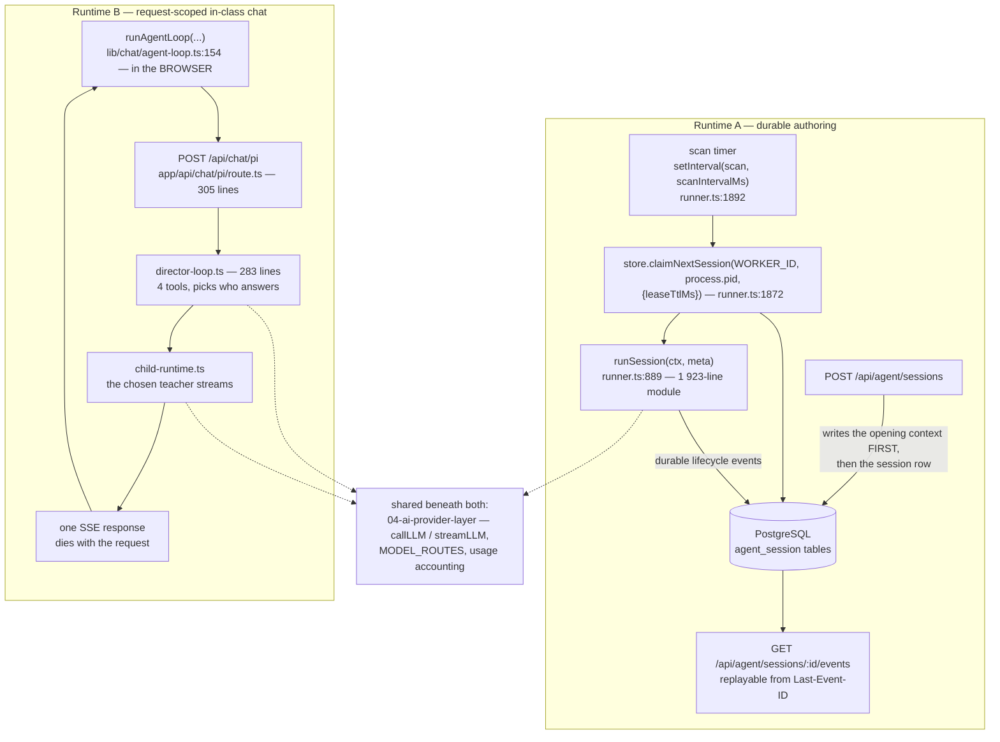
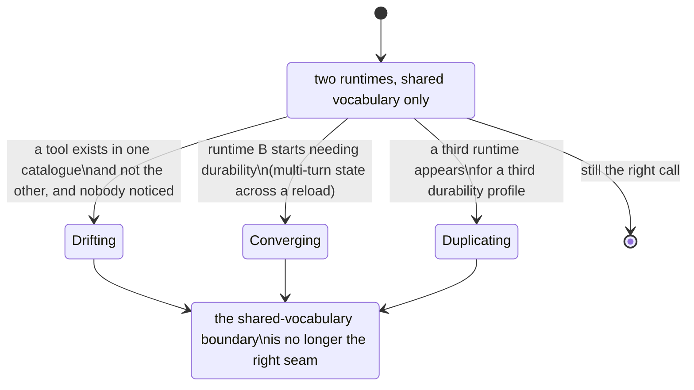

# 01 — Two agent runtimes, not one

**Status:** in force. Both runtimes ship and both are reachable in the same deployment.

## Context

OpenMAIC needs an LLM agent in two situations that look similar and are not:

1. **Authoring.** An operator asks for a course to be built or edited. The work takes
   minutes, spends money per step, calls tools that write to a durable document, and must
   survive the browser closing, the tab crashing, and the server process being replaced
   mid-run.
2. **In class.** A learner interrupts a playing lesson to ask a question. A director agent
   picks which synthetic teacher answers, that teacher streams a reply, and the whole
   exchange is over in seconds. If the tab closes, the correct behaviour is for the
   exchange to *stop existing*.

Those two have opposite requirements on almost every axis that matters: durability,
cancellation, cost per abandonment, and what "resume" means.

## Decision

Build two runtimes. Share the tool *vocabulary* and the provider layer beneath both; share
no loop, no persistence, and no cancellation primitive.

The two differ in every mechanism, not just in tuning:

| Axis | Runtime A (authoring) | Runtime B (in class) |
| --- | --- | --- |
| Where the loop runs | server, in a background scan started at boot | **the browser** — `runAgentLoop` (`lib/chat/agent-loop.ts:154`) drives the turn and calls the route per step |
| Work claiming | PostgreSQL lease. Scan every `scanIntervalMs` (default 1000), heartbeat every `heartbeatIntervalMs` (default 2000), lease TTL `leaseTtlMs` (default 10 000) — `lib/server/agent-runtime/config.ts:7,9,15`, all three env-overridable | none. A request either runs or does not |
| Crash survival | another process claims the session after lease expiry, then `planResume(transcript)` (`lib/server/agent-runtime/resume.ts:93`) and `repairOrphanedToolCalls` reconstruct a consistent transcript | none, by design. A dropped request is a dropped exchange |
| Stream | `GET …/:id/events`, replayable from a `Last-Event-ID` and deliberately **not** closed at `session_end` | one SSE response per turn, closed when the turn ends |
| Enablement | `isAgentRuntimeEnabled() && DATABASE_URL` (`lib/config/feature-flags.ts:18,24`); without the database its routes answer 404 and no runner starts | `isPiChatEnabled()` (`lib/config/feature-flags.ts:72`); the route 404s when off |
| Persistence | `@openmaic/storage/src/agent-session/pg.ts` — 1 710 lines of PostgreSQL | none of its own; whatever the teacher writes goes through the ordinary document path |

## Alternatives rejected

**One runtime with a `durable: boolean`.** The single loop would have to be correct under
both cancellation models simultaneously: a lease-expiry resume that reconstructs a
transcript, and an abort that must leave nothing behind. Every tool would need to know
which mode it was in before writing. The lease machinery — 1 710 lines in the PostgreSQL
session store alone — would become a required dependency of the in-class path, which means
**a deployment with no database could not answer a learner's question**. Today it can.

**One runtime, always durable.** Persist every in-class exchange, then garbage-collect. It
makes `DATABASE_URL` mandatory for the product's most common interaction, turns a
sub-second exchange into two round trips plus two writes, and creates a retention problem
for content whose correct lifetime is "the length of the conversation".

**One runtime, never durable — drive authoring from the browser too.** This is what
runtime B already is, and it is why runtime A exists: a ten-minute authoring run that dies
when a laptop lid closes, having already spent the money, is not a product.

**Inferred:** these three alternatives are reconstructed from the constraints, not from a
written record. What *is* written is the consequence the design protects — the opening
context is made durable **before** the runner is allowed to claim the session, so a claim
can never observe a session without its own prompt.

## Consequences

**Good.**

- The in-class path has no database dependency, so the whole product works from a
  checkout with no PostgreSQL — the default topology in
  [`../17-deployment-view/01-topologies-overview.md`](../17-deployment-view/01-topologies-overview.md).
- Each runtime's cancellation primitive is the simplest one that works for it: a lease TTL
  for A, request abort for B. Neither pays for the other's.
- Runtime A's crash recovery is testable in isolation — `planResume` is a pure function
  over a transcript (`lib/server/agent-runtime/resume.ts:93`).

**Bad.**

- **Two tool registries to keep in step.** The catalogues are documented separately
  ([`../05-agent-runtime/03-tool-catalogue.md`](../05-agent-runtime/03-tool-catalogue.md))
  and nothing machine-checks that a capability added to one is added to the other.
- **"Agent" now means two things** — see [`../glossary.md`](../glossary.md). The
  [`../05-agent-runtime/index.md`](../05-agent-runtime/index.md) topic opens with a
  two-runtimes table for exactly this reason.
- **`runSession` is 970 lines with roughly 22 mutable closure cells** and is the second
  most dangerous file in the repository to change
  ([`../14-code-quality/08-complexity-hotspots.md`](../14-code-quality/08-complexity-hotspots.md)
  §5). Durability is where that complexity comes from; runtime B has no equivalent.
- A reader debugging "the agent is stuck" must first establish *which* agent.

## How you would know this was the wrong call

The concrete trigger to watch for is **runtime B needing to survive a reload**. The moment
an in-class exchange must resume after the tab closes, it needs a lease, and the argument
for two runtimes collapses into an argument for one durable runtime with a cheap mode.

## Open questions

- Whether the two tool catalogues were ever intended to converge. Nothing in the tree
  states an intent either way.
- Whether `runSession` could be split by *lease scope* rather than by concern. The
  in-source rationale argues against splitting by concern and does not address the
  alternative ([`../14-code-quality/08-complexity-hotspots.md`](../14-code-quality/08-complexity-hotspots.md),
  open questions).

---

Next: [02-no-schema-layer-at-the-http-edge.md](./02-no-schema-layer-at-the-http-edge.md) ·
back to [index.md](./index.md) · set root [`../README.md`](../README.md)
