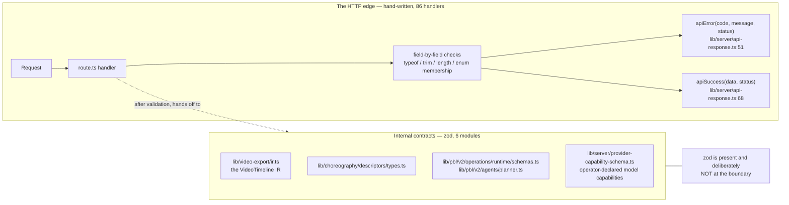
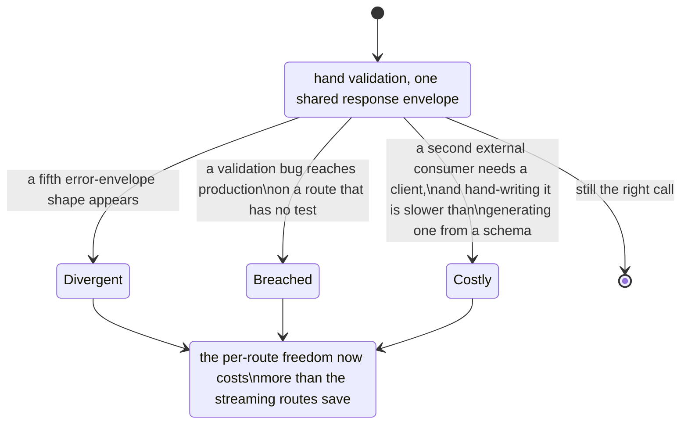

# 02 — No schema layer at the HTTP edge

**Status:** in force. 69 route files, 86 handlers, zero of them schema-validated.

## Context

The app exposes 69 `app/api/**/route.ts` files carrying 86 exported handlers
(`grep -rhoE "export (async function|const) (GET|POST|PUT|PATCH|DELETE|HEAD|OPTIONS)\b|export function (…)\b" app/api --include='route.ts' | wc -l` → 86; 43 POST, 30 GET, 4 DELETE,
3 PATCH, 1 PUT as `export async function`, plus five `export const` handlers in
`app/api/persistence/[...path]/route.ts:325-329` that all delegate to one
`handlePersistenceRequest`).

Every one of those handlers takes untrusted input: a browser body, a multipart upload, a
header, or — for the external-workbench routes — a request from an agent running on someone
else's machine. `zod` is already a dependency (`package.json:165`, `^4.3.5`) and is used
inside the app for internal contracts.

## Decision

Validate by hand, in each handler. No OpenAPI document, no generated client, no schema
library at the request boundary.

The measurement is unambiguous:

- `grep -rln "from 'zod'" app/api` → **0 files**.
- `grep -rln "from 'zod'" lib` → **6 files**, none of them a request boundary:
  `lib/choreography/descriptors/types.ts`, `lib/pbl/v2/agents/planner.ts`,
  `lib/pbl/v2/operations/runtime/schemas.ts`, `lib/server/provider-capability-schema.ts`,
  `lib/video-export/ir.ts`, `lib/video-export/runtime-diagnostics.ts`.
- The only `openapi` string in the manifest is the vendor SDK
  `@alicloud/openapi-client` (`package.json:44`) — a *client* for someone else's API, not a
  description of ours.

So the decision is not "we do not use schemas". It is precisely: **schemas guard internal
contracts and model output; the HTTP edge is guarded by hand-written code.**

What *is* shared is the **response** shape, not the request shape: `API_ERROR_CODES`,
`ApiErrorBody`, `apiError` and `apiSuccess` in a 70-line
`lib/server/api-response.ts:3,44,51,68`.

## Alternatives rejected

**Inferred throughout this section.** No comment, commit message or test records a decision
*not* to add a schema layer; an absence leaves no evidence. What follows is the case the
codebase's shape is consistent with, marked as inference.

**zod at every boundary, types inferred from the schema.** The standard answer, and it buys
runtime safety plus one source of truth. What it costs here is specific: many of these
routes do not accept a *document*, they accept a **stream**. `POST /api/export-video/render`
deliberately never parses its body — it caps the stream at 300 MiB and forwards it with
`duplex: 'half'`
([`../11-data-flows/08-export-video.md`](../11-data-flows/08-export-video.md)). A schema
that parses is exactly wrong for that route, and for `POST /api/materials`, which hashes
bytes as they arrive. A schema layer applied "everywhere" would have to carve those out,
and a validation rule with documented exceptions is weaker than it looks.

**An OpenAPI document, generated or hand-maintained.** Generated needs a framework the App
Router does not provide; hand-maintained is a second artefact that drifts. The set's own
[`../12-api-reference/index.md`](../12-api-reference/index.md) exists because *enumeration
is the contract* — and [`../README.md`](../README.md) §Keeping this current names this topic
as the fastest-rotting one for precisely that reason.

**A typed RPC layer (tRPC or similar).** Would work for the browser client and break the
external-workbench contract, which is the whole point of the plain-HTTP surface: a host
agent on someone else's machine probes `GET /api/health` for capabilities and then posts
JSON ([`../11-data-flows/09-external-workbench.md`](../11-data-flows/09-external-workbench.md)).
A transport-coupled RPC layer is not a public API.

## Consequences

**Good.**

- Streaming and byte-counting routes are correct by construction rather than by exemption.
- The public surface is plain HTTP + JSON, which is what makes the skill package and the
  external workbench possible at all.
- One error-envelope helper is 70 lines rather than a schema toolchain.

**Bad, and measured.**

| Consequence | Evidence |
| --- | --- |
| **Validation quality varies per handler** because nothing forces a shape. Four different error-envelope shapes coexist across `app/api` | [`../14-code-quality/07-error-handling.md`](../14-code-quality/07-error-handling.md) §Envelope inconsistency; deviations listed in [`../12-api-reference/09-conventions.md`](../12-api-reference/09-conventions.md) |
| **18 of the 69 routes are imported by no test file** — with no schema, the *only* place a route's input contract exists is the handler body, so an untested handler has an unspecified contract | `python3` scan in [`../14-code-quality/05-test-strategy.md`](../14-code-quality/05-test-strategy.md): `routes 69 referenced 51 unreferenced 18` |
| **Ten streaming routes commit HTTP 200 before doing any work**, so a validation failure discovered mid-stream cannot change the status | [`../14-code-quality/07-error-handling.md`](../14-code-quality/07-error-handling.md) §The 200-then-fail pattern |
| **The reference topic must be re-derived by hand** when a route is added; a new file silently makes it incomplete | [`../README.md`](../README.md) §Keeping this current, with the `git ls-files 'app/api/**/route.ts' \| wc -l` check |

## How you would know this was the wrong call

The cheap intermediate move, if that day comes, is **not** "zod everywhere": it is zod on
the JSON-body routes only, leaving the streaming routes explicitly hand-validated and
saying so in one place. That preserves the reason the decision was made while removing most
of what it costs.

## Open questions

- Whether a schema layer was ever considered. Nothing in the tree records a discussion, so
  the alternatives above are reconstruction rather than history.
- Whether the four error-envelope shapes are four decisions or one decision and three
  accidents. [`../12-api-reference/09-conventions.md`](../12-api-reference/09-conventions.md)
  names one as canonical, which suggests the latter.

---

Previous [01-two-agent-runtimes.md](./01-two-agent-runtimes.md) · next
[03-dsl-as-the-serialized-contract.md](./03-dsl-as-the-serialized-contract.md) · back to
[index.md](./index.md)
