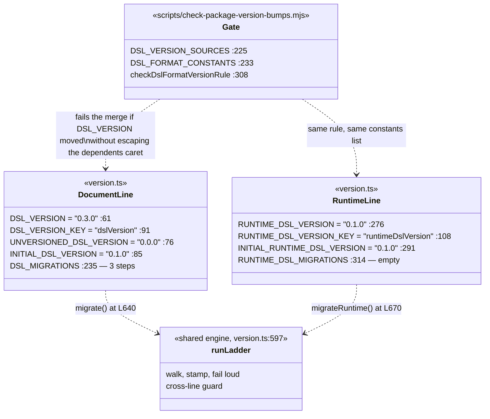
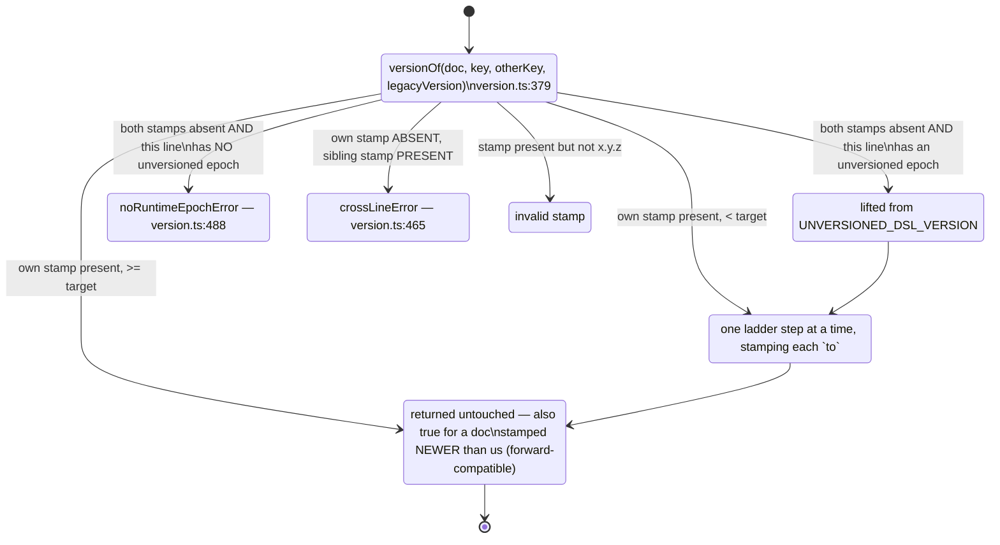

# 03 — The DSL package owns the serialized contract

**Status:** in force, and the only decision in this topic with a CI gate enforcing it.

This is the record with the best written provenance in the repository:
`packages/@openmaic/dsl/src/version.ts:1-51` is a 51-line module docstring that states the
rule, the reason it is phrased the way it is, and what breaks otherwise. Where this page
quotes, it quotes that file.

## Context

The unit of persistence is a course document, not a slide deck. That document is read and
written by, at minimum: the generation pipeline, the browser editor, the AI edit tools, the
`.pptx` exporter, the `.pptx` importer, the classroom playback engine, the video compiler,
the render container, and three storage backends. Some of those are *published npm
packages* that a third party can install at a version of their choosing.

A serialized shape with that many independent readers cannot be an implicit convention.

## Decision

One published package, `@openmaic/dsl`, owns the serialized shape. It carries **two
independent version lines**, and changing either one is gated in CI.

Three properties make this more than "we put the types in a package".

**1. The format version is decoupled from the npm version — in one direction only.**
"A package release can bump for code/API reasons (new exports, refactors) without touching
the serialized shape — in which case `DSL_VERSION` stays put; conversely the first breaking
change to the on-disk shape bumps `DSL_VERSION` and appends a migration, regardless of where
the package version happens to be" (`version.ts:4-10`).

**2. The release rule is phrased as "escapes the caret", not as a fixed semver level.**
`@openmaic/storage`, `@openmaic/renderer` and `@openmaic/importer` depend on the DSL as
`workspace:^`, published as a caret. Anything that caret admits reaches them with no release
of their own, so the required bump is exactly the one it does **not** admit — "while this
package is `0.x`, `^0.5.1` admits `0.5.x`, so a **MINOR**; once it reaches `1.0.0`, `^1.4.2`
admits minors as well, so a **MAJOR**" (`version.ts:35-36`). The rule is stated that way
"because the level changes at the 1.0 boundary — a rule that said MINOR would quietly stop
being sufficient exactly when this package matured" (`:38-40`).

**3. The gate is a CI script, not a convention.** `checkDslFormatVersionRule`
(`scripts/check-package-version-bumps.mjs:308`) reads both constants at the merge base and
at `HEAD`, and fails the merge if either moved without a sufficient package bump. It is
hardened against four ways of accidentally passing:

| Hazard | How the gate handles it |
| --- | --- |
| The constants file gets renamed mid-change | `DSL_VERSION_SOURCES` is a *list* (`:225`); the old path stays listed so the comparison still works across the move |
| Two files both declare the constants during a half-finished rename | ambiguity is a **failure**, not a first-match win (`:344-353`) — "taking the first match would compare the wrong file and pass" (`:318-322`) |
| The constants are commented out | the reader is anchored to the start of a line so `// export const DSL_VERSION = …` cannot be read as live (`:238-241`) |
| The rule cannot be evaluated at all | it fails rather than skipping: "This check must not pass by default" (`:361`) |
| An ordinary minor lands on `main` while the branch is open | the caret to escape comes from the **base tip**, not the merge base, because that is the reference already-published dependents carry (`:394-404`) |

## Why two version lines, mechanically separated

The document line and the runtime-session line stamp **different envelope fields**
(`dslVersion` vs `runtimeDslVersion`), and the reason is stated as a concrete failure:
"if runtime sessions rode `DSL_MIGRATIONS`, a future real Stage/Scene migration authored
against the document shape would run over a `RuntimeSession` and could corrupt or throw"
(`version.ts:250-254`).

Disjoint keys alone are "necessary but **not sufficient**" (`:99`). An object carrying only
the runtime stamp still *lacks* the document stamp, so the document runner would read it as
unversioned and walk its legacy ladder over it. The cross-line guard closes that:

The forward-compatible branch is deliberate: a document stamped *newer* than the reader
"is returned untouched rather than silently downgraded … The caller may not render it
correctly, but its on-disk shape survives for the next compatible reader"
(`version.ts:548-551`).

## Alternatives rejected

**Types in the app, no package.** The `.pptx` importer, the renderer and the storage layer
are published for third-party use; they cannot import from `@/`. Two of the three are
lint-walled against exactly that (`eslint.config.mjs:97-140`).

**One version line for both shapes.** Rejected in writing, with the corruption scenario
quoted above (`version.ts:250-254`).

**Version the npm package only, and treat the format as implicit.** This is the failure the
gate exists to prevent, also written down: "Shipping a format change inside the caret would
deliver it silently. The same published `storage` version, resolved against two different
admitted dsl versions, would write and then refuse to read the same rows — storage compares
these constants by value and rejects anything stamped newer than it knows"
(`version.ts:46-50`).

**Drop `audioUrl` in the migration that abolished it.** Rejected, and the reasoning is the
best example in the codebase of a migration author refusing to do the tidy thing: the URL
"may be the only live handle for the narration", whether it is live "is a reachability
question only the app-side reference converter can answer", and the ladder runs before that
converter ever sees the document — so "a ladder entry that dropped `audioUrl` in any case
would destroy a possibly live handle before the one component that can probe it gets the
chance" (`version.ts:165-174`). The 0.1.0 → 0.2.0 step is therefore a pure stamp that
changes no field, with the accepted cost written down: a strict external validator may
refuse such a document in the meantime.

## Consequences

**Good.** Three storage backends (`document/{browser,http,pg}.ts`) are interchangeable
because what they store is a versioned document. The render container can be a separate
process ([04](./04-render-service-as-a-separate-deployable.md)) because what crosses the
boundary is that document rather than live application state. Migrations are pure and
idempotent by contract (`version.ts:148-151`), so they are testable without a store.

**Bad.**

- **Every migration endpoint must be a pinned literal, never the moving constant**
  (`version.ts:79-84`, `:214-216`) — an easy rule to break and the ladder's correctness
  depends on it. A test checks the chain is contiguous and ends at `DSL_VERSION`
  (`:212-214`).
- **The gate is 27.2 KB of script** and its own hazards (ambiguous sources, base-tip vs
  merge-base) are subtle enough to need the long comments they have.
- **A hand-maintained mirror of the element schema exists anyway.**
  `lib/server/agent-runtime/course-edit/element-schema.ts` is 694 lines restating the
  element shape for the AI edit tools, with no drift check — the second-ranked hotspot and
  Tier-1 backlog item 2
  ([`../14-code-quality/08-complexity-hotspots.md`](../14-code-quality/08-complexity-hotspots.md) §2).
  The contract being owned by a package did not stop a second copy appearing.

## How you would know this was the wrong call

The signal is not the format changing — that is the mechanism working. It is
**`checkDslFormatVersionRule` being disabled, weakened, or routinely bypassed**, or a third
version line appearing. If a format change ever ships without escaping the caret and
nothing breaks, the gate was measuring the wrong thing.

## Open questions

- Whether `element-schema.ts` was meant to be generated from the DSL and never was.
  `gen-schema.mjs` already produces artefacts a drift test could compare against
  ([`../14-code-quality/08-complexity-hotspots.md`](../14-code-quality/08-complexity-hotspots.md) §2).
- `RUNTIME_DSL_MIGRATIONS` ships empty (`version.ts:314`). Whether the runtime shape has
  genuinely never changed, or changed before it was versioned, is not recorded.

---

Previous [02-no-schema-layer-at-the-http-edge.md](./02-no-schema-layer-at-the-http-edge.md)
· next [04-render-service-as-a-separate-deployable.md](./04-render-service-as-a-separate-deployable.md)
· back to [index.md](./index.md)
