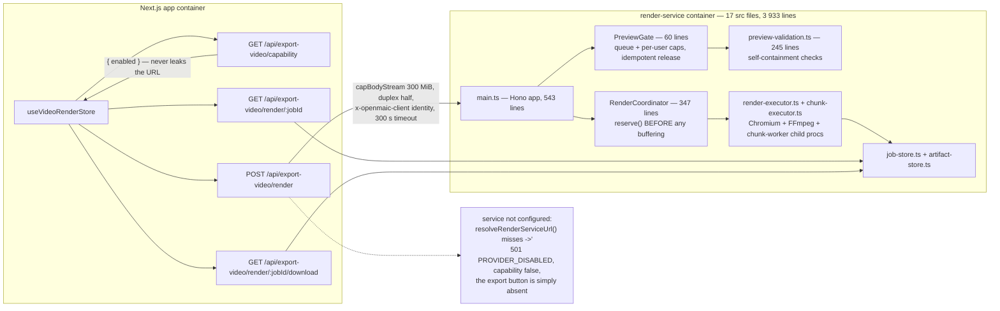
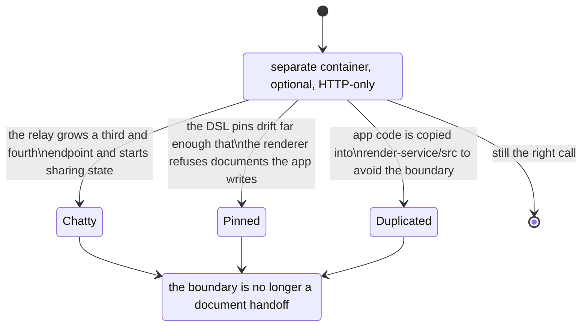

# 04 — The render service is a separate deployable

**Status:** in force. Optional at run time: the product ships and works without it.

## Context

MP4 export needs three things the Next.js app cannot host: a real Chromium to rasterise
slides, FFmpeg to mux, and enough memory and CPU headroom that one export does not evict the
request-serving process. It is also the only workload in the product measured in *minutes*
rather than seconds, and the only one that can be legitimately refused under load.

## Decision

Put it in its own container, outside the pnpm workspace, reachable only over HTTP, and make
the app degrade cleanly when it is absent.

The separation is total, and each part of it is checkable:

| Separation | Evidence |
| --- | --- |
| Not in the monorepo's workspace | `pnpm-workspace.yaml` lists `packages/*` and `packages/@openmaic/*` only. `grep -rn "render-service" pnpm-workspace.yaml package.json` → no hits |
| Its own package manager | `render-service/package-lock.json` — npm, not pnpm |
| Its own build and test config | `render-service/{tsconfig.json,vitest.config.ts,Dockerfile,docker-entrypoint.sh,.dockerignore,.gitignore}` |
| Consumes the **published** SDKs at exact versions | `@openmaic/dsl": "0.11.0"`, `"@openmaic/renderer": "0.1.4"` — no caret, no `workspace:` (`render-service/package.json:19-20`) |
| Its own server stack | Hono + `@hono/node-server`, not Next.js (`:17,24`) |
| Reached only over HTTP | `POST /render`, `POST /preview`, `GET /health` in `render-service/src/main.ts` |

The exact-version pins on lines 19–20 are the load-bearing detail. The render service does
**not** get the workspace copy of the DSL; it installs the published one at a pinned
version. That is what makes it a genuine third-party consumer of the contract in
[03](./03-dsl-as-the-serialized-contract.md), and why the caret-escape rule there matters
rather than being theoretical.

## Alternatives rejected

**Render in the Next.js process.** Chromium and FFmpeg in the request-serving process means
one export can starve every other request, and a serverless target
([`../17-deployment-view/04-serverless-vercel.md`](../17-deployment-view/04-serverless-vercel.md))
cannot host either binary at all. It would make the serverless topology impossible rather
than merely feature-reduced.

**Render in the browser.** The compiler *does* run in the browser — `buildExportZip`
compiles the timeline and packages the assets client-side
([`../11-data-flows/08-export-video.md`](../11-data-flows/08-export-video.md)). What the
browser cannot do is mux at acceptable quality and speed. The split that was chosen is
therefore *compile in the browser, render in the container*, and the artefact crossing the
boundary is a ZIP the browser built.

**A workspace package instead of a separate deployable.** It would share the lockfile and
the workspace copy of the DSL, which sounds convenient and destroys the property that makes
the boundary trustworthy: the service would no longer be an arm's-length consumer of the
published contract. It would also drag `puppeteer-core`, `tailwindcss`, `shiki` and a
pinned `esbuild` override (`render-service/package.json:41-43`) into the app's dependency
resolution for no benefit.

**Inferred:** the "workspace package" alternative is reconstruction. What *is* recorded is
the intent: the package description names it an "Isolated Node 22 + Chromium + FFmpeg
service" and cites issue #866 (`render-service/package.json:6`).

## Consequences

**Good.**

- The app has four topologies instead of one, because the heavy dependency is optional
  ([`../17-deployment-view/01-topologies-overview.md`](../17-deployment-view/01-topologies-overview.md)).
- The relay never parses the body. `capBodyStream(req.body, 300 MiB)` forwards a capped
  stream with `duplex: 'half'`, and a declared `content-length` over the cap is refused with
  a courtesy 413 before any bytes are read.
- Admission control lives where the resource is: `RenderCoordinator.reserve(identity)` runs
  *before* any buffering, and `PreviewGate.acquire` returns an idempotent release "so every
  route exit can safely call it once" (`render-service/src/preview-gate.ts:26-29`).
- The capability probe returns `{ enabled }` and deliberately never leaks the service URL to
  the browser.

**Bad.**

- **It is outside every lint config.** `eslint.config.mjs:56` ignores `render-service/**`
  on the stated reasoning that it is "linted/typechecked under `render-service/`" — but its
  four scripts are `dev`, `start`, `typecheck`, `test`, with no lint
  (`render-service/package.json:10-15`). 3 933 lines with no lint pass anywhere; Tier-1
  backlog item 3
  ([`../14-code-quality/12-remediation-backlog.md`](../14-code-quality/12-remediation-backlog.md)).
- **Two lockfiles, two dependency graphs.** A CVE in a shared transitive dependency has to
  be fixed twice, and `pnpm audit` at the root does not see this tree.
- **The DSL pins go stale silently.** `0.11.0` and `0.1.4` are exact. Nothing fails when the
  workspace moves ahead of them; the only symptom is a document the app can write and the
  renderer refuses to read — which is precisely the failure
  [03](./03-dsl-as-the-serialized-contract.md)'s value comparison is designed to make loud
  rather than silent.
- **Two error vocabularies.** The service throws `PreviewRejectedError` with three reasons
  (`preview_queue_full`, `preview_per_user_limit`, `capacity_busy`,
  `render-service/src/preview-gate.ts:1-4`); the relay maps upstream failures into the app's
  own envelope. The mapping is hand-written, per decision
  [02](./02-no-schema-layer-at-the-http-edge.md).

## How you would know this was the wrong call

The third branch is the one to watch, and it has already partly happened: the Hyperframes
emitter has one deliberate app-module dependency, `../../quiz/math-text`, explicitly
allowed by lint "so classroom and exported formulas cannot drift"
(`eslint.config.mjs:493-507`). One such exception is a considered tradeoff. Three would mean
the boundary is in the wrong place.

## Open questions

- Whether the exact DSL pins are refreshed by a process or by noticing. Nothing in
  `.github/workflows/` references `render-service/package.json`.
- Whether `render-service` being outside the pnpm workspace is about lockfile isolation, the
  Docker build context, or both. Only the isolation intent is written down.

---

Previous [03-dsl-as-the-serialized-contract.md](./03-dsl-as-the-serialized-contract.md) ·
next [05-client-first-persistence-with-a-postgres-cutover.md](./05-client-first-persistence-with-a-postgres-cutover.md)
· back to [index.md](./index.md)
