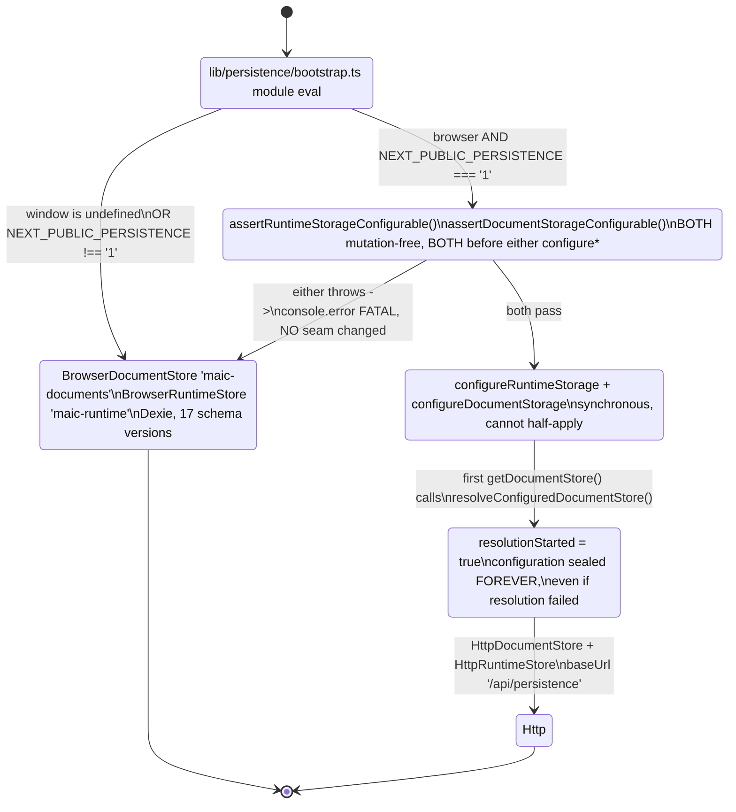
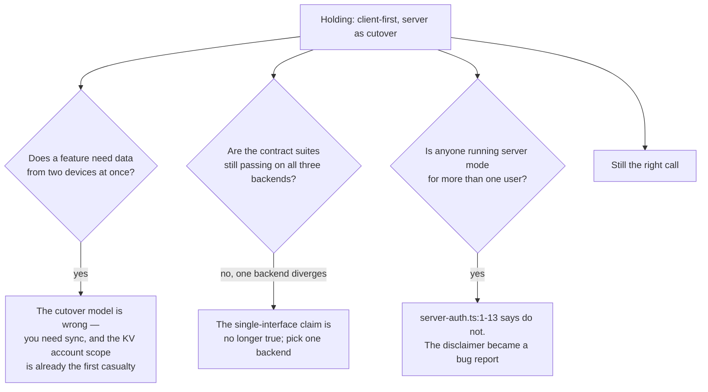

# 05 — Client-first persistence, with a PostgreSQL cutover

**Status:** in force. The browser is the default system of record; the server is opt-in.

## Context

OpenMAIC has to be usable by one person on one laptop with no infrastructure, *and* by an
operator running it for a class with real accounts. The first case is not a demo mode — it
is the default topology
([`../17-deployment-view/01-topologies-overview.md`](docs/17-deployment-view/01-topologies-overview.md)),
and it must be fully functional: generate a course, play it, edit it, export it.

That rules out the usual answer of "the server is the source of truth and the client caches
it", because with no server there is nothing to cache.

## Decision

The browser is the system of record by default. PostgreSQL is a **cutover** — a different
backend behind the same interface, selected once and then sealed — not a cache, not a sync
target, and not a superset.

Three properties define the shape.

**1. One interface, three backends, one contract suite per primitive.** `DocumentStore`
([`packages/@openmaic/storage/src/document/types.ts:180`](packages/@openmaic/storage/src/document/types.ts#L180)) has a browser IndexedDB backend
(477 lines), an HTTP backend (299) and a PostgreSQL backend (1 089). "Does the HTTP backend
behave like the browser one" is a *test* question, not a review question — 9 of the
47 files in the package's `test/` directory are shared backend-equivalence contract
suites, and
`scripts/assert-pg-contract-suites.mjs` (12.8 KB) exists to assert they are wired up.

**2. The cutover is a one-way, all-or-nothing latch.** Both preflight assertions are
mutation-free and both run *before* either `configure*` call, so a failure leaves **no seam
changed** and the app stays local rather than half-migrated
([`../10-persistence-and-state/01-storage-abstraction.md`](docs/10-persistence-and-state/01-storage-abstraction.md)
§Backend selection). Once `resolveConfiguredDocumentStore()` runs, `resolutionStarted = true`
seals configuration permanently — "even if resolution failed" ([`lib/document-store/config.ts:104-111`](lib/document-store/config.ts#L104-L111)).

**3. The Dexie schema is versioned like a database, because it is one.**
`MAICDatabase extends Dexie` ([`lib/utils/database.ts:305`](lib/utils/database.ts#L305)) declares **17 numbered schema
versions** (`:328` through `:562`) in a 1 043-line module. That ladder is the client-side
analogue of the DSL migration ladder in [03](docs/18-decisions/03-dsl-as-the-serialized-contract.md), and it
is why "the browser is the system of record" is a supportable claim rather than a hopeful
one.

## Alternatives rejected

**Server-first with an offline cache.** Requires a server. Kills the default topology.

**Sync, not cutover.** Two-way reconciliation between IndexedDB and PostgreSQL for course
documents, runtime sessions, assets and agent sessions means four conflict-resolution
policies, a merge UI for each, and a correctness argument nobody can hold in their head. The
codebase chose the boring answer: pick a backend at startup and never change your mind.

**One backend, PostgreSQL only, with a bundled database.** Turns "clone and run" into "clone,
install PostgreSQL, run migrations, then run".

**A pluggable storage-provider abstraction over both.** This one was actually tried and
**deliberately deleted**, and the deletion is pinned with its rationale —
`tests/runtime/storage-entrypoint-removal.test.ts`: "`getStorageProvider()` unconditionally
returned a `NoopStorageProvider` and swallowed every operation into silence, with no real
caller anywhere in the repo". The test asserts `lib/storage/index.ts`, `lib/storage/types.ts`
and `lib/storage/providers/noop.ts` stay deleted, and that importing the old entry point
**throws** so that "a caller that used to believe it had storage now gets a loud resolution
failure at import time — never a silent no-op provider". This is the only alternative in this
topic whose rejection is recorded as an executable assertion.

## Consequences

**Good.**

- The default deployment has no database, no migrations and no connection string, and is not
  feature-reduced.
- Every PostgreSQL backend takes an *injected* `Queryable` / `WithTransaction` and imports no
  driver; the only `pg` import in the subsystem is in the app
  ([`lib/persistence/server-provider.ts:8`](lib/persistence/server-provider.ts#L8)). The package therefore ships without a database
  dependency at all.
- The forbidden shortcut is named in the source: `(body) => body(sharedClient)` "is unsafe
  because concurrent calls can interleave in one transaction"
  ([`packages/@openmaic/storage/src/runtime/pg.ts:9-11`](packages/@openmaic/storage/src/runtime/pg.ts#L9-L11)).

**Bad, and each of these is a real cost the design pays.**

| Consequence | Evidence |
| --- | --- |
| **`account`-scoped KV is device-local in every shipped mode.** The scope exists to sync provider keys, model choices and the profile across devices. `src/kv/http.ts` is a complete client and `packages/@openmaic/storage/src/server/` has no `kv.ts`, so nothing serves it — `resolveKv` can only produce a `BrowserKVStore` | [`../10-persistence-and-state/01-storage-abstraction.md`](docs/10-persistence-and-state/01-storage-abstraction.md) §KV has no server side in this repo |
| **The anonymous→authenticated migration paths are declared and unreachable.** `RuntimeStore.mergeLearner` and `AgentSessionStore.mergeOwner` are the declared migration paths and are called from nowhere in `lib`, `app` or `components` | same file, Open questions |
| **Three unrelated identities get minted.** `anon:<uuid>` learner keys under KV `device` ([`lib/runtime/learner-key.ts:81`](lib/runtime/learner-key.ts#L81)), the `anonymous_id` cookie owner, and the access-code cookie — with no reconciliation | [`../10-persistence-and-state/06-access-codes.md`](docs/10-persistence-and-state/06-access-codes.md) |
| **`lib/utils/chat-storage.ts` is 1 455 lines** coordinating a global Web Lock, two nested per-partition locks, a promise queue and four `WeakMap`s — the complexity of being correct in a browser that can have two tabs open | [`../14-code-quality/08-complexity-hotspots.md`](docs/14-code-quality/08-complexity-hotspots.md) §Honourable mentions |
| **Server mode is explicitly not multi-tenant.** [`lib/persistence/server-auth.ts:1-13`](lib/persistence/server-auth.ts#L1-L13) is a 13-line disclaimer of what server mode does not provide | [`../10-persistence-and-state/06-access-codes.md`](docs/10-persistence-and-state/06-access-codes.md) |

## How you would know this was the wrong call

The first branch has *already* fired once, in the mildest possible way: `account`-scoped KV
is the feature that needs two devices, and it silently does not work. That is the signal to
watch — not a dramatic failure, but a capability quietly resolving to device-local.

## Open questions

- Whether the KV HTTP conformance server in `test/` (459 lines) is the intended reference
  implementation for hosts to copy, or whether a first-party handler is planned.
- Which auth system `mergeLearner` / `mergeOwner` were written against. Both are declared,
  tested in isolation, and called by nobody.

---

Previous [04-render-service-as-a-separate-deployable.md](docs/18-decisions/04-render-service-as-a-separate-deployable.md)
· next [06-one-llm-entry-point.md](docs/18-decisions/06-one-llm-entry-point.md) · back to
[index.md](docs/18-decisions/index.md)
