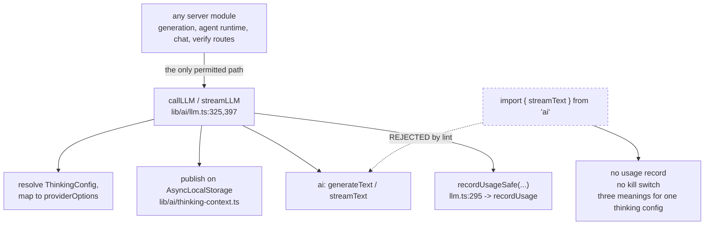

# 06 — One LLM entry point, enforced by lint

**Status:** in force, pinned by a test, and the only decision here made *after* the failure
it prevents.

This record is unusual: the reasoning survives in the lint config almost in full, including
two earlier revisions of the rule that review rejected. Where this page quotes, it quotes
`eslint.config.mjs`.

## Context

Three things must happen on every server-side model call, and none of them is visible at the
call site:

1. **Usage accounting.** `recordUsageSafe` fires after the call ([`lib/ai/llm.ts:295,361,415`](lib/ai/llm.ts#L295))
   and appends a JSONL line under `data/usage/`.
2. **The `LLM_THINKING_DISABLED` kill switch.** An operator must be able to turn reasoning
   off globally.
3. **Per-provider thinking resolution.** Nineteen providers wire reasoning control
   differently; native providers take `providerOptions`, OpenAI-compatible gateways strip
   unknown ones and need a `fetch` shim reading an `AsyncLocalStorage`
   ([`../04-ai-provider-layer/index.md`](docs/04-ai-provider-layer/index.md)).

The Vercel AI SDK's `generateText` and `streamText` do the model call and none of the three.
A direct call therefore opts out of all of them **invisibly** — the code looks correct.

## The failure that forced it

This is written down, in the config, with an issue number: "The PBL v2 runtime drifted
exactly this way (#1003): five direct calls meant zero usage records for the busiest traffic
in the product, plus three different meanings for one thinking config"
([`eslint.config.mjs:580-582`](eslint.config.mjs#L580-L582)).

Five call sites. The busiest path in the product. Zero usage records. Nothing failed, nothing
logged, and nothing would have caught it.

## Decision

Route every server model call through `callLLM` / `streamLLM` in `lib/ai/llm.ts`, and make
the boundary a lint error rather than a convention.

**Every reachable import form is covered, and the config says each was fed to ESLint rather
than assumed** ([`eslint.config.mjs:589-599`](eslint.config.mjs#L589-L599)):

| Form | Covered by |
| --- | --- |
| `import { streamText } from 'ai'` | `@typescript-eslint/no-restricted-imports` with `importNames` (`:620-632`) |
| `import * as ai from 'ai'` | the same rule — "ESLint reports a namespace import when `importNames` is set, since the namespace would carry the restricted name" (`:592-594`) |
| `require('ai')` | the inherited repo-wide `@typescript-eslint/no-require-imports` |
| `await import('ai')` | `no-restricted-syntax` on `ImportExpression > Literal[value='ai']` **and** its template-literal form (`:13-24`) |

Scope is **every linted source extension**, not just `.ts`/`.tsx` — because an earlier
revision guarded only those two, "which left `app/api/route.js` and `scripts/*.mjs` free to
import the SDK; review caught it" (`:603-607`). `tests/lint-llm-entry-guard.test.ts` (121
lines) now pins the whole form × extension matrix so the scope "cannot quietly narrow again".

Exemptions are three, and each is justified in place (`:610-618`): the entry point itself,
`eval/**` and `tests/**` — "not server request paths, nothing to account for, and the
integration test must be able to call the raw SDK to assert what the wrapper is built on".

## The mechanical trap this decision had to survive

Flat ESLint config **replaces** a rule's options in a later matching block rather than
merging them. That makes a single repo-wide ban actively dangerous here: it would silently
drop the module boundaries of every block that also sets the same key
([01](docs/18-decisions/01-two-agent-runtimes.md) and the walls in
[`../14-code-quality/09-architectural-consistency.md`](docs/14-code-quality/09-architectural-consistency.md)).

Three consequences, all deliberate:

1. The static ban uses the `@typescript-eslint/` variant, not the base rule, because "the
   base `no-restricted-imports` is already configured for `lib/choreography` and
   `lib/video-export`, and flat config REPLACES a rule's options per key … so reusing that
   key here would silently drop those module-boundary bans. Different key, no interference"
   (`:584-588`).
2. The dynamic ban is a shared constant, `AI_SDK_DYNAMIC_IMPORT_BAN` (`:13`), *spread into*
   each package/module block rather than declared once globally.
3. The blocks that are ignored by the global dynamic ban are each covered another way, and
   the config explains why the previous reasoning was insufficient: an earlier revision left
   the three walled packages out on the grounds that they are built in isolation against
   `@openmaic/dsl`, "review showed `void import('ai')` under the renderer source path passing
   lint, which is exactly why that reasoning was not good enough" (`:640-647`).

`tests/lint-llm-entry-guard.test.ts` has a case asserting exactly this: that the shared rule
key "still enforces the pre-existing module boundaries it shares a rule key with" (`:100`).

## Alternatives rejected

**A code review convention.** Already tried, implicitly. #1003 is what it produced.

**A type-level barrier — re-export a narrowed SDK and ban nothing.** Does not stop
`import from 'ai'`, and a bypass would be invisible again. The whole value of the decision is
that the bypass has to be written down where a reviewer sees it: "An `eslint-disable` comment
defeats any of them, which is the point" (`:600-601`).

**Wrap only the streaming path.** `generateText` bypasses accounting exactly as `streamText`
does; both are named (`:626`).

**Accounting in a middleware instead of a wrapper.** The AI SDK does support middleware, and
the codebase uses it for reasoning extraction (`wrapLanguageModel` +
`extractReasoningMiddleware`, [`lib/ai/providers.ts:34`](lib/ai/providers.ts#L34)). It is not sufficient here because
the kill switch and the thinking resolution have to run *before* the model object is built,
which is where `getModel()` sits — a middleware sees a call that has already been shaped.
**Inferred:** this ordering argument is reconstruction; the config does not state it.

## Consequences

**Good.** One place to add a metric, a cap, a retry policy or a cost ceiling. Usage
accounting is complete for text generation by construction. The rule's coverage is a test,
not a claim.

**Bad.**

- **The wall names two exports, so it is a denylist of two.** `experimental_transcribe` is
  imported directly ([`lib/audio/asr-providers.ts:149`](lib/audio/asr-providers.ts#L149), called at [`:406`](lib/audio/asr-providers.ts#L406)), which is how
  `UsageKind`'s `'asr'` member ([`lib/server/usage-storage.ts:21`](lib/server/usage-storage.ts#L21)) ends up written by nobody
  — `grep -rn "kind: 'asr'"` returns nothing. Tier-2 backlog item 6
  ([`../14-code-quality/12-remediation-backlog.md`](docs/14-code-quality/12-remediation-backlog.md)).
  A positive allowlist, as used for `@openmaic/generation`'s imports ([`eslint.config.mjs:162-179`](eslint.config.mjs#L162-L179)),
  would not have this hole.
- **`render-service/**` is globally eslint-ignored** (`:56`), so the wall does not apply
  there at all. It has no `ai` import today; nothing would reject one.
- **Non-text modalities route around it entirely.** Image, video and TTS call
  `recordGenerationUsage` by hand at five sites
  (`app/api/generate/{image,tts,video}/route.ts:113,146,111` and
  `lib/server/agent-runtime/generate-{image,video}.ts:325,409`). Nothing enforces that a
  sixth generation path remembers to.

## How you would know this was the wrong call

You would not — this is the decision in the topic with the clearest evidence *for* it,
because the counterfactual already happened. The signal to watch is the opposite one:
**`eslint-disable` comments accumulating on the rule.** One, with a reason, is the escape
hatch working as designed. Three would mean the wrapper is missing a capability its callers
need, and the fix is to widen `callLLM`, not to widen the exemptions.

## Open questions

- Whether the two named exports were meant to be a complete list or a starting point. The
  `'asr'` hole suggests the latter, and nothing records an intent.
- Whether the five hand-written `recordGenerationUsage` call sites were considered for the
  same treatment. No rule mentions them.

---

Previous [05-client-first-persistence-with-a-postgres-cutover.md](docs/18-decisions/05-client-first-persistence-with-a-postgres-cutover.md)
· back to [index.md](docs/18-decisions/index.md) · set root [`../README.md`](docs/README.md)
