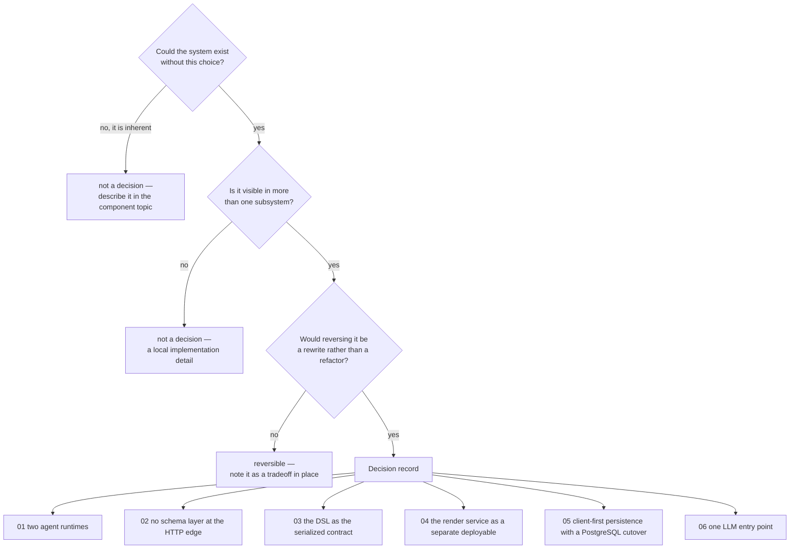
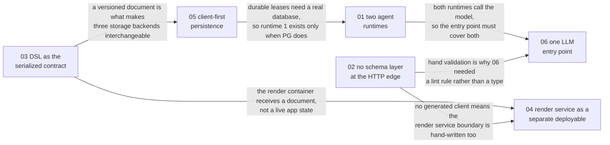

# Architecture Decisions

The rest of this set describes *what* OpenMAIC is and *how* it behaves. This topic is the
only one that answers *why this shape and not another* — one page per choice that is
expensive or impossible to reverse, each stating the context, the decision, the
alternatives that were rejected, and the consequences the codebase now lives with.

## What qualifies as a decision here

Six records, chosen by a single test: **could a competent team have built this system
without making this choice, and would reversing it now require touching more than one
subsystem?** Everything that fails that test — a library pick, a directory name, a naming
convention — is documented where it is used, not here.

## Provenance, and its limits

**These records were reconstructed from the code and its comments, not from a decision
log.** No ADR directory, RFC folder or design-doc tree exists in the repository
(`grep -ril "architecture decision" .` returns nothing outside this topic). Where a
decision left its reasoning behind — in a module docstring, a lint-config comment, a test
that pins a removal — the record quotes it and cites the line. Where it did not, the
record says **`Inferred:`** and explains what the inference rests on.

Four of the six left unusually good written provenance, which is why they are recordable
at all:

| Decision | Where its reasoning survives in the code |
| --- | --- |
| 03 — the DSL as the serialized contract | `packages/@openmaic/dsl/src/version.ts:1-51` — a 51-line module docstring that states the release rule, why it is phrased as "escapes the caret" rather than "MINOR", and what would break otherwise |
| 06 — one LLM entry point | `eslint.config.mjs:5-24,575-607,635-647` — including the issue that forced it (#1003) and two earlier revisions of the rule that review rejected |
| 05 — client-first persistence | `tests/runtime/storage-entrypoint-removal.test.ts` — a deletion pinned *with its rationale*, plus the Dexie version ladder to 17 in `lib/utils/database.ts:328-562` |
| 01 — two agent runtimes | `lib/server/agent-runtime/config.ts:7-15` and the `runSession` in-source rationale (`lib/server/agent-runtime/runner.ts:889`) |

Two did not, and their records are correspondingly more inferential: 02 (the absence of a
schema layer is an absence — nothing documents a decision not to add one) and 04.

## The records

| Record | The choice | Reversal cost today |
| --- | --- | --- |
| [01-two-agent-runtimes.md](./01-two-agent-runtimes.md) | Two independent agent runtimes — a durable PostgreSQL-leased authoring runtime and a request-scoped in-class chat runtime — rather than one runtime with two modes | High. They share a tool *vocabulary* but no loop, no persistence and no cancellation primitive |
| [02-no-schema-layer-at-the-http-edge.md](./02-no-schema-layer-at-the-http-edge.md) | 69 route handlers validate their own input by hand; no OpenAPI document, no generated client, and no zod at the HTTP boundary despite zod being a dependency | Medium per route, high in aggregate: the enumeration in [12-api-reference](../12-api-reference/index.md) *is* the contract |
| [03-dsl-as-the-serialized-contract.md](./03-dsl-as-the-serialized-contract.md) | One published package owns the serialized document shape, with two independent version lines and a CI gate that fails a merge whose format change would reach dependents silently | Very high. Every persisted document, every export and both runtime units read it |
| [04-render-service-as-a-separate-deployable.md](./04-render-service-as-a-separate-deployable.md) | Video rendering runs in its own container, outside the pnpm workspace, with its own lockfile — reachable only over HTTP | Medium. The app degrades to "no MP4 export" without it, by design |
| [05-client-first-persistence-with-a-postgres-cutover.md](./05-client-first-persistence-with-a-postgres-cutover.md) | The browser is the default system of record (Dexie, 17 schema versions); PostgreSQL is a *cutover*, not a cache | High. The same storage interface has three backends and the app must be correct on all of them |
| [06-one-llm-entry-point.md](./06-one-llm-entry-point.md) | Every server model call goes through `callLLM` / `streamLLM`, enforced by lint across every source extension | Low to reverse, high to have skipped — it was skipped once and cost the product its usage accounting |

## How the six interact

The records are independent choices, but three pairs constrain each other, and reading one
without its partner gives a misleading picture.

The strongest of those edges is **03 → 04**. The render service is a viable separate
process only because the thing crossing the boundary is a *serialized, versioned document*
rather than live application state. Reverse decision 03 and decision 04 becomes
impractical; that is why 03 carries the highest reversal cost in the table.

## How to write the seventh

If you make a choice that passes the test at the top of this page, add a record. The shape
is fixed, and every section is there because leaving it out is how ADRs become useless:

| Section | Why it is mandatory |
| --- | --- |
| **Context** | The constraints, not the solution. A reader who disagrees with the decision must be able to check whether they disagree with the constraints instead |
| **Decision** | What was chosen, with the code that implements it cited by `path:line` |
| **Alternatives rejected** | The section that makes the record worth keeping. Each alternative gets the reason it lost, and `Inferred:` if that reason is reconstruction rather than history |
| **Consequences** | Split good and bad, and cite the bad ones into [`../14-code-quality/`](../14-code-quality/index.md) so they stay measured rather than remembered |
| **How you would know this was the wrong call** | A falsifiable signal. A decision with no failure signal is a preference |
| **Open questions** | What the tree does not say. Never a guess |

Do not edit a record to reflect a new decision. Add a new one and mark the old one
superseded — the value of the file is the reasoning at the time, not its conclusion.

## What is deliberately *not* recorded here

- **Framework and library choices.** Next.js 16 with the App Router, Zustand, Dexie,
  Hono in the render service, the Vercel AI SDK. Each is replaceable inside one subsystem
  and is discussed where it is used ([13-dependencies](../13-dependencies/index.md)).
- **The two vendored forks.** `packages/pptxgenjs` and `packages/mathml2omml` exist for
  specific missing APIs, documented with the API each adds in
  [`../07-dsl-renderer-editor/09-vendored-forks.md`](../07-dsl-renderer-editor/09-vendored-forks.md).
- **Documentation-set decisions.** That C4 Level 4 is not written as prose, that files are
  capped at 350 lines, that every claim carries a `path:line` — those are
  [`../README.md`](../README.md) §Conventions, not architecture.
- **Anything the tree does not support.** A decision record that cannot cite the code is a
  guess, and this topic has no rows of that kind. Where the *reasoning* is unrecoverable
  the record says so under its own "Open questions".

## Related topics

- [`../02-container-view/index.md`](../02-container-view/index.md) — the structure these decisions produced
- [`../14-code-quality/12-remediation-backlog.md`](../14-code-quality/12-remediation-backlog.md) — the measured consequences, ranked
- [`../glossary.md`](../glossary.md) — the vocabulary these records use
- [`../README.md`](../README.md) — the documentation set root
