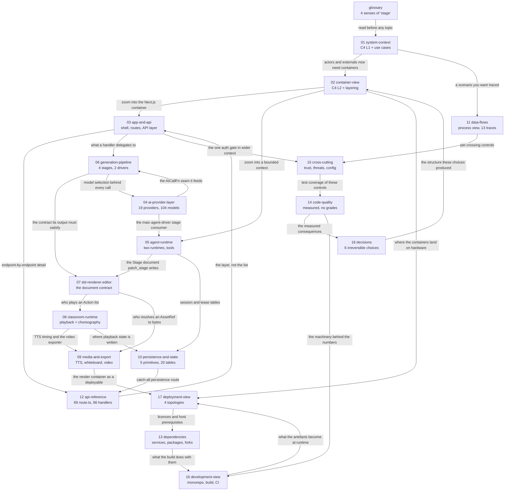
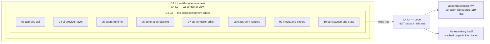
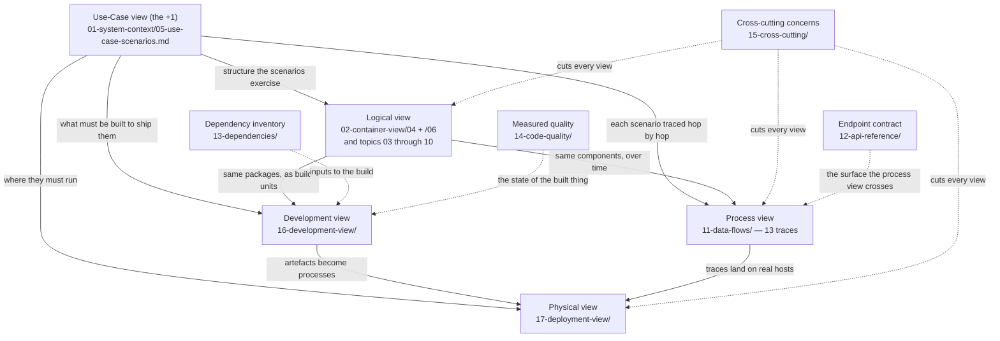
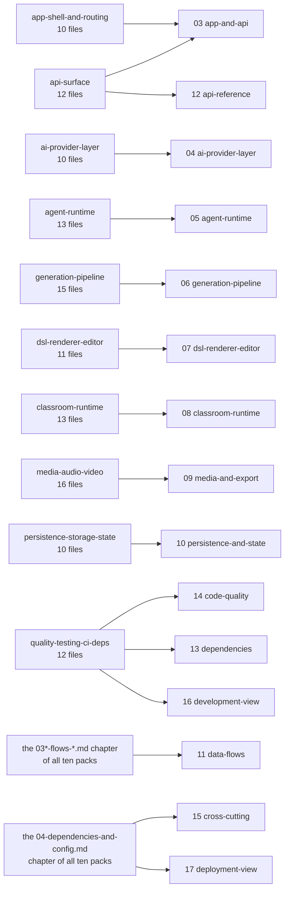

# OpenMAIC architecture documentation

OpenMAIC turns a topic string or an uploaded document into a *playable* classroom.
The unit of persistence is not a slide deck but a course document with an embedded
playback script: `packages/@openmaic/dsl/src/stage.ts` defines a `Stage` holding
ordered `Scene`s, each carrying a `type` discriminant (`'slide' | 'quiz' |
'interactive' | 'pbl'`, `packages/@openmaic/dsl/src/stage.ts:22`) plus a list of
`Action`s — a 21-variant union of playback verbs
(`packages/@openmaic/dsl/src/action.ts:235-256`). Four moves operate on that
document: **ingest** bytes into a prompt-ready bundle, **generate** the document
from it, **play** it as a live lesson with synthetic teachers that speak, draw and
discuss, and **export** it to `.pptx`, a ZIP or an MP4. It ships as one Next.js 16
app, one optional out-of-process render container, six published npm SDKs and two
vendored forks.

This set is the architecture reference for that system: 18 topics as directories,
each an `index.md` plus small section files, organised as C4 levels 1–3 followed
by the 4+1 views and then the decision records, every non-obvious claim carrying a
`path:line` citation.

Surveyed at commit `c2c9553a` on `main`. 316 Markdown files
(`find docs -name '*.md' | wc -l`): 191 across the 18 topics, 123 evidence-pack files under
`appendix/`, and two at the root — this page and [`glossary.md`](./glossary.md). 837 Mermaid
diagrams, all of which parse; the gate is `scripts/check-docs-links.mjs`, and
`node scripts/check-docs-links.mjs --mermaid` sends every block through the real parser
([`16-development-view/07-quality-gates.md`](./16-development-view/07-quality-gates.md) §Gate 6).

**Read [`glossary.md`](./glossary.md) first if you are new.** One word, `stage`, has four
unrelated meanings here, and three of them appear in the paragraph above.

## How the topics relate

The spine is 01 → 02, then any component topic, then 11 to see them cooperate.
Edge labels are the reason to make the hop, not decoration.

## Start here

Ordered paths, not menus. Each stops when you can do the job.

| Role | Read in this order |
| --- | --- |
| **Anyone, before anything** | [`glossary.md`](./glossary.md) — 5 minutes, and it is the difference between reading this set and mis-reading it |
| **Architect, or a new tech lead** | [`18-decisions/index.md`](./18-decisions/index.md) → the two records that constrain everything else, [`18-decisions/03-dsl-as-the-serialized-contract.md`](./18-decisions/03-dsl-as-the-serialized-contract.md) and [`18-decisions/05-client-first-persistence-with-a-postgres-cutover.md`](./18-decisions/05-client-first-persistence-with-a-postgres-cutover.md) → [`02-container-view/index.md`](./02-container-view/index.md) → [`14-code-quality/12-remediation-backlog.md`](./14-code-quality/12-remediation-backlog.md) |
| **New engineer, week one** | [`01-system-context/index.md`](./01-system-context/index.md) → [`01-system-context/01-what-openmaic-is.md`](./01-system-context/01-what-openmaic-is.md) → [`02-container-view/index.md`](./02-container-view/index.md) → [`11-data-flows/00-index-of-flows.md`](./11-data-flows/00-index-of-flows.md) → [`11-data-flows/02-topic-to-classroom.md`](./11-data-flows/02-topic-to-classroom.md) → [`03-app-and-api/index.md`](./03-app-and-api/index.md) → [`16-development-view/05-local-development.md`](./16-development-view/05-local-development.md) → the component topic for your area (03–10) → [`14-code-quality/08-complexity-hotspots.md`](./14-code-quality/08-complexity-hotspots.md) |
| **API / skill integrator** | [`12-api-reference/index.md`](./12-api-reference/index.md) → [`12-api-reference/09-conventions.md`](./12-api-reference/09-conventions.md) (error envelopes, identity, SSE frames) → [`12-api-reference/00-all-routes.md`](./12-api-reference/00-all-routes.md) → [`05-agent-runtime/07-skill-package.md`](./05-agent-runtime/07-skill-package.md) → [`11-data-flows/09-external-workbench.md`](./11-data-flows/09-external-workbench.md) → [`15-cross-cutting/05-auth-and-access-control.md`](./15-cross-cutting/05-auth-and-access-control.md) |
| **Self-hoster / operator** | [`17-deployment-view/01-topologies-overview.md`](./17-deployment-view/01-topologies-overview.md) → [`17-deployment-view/03-docker-compose.md`](./17-deployment-view/03-docker-compose.md) → [`15-cross-cutting/06-configuration.md`](./15-cross-cutting/06-configuration.md) → [`04-ai-provider-layer/08-env-vars.md`](./04-ai-provider-layer/08-env-vars.md) → [`13-dependencies/06-runtime-prerequisites.md`](./13-dependencies/06-runtime-prerequisites.md) → [`15-cross-cutting/05-auth-and-access-control.md`](./15-cross-cutting/05-auth-and-access-control.md) (read before exposing a deployment) → [`17-deployment-view/08-operations-runbook.md`](./17-deployment-view/08-operations-runbook.md) |
| **Quality or security auditor** | [`14-code-quality/01-method.md`](./14-code-quality/01-method.md) (what the measurements can and cannot support) → [`15-cross-cutting/01-trust-boundaries.md`](./15-cross-cutting/01-trust-boundaries.md) → [`11-data-flows/12-trust-boundaries-in-flight.md`](./11-data-flows/12-trust-boundaries-in-flight.md) → [`15-cross-cutting/02-threat-ssrf.md`](./15-cross-cutting/02-threat-ssrf.md) → [`15-cross-cutting/03-threat-injection.md`](./15-cross-cutting/03-threat-injection.md) → [`15-cross-cutting/04-threat-secrets-and-uploads.md`](./15-cross-cutting/04-threat-secrets-and-uploads.md) → [`13-dependencies/07-licences.md`](./13-dependencies/07-licences.md) → [`13-dependencies/08-supply-chain.md`](./13-dependencies/08-supply-chain.md) → [`14-code-quality/08-complexity-hotspots.md`](./14-code-quality/08-complexity-hotspots.md) |
| **Extending the slide DSL or renderer** | [`07-dsl-renderer-editor/01-dsl-schema.md`](./07-dsl-renderer-editor/01-dsl-schema.md) → [`07-dsl-renderer-editor/02-dsl-invariants.md`](./07-dsl-renderer-editor/02-dsl-invariants.md) → [`07-dsl-renderer-editor/03-renderer.md`](./07-dsl-renderer-editor/03-renderer.md) → [`07-dsl-renderer-editor/10-public-package-api.md`](./07-dsl-renderer-editor/10-public-package-api.md) → [`16-development-view/07b-version-and-release-gates.md`](./16-development-view/07b-version-and-release-gates.md) (the version-bump gate that protects the serialized format) → [`06-generation-pipeline/05-scene-generation.md`](./06-generation-pipeline/05-scene-generation.md) (who produces it) → [`09-media-and-export/06-video-export-pipeline.md`](./09-media-and-export/06-video-export-pipeline.md) (the second consumer) |
| **Adding an agent tool or changing the loop** | [`05-agent-runtime/index.md`](./05-agent-runtime/index.md) (the two-runtimes table first) → [`05-agent-runtime/01-agent-loop.md`](./05-agent-runtime/01-agent-loop.md) → [`05-agent-runtime/01b-loop-dispatch-and-settle.md`](./05-agent-runtime/01b-loop-dispatch-and-settle.md) → [`05-agent-runtime/03-tool-catalogue.md`](./05-agent-runtime/03-tool-catalogue.md) → [`04-ai-provider-layer/03-stage-routing.md`](./04-ai-provider-layer/03-stage-routing.md) → [`10-persistence-and-state/02b-agent-run-tables.md`](./10-persistence-and-state/02b-agent-run-tables.md) |

## Topic index

File counts are total `.md` files in the directory, `index.md` included, from
`find docs/<topic> -maxdepth 1 -name '*.md' | wc -l`.

| Topic | What it answers | When you need it | Files |
| --- | --- | --- | --- |
| [01-system-context](./01-system-context/index.md) | What the system is, the five actors, every external system it can talk to, eleven use-case scenarios, and the quality attributes the code optimises for | First. Nothing else parses without it | 7 |
| [02-container-view](./02-container-view/index.md) | Which processes and stores exist at run time, and how the source tree layers onto them — including which source roots compile into *two* runtime units | Before you touch any file whose runtime you are unsure of | 7 |
| [03-app-and-api](./03-app-and-api/index.md) | Where a request goes: route tree, provider stack, RSC boundary, the one middleware gate, process-boot hook, and the API layer's conventions and deviations | Debugging a 401/404, adding a handler, or a background job that never starts | 8 |
| [04-ai-provider-layer](./04-ai-provider-layer/index.md) | The single seam to every text LLM: registry, capabilities, five transports, credential arbitration, per-stage routing, boot validation, usage accounting | "Why did this call go to that vendor / not send `reasoning_effort` / ignore my key?" | 10 |
| [05-agent-runtime](./05-agent-runtime/index.md) | Two independent agent runtimes (durable PostgreSQL-leased authoring vs request-scoped in-class chat), the shared harness, the tool catalogue, the external driver skill | Adding a tool, debugging a stuck session, reasoning about crash survival | 10 |
| [06-generation-pipeline](./06-generation-pipeline/index.md) | Requirement + materials → persisted course document: ingestion, outline, stage planning, scene generation, prompts, concurrency, progress, quiz grading | Adding a scene type, swapping an extractor, retuning a prompt | 14 |
| [07-dsl-renderer-editor](./07-dsl-renderer-editor/index.md) | The slide document end to end: the contract, the renderer, both mutation paths (human and AI), and both PowerPoint bridges | Changing the serialized format, or a `.pptx` fidelity bug | 11 |
| [08-classroom-runtime](./08-classroom-runtime/index.md) | Playback state machine, the pure choreography spec shared with the video exporter, the pacing buffer, roundtable cast, PBL v2, the interactive sandbox | Changing playback without breaking video export | 11 |
| [09-media-and-export](./09-media-and-export/index.md) | Everything done with media bytes: TTS/ASR, the duration contract, whiteboard, images/video, web search, the nine-pass video compiler, the render container | Touching synthesis, timing, or the MP4 path | 12 |
| [10-persistence-and-state](./10-persistence-and-state/index.md) | Five storage primitives and their backends, real column names, the three big client stores, settings pull, chat cutover, access codes, i18n, retention | "Where does this physically live in mode X?" | 10 |
| [11-data-flows](./11-data-flows/index.md) | Thirteen traced flows, hop by hop with `file:line` per step, plus concurrency/backpressure and every in-flight trust crossing | Behaviour questions structure cannot answer | 14 |
| [12-api-reference](./12-api-reference/index.md) | All 69 `app/api/**/route.ts` files and all 86 handlers: methods, runtime, gating, shapes, side effects, limits — the routes *are* the spec | Calling, changing, or auditing an endpoint | 12 |
| [13-dependencies](./13-dependencies/index.md) | External services, 132 runtime + 32 dev npm packages, two vendored forks, six published packages, host prerequisites, licences, supply chain | Provider outage, `pnpm install` surprise, redistribution question | 9 |
| [14-code-quality](./14-code-quality/index.md) | Measured size, typing, lint walls, test strategy, eval harnesses, error handling; then the eleven complexity hotspots, the eight lint-enforced boundary rows and their six surviving violations, the duplication and dead-code passes, the strengths worth preserving, and a 22-item ranked backlog — every number with its command, no grades | First week; and before estimating a refactor | 13 |
| [15-cross-cutting](./15-cross-cutting/index.md) | Trust boundaries, named threats and the controls that exist (and the ones that do not), auth, configuration, secrets, observability, performance, resilience, i18n/a11y | Before exposing a deployment, or when no single component owns your question | 13 |
| [16-development-view](./16-development-view/index.md) | Monorepo layout, workspace dependency graph, the nine-step `postinstall`, every script, local dev, tests and evals, eight gates, five workflows | Running it, releasing a package, predicting which CI job rejects you | 12 |
| [17-deployment-view](./17-deployment-view/index.md) | Two build artefacts, four topologies, storage backends per topology, the render service as its own deployable, scaling costs, operations runbook | Standing it up somewhere real | 9 |
| [18-decisions](./18-decisions/index.md) | Six irreversible choices as decision records — two agent runtimes, no schema layer at the HTTP edge, the DSL as the serialized contract, the render service as a separate deployable, client-first persistence, one LLM entry point — each with context, alternatives rejected, and consequences | Before proposing a change that crosses two subsystems, or when a shape looks wrong and you need to know whether it was chosen | 7 |
| [glossary.md](./glossary.md) | One canonical definition per term. The four senses of `stage`, why `course` has no type, what `classroom` adds over it, and the three things `utterance` can mean | First, and again whenever a word stops making sense | 1 |

## The documentation model

Two notations, used for what each is good at. **C4** for structure — nested
levels of decomposition, each level a strict zoom into one box of the level
above. **4+1** for viewpoints — the same system described from five independent
stakeholder angles. They are orthogonal: C4 asks *how far in*, 4+1 asks *from
which angle*.

| Level / view | Question | Carried by |
| --- | --- | --- |
| C4 L1 — System Context | What is the system, who uses it, what does it talk to? | `01-system-context/` (canonical diagram in `04-context-diagram.md`) |
| C4 L2 — Container | What separately-startable processes and addressable stores exist? | `02-container-view/` (`01-container-inventory.md`, `02-container-diagram.md`) |
| C4 L3 — Component | What are the parts inside one container, and how do they collaborate? | `03-app-and-api/` … `10-persistence-and-state/` — eight topics, each a zoom into one container or bounded context named in 02 |
| C4 L4 — Code | Classes, functions, signatures | **Deliberately not prose.** See below |
| 4+1 Logical | What are the domain abstractions and how are they layered? | `02-container-view/04-logical-layering.md`, `02-container-view/06-bounded-contexts.md`, plus the type vocabularies in 03–10 |
| 4+1 Process | What happens over time — who calls whom, in what order, on which thread? | `11-data-flows/` (13 traces), with `06-generation-pipeline/07-concurrency-and-retry.md` and `11-data-flows/11-concurrency-and-backpressure.md` |
| 4+1 Development | Where does code live, how is it built, what must be true before it lands? | `16-development-view/`, with `13-dependencies/` for the inputs and `14-code-quality/` for the measured state |
| 4+1 Physical | What runs where, on which ports, over which storage? | `17-deployment-view/` |
| 4+1 Use-Case (the "+1") | Which scenarios tie the other four together? | `01-system-context/05-use-case-scenarios.md` (11 scenarios), each forward-linked into `11-data-flows/` |
| Neither notation | Concerns no single component owns; the endpoint contract | `15-cross-cutting/`, `12-api-reference/` |
| Neither notation | *Why* this shape and not another | `18-decisions/` — six decision records. Both C4 and 4+1 describe a system as it is; neither has a place for a rejected alternative |
| Neither notation | What the words mean | `glossary.md` |

**C4 Level 4 is deliberately not written as prose.** Signature-level detail goes
stale on the next refactor and duplicates what the compiler already knows. Where
you need it, two places have it: `appendix/research/**` holds verbatim signatures
and interface transcriptions per subsystem (the `02*-interfaces-*.md` files), and
the code itself is one `path:line` citation away from every claim in this set.

The 4+1 views onto the directories, with the cross-cutting topics shown as what
they are — spanning concerns, not views:

## Conventions used in these docs

- **`path:line` citations.** Every non-obvious factual claim names a
  repo-relative path, with a line number when it points at a specific symbol
  (`lib/ai/providers.ts:2033`). Line numbers drift with every refactor; the
  symbol name in the same sentence is the durable half of the citation.
- **`Inferred:` markers.** Anything not directly readable from the code is
  prefixed `Inferred:`. Absence of the prefix is a claim that the code says so.
- **Open questions sections.** Anything that could not be determined from the
  working tree is recorded as an open question rather than guessed. A topic with
  no open questions is asserting that it found none, not that it did not look.
- **Mermaid only, and a restricted subset.** `flowchart`, `sequenceDiagram`,
  `stateDiagram-v2`, `erDiagram`, `classDiagram`, with `mindmap` and `timeline`
  used sparingly. Mermaid's experimental `C4Context`/`C4Container` blocks are
  deliberately avoided; C4 levels are expressed with `subgraph` grouping and
  explicit node labels so the diagrams render everywhere. Diagram nodes carry
  real symbol and function names — a diagram that only restates a table is a
  defect.
- **One section per file, 120–350 lines.** A section that outgrew the ceiling was
  split and both halves registered in the topic's index (`03b`, `05b`, `06b`,
  `07b`, `08b`, `01b`, `02b` suffixes mean exactly that).
- **Every measured number states its command.** Counts are measured over the
  working tree, not read off a manifest by eye, and the measuring command appears
  next to the figure wherever the number is load-bearing.
- **Absences are stated.** "There is no rate limiting in `app/api/**`" is a
  finding, and it is written as one rather than omitted.

## Keeping this current

Every topic states the commit it was surveyed at (`c2c9553a` on `main`). These
three go stale fastest, in this order.

| Topic | Why it rots | Cheapest refresh |
| --- | --- | --- |
| [12-api-reference](./12-api-reference/index.md) | Enumeration *is* the contract — there is no OpenAPI document and no generated client, so a new route file silently makes the reference incomplete | `git ls-files 'app/api/**/route.ts' \| wc -l` against the documented 69, then `git diff --name-status c2c9553a..HEAD -- app/api` for the deltas. Reconcile against the completeness audit table in [`12-api-reference/08-ops.md`](./12-api-reference/08-ops.md), which exists to be the proof |
| [13-dependencies](./13-dependencies/index.md) | Two manifests and a lockfile move independently of any prose, and there is no Dependabot/Renovate/SBOM to announce a change | `git diff c2c9553a..HEAD -- package.json pnpm-lock.yaml packages/*/package.json render-service/package.json`. Only the counts and the licence table in [`07-licences.md`](./13-dependencies/07-licences.md) need re-deriving; the failure-mode prose is stable |
| [14-code-quality](./14-code-quality/index.md) | Every figure is a static measurement of source text at one commit; line counts, `as any` counts and suppression counts change with ordinary work | Re-run the commands printed in [`14-code-quality/01-method.md`](./14-code-quality/01-method.md) — they are recorded precisely so this is a rerun, not a re-investigation. Sections 02–07 are then a numbers swap; 08 is judgement and needs a human |

Second tier, cheaper to check and slower to move: `04-ai-provider-layer` (registry
counts — 19 providers, 104 models, 20 stages — shift whenever a vendor is added),
`16-development-view` (`git diff -- .github/workflows scripts package.json`),
`17-deployment-view` (`git diff -- Dockerfile docker-compose.yml
render-service/Dockerfile vercel.json next.config.ts`). Topics 01, 02, 07 and 11
describe contracts and shapes rather than counts, and survive ordinary change.

This set was previously listed in `.gitignore`, which meant a stale page never showed up in
a `git status` or a review diff — and is why eighteen dead internal links and nineteen
non-parsing Mermaid blocks survived unnoticed until an audit went looking. The `/docs`
entry has been removed, so the set is tracked and CI can see it. The gate that reads it is
`scripts/check-docs-links.mjs`
([`16-development-view/07-quality-gates.md`](./16-development-view/07-quality-gates.md)
§Gate 6); it is not yet wired into a workflow, and §Open questions says so.

## The evidence packs

`appendix/research/` holds the ten subsystem evidence packs these topics were
written from — 122 files, one directory per subsystem, each with its own
`00-overview.md`, its own `path:line` citations, verbatim interface
transcriptions, traced flows, failure-mode catalogues and open questions. They are
the working notes, not the narrative: go there when a topic page's summary is not
enough and you want the raw signatures before opening the file itself.

**The entry point for all ten is [`appendix/research/index.md`](./appendix/research/index.md)**,
which carries the pack→topic mapping, the shared chapter convention (`00` overview, `01*`
modules, `02*` interfaces, `03*` flows, `04` config, `05` failure modes, `06*` metrics, `07`
open questions), the three cross-chapter reading paths, and the one rule to remember: where
a topic page and a pack disagree, **the topic page was checked against the code more
recently** and names the correction.

## Open questions

Five findings that used to sit here — the four missing `14-code-quality` sections, the five
dead `appendix/research/<pack>/index.md` links, the "there is no `docs/README.md`"
contradiction in `12-api-reference/index.md`, the nineteen non-parsing Mermaid blocks, and
the absence of any checker — have been fixed rather than restated. `docs/` is no longer
gitignored, `scripts/check-docs-links.mjs` exists, and
`node scripts/check-docs-links.mjs --mermaid` passes over all 316 files and all 837 blocks.
What remains genuinely open:

- **The checker is not wired into CI.** It is a script and a documented command, run by
  hand. Adding a `package.json` script shifts every line below it, and roughly thirty
  `package.json:<line>` citations in this set point into that file, so the npm entry and
  the workflow step belong in one change — see
  [`16-development-view/07-quality-gates.md`](./16-development-view/07-quality-gates.md)
  §Gate 6. Until then, a regression is caught by whoever remembers to run it.
- **Nothing verifies a `path:line` citation.** The checker resolves links, registration and
  Mermaid syntax. It cannot tell you that `lib/ai/providers.ts:2033` still contains
  `getModel`. That is the largest unverified claim class in the set, and it is the reason
  §Conventions says the *symbol name* beside a citation is the durable half. Checking it
  properly needs a TypeScript program, not a file walk.
- **Whether these docs are meant to be published.** `docs-build.yml` exists and is
  path-filtered (per
  [`16-development-view/08-ci-workflows.md`](./16-development-view/08-ci-workflows.md)),
  and there is a `packages/docs` Fumadocs workspace with its own lockfile (per
  [`13-dependencies/08-supply-chain.md`](./13-dependencies/08-supply-chain.md)) whose
  `content/docs/` holds six topics in six locales — **none of them from this set**. Whether
  this set is meant to become that site, sit beside it, or stay repo-local is recorded
  nowhere in the repository.
- **`appendix/research/ai-provider-layer/` is now complete.** It was the one pack of the ten
  missing `06-quality-and-metrics.md` and `07-open-questions.md` — not because the material
  was folded in elsewhere, but because the authoring agent for those two chapters died on an
  API error mid-run. Both chapters have since been written directly into the pack, its
  `00-overview.md` lists them in the file inventory, and
  [`appendix/research/index.md`](./appendix/research/index.md) no longer records a
  discrepancy. Nothing remains open here.
- **Nothing enforces the 120–350-line ceiling** that §Conventions states. Fourteen files
  exceed it (`find docs -name '*.md' -print0 | while IFS= read -r -d '' f; do n=$(wc -l <
  "$f"); [ "$n" -gt 350 ] && echo "$n $f"; done | sort -rn`), none by more than 38 lines. The
  largest is
  [`06-generation-pipeline/06-prompt-architecture.md`](./06-generation-pipeline/06-prompt-architecture.md)
  at 388 lines. One file is now under the 120 floor —
  [`04-ai-provider-layer/02-model-registry-and-capabilities.md`](./04-ai-provider-layer/02-model-registry-and-capabilities.md)
  at 107 lines, the registry half of a split that pulled the former 405-line worst offender under
  the ceiling by moving its capability tables into
  [`02b-capability-shapes-and-gating.md`](./04-ai-provider-layer/02b-capability-shapes-and-gating.md).
  Adding both bounds as a fourth rule to the checker is a five-line change; whether the ceiling
  is a rule or a guideline has not been decided.
