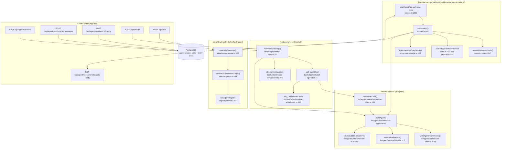
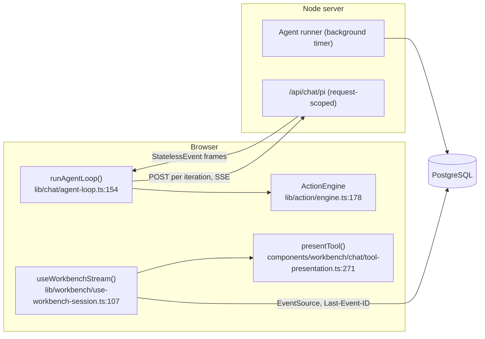

# Agent runtime — overview

Survey of the agent loop, tool calling, orchestration and skills subsystem of
OpenMAIC. Everything below was read out of the working tree at commit
`c2c9553a` (`git log --oneline -1`).

## Charter

There are **two independent agent runtimes** in this repo. They share one
harness (`@earendil-works/pi-agent-core` 0.78.0, `package.json:52-53`) and one
LLM adapter (`lib/agent/runtime/stream-fn.ts`), and nothing else.

| Runtime | Purpose | Lifetime owner | Entry |
| --- | --- | --- | --- |
| **Durable background runtime** ("agent runtime", "workbench agent") | One long-lived authoring conversation that builds and edits classroom *stage documents*. Survives worker death, deploys and client disconnects. | PostgreSQL lease + `startAgentRunner()` timer (`lib/server/agent-runtime/runner.ts:1861`) | `instrumentation.ts:49` |
| **In-class chat runtime** ("Pi chat", "director loop") | The multi-agent classroom conversation the *student* sees: a director LLM delegates turns to teacher/assistant/student personas that speak and drive the slide + whiteboard. Request-scoped, fully stateless server-side. | The HTTP request (`req.signal`) | `app/api/chat/pi/route.ts:42` → `lib/chat/pi/director-loop.ts:29` |

A third, older path still ships: the LangGraph `StateGraph` director in
`lib/orchestration/director-graph.ts:484`, driven by `app/api/chat/route.ts:44`
via `statelessGenerate` (`lib/orchestration/stateless-generate.ts:392`). It
produces the same `StatelessEvent` SSE protocol as the Pi path, so the browser
loop (`lib/chat/agent-loop.ts:154`) drives either one. `NEXT_PUBLIC_PI_CHAT_ENABLED`
selects which (`lib/config/feature-flags.ts:72`).

`lib/action/engine.ts:178` (`ActionEngine`) is the client-side executor for
whatever the classroom agents emit — it is the sink for both classroom paths.

## Internal parts

## Client / server split at a glance

The asymmetry is deliberate and load-bearing: the durable runtime never streams
to a client at all — it writes durable events, and the browser reads the log.
The classroom runtime has no durable log; the browser holds all state and
re-posts it every iteration (`lib/chat/agent-loop.ts:181-192`).

## File inventory

Measured with
`find <dir> -type f | xargs wc -l | sort -rn` and
`for d in …; do printf '%s ' $d; find $d -type f | xargs cat | wc -l; done`.

| Directory | Lines | Role |
| --- | --- | --- |
| `lib/server/agent-runtime/` | 16154 | Durable runner, the whole server tool catalogue, skills loader, session store binding |
| `lib/chat/` | 6025 | In-class Pi director loop, classroom tools, prompts, browser agent loop |
| `skills/` | 6801 | 23 builtin agent-runtime skills + the `openmaic` external-driver skill |
| `components/workbench/chat/` | 5024 | Chat fold rendering: tool cards, thinking bars, question cards |
| `lib/orchestration/` | 3477 | LangGraph director graph, agent registry, prompt builders, summarizers |
| `components/agent/` | 1544 | Agent bar / config panel / reveal modal (classroom roster UI) |
| `lib/agent/` | 1537 | Shared harness: `buildAgent`, stream adapter, tool timeout, native child |
| `app/api/agent/` | 1245 | Durable-runtime control plane (sessions, events, messages, cancel, skills) |
| `lib/action/` | 902 | `ActionEngine` — client-side executor for classroom actions |
| `app/api/chat/` | 568 | `/api/chat` (LangGraph) and `/api/chat/pi` (Pi director) |
| `lib/agent-runtime/` | 175 | Isomorphic contracts: lifecycle event names, stage-writer registry |
| `app/api/skills/` | 49 | Skill zip export |

### Largest modules

| File | Lines |
| --- | --- |
| `lib/server/agent-runtime/runner.ts` | 1923 |
| `lib/chat/pi/tools/native-whiteboard.ts` | 1113 |
| `lib/chat/pi/tools/call-agent.ts` | 1004 |
| `components/workbench/chat/tool-presentation.ts` | 1002 |
| `lib/server/agent-runtime/dsl-tools.ts` | 994 |
| `components/agent/agent-bar.tsx` | 941 |
| `lib/action/engine.ts` | 902 |
| `lib/server/agent-runtime/skills.ts` | 895 |
| `skills/agent-runtime/slide-dsl/SKILL.md` | 892 |

## This pack

Thirteen files. Every row links, so this table is the pack's navigation as well as its
manifest.

| File | Contents |
| --- | --- |
| `00-overview.md` | this file |
| [`01a-modules-server.md`](./01a-modules-server.md) | durable runtime modules, path:line anchors |
| [`01b-modules-classroom.md`](./01b-modules-classroom.md) | classroom runtime + orchestration + client modules |
| [`02-interfaces.md`](./02-interfaces.md) | verbatim public types: harness, runner, recovery, skills |
| [`02b-tool-catalogue.md`](./02b-tool-catalogue.md) | every registered tool, what it mutates, how it is authorised |
| [`02c-interfaces-tools-and-events.md`](./02c-interfaces-tools-and-events.md) | verbatim types: tool layer and classroom |
| [`02d-durable-events.md`](./02d-durable-events.md) | the durable event vocabulary, write channels, and storage shape |
| [`03-flows.md`](./03-flows.md) | traced flows through the durable runtime |
| [`03b-flows-classroom-and-external.md`](./03b-flows-classroom-and-external.md) | traced flows: in-class round, and the external `openmaic` skill driver |
| [`04-dependencies-and-config.md`](./04-dependencies-and-config.md) | packages, env vars, config resolution |
| [`05-failure-modes.md`](./05-failure-modes.md) | error handling and failure behaviour |
| [`06-quality-and-metrics.md`](./06-quality-and-metrics.md) | quality observations, measured numbers with commands |
| [`07-open-questions.md`](./07-open-questions.md) | what could not be determined |

Nothing was omitted: the subsystem has real content for every section. Pack→topic mapping
and the shared chapter convention: [`../index.md`](../index.md).
