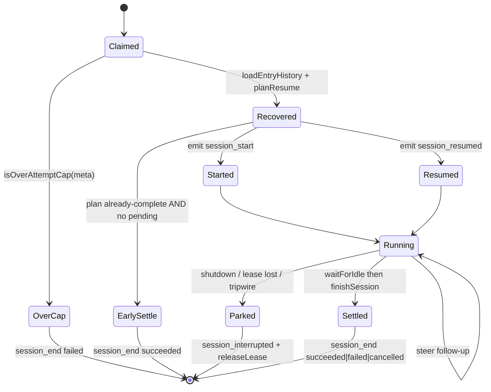

# Modules — durable background runtime

Everything in `lib/server/agent-runtime/`, plus the shared harness in
`lib/agent/runtime/` and the isomorphic contracts in `lib/agent-runtime/`.

```mermaid
flowchart TD
  subgraph L0["Isomorphic (browser + server)"]
    LC["lib/agent-runtime/lifecycle.ts:37<br/>HOST_AGENT_LIFECYCLE"]
    SW["lib/agent-runtime/stage-writer-tools.ts:20<br/>STAGE_WRITER_TOOL_NAMES"]
  end
  subgraph L1["Harness (lib/agent/runtime/)"]
    BA["build-agent.ts:65 buildAgent"]
    SFN["stream-fn.ts:250 createCallLlmStreamFn"]
    TMO["tool-timeout.ts:98 withAgentToolTimeout"]
    ALG["allowlist.ts:5 makeAllowlistGate"]
    QTA["quota.ts:8 makeQuotaHook"]
  end
  subgraph L2["Runner core (lib/server/agent-runtime/)"]
    RUN["runner.ts:889 runSession"]
    START["runner.ts:1861 startAgentRunner"]
    RES["resume.ts:93 planResume"]
    TCI["tool-call-integrity.ts:109 repairOrphanedToolCalls"]
    ETS["entry-tree-storage.ts:163 AgentSessionEntryStorage"]
    CFG["config.ts:5 agentRuntimeConfig"]
    DRV["agent-driver-model.ts:83 resolveAgentDriverModel"]
    BUS["event-notify-bus.ts LISTEN/NOTIFY"]
    STORE["store.ts:91 getAgentSessionStore"]
  end
  subgraph L3["Tool layers"]
    CT["course-tools.ts:204 buildDslCourseToolset"]
    DSL["dsl-tools.ts:748 buildDslCourseTools"]
    CUR["curriculum-tools.ts:191 buildCurriculumTools"]
    GEN["generation-tools.ts:224 buildGenerationTools"]
    MAT["material-tools.ts:272 buildMaterialTools"]
    SK["skills.ts:592 createNativeSkillReadTool"]
    SKE["skill-edit-tools.ts:263 buildSkillEditTools"]
  end
  START --> RUN
  RUN --> RES
  RES --> TCI
  RUN --> ETS
  RUN --> DRV
  RUN --> CFG
  RUN --> BUS
  RUN --> STORE
  RUN --> CT
  CT --> DSL
  CT --> GEN
  RUN --> CUR
  RUN --> MAT
  RUN --> SK
  RUN --> SKE
  RUN --> BA
  BA --> TMO
  BA --> ALG
  BA --> QTA
  BA --> SFN
  CT --> SW
  RUN --> LC
```

## `lib/agent-runtime/` — the isomorphic contract layer

Two files, 175 lines total, importing nothing server-only on purpose.

- **`lifecycle.ts:37` `HOST_AGENT_LIFECYCLE`** — the 13 host lifecycle event
  names the runner writes and the browser subscribes to by name. The file header
  (`lifecycle.ts:5-12`) states the reason it lives outside `lib/server/`: a
  native `EventSource` delivers `event: user_question` only to a listener
  registered for that exact type, so the browser needs the same constant, and
  importing it must not pull `pg` into the client bundle. `stageLink` documents
  a durable-compat wrinkle: the old name `course_link` is already in historical
  logs and the browser must keep accepting both (`lifecycle.ts:95-100`).
- **`stage-writer-tools.ts:20` `STAGE_WRITER_TOOL_NAMES`** — the single list of
  "which agent tools WRITE a stage document" (9 names). Three consumers: the
  server scheduler derives `DOCUMENT_WRITING_TOOLS` from it
  (`course-tools.ts:110`), the workbench fold arms write ownership on
  `tool_execution_start` for exactly these names, and `rename_stage` is a member
  even though it is scheduled in the curriculum toolset instead.

## `lib/agent/runtime/` — the shared harness

- **`build-agent.ts:65` `buildAgent(opts)`** — the only place a pi `Agent` is
  constructed in this repo. Both runtimes and the classroom child agent go
  through it. It pins `toolExecution: 'sequential'` (`build-agent.ts:70`), wraps
  every tool in `withAgentToolTimeout` (`:77`), installs the allowlist gate as
  `beforeToolCall` (`:82`), and composes a quota hook with the caller's
  `afterToolCall` (`:83-100`). `STUB_MODEL` (`:28`) is a metadata placeholder
  with `contextWindow: 1_000_000` so the harness never tries to compact on its
  own; the injected `StreamFn` ignores it.
  `build-agent.ts:103-125` adds a **terminal barrier**: when a `turn_end`
  assistant frame has `stopReason === 'length'` and carries length-tool-call
  provenance, it calls `agent.clearAllQueues()` and monkey-patches `steer` and
  `followUp` into no-ops until `agent_end`.
- **`stream-fn.ts:250` `createCallLlmStreamFn(opts)`** — the integration seam.
  pi's `StreamFn` is `(model, context, options) => AssistantMessageEventStream`;
  this ignores pi's model stub, calls OpenMAIC's `streamLLM`
  (`stream-fn.ts:400`) with `stopWhen: stepCountIs(1)` (`:413`) so pi's own loop
  owns multi-step, and maps AI-SDK `fullStream` parts back to pi events via
  `createPartMapper` (`:168`). `LocalAssistantEventStream` (`:52`) is a local
  re-implementation of pi-ai's event-stream queue because the factory is not
  re-exported from the package root (`:46-51`).
  Finish-reason mapping is explicit (`:329-366`): `length` → `stopReason:
  'length'` with executable tool calls stripped; `content-filter | error |
  other` → error; `tool-calls` without a parsed call → error; `stop` →
  `toolUse` when a tool call is present, else `stop`.
- **`tool-timeout.ts:98` `withAgentToolTimeout(tool)`** — races every tool call
  against a budget and the caller's abort signal, because pi awaits
  `tool.execute` with no deadline (`tool-timeout.ts:5-10`). Default 10 min
  (`:31`), overrides for `generate_scene` / `generate_actions` /
  `extract_material` at 15 min (`:38-45`), env override
  `OPENMAIC_AGENT_TOOL_TIMEOUT_MS` (`:48`). On timeout it throws
  `AgentToolTimeoutError` (`:63`) which pi converts into an error tool result,
  so the session survives. Progress updates from a zombie tool after the race
  settles are dropped (`:190-194`).
- **`allowlist.ts:5` `makeAllowlistGate(allowed)`** — 10 lines. `block: true`
  with reason `Tool "<name>" is not enabled in this build.` The comment states
  the design: "v0 capability restriction = tool allowlist (NOT a hardcoded
  workflow)".
- **`quota.ts:8` `makeQuotaHook(source)`** — 13 lines, explicitly a v0 stub;
  `buildAgent` wires it with `remaining: () => Number.MAX_SAFE_INTEGER`
  (`build-agent.ts:66`), i.e. **there is no quota enforcement today**.
- **`run-native-child.ts:189` `runNativeChild(opts)`** — bounded single-shot
  child agent used by the classroom `call_agent` tool. Adds its own budgets on
  top of `buildAgent`: a wall-clock `timeoutMs`, a `maxProviderTransports`
  counter enforced by wrapping the `StreamFn` (`:228-238`), duplicate-tool-call
  detection by `toolCallId` (`:268-272`), and a four-way settlement owner
  (`caller | deadline | internal`, `:206`). Returns
  `status: 'completed' | 'failed' | 'exhausted' | 'cancelled'` (`:27`).

## `lib/server/agent-runtime/runner.ts` — the loop

1923 lines, one large state machine by declared intent
(`runner.ts:886-888`: "its nested finally blocks pair every timer,
subscription, and agent listener with the exact lifetime in which it can fire").

- **`startAgentRunner()` (`:1861`)** installs a `setInterval` at
  `config.scanIntervalMs`, and each scan claims sessions with
  `store.claimNextSession(WORKER_ID, pid, { leaseTtlMs, maxAttempts })`
  (`:1872`) while `ctx.running.size < config.maxConcurrent`. `WORKER_ID` is
  `<8 hex>:<pid>` (`:100`). `stop()` (`:1909`) aborts every running session and
  waits up to 15 s.
- **`runSession(ctx, meta)` (`:889`)** — the body. Key internal machinery:
  - `enqueue(write, critical)` (`:915`) serializes every durable write onto one
    promise chain; a `critical` failure sets `entryWritesHealthy = false` and
    aborts the run so a settle cannot succeed on a broken tree.
  - `appendEvent(type, data, ts)` (`:960`) is the only runner-side writer to
    `store.appendRunEvent`. `emit(type, data)` (`:983`) is the *guarded front door*
    to it, not the only writer: `appendEvent` is also called directly for two
    `LIFECYCLE.thinkingEnd` frames (`:1038`, `:1042`), which therefore skip the
    tripwire and throttle below. User messages do not pass through either — they
    reach the log via the store's own `insertEvent`
    (`packages/@openmaic/storage/src/agent-session/pg.ts:840`; see the note at
    `runner.ts:1105`). `emit` enforces an
    **event-order tripwire** (`markRunEventEmitted`, `:317`): the first frame of
    a run must be one of `session_start`/`session_resumed`/`session_interrupted`/
    `session_end`, or the run aborts with `TRIPWIRE VIOLATION` (`:986-992`). It
    also throttles `message_update` to one per
    `MESSAGE_UPDATE_MIN_INTERVAL_MS` = 150 ms (`runner.ts:102`, applied at
    `:1030`) and synthesizes the `thinking_end` frame at the first
    text-after-thinking update (`:1035-1043`).
  - `snapshotEventDataForLog` (`:269`) shallow-clones the pi event at emission
    time, because pi mutates the shared partial message after every token while
    durable writes run asynchronously.
  - Lease heartbeat `setInterval` at `config.heartbeatIntervalMs` (`:1090`);
    losing the lease calls `markLeaseLost()` which aborts locally.
  - One shared `subscribeAgentEventWakeup({kind:'session', sessionId})`
    subscription (`:1133`) serves **both** cancel detection and follow-up
    message drain; the long comment at `:1103-1119` explains why it is one
    subscription and why the polls at `SESSION_WAKEUP_FALLBACK_MS` = 5 000 ms
    (`runner.ts:101`) are kept as a correctness backstop rather than deleted.
  - `requestDrain()` (`:1610`) serializes follow-up drains; `drainMessages()`
    (`:1563`) re-reads `listAgentUserMessages`, verifies the lease still matches
    (`leaseMatches`, `:878`), and `agent.steer(...)` each undelivered message
    tagged with its durable seq (`tagDurableUserMessage`, `:682`).
  - `planUndeliveredRequeue` (`:338`) classifies work that was never delivered
    at every terminal exit into `none | reset | retry`.

## Recovery and transcript integrity

- **`resume.ts:93` `planResume(transcript)`** returns
  `{kind:'start'} | {kind:'continue', messages, repairedToolCalls} |
  {kind:'already-complete', messages}`. It pops the incomplete assistant suffix
  first (`isDiscardableAssistantTail`, `:83`), then classifies the tail. A
  trailing successful `ask_user` **or** `create_skill` result is terminal
  (`:126-130`) — the run is waiting on the user, and a takeover must not
  `continue()` past it. The header (`:33-37`) states the consequence plainly:
  tool execution is **at-least-once**, so every tool must be idempotent.
- **`tool-call-integrity.ts:109` `repairOrphanedToolCalls(messages)`** — the
  read-boundary normalizer. Strict providers require all results for one
  assistant tool-call frame to be contiguous; parallel tools finishing during an
  abort unwind break that. It moves existing results next to their owning
  assistant, drops incomplete unwind frames, and synthesizes
  `interruptedToolResult` (`:64`) only for genuinely missing ones. A healthy
  transcript is returned **by reference** (`:154`) so its bytes are provably
  unchanged. The entry tree itself is never mutated.
- **`entry-tree-storage.ts:163` `AgentSessionEntryStorage`** — a pi
  `SessionStorage` adapter over the storage package's append-only entry tree.
  `loadSessionEntryHistory` (`:43`) validates the one tree shape the runner
  understands, rejects a non-backward `firstKeptEntryId` on a compaction entry
  (`:66-72`), and asserts the context-to-entry mapping is 1:1 (`:109-114`).
  `translateStorageError` (`:129`) maps package errors onto pi's `SessionError`
  classes, including a `unknown session` race to `not_found`.
- **`mutation-fence.ts:10` `runStageMutation(signal, mutation)`** — 25 lines
  using `AsyncLocalStorage` so a persistence transaction can assert its owning
  tool call has not been aborted (`assertCurrentStageMutationActive`, `:23`).
  The runner passes this assertion into the owner-scoped document store's
  transaction hook (`runner.ts:1303-1310`).

## Skills

- **`skills.ts:211` `listSkills(ownerId?)`** = filesystem builtins (cached once,
  `listBuiltinSkills`, `:170`) + this owner's database skills, each wrapped by
  `wrapUserSkillContent` (`:140`) — an explicitly-labelled security boundary
  ("Ported EXACTLY from the reference product — do not reword it").
- **`skills.ts:592` `createNativeSkillReadTool(skills, onActivate)`** — pi's
  native `read`, restricted to installed skill directories via `realpath`
  containment (`assertAllowed`, `:597-605`). Database skills have virtual paths
  under `/__openmaic_user_skills__` and are served from memory, never through
  `realpath` (`:612-639`). Every result carries
  `{path, offset, lines, totalLines, skill, sourceHash}`.
- **Activation lives in the transcript.** `skillReadFromTranscript` (`:529`)
  resolves the active skill from the last successful `read` of a SKILL.md;
  `readProvesCoverage` (`:515`) is the three-condition table (offset === 1,
  `lines >= totalLines`, `sourceHash` equals the file's current hash) that
  decides whether a body is actually in context. `skillSourceHash` (`:495`) is
  the first 16 hex chars of sha256.
- **`skill-preload.ts:224` `buildSkillPreload(input)`** — turns the `/handle`s a
  turn names (plus the session's frozen `skillId`) into a synthesized
  `assistant(toolCall read)` + `toolResult(SKILL.md)` pair, i.e. "a read that
  already happened". Caps: `SKILL_PRELOAD_MAX_COUNT = 3` (`:124`) and
  `SKILL_PRELOAD_MAX_BYTES = 60_000` (`:138`), with the first named skill
  admitted regardless of size (`:336`). It never emits a `user` message,
  because the follow-up cursor counts `user` frames (`:82-87`).
- **`skill-preload.ts:437` `preloadConstraintTarget(named)`** — picks the last
  *constrained* named skill (else the last named one) as the outline-constraint
  pointer.

## Configuration and model resolution

- **`config.ts:5` `agentRuntimeConfig`** — scan 1000 ms, heartbeat 2000 ms,
  lease TTL 10 000 ms, `maxConcurrent` 2, `maxAttempts` 5, compaction **opt-in**
  (`OPENMAIC_AGENT_COMPACTION_ENABLED`, deliberately inverted from the reference
  runtime, `:20-26`), `skillsDir` defaulting to `<cwd>/skills/agent-runtime`.
- **`agent-driver-model.ts:83` `resolveAgentDriverModel()`** — the driver model
  comes from a dedicated `MODEL_ROUTES` stage `maic-agent-driver` (`:6`);
  `DEFAULT_MODEL` is never consulted. `assertAgentDriverRouteConfig` (`:14`)
  fails boot on a missing route, a bare model id with no provider prefix, a
  `thinking.effort` setting, or a non-OpenAI-compatible pi api. Context window
  chain: route pin → catalog window → 128 000 fallback (`:69-73`).
- **`store.ts:91` `getAgentSessionStore()`** — process-wide lazy
  `PgAgentSessionStore` keyed on `DATABASE_URL`, with `ensureAgentSessionSchema`
  run once. Its hooks register observed URLs from prompt/message text in the
  same transaction (`:55-70`) and fire `pg_notify` on every durable append
  (`:76-81`).
- **`owner.ts:52` `resolveRequestOwnerId(req, headers, authenticatedOwnerId?)`**
  — identity is an `anon:<uuid-v4>` cookie (`anonymous_id`, HttpOnly, SameSite
  Lax, 30 days) unless the caller supplies an authenticated id. **No current
  caller supplies one** (`:47-50`).
