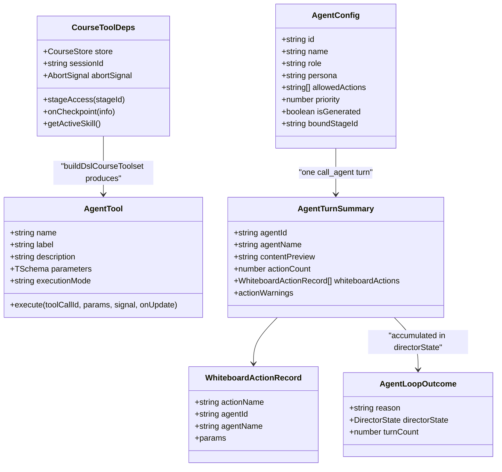

# Interfaces — tool layer and classroom

Continuation of `02-interfaces.md`; the durable event vocabulary is in
`02d-durable-events.md`. Same rule: every code block is copied verbatim from
the cited file.



## Tool layer contracts

`lib/server/agent-runtime/course-tools.ts`

```ts
export type CourseDocument = MaicDocument<Scene, Stage>;                     // :57
export type CourseStore = DocumentStore<Scene, Stage> & DocumentFolderStore;  // :58

export interface CheckpointInfo {                                            // :61
  tool: string;
  detail: string;
  stageId?: string;
  sceneId?: string;
  order?: number;
  title?: string;
  sceneType?: string;
  /** Active skill whose persisted constraints were checked after this write. */
  skill?: string;
  /** Non-blocking structural diagnostics for the persisted stage. */
  skillViolations?: string[];
}

export interface CourseToolDeps {                                            // :77
  store: CourseStore;
  stageAccess: (stageId: string) =>
    Promise<{ kind: 'owned' | 'missing' | 'foreign' | 'tombstoned' }>;
  onCheckpoint: (info: CheckpointInfo) => void;
  sessionId?: string;
  abortSignal?: AbortSignal;
  synthesizeTts?: (input: SceneTtsInput) => Promise<SceneTtsSummary>;
  getActiveSkill?: () => LoadedSkill | null;
}

export const DOCUMENT_WRITING_TOOLS: ReadonlySet<string>                      // :110
export function markDocumentWritersSequential(tools): AgentTool[]             // :137
export function withOwnerStageAuthorization(tools, deps): AgentTool[]         // :159
export function buildDslCourseToolset(deps): AgentTool[]                      // :204
export function buildCourseAllowlist(videoDeps?): ReadonlySet<string>         // :223
export function courseSystemPrompt(blocks: CoursePromptBlocks): string        // :306
```

`lib/agent-runtime/stage-writer-tools.ts:20` — the shared writer registry:

```ts
export const STAGE_WRITER_TOOL_NAMES: ReadonlySet<string> = new Set([
  // course generation writers
  'set_roster',
  'generate_scene',
  'generate_actions',
  'duplicate_scene',
  'import_pptx',
  // course audio and page-list writers
  'generate_tts',
  'edit_deck',
  // generic stage-document writer
  'patch_stage',
  // curriculum writer (stage identity)
  'rename_stage',
]);

export function isStageWriterTool(toolName: string): boolean
```

`DOCUMENT_WRITING_TOOLS` (`course-tools.ts:110-112`) is that set minus
`rename_stage`, which is scheduled in the curriculum toolset instead.

`lib/server/agent-runtime/runner-contract.ts` — the whole file (16 lines):

```ts
export function assembleRunnerTools(
  ...groups: ReadonlyArray<ReadonlyArray<AgentTool>>
): AgentTool[] {
  return groups.flat();
}

/** The DSL compatibility block is part of every runner prompt. */
export function buildRunnerCoursePrompt(blocks: Omit<PromptBlocks, 'dslTools'>): string {
  return courseSystemPrompt({ ...blocks, dslTools: DSL_TOOLS_PROMPT });
}
```

`lib/server/agent-runtime/ask-user.ts:12`

```ts
export interface AskUserQuestion {
  question: string;
  options?: { id: string; label: string }[];
  multiSelect?: boolean;
}
```

The other name constants, each the authoritative list for its toolset:

```ts
CURRICULUM_ALLOWLIST      // curriculum-tools.ts:571 — 6 names
GENERATION_TOOL_NAMES     // generation-tools.ts:645 — 4 names
MATERIAL_TOOL_NAMES       // material-tools.ts:604   — 6 names, INCLUDING fetch_url
ROSTER_TOOL_NAMES         // roster-tools.ts:381     — list_voices, set_roster
VOICE_CLONE_TOOL_NAMES    // voice-clone-tools.ts:427 — clip_audio, register_voice
SKILL_EDIT_TOOL_NAMES     // skill-edit-tools.ts:385 — read_skill, patch_skill
SKILL_EDIT_WRITE_TOOLS    // skill-edit-tools.ts:386 — patch_skill
DSL_COURSE_TOOL_NAMES     // dsl-tools.ts:993        — read_stage, patch_stage, grep_stage
DSL_COURSE_WRITE_TOOLS    // dsl-tools.ts:994        — patch_stage
COURSE_AUDIO_DECK_TOOL_NAMES // course-edit/tools.ts:252 — generate_tts, edit_deck
PERSONAL_HISTORY_TOOL_NAMES  // personal-history-tools.ts:12 — 4 names
MATERIAL_MEDIA_TOOL_NAME     // material-media.ts:79
RENDER_SCENE_PREVIEW_TOOL_NAME // scene-preview.ts:101
IMPORT_PPTX_TOOL_NAME        // import-pptx.ts:39
GENERATE_IMAGE_TOOL_NAME     // generate-image.ts:40
GENERATE_VIDEO_TOOL_NAME     // generate-video.ts:43
```

Pagination and budget constants worth knowing before reading a tool:

```ts
READ_PAGE_CHARS            = 12_000    // dsl-tools.ts:23
SEARCH_CONTEXT_CHARS       = 200       // dsl-tools.ts:24
MAX_SEARCH_HITS_PER_SCENE  = 10        // dsl-tools.ts:26
MAX_SEARCH_HITS_TOTAL      = 30        // dsl-tools.ts:27
MAX_SEARCH_CHARS_PER_EXEC  = 1_000_000 // dsl-tools.ts:28
SEARCH_TIME_BUDGET_MS      = 100       // dsl-tools.ts:29
SKILL_READ_PAGE_CHARS      = 12_000    // skill-edit-tools.ts:39
HISTORY_PAGE_LIMIT_DEFAULT = 10        // personal-history-tools.ts:19
HISTORY_PAGE_LIMIT_MAX     = 20        // personal-history-tools.ts:20
HISTORY_SCAN_MAX           = 500       // personal-history-tools.ts:21
MAX_SESSION_TEXT_LENGTH    = 100_000   // limits.ts:9
```

## Classroom contracts

`lib/orchestration/registry/types.ts:9`

```ts
export interface AgentConfig {
  id: string; name: string; role: string; persona: string;
  avatar: string; color: string;
  allowedActions: string[]; priority: number;
  voiceConfig?: { providerId: TTSProviderId; modelId?: string; voiceId: string };
  voiceDesign?: VoiceDesign;
  createdAt: Date; updatedAt: Date; isDefault: boolean;
  isGenerated?: boolean; boundStageId?: string;
}
```

```ts
export const WHITEBOARD_ACTIONS = [                                          // :62
  'wb_open','wb_close','wb_draw_text','wb_draw_shape','wb_draw_chart',
  'wb_draw_latex','wb_draw_table','wb_draw_line','wb_draw_code',
  'wb_edit_code','wb_clear','wb_delete',
];
export const SLIDE_ACTIONS = ['spotlight', 'laser', 'play_video'];           // :77
export const ROLE_ACTIONS: Record<string, string[]> = {                      // :83
  teacher: [...SLIDE_ACTIONS, ...WHITEBOARD_ACTIONS],
  assistant: [...WHITEBOARD_ACTIONS],
  student: [...WHITEBOARD_ACTIONS],
};
export function getActionsForRole(role: string): string[]                     // :93
```

`lib/orchestration/types.ts:12`

```ts
export interface WhiteboardActionRecord {
  actionName: 'wb_draw_text' | 'wb_draw_shape' | 'wb_draw_chart' | 'wb_draw_latex'
    | 'wb_draw_table' | 'wb_draw_line' | 'wb_draw_code' | 'wb_edit_code'
    | 'wb_clear' | 'wb_delete' | 'wb_open' | 'wb_close';
  agentId: string; agentName: string; params: Record<string, unknown>;
}

export interface AgentTurnSummary {                                          // :34
  agentId: string; agentName: string;
  contentPreview: string; actionCount: number;
  whiteboardActions: WhiteboardActionRecord[];
  actionWarnings?: Array<{
    actionName?: string;
    reason: 'unknown_action' | 'invalid_params' | 'raw_structured_fallback';
    message: string;
  }>;
}
```

`lib/orchestration/registry/agent-selection.ts:1`

```ts
export interface AgentSelection {
  mode: 'preset' | 'auto';
  selectedAgentIds: string[];
}

export interface RestoredAgentSelection {
  selection: AgentSelection;
  /** Whether `selection` is the user's explicit choice (vs stage-derived defaults). */
  isUserSet: boolean;
}

export function restoreAgentSelection(params: {
  persisted: AgentSelection;
  persistedIsUserSet: boolean;
  generatedAgentIds: string[];
  stageAgentIds?: string[];
  isPresetAgent: (id: string) => boolean;
}): RestoredAgentSelection                                                   // :27
```

`lib/chat/agent-loop.ts:107`

```ts
export interface AgentLoopOutcome {
  /** Why the loop stopped */
  reason: 'end' | 'cue_user' | 'aborted' | 'empty_turns' | 'no_done';
  directorState?: DirectorState;
  turnCount: number;
}

export async function runAgentLoop(
  request: AgentLoopRequest,
  callbacks: AgentLoopCallbacks,
  signal: AbortSignal,
): Promise<AgentLoopOutcome>                                                 // :154
```

`lib/chat/pi/director-compaction.ts:34`

```ts
export interface DirectorCompactionTrace {
  enabled: true;
  contextWindow: number;
  reserveTokens: number;
  keepRecentTokens: number;
  checkCount: number;
  triggerCount: number;
  failures: string[];
  events: DirectorCompactionEvent[];
}

export interface DirectorCompactionRuntime {                                 // :45
  transformContext: (messages: AgentMessage[], signal?: AbortSignal) => Promise<AgentMessage[]>;
  getTrace: () => DirectorCompactionTrace;
  dispose: () => void;
}
```

`components/workbench/chat/tool-presentation.ts:106`

```ts
export interface ToolPresentation {
  icon: LucideIcon;
  /** The verb phrase. Stable across running / done — the status dot carries state. */
  label: string;
  /** What the verb acted on: a page title, a course title. */
  subject?: string;
  /** One line of supporting detail; the card truncates it to one line. */
  detail?: string;
  chips: ToolChip[];
  /** Human-readable failure, shown on the collapsed row rather than hidden. */
  errorText?: string;
  /** Keep internal arguments/results/traces out of the disclosure UI. */
  hidePayload?: boolean;
  /** Durable text that should be shown in the expanded result section. */
  expandedResultText?: string;
  /** `read_stage_outline` — the plan, as a plan. */
  pages?: PlannedPage[];
}
```

The durable event vocabulary and the storage `erDiagram` continue in
`02d-durable-events.md`.
