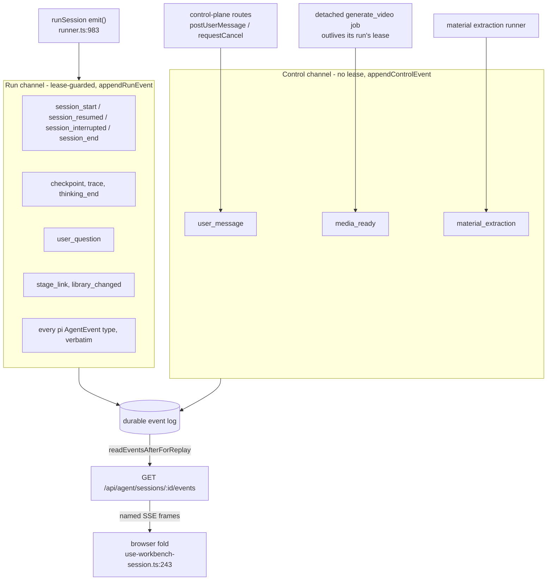
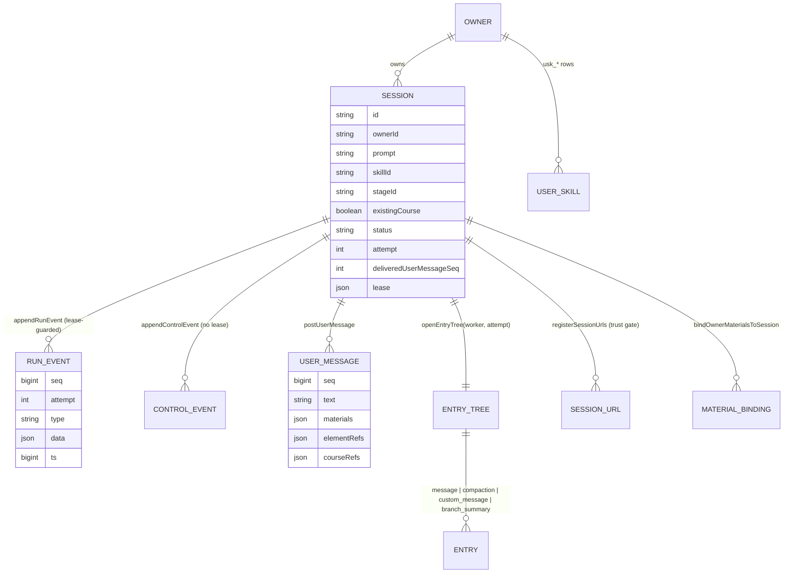

# Durable event vocabulary

The third part of the interface pack (see `02-interfaces.md` and
`02c-interfaces-tools-and-events.md`). This is the contract between the runner,
the control plane, and the browser fold.

## Who may write which channel



The split is the reason `media_ready` exists as its own lifecycle name: the job
that emits it legitimately runs after `finishSession`, when the lease is gone,
so it cannot use the run channel ([`lifecycle.ts:122-132`](lib/agent-runtime/lifecycle.ts#L122-L132), `runner.ts:1311-1319`).


[`lib/agent-runtime/lifecycle.ts:37`](lib/agent-runtime/lifecycle.ts#L37) — the `HOST_AGENT_LIFECYCLE` keys and wire
names, which are the browser's subscription list:

| Key | Wire name | Written by |
| --- | --- | --- |
| `sessionStart` | `session_start` | runner (`runner.ts:1241`) |
| `sessionResumed` | `session_resumed` | runner (`:1252`) |
| `sessionInterrupted` | `session_interrupted` | runner (`:1752`, `:1795`) |
| `sessionEnd` | `session_end` | runner (`:1075`, `:1226`, `:1771`) |
| `checkpoint` | `checkpoint` | course/curriculum tools via `onCheckpoint` |
| `userMessage` | `user_message` | control plane (`postUserMessage`) |
| `trace` | `trace` | runner skill-preload skip notes (`:1662`, `:1717`) |
| `thinkingEnd` | `thinking_end` | runner (`:1038`, `:1042`) |
| `materialExtraction` | `material_extraction` | material extraction runner |
| `userQuestion` | `user_question` | `ask_user` via `runner.ts:1278` |
| `stageLink` | `stage_link` (legacy `course_link`) | curriculum tools (`:1373`) |
| `libraryChanged` | `library_changed` | curriculum tools (`:1374`) |
| `mediaReady` | `media_ready` | detached `generate_video` job, via the session **control** channel, not the lease-guarded run channel |

Two payload types are declared alongside the names:

```ts
export interface StageLinkLifecycleData {          // lifecycle.ts:14
  stageId: string; title: string; url: string;
}

export interface MediaReadyLifecycleData {         // lifecycle.ts:24
  /** The `gen_vid_<id>` placeholder the tool returned for the agent to patch onto an element. */
  ref: string;
  stageId: string;
  status: 'done' | 'failed';
  /** Server-relative renderable src (`/api/classroom-media/...`) when done. */
  src?: string;
  mime?: string;
  durationSec?: number;
  /** Stable provider-neutral code from MEDIA_TOOL_ERROR_REASONS when failed. */
  errorCode?: string;
}

export type HostAgentLifecycleEventType =           // lifecycle.ts:136
  (typeof HOST_AGENT_LIFECYCLE)[keyof typeof HOST_AGENT_LIFECYCLE];
```

## The browser's subscription list

A native `EventSource` routes a named frame **only** to a listener registered
for that exact type, so the browser has to enumerate every name it wants
([`lib/workbench/use-workbench-session.ts:63-72`](lib/workbench/use-workbench-session.ts#L63-L72)). Two constants there make that
explicit:

- `LEGACY_WORKBENCH_EVENT_TYPES` ([`use-workbench-session.ts:84`](lib/workbench/use-workbench-session.ts#L84)) — names still
  present in historical logs that must keep being subscribed to. `stage_link`'s
  predecessor `course_link` is the documented member
  ([`lib/agent-runtime/lifecycle.ts:95-100`](lib/agent-runtime/lifecycle.ts#L95-L100)): emitters only ever write
  `stage_link`, the fold matches both with identical semantics.
- `WORKBENCH_EVENT_TYPES` ([`use-workbench-session.ts:92`](lib/workbench/use-workbench-session.ts#L92)) — the union actually
  passed to `source.addEventListener` (`:243`) and removed on teardown (`:262`).
  Its lifecycle half is **derived** from `HOST_AGENT_LIFECYCLE` rather than
  retyped, so adding a host lifecycle name automatically subscribes the browser;
  the pi event names are hand-listed because they come from the agent library
  (`:44-48`).

An old frontend that does not know a new type ignores it — the fold's default
case — and loses only the affordance, which is the compatibility rule
[`lifecycle.ts:84-86`](lib/agent-runtime/lifecycle.ts#L84-L86) states for `user_question`.

## Durable storage shape

`erDiagram` of the durable shape the runtime reads and writes. **Caveat:** the
tables themselves live in `packages/@openmaic/storage` (out of scope for this
survey); the entity/field names below are the ones this subsystem actually reads
and writes through `PgAgentSessionStore` and `AgentSessionMeta`, not verified
SQL column names.


