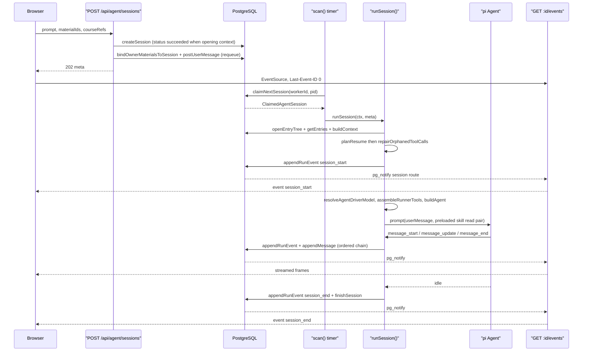
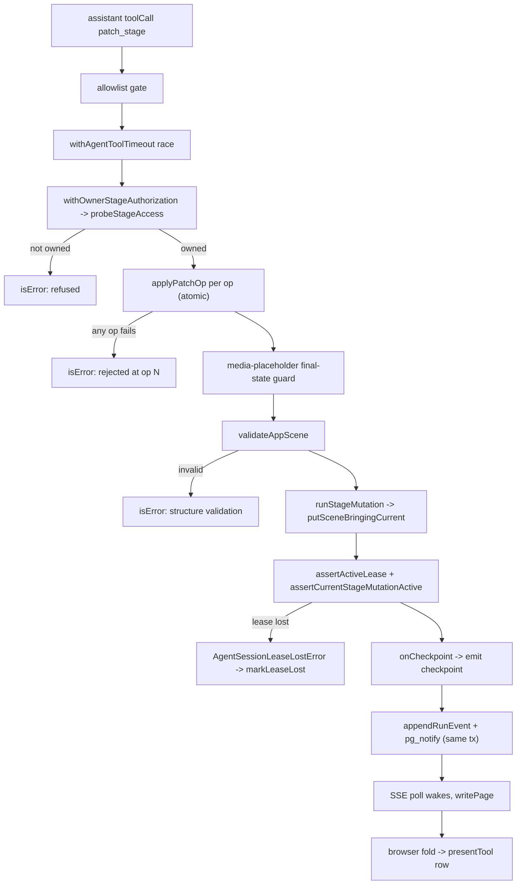
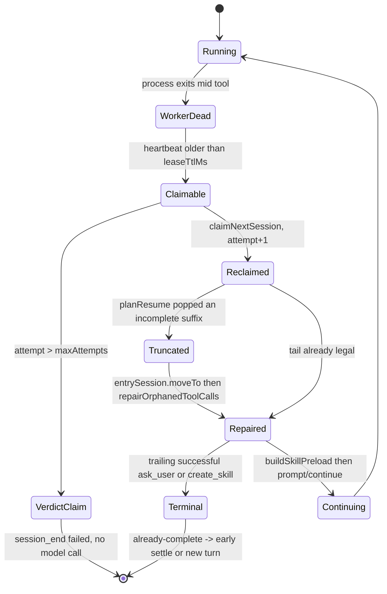

# Traced flows — durable background runtime

Three flows through `lib/server/agent-runtime/`, each named function in call
order. Line anchors are the definition sites.

## Flow A — cold start: a new authoring session through its first turn

| # | Hop | Where |
| --- | --- | --- |
| 1 | `POST /api/agent/sessions` handler | [`app/api/agent/sessions/route.ts:37`](app/api/agent/sessions/route.ts#L37) |
| 2 | `isAgentRuntimeConfigured()` — 404 if off | [`lib/config/feature-flags.ts:23`](lib/config/feature-flags.ts#L23) |
| 3 | validate `existingCourse`/`stageId`/`prompt` length/`materialIds`/`courseRefs` | `route.ts:49-90` |
| 4 | `withRequestOwnerId(req, handler)` → `resolveRequestOwnerId` mints `anon:<uuid>` | [`with-owner.ts:12`](lib/server/agent-runtime/with-owner.ts#L12), [`owner.ts:52`](lib/server/agent-runtime/owner.ts#L52) |
| 5 | explicit `skill`: `findSkill(ref, ownerId)`; else `inferSkillIdFromPrompt(prompt, ownerId)` | [`skills.ts:291`](lib/server/agent-runtime/skills.ts#L291), [`:369`](lib/server/agent-runtime/skills.ts#L369) |
| 6 | `getAgentSessionStore()` (lazy `PgAgentSessionStore` + `ensureAgentSessionSchema`) | `store.ts:91` |
| 7 | `store.createSession({ownerId, prompt, stageId?, skillId?, existingCourse, origin, status?})` — `status: 'succeeded'` when the session has opening context, so the runner cannot claim it yet | `route.ts:139-149` |
| 8 | `bindOwnerMaterialsToSession(id, ownerId, materialIds)` then `store.postUserMessage(...)` — atomically requeues | `route.ts:156-167` |
| 9 | HTTP 202 with the session meta | `route.ts:168-175` |
| 10 | Browser attaches `EventSource /api/agent/sessions/:id/events` | [`lib/workbench/use-workbench-session.ts:153`](lib/workbench/use-workbench-session.ts#L153) |
| 11 | Runner scan tick (`config.scanIntervalMs`, 1000 ms) | `runner.ts:1892` |
| 12 | `store.claimNextSession(WORKER_ID, pid, {leaseTtlMs, maxAttempts})` | `runner.ts:1872` |
| 13 | `runSession(ctx, meta)` | `runner.ts:889` |
| 14 | `isOverAttemptCap(meta)` — if over, emit terminal `session_end` and return | `runner.ts:305`, `:1070` |
| 15 | heartbeat `setInterval` + `subscribeAgentEventWakeup` + cancel poll | `runner.ts:1090`, `:1133`, `:1138` |
| 16 | `loadEntryHistory()` → `AgentSessionEntryStorage.open` → `loadSessionEntryHistory` | `runner.ts:943`, [`entry-tree-storage.ts:169`](lib/server/agent-runtime/entry-tree-storage.ts#L169), [`:43`](lib/server/agent-runtime/entry-tree-storage.ts#L43) |
| 17 | `planResume(historyMessages)` → `{kind:'start'}` for a fresh session | [`resume.ts:93`](lib/server/agent-runtime/resume.ts#L93) |
| 18 | `repairOrphanedToolCalls(plannedMessages)` (no-op here) | [`tool-call-integrity.ts:109`](lib/server/agent-runtime/tool-call-integrity.ts#L109) |
| 19 | `listSkills(meta.ownerId)`; `findSkill(meta.skillId, ownerId)`; `skillReadFromTranscript` | [`skills.ts:211`](lib/server/agent-runtime/skills.ts#L211), [`:291`](lib/server/agent-runtime/skills.ts#L291), [`:529`](lib/server/agent-runtime/skills.ts#L529) |
| 20 | `createNativeSkillReadTool(installedSkills, onActivate)` when skills exist | [`skills.ts:592`](lib/server/agent-runtime/skills.ts#L592) |
| 21 | `listAgentUserMessages(store, id)` → filter `seq > deliveredThrough` → `toFollowUp` → `resolveCourseRefsForContext` | `runner.ts:1204-1222`, `:704` |
| 22 | `emit(session_start)` (or `session_resumed` when attaching to an existing course with pending) | `runner.ts:1241` / `:1252` |
| 23 | `resolveAgentDriverModel()` → `createCallLlmStreamFn({languageModel, wireMaxOutputTokens, thinkingConfig, abortSignal})` | [`agent-driver-model.ts:92`](lib/server/agent-runtime/agent-driver-model.ts#L92), [`stream-fn.ts:250`](lib/agent/runtime/stream-fn.ts#L250) |
| 24 | `buildAskUserTool({onUserQuestion})`; `resolveWebSearchCapability()` | [`ask-user.ts:45`](lib/server/agent-runtime/ask-user.ts#L45), `web-search.ts:24` |
| 25 | `getOwnerScopedDocumentStore(ownerId, leaseGuardedHook)` **and** a second lease-free store for detached media jobs | `runner.ts:1303`, `:1317` |
| 26 | `resolveFollowUpElementContext` per pending message → `resolveElementRefsForContext` | `runner.ts:1320`, `:412` |
| 27 | `planRunStart({plan, claimReason, pending, prompt, idleAttach})` | `runner.ts:772` |
| 28 | toolsets: `buildDslCourseToolset`, `buildCurriculumTools`, `buildScenePreviewTools`, `buildMaterialTools`, `withOwnerStageAuthorization(buildRosterTools(...))`, `buildVoiceCloneTools`, `buildPersonalHistoryTools`, `buildCreateSkillTool`, `buildSkillEditTools`, `buildFetchUrlTool` | `runner.ts:1359-1458` |
| 29 | `assembleRunnerTools(...)` (a flat concat) | [`runner-contract.ts:7`](lib/server/agent-runtime/runner-contract.ts#L7) |
| 30 | `buildAgent({streamFn, systemPrompt: buildRunnerCoursePrompt(blocks), model: driver.piModel, tools, allowedToolNames, history?, afterToolCall})` | [`build-agent.ts:65`](lib/agent/runtime/build-agent.ts#L65), [`runner-contract.ts:14`](lib/server/agent-runtime/runner-contract.ts#L14) |
| 31 | `agent.subscribe(...)` → `emit(event.type, event)` + `entrySession.appendMessage` + `store.markUserMessageDelivered` on tagged user frames | `runner.ts:1506-1538` |
| 32 | follow-up `messagePoll` `setInterval` every 5 s | `runner.ts:1628` |
| 33 | `buildSkillPreload({text, skills, transcript, forced?, model, onSkipped})` → `adoptPreload(preload, true)` | [`skill-preload.ts:224`](lib/server/agent-runtime/skill-preload.ts#L224), `runner.ts:1196` |
| 34 | `agent.prompt(preload.text)` — or `agent.prompt([preloadUserMessage(...), ...preload.messages])` when a skill was preloaded or the prompt carries a durable seq | `runner.ts:1667-1676` |
| 35 | wind-down loop: `agent.waitForIdle()` → `requestDrain()` until nothing new | `runner.ts:1732-1740` |
| 36 | `queueInterruptedToolResults()` then `flushAll()` | `runner.ts:1746-1747` |
| 37 | `terminalLoopError(agent.state.messages, agent.state.errorMessage)` | `runner.ts:324` |
| 38 | `emit(session_end, {status, toolCalls, error?})` | `runner.ts:1771` |
| 39 | `store.finishSession(id, WORKER_ID, {status, resetAttempt, expectedAttempt, consumeCancelRequestedAt?})` | `runner.ts:1773` |
| 40 | `requeueIfUndelivered('settle')` → `planUndeliveredRequeue` → `requeueSession` / `requeueForRetry` | `runner.ts:1047`, `:338` |
| 41 | `finally`: clear heartbeat + cancel poll, `unsubscribeWakeup()`, final `flushAll(false)`, `ctx.running.delete(id)` | `runner.ts:1850-1857` |

## Flow B — one write tool call, from the model to the rendered card

| # | Hop | Where |
| --- | --- | --- |
| 1 | model emits `toolCall{name:'patch_stage'}` inside an assistant frame | — |
| 2 | pi calls `beforeToolCall` = `makeAllowlistGate(allowedToolNames)` | [`allowlist.ts:5`](lib/agent/runtime/allowlist.ts#L5) |
| 3 | `trackToolCallMessage(inFlightToolCalls, message)` at the assistant `message_end` — the call becomes "pending durable receipt" | `runner.ts:1515`, [`tool-call-integrity.ts:203`](lib/server/agent-runtime/tool-call-integrity.ts#L203) |
| 4 | wrapper `withAgentToolTimeout` starts the race (10 min default) | [`tool-timeout.ts:98`](lib/agent/runtime/tool-timeout.ts#L98) |
| 5 | `withOwnerStageAuthorization` wrapper reads `params.stageId`, calls `deps.stageAccess(stageId)` = `probeStageAccess(ownerId, stageId)` | [`course-tools.ts:163-186`](lib/server/agent-runtime/course-tools.ts#L163-L186), [`curriculum-tools.ts:54`](lib/server/agent-runtime/curriculum-tools.ts#L54) |
| 6 | non-`owned` → `isError` result `"The stage was not found, or does not belong to this session user…"`, `details.refused = true`. Flow stops. | [`course-tools.ts:174-185`](lib/server/agent-runtime/course-tools.ts#L174-L185) |
| 7 | `patch_stage.execute`: reject blank `intent`; `loadCourse(deps, stageId)` ([`dsl-tools.ts:141`](lib/server/agent-runtime/dsl-tools.ts#L141)); `resolveCoursePath(doc, target)` ([`:168`](lib/server/agent-runtime/dsl-tools.ts#L168)); require `kind === 'scene'` | [`dsl-tools.ts:777-790`](lib/server/agent-runtime/dsl-tools.ts#L777-L790) |
| 8 | `structuredClone(resolved.scene)` then `applyPatchOp` ([`dsl-tools.ts:571`](lib/server/agent-runtime/dsl-tools.ts#L571)) per op; first failure aborts the whole batch with `failedOp` | [`dsl-tools.ts:791-810`](lib/server/agent-runtime/dsl-tools.ts#L791-L810) |
| 9 | `containsReadSceneMediaPlaceholder(JSON.stringify(next))` — final-state guard against a placeholder assembled across ops | [`dsl-tools.ts:819-826`](lib/server/agent-runtime/dsl-tools.ts#L819-L826) |
| 10 | `validationError(next)` ([`dsl-tools.ts:431`](lib/server/agent-runtime/dsl-tools.ts#L431), wrapping `validateAppScene`) | [`dsl-tools.ts:827`](lib/server/agent-runtime/dsl-tools.ts#L827) |
| 11 | `runStageMutation(signal, () => putSceneBringingCurrent(store, stageId, next))` | [`mutation-fence.ts:10`](lib/server/agent-runtime/mutation-fence.ts#L10), [`document-writes.ts:32`](lib/server/agent-runtime/document-writes.ts#L32) |
| 12 | inside the transaction: `assertCurrentStageMutationActive()` then `store.assertActiveLease(id, WORKER_ID, attempt)` then assert again | `runner.ts:1304-1309` |
| 13 | `deps.onCheckpoint({tool:'patch_stage', stageId, sceneId, order, title, sceneType, detail})` | [`dsl-tools.ts:846`](lib/server/agent-runtime/dsl-tools.ts#L846) |
| 14 | `emit(LIFECYCLE.checkpoint, info)` → `snapshotEventDataForLog` → `enqueue` → `store.appendRunEvent` | `runner.ts:1363`, `:983`, `:960` |
| 15 | store hook `onSessionEventAppended` → `notifyDurableAgentEvent(tx, {kind:'session', sessionId})` in the same transaction | `store.ts:76` |
| 16 | commit → PG emits `NOTIFY openmaic_agent_event_wakeup` | [`event-notify-bus.ts:31`](lib/server/agent-runtime/event-notify-bus.ts#L31) |
| 17 | SSE route's `subscribeAgentEventWakeup` callback → `requestPoll()` → `store.readEventsAfterForReplay(id, cursor, 500)` → `writePage` | `[id]/events/route.ts:282`, `:210`, `:157` |
| 18 | tool result `message_end` → `trackToolCallMessage` deletes the pending entry **after** the fenced append succeeds | `runner.ts:1533-1535` |
| 19 | browser `onAny` listener folds the frame into the session store | [`lib/workbench/use-workbench-session.ts:243`](lib/workbench/use-workbench-session.ts#L243) |
| 20 | `presentTool(...)` builds the collapsed row from the tool's `details` (never its prose) | [`components/workbench/chat/tool-presentation.ts:271`](components/workbench/chat/tool-presentation.ts#L271) |

## Flow C — crash, lease steal, resume, and skill repair

| # | Hop | Where |
| --- | --- | --- |
| 1 | worker dies mid tool execution; the transcript's tail is `assistant(toolCall …)` with no result | — |
| 2 | heartbeats stop; after `config.leaseTtlMs` (10 s) the row is claimable again | `config.ts:15` |
| 3 | another instance's `scan()` → `store.claimNextSession(...)` returns the session with `attempt + 1` and `claimReason` | `runner.ts:1872` |
| 4 | `isOverAttemptCap({attempt})` — `attempt > maxAttempts` (5) means a **verdict-only claim**: emit `session_end failed` with "send a new message to retry" and never call the model | `runner.ts:305`, `:1070-1088` |
| 5 | `loadEntryHistory()` → `loadSessionEntryHistory` validates the tree and the context↔entry mapping | [`entry-tree-storage.ts:43`](lib/server/agent-runtime/entry-tree-storage.ts#L43) |
| 6 | `planResume(historyMessages)` pops the incomplete assistant suffix, then returns `{kind:'continue', messages, repairedToolCalls:[danglingIds]}` | [`resume.ts:93-157`](lib/server/agent-runtime/resume.ts#L93-L157) |
| 7 | if the plan truncated the tail, `entrySession.moveTo(targetId)` records the truncation in the append-only tree — a **required** write, so lease loss aborts | `runner.ts:1153-1159`, `:129` |
| 8 | `repairOrphanedToolCalls(plannedMessages)` materializes a provider-safe **read-time** view: existing results moved next to their assistant, unwind frames dropped, missing results synthesized as `interruptedToolResult` | [`tool-call-integrity.ts:109`](lib/server/agent-runtime/tool-call-integrity.ts#L109), [`:64`](lib/server/agent-runtime/tool-call-integrity.ts#L64) |
| 9 | `emit(session_resumed, {workerId, pid, attempt, reason:'crash', transcriptMessages, repairedToolCalls})` | `runner.ts:1252-1259` |
| 10 | resume repair path: `resumedTurnText` comes from the **durable** `user_message` row (`loggedMessages.findLast(seq <= deliveredThrough)`) or `meta.prompt` — never from the compaction view | `runner.ts:1704-1706` |
| 11 | `buildSkillPreload({text: resumedTurnText, skills, transcript: modelMessages, model, onSkipped})` — the transcript dedupe (`readProvesCoverage`) is the idempotence judge | [`skill-preload.ts:224`](lib/server/agent-runtime/skill-preload.ts#L224), [`skills.ts:515`](lib/server/agent-runtime/skills.ts#L515) |
| 12 | `adoptPreload(repair, false)` — pins the turn's constraint target without advancing the user-frame cursor | `runner.ts:1196`, `:1721` |
| 13 | `repair.messages.length > 0` → `agent.prompt(repair.messages)` (assistant + toolResult only, no user frame); otherwise `agent.continue()` | `runner.ts:1722-1726` |
| 14 | run proceeds as Flow A from hop 35 | — |

The consequence, stated in [`resume.ts:33-37`](lib/server/agent-runtime/resume.ts#L33-L37): tool execution is **at-least-once**,
so every tool must be idempotent. `putScene` is idempotent on
`(stageId, sceneId)` and `generate_scene` derives its scene id from the outline
entry rather than minting one.

## Flow D — cancel

| # | Hop | Where |
| --- | --- | --- |
| 1 | `POST /api/agent/sessions/:id/cancel` | [`cancel/route.ts:16`](app/api/agent/sessions/[id]/cancel/route.ts#L16) |
| 2 | owner check; 409 `SESSION_ALREADY_TERMINAL` if already succeeded/failed/cancelled | [`cancel/route.ts:25-37`](app/api/agent/sessions/[id]/cancel/route.ts#L25-L37) |
| 3 | `store.requestCancel(id)` — durable only; the route writes no event | [`cancel/route.ts:39`](app/api/agent/sessions/[id]/cancel/route.ts#L39) |
| 4 | store hook `onCancelRequested` → `notifyDurableAgentEvent(tx, {kind:'session', sessionId})` | `store.ts:80` |
| 5 | runner's shared wakeup subscription fires → `checkCancel()` → `store.getCancelRequestedAt(id)` | `runner.ts:1133`, `:1121` |
| 6 | `cancelled = true`; `abort.abort()` | `runner.ts:1126-1128` |
| 7 | `abortAgent` listener → `agent.abort()`; in-flight tool receives the derived signal and rejects with `AgentToolAbortedError` | `runner.ts:1557-1558`, [`tool-timeout.ts:158-164`](lib/agent/runtime/tool-timeout.ts#L158-L164) |
| 8 | `drainMessages` is fenced off (the wind-down loop breaks on `abort.signal.aborted`) | `runner.ts:1734` |
| 9 | `queueInterruptedToolResults()` appends receipts for still-pending calls | `runner.ts:1540`, `:1746` |
| 10 | `settledCancelled` → `status = 'cancelled'`, error suppressed | `runner.ts:1766-1770` |
| 11 | `emit(session_end, {status:'cancelled', toolCalls})`; `finishSession(..., consumeCancelRequestedAt)` | `runner.ts:1771-1781` |
| 12 | `requeueIfUndelivered` is deliberately **skipped** for a cancelled settle | `runner.ts:1786-1788` |

The 5 s `cancelPoll` (`runner.ts:1138`) is the correctness backstop when the
NOTIFY is lost, so the worst-case cancel latency is one poll interval.
