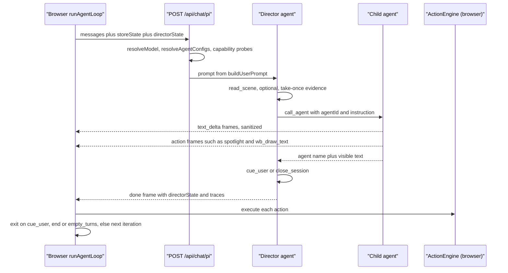
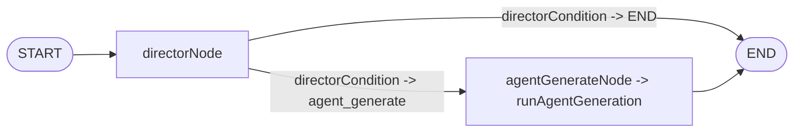
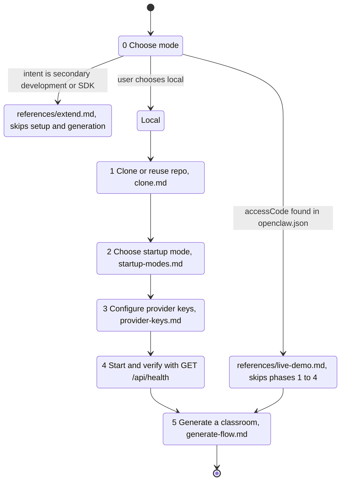
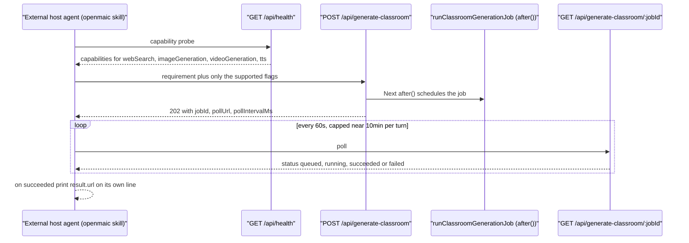

# Traced flows — classroom runtime and the external driver

## Flow E — one in-class round (Pi director path)

The browser owns the loop. Each iteration is one HTTP request; the server keeps
no state between them.

| # | Hop | Where |
| --- | --- | --- |
| 1 | `runAgentLoop(request, callbacks, signal)` iteration begins; `callbacks.getStoreState()` re-reads stage/scenes/whiteboard/quiz state | `lib/chat/agent-loop.ts:154`, `:170` |
| 2 | `callbacks.fetchChat(body, signal)` POSTs `{messages, storeState, config, directorState, userProfile, apiKey, baseUrl, model, providerType, thinkingConfig}` | `agent-loop.ts:181-195` |
| 3 | `POST /api/chat/pi`; `isPiChatEnabled()` → 404 if off | `app/api/chat/pi/route.ts:42-45` |
| 4 | validate `messages`, `storeState`, `config.agentIds` (non-empty, unique, trimmed) | `route.ts:56-90` |
| 5 | `resolveSlideElementReference(body)` — the user's selected slide element, or a 400 on `ElementReferenceValidationError` | `route.ts:70`, `lib/chat/pi/element-reference.ts` |
| 6 | `resolveModel({modelString, stage:'chat-adapter', apiKey, baseUrl, providerType, thinkingConfig})`; 401 when the provider needs a key and none resolved | `route.ts:98-111` |
| 7 | `resolveAgentConfigs(body)` — request `agentConfigs` overrides win over `useAgentRegistry`; unknown ids → 400 | `lib/chat/pi/config.ts:10`, `route.ts:113-129` |
| 8 | `getPiMaxAgentTurns(body)` / `getPiMaxActionsPerAgent(body)` — clamped to 6 / 8 | `config.ts:27`, `:35` |
| 9 | whiteboard capability probe: native runtime flag + `piEnableWhiteboardTools` + agent declares a `wb_*` action + `NEXT_PUBLIC_PERSISTENCE=1` + `DATABASE_URL` + `PERSISTENCE_DEV_TOKEN` + `authenticatePersistenceHeaders(req.headers).learnerKey` → `createWhiteboardRuntimeService` | `route.ts:159-187` |
| 10 | `resolveClassroomWebSearchConfig(...)` for the native child (400 on bad config) | `route.ts:188-203` |
| 11 | `TransformStream` + `send: SendEvent` writing `data: <json>\n\n`; 15 s `:heartbeat` ticker | `route.ts:135-140`, `:210-221` |
| 12 | `runPiDirectorLoop(opts)` | `lib/chat/pi/director-loop.ts:29` |
| 13 | `createCallLlmStreamFn({..., source:'pi-chat-director'})` and `createDirectorCompactionRuntime({streamFn, contextWindow, maxOutputTokens})` | `director-loop.ts:118`, `:125` |
| 14 | four director tools built: `buildReadSceneTool`, `buildCallAgentTool`, `buildCloseSessionTool`, `buildCueUserTool` | `director-loop.ts:131-208` |
| 15 | `buildAgent({streamFn, systemPrompt: buildDirectorPrompt(...), tools, allowedToolNames, history: toHistoryMessages(...), transformContext: compactionRuntime.transformContext, convertToLlm, afterToolCall})` | `director-loop.ts:210-245` |
| 16 | `director.prompt(buildUserPrompt(body, elementReference?.directorSummary))` then `director.waitForIdle()` | `director-loop.ts:248-249` |
| 17 | model calls `read_scene` → evidence packet stashed in `pendingSceneEvidence` (take-once) | `director-loop.ts:134-136` |
| 18 | model calls `call_agent{agentId, instruction}` → six skip guards, then `agent_start` SSE frame | `tools/call-agent.ts:579-662`, `:722-731` |
| 19 | **native** child: `runNativeChild({streamFn, systemPrompt: buildNativeChildPrompt(...), prompt: buildNativeChildTurnPrompt(...), tools, allowedToolNames, timeoutMs: 60_000, maxProviderTransports: 5, onVisibleTextDelta, onDispatchedAction})` | `call-agent.ts:772-808` |
| 20 | child tools per agent: `buildNativeSpotlightTool` (only with an authorised element set), `buildNativeWhiteboardTools` (only with a service + stage + learner key), `buildNativeWebSearchTool` | `call-agent.ts:741-767` |
| 21 | each visible text delta passes `createVisibleSpeechDeltaSanitizer()` before `send({type:'text_delta'})` | `call-agent.ts:769`, `:798-803`, `prompts.ts:437` |
| 22 | `agent_end` frame; `opts.onAgentDone(summary)` pushes an `AgentTurnSummary` into `piAgentResponses` | `call-agent.ts:820-828`, `director-loop.ts:143-147` |
| 23 | **legacy** child instead: `buildAgent({tools: [], allowedToolNames: new Set()})`; text stream fed through `parseStructuredChunk`, each parsed action `validateActionParams` then dispatched | `call-agent.ts:874-899`, `:252`, `:405` |
| 24 | director's `afterToolCall` records `directorToolTrace` and terminates on `sessionClosed \|\| userCued \|\| directorToolCalls >= maxDirectorToolCalls` | `director-loop.ts:218-244` |
| 25 | post-loop: if content exists and neither `close_session` nor `cue_user` fired, the loop cues the user itself | `director-loop.ts:256-258` |
| 26 | terminal `done` frame carries `{totalActions, totalAgents, agentHadContent, cueUserReceived, sessionClosed, endReason, directorCompaction, directorToolTrace, directorState}` | `director-loop.ts:260-282` |
| 27 | browser `callbacks.onEvent` per frame; `callbacks.onIterationEnd()` returns the iteration result | `agent-loop.ts:218-239` |
| 28 | client `ActionEngine` executes each action (`spotlight`, `wb_*`, `speech`, `play_video`, `widget_*`) | `lib/action/engine.ts:234-283` |
| 29 | loop exit or next iteration with the accumulated `directorState` | `agent-loop.ts:242-271` |

### The same round on the LangGraph path

`POST /api/chat` (`app/api/chat/route.ts:44`) → `statelessGenerate`
(`lib/orchestration/stateless-generate.ts:392`) → `createOrchestrationGraph()`
(`director-graph.ts:484`) → `graph.stream(initialState, {streamMode:'custom'})`
→ `directorNode` (`:103`) → `directorCondition` (`:225`) →
`agentGenerateNode` (`:434`) → `runAgentGeneration` (`:235`) → END. One
director→agent cycle per request by topology (`:479-482`); the browser loop is
what produces a multi-turn discussion. `statelessGenerate` reassembles
`directorState` itself from the frames it observes (`:460-491`).

## Flow F — an external workbench driving OpenMAIC end to end

`skills/openmaic/SKILL.md` is not consumed by any OpenMAIC runtime. It is a
**skill for another agent** (an OpenClaw-style host) that drives an OpenMAIC
*deployment* over HTTP. It ships in this repo and is downloadable as a zip from
`GET /api/skills/openmaic` (`app/api/skills/[id]/route.ts:28-31`, via
`buildOpenClawSkillZip`).

Its frontmatter (`SKILL.md:2-5`) declares `name: openmaic`,
`user-invocable: true`, and a description covering setup, generation and
secondary development. Contents: `SKILL.md` (104 lines) plus eight references —
`clone.md`, `startup-modes.md`, `provider-keys.md`, `generate-flow.md`,
`live-demo.md`, `extend.md`, `extend-sdk.md`, `extend-cookbook.md`.

The SOP is a six-phase, confirmation-heavy state machine (`SKILL.md:52-96`):

Generation, verified against this repo's routes:

| # | Hop | Skill instruction | Repo reality |
| --- | --- | --- | --- |
| 1 | capability probe | `GET {url}/api/health`, read `capabilities` (`generate-flow.md:50-65`) | `app/api/health/route.ts:11` returns `{status, version, capabilities:{webSearch, imageGeneration, videoGeneration, tts}}`; a capability is true only when at least one non-`disabled` provider exists (`:16-21`) |
| 2 | optional PDF | `POST {url}/api/parse-pdf` first, then send `pdfContent` (`generate-flow.md:82-96`) | `app/api/parse-pdf/route.ts` exists |
| 3 | submit | `POST {url}/api/generate-classroom` with `requirement` (+ optional `pdfContent`, `language`, `enableWebSearch`, `enableImageGeneration`, `enableVideoGeneration`, `enableTTS`, `agentMode`) (`generate-flow.md:33-46`) | `app/api/generate-classroom/route.ts:19-36` accepts all of these **except `language`** — see the finding below. Returns 202 `{jobId, status, step, message, pollUrl, pollIntervalMs: 5000}` (`:50-60`) |
| 4 | background work | — | `after(() => runClassroomGenerationJob(jobId, body, baseUrl))` — Next.js `after()`, so the job outlives the response (`route.ts:48`) |
| 5 | poll | `GET {pollUrl}`; prefer ~60 s cadence even though `pollIntervalMs` is 5000; never resubmit; cap active polling at ~10 min per turn (`generate-flow.md:104-120`) | `app/api/generate-classroom/[jobId]/route.ts:14` returns `{jobId, status, …, pollUrl, pollIntervalMs}` |
| 6 | finish | on `succeeded` use `result.classroomId` and `result.url`, printed as a bare URL on its own line (`generate-flow.md:124`, `:139-159`) | job steps are `initializing → researching → generating_outlines → generating_scenes → generating_media → generating_tts → persisting → completed` (`lib/server/classroom-generation.ts:62-70`) |

### Two documented-vs-code discrepancies in the external contract

1. **`language` is documented but not accepted.**
   `skills/openmaic/references/generate-flow.md:37` documents
   `optional language ("zh-CN" | "en-US", defaults to "zh-CN") — any other value
   silently falls back to "zh-CN"`. `GenerateClassroomInput`
   (`lib/server/classroom-generation.ts:48-60`) has no `language` member and
   `app/api/generate-classroom/route.ts:19-36` builds the input by explicit
   field copy, so a `language` in the body is silently dropped. The generator
   derives a `languageDirective` internally instead
   (`classroom-generation.ts:126`, `:492`). A driver that sets
   `language: "en-US"` will get whatever the model infers, with no error.
2. **`Authorization: Bearer <access-code>` is not an auth mechanism in this
   repo.** `live-demo.md:12-13` and `generate-flow.md:12` tell the driver to send
   that header on every request. The only access gate in the tree is
   `middleware.ts:60-85`: when `ACCESS_CODE` is set, requests need a valid
   HMAC-signed `openmaic_access` **cookie** (minted by
   `POST /api/access-code/verify`), and any other `/api/*` request gets
   `401 {errorCode:'INVALID_REQUEST', error:'Access code required'}`. Only
   `/api/health` and `/api/access-code/*` are whitelisted
   (`middleware.ts:66-68`). *Inferred:* the hosted Live Demo at
   `open.maic.chat` terminates the Bearer header at a gateway that is not in
   this repository — see `07-open-questions.md`.
