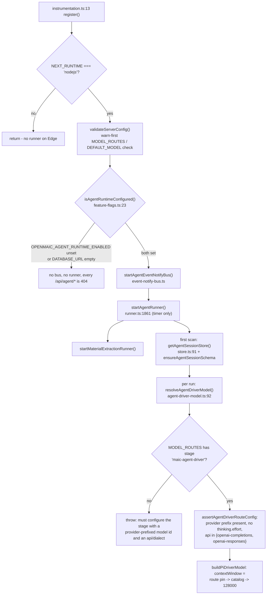
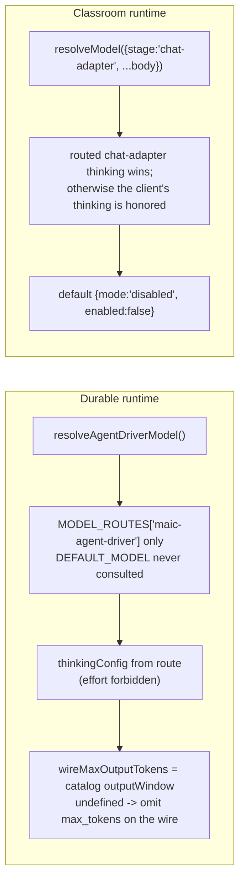

# Dependencies and configuration

## External dependencies

Versions from `package.json` (grep for the exact lines is recorded in
`06-quality-and-metrics.md`).

| Package | Version | Used for | Evidence |
| --- | --- | --- | --- |
| `@earendil-works/pi-agent-core` | `0.78.0` (exact, no caret) | the agent loop itself: `Agent`, `Session`, `loadSkills`, `compact`/`prepareCompaction`, `InMemorySessionRepo`, `convertToLlm` | [`package.json:52`](package.json#L52); [`lib/agent/runtime/build-agent.ts:10`](lib/agent/runtime/build-agent.ts#L10), [`lib/server/agent-runtime/runner.ts:9`](lib/server/agent-runtime/runner.ts#L9), [`lib/chat/pi/director-compaction.ts:1`](lib/chat/pi/director-compaction.ts#L1) |
| `@earendil-works/pi-ai` | `0.78.0` (exact) | event protocol and message types: `AssistantMessage`, `AssistantMessageEvent`, `ToolCall`, `Model`, `Api`, `registerApiProvider` | [`package.json:53`](package.json#L53); [`lib/agent/runtime/stream-fn.ts:14`](lib/agent/runtime/stream-fn.ts#L14), [`lib/chat/pi/director-compaction.ts:13`](lib/chat/pi/director-compaction.ts#L13) |
| `ai` (Vercel AI SDK v6) | see `package.json` | the actual provider transport, behind `streamLLM`; `jsonSchema`, `stepCountIs`, `tool` | [`lib/agent/runtime/stream-fn.ts:27-36`](lib/agent/runtime/stream-fn.ts#L27-L36), [`:400`](lib/agent/runtime/stream-fn.ts#L400) |
| `typebox` | `^1.1.39` | every tool parameter schema (`Type.Object`, `Static`) | [`package.json:161`](package.json#L161); [`lib/server/agent-runtime/dsl-tools.ts:1`](lib/server/agent-runtime/dsl-tools.ts#L1), [`lib/chat/pi/tools/native-whiteboard.ts:14`](lib/chat/pi/tools/native-whiteboard.ts#L14) |
| `@langchain/langgraph` | `^1.1.1` | the older director `StateGraph` | [`package.json:70`](package.json#L70); [`lib/orchestration/director-graph.ts:24`](lib/orchestration/director-graph.ts#L24) |
| `@langchain/core` | `^1.1.16` | `SystemMessage`/`HumanMessage`/`AIMessage` for that graph | [`package.json:69`](package.json#L69); [`director-graph.ts:25`](lib/orchestration/director-graph.ts#L25) |
| `partial-json` | `^0.1.7` | incremental parse of the classroom child's JSON-array output | [`package.json:124`](package.json#L124); used by [`lib/orchestration/stateless-generate.ts:136`](lib/orchestration/stateless-generate.ts#L136) |
| `pg` | — | `PgAgentSessionStore` pool and the dedicated LISTEN client | [`lib/server/agent-runtime/store.ts:8`](lib/server/agent-runtime/store.ts#L8), [`event-notify-bus.ts:18`](lib/server/agent-runtime/event-notify-bus.ts#L18) |
| `js-yaml` | `4.3.0` | reading a skill's `title` frontmatter (same slice pi parses) | [`package.json:107`](package.json#L107); [`lib/server/agent-runtime/skills.ts:38`](lib/server/agent-runtime/skills.ts#L38), [`:253`](lib/server/agent-runtime/skills.ts#L253) |
| `nanoid` | `5.1.16` | message ids, compaction source ids, job ids | [`package.json:118`](package.json#L118); [`lib/chat/pi/director-compaction.ts:23`](lib/chat/pi/director-compaction.ts#L23) |
| `katex` | — | server-side LaTeX render for `wb_draw_latex` | [`lib/chat/pi/tools/native-whiteboard.ts:17`](lib/chat/pi/tools/native-whiteboard.ts#L17) |
| `@openmaic/storage` (workspace) | — | `PgAgentSessionStore`, entry tree, user-skill store, `AgentSessionLeaseLostError`, `RuntimeAppendConflictError`, `extractObservedUrls` | [`lib/server/agent-runtime/store.ts:1-7`](lib/server/agent-runtime/store.ts#L1-L7), `runner.ts:10-16`, [`native-whiteboard.ts:13`](lib/chat/pi/tools/native-whiteboard.ts#L13) |
| `@openmaic/dsl` (workspace) | — | `Stage`, `PPT*Element` types the tools write | [`lib/server/agent-runtime/course-tools.ts:32`](lib/server/agent-runtime/course-tools.ts#L32), [`native-whiteboard.ts:1-11`](lib/chat/pi/tools/native-whiteboard.ts#L1-L11) |
| `@openmaic/generation` (workspace) | — | `AgentInfo` for the generation pipeline | [`lib/orchestration/registry/store.ts:15`](lib/orchestration/registry/store.ts#L15) |
| `zustand` | — | the client agent registry (`persist` middleware, localStorage) | [`lib/orchestration/registry/store.ts:6-7`](lib/orchestration/registry/store.ts#L6-L7) |
| `lucide-react` | — | tool-row icons (icons are part of a tool's identity, [`tool-presentation.ts:43-46`](components/workbench/chat/tool-presentation.ts#L43-L46)) | [`components/workbench/chat/tool-presentation.ts:52-74`](components/workbench/chat/tool-presentation.ts#L52-L74) |

### Vendoring posture

`lib/agent/VENDOR.md` records the intent: baseline tag `0.78.0`, MIT, pinned
exactly for reproducible installs, and an explicit **do not vendor until you
need to modify the loop** rule with a four-step fork procedure
([`VENDOR.md:25-34`](lib/agent/VENDOR.md#fork--vendor-rule)). It also records what is deliberately *not* used: pi-ai's
provider implementations (LLM calls go through this project's connector),
`pi-tui`, and `pi-coding-agent` ([`VENDOR.md:14-17`](lib/agent/VENDOR.md#what-we-use)).

## Configuration resolution

`isAgentRuntimeConfigured()` is deliberately two conditions: the flag reports
intent, `DATABASE_URL` reports usability, and `GET /api/agent/runtime` exposes
both separately so a client can distinguish "off by choice" from "on but
unusable" ([`app/api/agent/runtime/route.ts:1-13`](app/api/agent/runtime/route.ts#L1-L13)).

Note the ordering guarantee [`instrumentation.ts:3-11`](instrumentation.ts#L3-L11) relies on: Next calls
`register` once per server instance before serving a request, which is why the
scan timer lives there and not in a route module. `startAgentRunner` installs
only a timer — store and schema construction stay behind the lazy promise so
`register()` never blocks on I/O ([`instrumentation.ts:46-47`](instrumentation.ts#L46-L47)).

## Environment variables

### Durable agent runtime

| Name | Required | Effect | Evidence |
| --- | --- | --- | --- |
| `OPENMAIC_AGENT_RUNTIME_ENABLED` | yes, to use the runtime at all | `'true'`/`'1'` enables the durable runtime; anything else disables it | [`lib/config/feature-flags.ts:19`](lib/config/feature-flags.ts#L19), [`.env.example:347`](.env.example#L347) |
| `DATABASE_URL` | yes, with the flag | the store rejects with `Agent runtime requires DATABASE_URL` when unset | [`lib/server/agent-runtime/store.ts:92-94`](lib/server/agent-runtime/store.ts#L92-L94), [`feature-flags.ts:24`](lib/config/feature-flags.ts#L24) |
| `MODEL_ROUTES` | yes, must contain stage `maic-agent-driver` | JSON route map; the driver route must carry a provider-prefixed model id and an OpenAI-compatible `api`, and must not set `thinking.effort` | [`lib/server/model-routes.ts:218`](lib/server/model-routes.ts#L218), [`agent-driver-model.ts:22-55`](lib/server/agent-runtime/agent-driver-model.ts#L22-L55), [`.env.example:355-365`](.env.example#L355-L365) |
| `OPENMAIC_AGENT_RUNTIME_SCAN_INTERVAL_MS` | no (1000) | claim-scan period | `config.ts:7` |
| `OPENMAIC_AGENT_RUNTIME_HEARTBEAT_MS` | no (2000) | lease heartbeat period | `config.ts:9` |
| `OPENMAIC_AGENT_RUNTIME_LEASE_TTL_MS` | no (10000) | after this, a running session is orphaned and reclaimable | `config.ts:15` |
| `OPENMAIC_AGENT_RUNTIME_MAX_CONCURRENT` | no (2) | sessions one app instance runs at once | `config.ts:17` |
| `OPENMAIC_AGENT_RUNTIME_MAX_ATTEMPTS` | no (5) | consecutive unattended starts/resumes before a verdict-only claim | `config.ts:19` |
| `OPENMAIC_AGENT_TOOL_TIMEOUT_MS` | no (600000) | default per-tool-call budget; per-tool overrides win over it | [`tool-timeout.ts:48-59`](lib/agent/runtime/tool-timeout.ts#L48-L59), [`.env.example:379`](.env.example#L379) |
| `OPENMAIC_AGENT_COMPACTION_ENABLED` | no (off) | native conversation compaction for the durable runner — **opt-in**, a deliberate inversion of the reference runtime's opt-out default | `config.ts:27-28` |
| `OPENMAIC_AGENT_COMPACTION_RESERVE_TOKENS` | no | only forwarded when set | `config.ts:29-33` |
| `OPENMAIC_AGENT_COMPACTION_KEEP_RECENT_TOKENS` | no | only forwarded when set | `config.ts:34-41` |
| `OPENMAIC_AGENT_SKILLS_DIR` | no (`<cwd>/skills/agent-runtime`) | where builtin skills are loaded from, so a deployment can mount its own set | `config.ts:44`, [`skills.ts:50`](lib/server/agent-runtime/skills.ts#L50) |
| `OPENMAIC_AGENT_MAX_UPLOAD_BYTES` | no (50 MiB) | audio/video upload ceiling | `config.ts:46` |
| `MATERIALS_MAX_DOCUMENT_BYTES` | no (50 MiB) | document/image cap | `config.ts:48` |
| `MATERIALS_MAX_COUNT_PER_OWNER` | no (100) | active material records per owner | `config.ts:50` |
| `MATERIALS_MAX_TOTAL_BYTES_PER_OWNER` | no (2 GiB) | aggregate material bytes per owner | `config.ts:52-55` |
| `FETCH_URL_BLOCKED_MARKERS` | no | extra comma-joined markers that make fetched content count as blocked | [`fetch-url.ts:417`](lib/server/agent-runtime/fetch-url.ts#L417) |
| `FETCH_URL_MIN_CONTENT_CHARS` | no | minimum extracted length before `fetch_url` treats a page as empty | [`fetch-url.ts:412`](lib/server/agent-runtime/fetch-url.ts#L412) |
| `DEFAULT_IMAGE_PROVIDER` | no | operator's preferred image provider for `generate_image`; explicitly cannot select a disabled provider or bypass the capability gate | [`generate-image.ts:180-190`](lib/server/agent-runtime/generate-image.ts#L180-L190), [`:228`](lib/server/agent-runtime/generate-image.ts#L228) |
| `NEXT_PUBLIC_PRO_WORKBENCH_ENABLED` | build-time, to reach the UI | gates `/workbench` in middleware; both halves must be on | [`feature-flags.ts:33`](lib/config/feature-flags.ts#L33), [`middleware.ts:54-58`](middleware.ts#L54-L58) |
| `NODE_ENV` | — | adds `Secure` to the anonymous owner cookie in production | [`owner.ts:23`](lib/server/agent-runtime/owner.ts#L23) |
| `NEXT_RUNTIME` | — | `register()` returns early on Edge so `pg` never enters that bundle | [`instrumentation.ts:16`](instrumentation.ts#L16) |

### In-class chat runtime

| Name | Required | Effect | Evidence |
| --- | --- | --- | --- |
| `NEXT_PUBLIC_PI_CHAT_ENABLED` | yes for the Pi path | selects the Pi client runtime **and** gates `POST /api/chat/pi` (404 when off) | [`feature-flags.ts:72`](lib/config/feature-flags.ts#L72), [`app/api/chat/pi/route.ts:43`](app/api/chat/pi/route.ts#L43) |
| `OPENMAIC_ENABLE_PI_NATIVE_CHILD_RUNTIME` | no (off → legacy) | server-only selector between the native tool-calling child and the legacy JSON-action child | [`feature-flags.ts:80`](lib/config/feature-flags.ts#L80), [`app/api/chat/pi/route.ts:150`](app/api/chat/pi/route.ts#L150) |
| `OPENMAIC_ENABLE_PI_NATIVE_CHILD_SPOTLIGHT` | no (off) | capability gate for the native `spotlight` tool; has no effect on the legacy harness | [`feature-flags.ts:88`](lib/config/feature-flags.ts#L88), `route.ts:151` |
| `NEXT_PUBLIC_PERSISTENCE` | `'1'` for durable whiteboard | one of four preconditions for the `wb_*` toolset | [`app/api/chat/pi/route.ts:169`](app/api/chat/pi/route.ts#L169) |
| `PERSISTENCE_DEV_TOKEN` | with the above | development-only learner authentication for whiteboard writes | `route.ts:171`, [`.env.example:496-503`](.env.example#L496-L503) |
| `ACCESS_CODE` | no | when set, `middleware.ts` requires a valid HMAC `openmaic_access` cookie on everything except `/api/health` and `/api/access-code/*` | [`middleware.ts:60-85`](middleware.ts#L60-L85) |

Request-level knobs the classroom path accepts but **clamps**: `piMaxAgentTurns`
and `piMaxActionsPerAgent` are floored at 1 and capped at 6 / 8 respectively
([`lib/chat/pi/config.ts:5-8`](lib/chat/pi/config.ts#L5-L8), [`:43-46`](lib/chat/pi/config.ts#L43-L46)), so a client cannot raise the loop
bounds. `piEnableWhiteboardTools` is a plain boolean in `body.config`
(`route.ts:149`).

## Model / thinking resolution for each runtime

The durable runtime's `wireMaxOutputTokens` distinction is load-bearing:
`buildPiDriverModel` sets `Model.maxTokens` to the catalog output window or
8192 purely as an internal compaction reservation, while
`resolveAgentDriverModel` returns an independent `wireMaxOutputTokens` that may
be `undefined` so it never becomes an API cap
([`agent-driver-model.ts:83-108`](lib/server/agent-runtime/agent-driver-model.ts#L83-L108)), and `createCallLlmStreamFn` honours
`omitMaxOutputTokens` by never sending a cap even when pi supplies one
([`stream-fn.ts:143-149`](lib/agent/runtime/stream-fn.ts#L143-L149), [`:394-399`](lib/agent/runtime/stream-fn.ts#L394-L399)).

## Skill assets on disk

`skills/agent-runtime/` holds **23** builtin skill directories, **9** of which
carry an `outline-constraints.json` sibling (measured — command in
`06-quality-and-metrics.md`). The constraint file is deliberately a *separate*
file from the frontmatter: "the frontmatter is the model-visible contract, this
is the checker's, and mixing them means every schema tweak edits the thing the
model reads" ([`skills.ts:182-185`](lib/server/agent-runtime/skills.ts#L182-L185)).

| With constraints | Without |
| --- | --- |
| `deep-interactive`, `deep-research`, `lecture-style`, `pptx-import`, `pro-editing`, `style-clone`, `teacher-style-clone`, `vocational`, `workshop-style` | `build-personal-skill`, `curriculum-planner`, `fact-check`, `feynman-learning`, `k12-core-literacy-planning`, `learning-to-learn`, `page-clone`, `slide-craft`, `slide-dsl`, `social-emotional-learning`, `spiral-curriculum`, `stage-design`, `stage-dsl`, `understanding-by-design` |

`skills/openmaic/` is *not* in `skillsDir` and is never loaded by a runtime — it
is the externally-consumed driver skill (see `03b-flows-classroom-and-external.md`).
