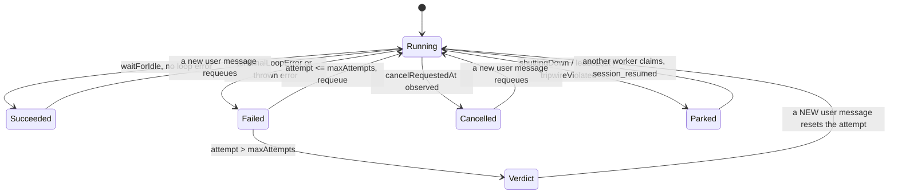
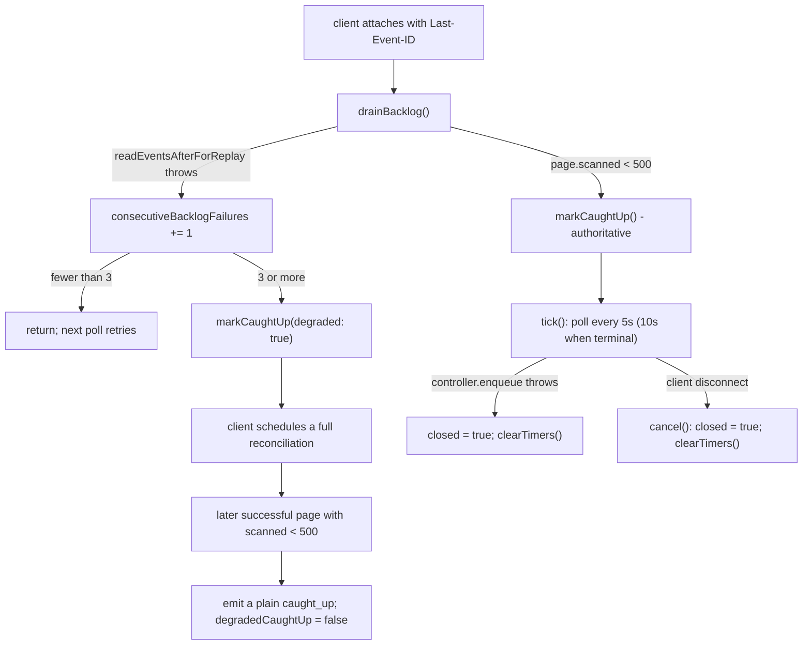

# Failure modes

## Durable runtime — terminal vs non-terminal exits

The single most important distinction: `session_end` is terminal and settles the
row; `session_interrupted` is **not** terminal — the row stays `running` and the
instance that steals the lease appends `session_resumed`
([`lib/agent-runtime/lifecycle.ts:42-47`](lib/agent-runtime/lifecycle.ts#L42-L47)).

## Failure catalogue

| Failure | Detected by | Behaviour |
| --- | --- | --- |
| **Lease lost** (another worker stole it, or the heartbeat says so) | `store.heartbeat` returns false (`runner.ts:1093`), or any write throws something whose `cause` chain reaches `AgentSessionLeaseLostError` (`isLeaseLostError`, `runner.ts:117`) | `markLeaseLost()` → `leaseLost = true` + `abort.abort()`. Every subsequent `emit` is dropped (`runner.ts:999`) because both the event log and the entry tree already reject this generation. The **new owner's `session_resumed` frame is the durable interruption marker** — no `session_interrupted` is written. `releaseLease` is skipped (`:1761`, `:1804`). |
| **Critical entry write failed** (not a lease problem) | `enqueue(write, critical = true)` catch (`runner.ts:920-932`) | `entryWritesHealthy = false`, `criticalWriteError` recorded, `abort.abort()`. Every later critical write is skipped (`:917`). `flushAll(true)` re-throws so the run cannot settle successfully on a broken tree (`:935-940`). |
| **Non-critical event write failed** | same catch, `critical = false` | logged at `error` and swallowed; the run continues. Losing a telemetry frame is not allowed to kill the conversation. |
| **Event-order tripwire** — the first frame of a run is not a lifecycle frame | `markRunEventEmitted` (`runner.ts:317`) called from `emit` | logs `TRIPWIRE VIOLATION session <id>: first runner event must be lifecycle, got <type>`, aborts the run, and the run parks with `reason: 'runner event-order tripwire'` (`:1751-1759`). This is a *runtime assertion about the runner's own code*, not about model behaviour. |
| **Attempt cap exceeded** | `isOverAttemptCap(meta)` at the top of `runSession` (`:1070`) | The claim is a **verdict-only claim**: no model call at all. Emits `session_end failed` with `session failed <maxAttempts> consecutive unattended attempts; send a new message to retry`, then `finishSession`, then `requeueIfUndelivered('over-cap verdict', atVerdict = true)`. A message posted *after* the claim still gets one attended redemption through the common check (`:1068-1069`). |
| **Model output truncated at the token limit** | `terminalLoopError` sees the last assistant frame's `stopReason === 'length'` (`runner.ts:324-333`) | `status = 'failed'` with `LENGTH_STOP_ERROR` = "model output hit the max token limit and was truncated; this run did not finish". Separately, [`build-agent.ts:103-116`](lib/agent/runtime/build-agent.ts#L103-L116) arms a **terminal barrier** when the length-truncated frame also carried tool calls: `agent.clearAllQueues()` and `steer`/`followUp` become no-ops until `agent_end`, so a queued follow-up is not fed into a wedged turn. |
| **Tool hangs** | `withAgentToolTimeout` race ([`tool-timeout.ts:111-201`](lib/agent/runtime/tool-timeout.ts#L111-L201)) | Rejects with `AgentToolTimeoutError` after 10 min (15 min for `generate_scene` / `generate_actions` / `extract_material`). pi converts the rejection into an error tool result, so *the agent sees the failure and can retry or proceed — the session does not die* ([`tool-timeout.ts:19-22`](lib/agent/runtime/tool-timeout.ts#L19-L22)). The derived signal is aborted so the tool's own in-flight work is cancelled, and a throwing abort listener cannot break race settlement ([`:132-138`](lib/agent/runtime/tool-timeout.ts#L132-L138)). |
| **Tool aborted by cancel / shutdown / lease loss** | same wrapper, outer-signal branch | `AgentToolAbortedError`. |
| **Orphaned tool call** (assistant frame persisted, result never was) | `trackToolCallMessage` keeps `inFlightToolCalls` (`runner.ts:1505`, [`tool-call-integrity.ts:203`](lib/server/agent-runtime/tool-call-integrity.ts#L203)) | `queueInterruptedToolResults()` (`runner.ts:1540`) appends `interruptedToolResult` receipts through the *same attempt-fenced storage* as normal messages, resolved only after all preceding appends drain, so a result that did land removes itself first (`:1543-1555`). At read time `repairOrphanedToolCalls` synthesizes the same shape without persisting it ([`tool-call-integrity.ts:109`](lib/server/agent-runtime/tool-call-integrity.ts#L109)). The receipt body is `{"ok":false,"error":"interrupted","message":"This tool call was interrupted before a result was recorded."}` ([`:20-24`](lib/server/agent-runtime/tool-call-integrity.ts#L20-L24)). |
| **Non-contiguous tool results** (parallel tools finishing during an abort unwind) | `repairOrphanedToolCalls` contiguity check ([`tool-call-integrity.ts:135-152`](lib/server/agent-runtime/tool-call-integrity.ts#L135-L152)) | The model-facing view is rebuilt: results move next to their owning assistant in call order, duplicate receipts are dropped from the view, and interrupted unwind frames are omitted. The entry tree stays an immutable audit trail ([`:104-107`](lib/server/agent-runtime/tool-call-integrity.ts#L104-L107)). |
| **Corrupt / inconsistent entry tree** | `loadSessionEntryHistory` ([`entry-tree-storage.ts:43`](lib/server/agent-runtime/entry-tree-storage.ts#L43)) | Throws `SessionEntryHistoryError` for: an empty tree after a prior run ([`:49-51`](lib/server/agent-runtime/entry-tree-storage.ts#L49-L51)), a compaction whose `firstKeptEntryId` is not backward ([`:66-72`](lib/server/agent-runtime/entry-tree-storage.ts#L66-L72)), and a context↔entry mapping length mismatch ([`:109-114`](lib/server/agent-runtime/entry-tree-storage.ts#L109-L114)). The throw lands in the outer setup catch → `session_end failed` (or park if shutting down). |
| **Session vanished mid-open** (concurrent soft-delete) | `translateStorageError` ([`entry-tree-storage.ts:148-150`](lib/server/agent-runtime/entry-tree-storage.ts#L148-L150)) | Classified as pi `SessionError('not_found')` rather than an opaque error. |
| **Session's frozen skill is unavailable** | `runner.ts:1181` | Hard error: `session skill "<id>" is unavailable for its owner` → `session_end failed`. Deliberately checked at claim time, not create time, *and* validated at create time by the route so a typo does not sit queued ([`app/api/agent/sessions/route.ts:93-116`](app/api/agent/sessions/route.ts#L93-L116)). |
| **A named skill's file cannot be read** | `buildSkillPreload` per-skill try/catch ([`skill-preload.ts:276-282`](lib/server/agent-runtime/skill-preload.ts#L276-L282), [`:304-314`](lib/server/agent-runtime/skill-preload.ts#L304-L314)) | **Never throws.** The skill becomes `deferred`, its location is named in the appended note (`deferredNote`, [`:189`](lib/server/agent-runtime/skill-preload.ts#L189)), `onSkipped` fires a `trace` lifecycle event (`runner.ts:1661-1664`), and the run continues degraded. |
| **A skill exceeds the preload budget** | `spent + bytes > maxBytes` ([`skill-preload.ts:336`](lib/server/agent-runtime/skill-preload.ts#L336)) | deferred with reason `over the 60000-byte preload budget`; the **first** named skill is admitted regardless of size so `/slide-dsl` can never silently do nothing ([`:133-137`](lib/server/agent-runtime/skill-preload.ts#L133-L137)). |
| **A skill is longer than pi's default read window** | historical bug, fixed at [`skill-preload.ts:316-331`](lib/server/agent-runtime/skill-preload.ts#L316-L331) | The synthesized read now passes an explicit `limit: lines.length`. With the old default 2000-line slice, `readProvesCoverage` correctly refused the record and every turn re-injected the same prefix — "the tail never arrived and every turn paid for the head twice". |
| **`create_skill` database failure** | [`create-skill.ts:66-79`](lib/server/agent-runtime/create-skill.ts#L66-L79) | Returns `isError` with `details.error = 'database-error'` and the user-facing text "The Skill could not be saved right now; please retry later. **Nothing was created or overwritten.**" `UserSkillError` messages pass through verbatim with their code. |
| **Foreign / missing / tombstoned stage** | `withOwnerStageAuthorization` ([`course-tools.ts:174-185`](lib/server/agent-runtime/course-tools.ts#L174-L185)) | One `isError` result — "The stage was not found, or does not belong to this session user. Use list_folder_stages to see the stages you can work on." — that deliberately never reveals which of the three states it was. |
| **Patch batch partially valid** | `patch_stage` per-op loop ([`dsl-tools.ts:793-810`](lib/server/agent-runtime/dsl-tools.ts#L793-L810)) | Nothing is persisted; the result names `failedOp`. Same for the final-state media-placeholder guard ([`:819-826`](lib/server/agent-runtime/dsl-tools.ts#L819-L826)) and the structure validation ([`:827-834`](lib/server/agent-runtime/dsl-tools.ts#L827-L834)). |
| **`grep_stage` blowing the time/char budget** | `performance.now() >= deadline` or `scannedChars >= 1_000_000` ([`dsl-tools.ts:910`](lib/server/agent-runtime/dsl-tools.ts#L910)) | Returns a truncated result with a continuation cursor bound to `{stageId, query, scope}`; a mismatched cursor is `Invalid or mismatched grep_stage cursor.` ([`:888`](lib/server/agent-runtime/dsl-tools.ts#L888)). Source-scope search runs over the media-omitted projection so a page with tens of MB of inline data URLs cannot block the event loop before the budget applies ([`:735-746`](lib/server/agent-runtime/dsl-tools.ts#L735-L746)). |
| **Undelivered user message at a terminal exit** | `requeueIfUndelivered` → `planUndeliveredRequeue` (`runner.ts:1047`, `:338`) | `reset` (a message newer than the claim watermark → `requeueSession`, attempt reset), `retry` (stranded within the claim → `requeueForRetry`, attempt preserved), or `none`. Failure of the check itself is logged at `warn` and swallowed (`:1063-1065`). |
| **Runner shutdown mid-run** | `ctx.shuttingDown && abort.signal.aborted && !cancelled` (`runner.ts:1750`) | Park: `session_interrupted{reason:'runner shutdown'}`, `releaseLease`, log `session <id> parked at attempt <attempt>`. `stop()` waits up to 15 s and warns if sessions are still settling (`:1912-1919`). [`instrumentation.ts:58-95`](instrumentation.ts#L58-L95) orders shutdown so sessions are parked **before** the pool closes. |
| **`runSession` itself crashes** | `void runSession(...).catch(...)` in the scan (`runner.ts:1880`) | logged and `ctx.running.delete(meta.id)` so the slot is not leaked; the lease then expires normally. |
| **Claim scan throws** | `scan()` catch (`runner.ts:1885`) | logged as `claim scan failed`; `scanning` is reset in `finally` so the next tick retries. |
| **Store initialization fails** | `getAgentSessionStore` (`store.ts:101-107`) | The cached promise is cleared so a later request retries after the database comes back. |

## SSE reader failures

- Pagination judges by the **raw** page size (`page.scanned`), not the compacted
  length, because a page of pure `message_update` frames compacts to two frames
  and would otherwise look exhausted mid-log
  (`app/api/agent/sessions/[id]/events/route.ts:202-205`).
- Polls are serialized: the next poll is scheduled only after the previous one
  *settles*, because two concurrent polls share the cursor and the slower one
  would rewind it (`:255-272`).
- The stream does **not** close at `session_end` — a run boundary is just another
  frame (`:19-23`). A terminal `session_end` switches to the 10 s cadence, and
  any later durable frame switches back (`:174-185`).
- A disconnect closes the reader and nothing else: the runner keeps running and
  its events keep landing in the log (`:30-33`).

## Classroom runtime failures

| Failure | Behaviour |
| --- | --- |
| Feature flag off | `POST /api/chat/pi` → 404 `Pi chat runtime is disabled` ([`app/api/chat/pi/route.ts:43-45`](app/api/chat/pi/route.ts#L43-L45)) |
| Missing `messages` / `storeState` / `config.agentIds` | 400 `MISSING_REQUIRED_FIELD` (`route.ts:56-66`) |
| `agentIds` not unique / blank / untrimmed | 400 with the exact constraint spelled out (`route.ts:79-90`) |
| Unknown agent ids after `resolveAgentConfigs` | 400 listing them (`route.ts:116-122`) |
| Provider needs a key, none resolved | 401 `MISSING_API_KEY` (`route.ts:109-111`) |
| Bad element reference | 400 from `ElementReferenceValidationError` (`route.ts:72-75`) |
| Bad web-search config | 400 with the underlying message (`route.ts:200-203`) |
| Persistence init fails during the whiteboard probe | `log.warn('Native whiteboard capability unavailable: persistence initialization failed')` and the `wb_*` tools are simply not registered (`route.ts:183-186`) |
| Mid-stream error | `send({type:'error', data:{message}})` then close; if the request was aborted, close silently without an error frame (`route.ts:261-283`) |
| Idle SSE connection | `:heartbeat` comment every 15 s (`route.ts:212-215`); on write failure the heartbeat stops itself |
| Child agent hangs | `runNativeChild` `timeoutMs: 60_000` → `status: 'exhausted'`, `stopReason: 'native_timeout'` ([`run-native-child.ts:337-339`](lib/agent/runtime/run-native-child.ts#L337-L339)) |
| Child loops on provider calls | `maxProviderTransports: 5` → `stopReason: 'native_provider_transport_budget'` ([`run-native-child.ts:232-235`](lib/agent/runtime/run-native-child.ts#L232-L235), [`:24`](lib/agent/runtime/run-native-child.ts#L24)) |
| Child re-issues the same `toolCallId` | `stopReason: 'native_duplicate_tool_call'` ([`run-native-child.ts:266-273`](lib/agent/runtime/run-native-child.ts#L266-L273)) |
| Child hits the output token limit | `status: 'exhausted'`, `stopReason: 'output_token_limit'` (`:343-345`) |
| Child produced no assistant frame / errored | `status: 'failed'`, `stopReason` = the error message or `native_child_failed` (`:349-355`) |
| Any non-`completed` child status | `consecutiveEmptyTurns += 1` and the `call_agent` result is marked `isError` ([`call-agent.ts:819`](lib/chat/pi/tools/call-agent.ts#L819), [`:851`](lib/chat/pi/tools/call-agent.ts#L851)) |
| Director exceeds its tool budget | `afterToolCall` returns `terminate: true` at `directorToolCalls >= max(maxAgentTurns*3, maxAgentTurns+3)` ([`director-loop.ts:238`](lib/chat/pi/director-loop.ts#L238)) |
| Whiteboard write races another writer | `RuntimeAppendConflictError` caught in the tool ([`native-whiteboard.ts:500`](lib/chat/pi/tools/native-whiteboard.ts#L500)); the model is told to re-read `expectedLastSeq` |
| Compaction fails | the failure message is pushed onto `trace.failures` and the **pre-compaction** context is returned, so the turn still runs ([`director-compaction.ts:217-220`](lib/chat/pi/director-compaction.ts#L217-L220)) |
| Model emits malformed structured output (legacy child) | `finalizeParser` structurally recovers visible text where possible and `looksLikeStructuredFragment` suppresses residue rather than leaking `{"type":"text"…}` into a chat bubble ([`stateless-generate.ts:264`](lib/orchestration/stateless-generate.ts#L264), [`:327`](lib/orchestration/stateless-generate.ts#L327)) |
| Model emits an unknown action or bad params | `validateActionParams` ([`call-agent.ts:252`](lib/chat/pi/tools/call-agent.ts#L252)) rejects it and an `actionWarnings` entry with reason `unknown_action` / `invalid_params` / `raw_structured_fallback` rides in the turn summary ([`lib/orchestration/types.ts:40-44`](lib/orchestration/types.ts#L40-L44)) |
| Two consecutive empty agent turns | the browser loop exits with `reason: 'empty_turns'` ([`agent-loop.ts:261-268`](lib/chat/agent-loop.ts#L261-L268)) |
| No `done` event | browser loop exits with `reason: 'no_done'` ([`agent-loop.ts:242`](lib/chat/agent-loop.ts#L242)) |
| Non-2xx from `/api/chat*` | the browser loop **throws** `API error: <status> - <body>` ([`agent-loop.ts:197-200`](lib/chat/agent-loop.ts#L197-L200)) |

## Two failure paths worth calling out explicitly

**`media_ready` deliberately bypasses the lease.** A `generate_video` job
settles after its tool call returned — possibly after the whole run ended — so
it writes through the session **control** channel (`appendControlEvent`), not
the lease-guarded run channel ([`lifecycle.ts:122-132`](lib/agent-runtime/lifecycle.ts#L122-L132)), and it patches the
document through the second, lease-free `mediaJobStore`. Wiring the run's store
there would make every post-run patch throw `AgentSessionLeaseLostError`
(`runner.ts:1311-1319`).

**`register_voice` results do not survive the run.** Registered voices live in a
plain in-memory array shared by `buildRosterTools` and `buildVoiceCloneTools`
(`runner.ts:1398`, `:1402-1419`). A voice cloned in one run is bindable only
inside that run; the comment calls this an "in-session loop by design, no
persistence". A user who clones a voice and then starts a new conversation
cannot bind it.
