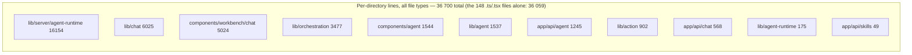
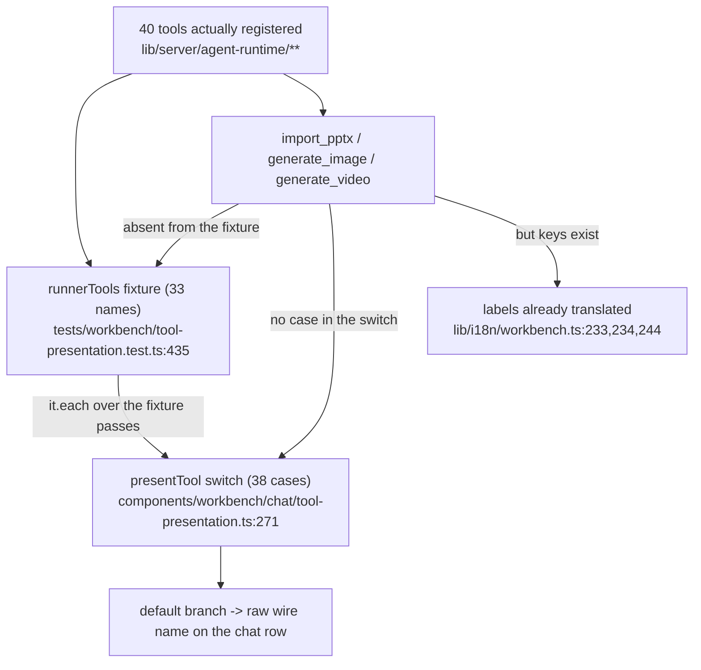

# Quality observations and measured metrics

## Measured metrics

Every number below was produced by the command shown next to it, run from the
repo root at commit `c2c9553a`.

| Metric | Value | Command |
| --- | --- | --- |
| Lines across the whole subsystem | 43 501 | `find lib/agent lib/agent-runtime lib/server/agent-runtime lib/chat lib/orchestration lib/action app/api/agent app/api/chat app/api/skills components/agent components/workbench/chat skills -type f \| xargs wc -l \| tail -1` |
| Per-directory lines | see table in `00-overview.md` | `for d in lib/agent lib/agent-runtime lib/server/agent-runtime lib/chat lib/orchestration lib/action app/api/agent app/api/chat app/api/skills components/agent components/workbench/chat skills; do printf '%s ' $d; find $d -type f \| xargs cat \| wc -l; done` |
| Largest module | `lib/server/agent-runtime/runner.ts`, 1923 lines | `wc -l lib/server/agent-runtime/runner.ts` |
| Next four largest | 1113 / 1004 / 1002 / 994 | `wc -l lib/chat/pi/tools/native-whiteboard.ts lib/chat/pi/tools/call-agent.ts components/workbench/chat/tool-presentation.ts lib/server/agent-runtime/dsl-tools.ts` |
| `.ts`/`.tsx` files in scope (excluding `skills/`) | 148 | node walk over the 11 code dirs, counting `/\.tsx?$/` |
| Lines in those files | 36 059 | same walk |
| Comment lines in those files | 5326 (**14.8 %**) | same walk, `/^(\/\/\|\/\*\|\*)/` on the trimmed line |
| `runner.ts` comment ratio | 256 / 1923 = **13.3 %** | same walk restricted to `runner.ts` |
| `eslint-disable` lines in scope | 20 | same walk, `/eslint-disable/` |
| `@ts-ignore` / `@ts-expect-error` in scope | **0** | same walk |
| Explicit `any` (`: any`, `as any`, `<any>`) in scope | 20 | same walk |
| Distinct tool names registered by the durable runtime | **40** | node walk of `lib/server/agent-runtime/**.ts` matching `/^\s*name: '([a-z_]+)'/m` (37) plus the three declared via `*_TOOL_NAME` constants (`import_pptx`, `generate_image`, `generate_video`) |
| Distinct tool names in the classroom runtime | **17** | same walk over `lib/chat/pi/**.ts` |
| `case '<tool>'` rows in `tool-presentation.ts` | **38** | `[...new Set([...src.matchAll(/case '([a-z_]+)':/g)].map(m => m[1]))].length` |
| Registered runner tools with **no** presentation row | **3** — `generate_image`, `generate_video`, `import_pptx` | set difference of the two above |
| Builtin skill directories | **23** | `ls -d skills/agent-runtime/*/ \| wc -l` |
| …of which carry `outline-constraints.json` | **9** | `ls skills/agent-runtime/*/outline-constraints.json \| wc -l` |
| Largest skill file | `skills/agent-runtime/slide-dsl/SKILL.md`, 892 lines | from the `wc -l` inventory |
| Test files under `tests/agent-runtime/` | **76** (78 entries incl. 2 non-test files) | node walk of `tests/agent-runtime`, filtering `/\.test\.ts$/` |
| `it(...)` cases under `tests/agent-runtime/` | **802** | same walk, counting `/^\s*it\(/m` |
| `process.env.*` names referenced in scope | 20 (plus `OPENMAIC_AGENT_TOOL_TIMEOUT_MS`, read indirectly via `env[AGENT_TOOL_TIMEOUT_ENV]`) | `grep -rho 'process\.env\.[A-Z0-9_]*' lib/agent lib/agent-runtime lib/server/agent-runtime lib/chat lib/orchestration lib/action app/api/agent app/api/chat app/api/skills \| sort -u` |
| pi harness pin | `@earendil-works/pi-agent-core` and `-ai` both exactly `0.78.0` | `grep -n 'earendil' package.json` |

## Genuine strengths

**The comments are a defect log, not decoration.** 14.8 % of in-scope lines are
comments, and a large share of them name the specific bug the code exists to
prevent, with enough detail to re-derive the decision. Examples that are
load-bearing for a new maintainer:
[`course-tools.ts:114-136`](lib/server/agent-runtime/course-tools.ts#L114-L136) (why writers are declared sequential to pi rather
than serialized by hand, and what the silent damage looked like),
[`skill-preload.ts:1-101`](lib/server/agent-runtime/skill-preload.ts#L1-L101) (the whole rationale for "a read that already
happened", including which crash prefixes it survives),
[`skills.ts:499-513`](lib/server/agent-runtime/skills.ts#L499-L513) (a three-row table of why each coverage condition is not
optional, each attributed to a real defect),
`runner.ts:1103-1119` (why there is exactly one NOTIFY subscription and why the
polls were demoted rather than deleted),
[`skill-preload.ts:316-331`](lib/server/agent-runtime/skill-preload.ts#L316-L331) (the 2000-line-slice bug: "the tail never arrived and
every turn paid for the head twice").

**Capability registration is consistent and principled.** The same rule is
applied at seven independent sites: a tool the deployment cannot serve is not
built, so the model never sees a tool that can only throw
(`runner.ts:1281-1293`, `:1416-1420`, [`course-tools.ts:196-216`](lib/server/agent-runtime/course-tools.ts#L196-L216),
`web-search.ts:24`, [`voice-clone-tools.ts:150`](lib/server/agent-runtime/voice-clone-tools.ts#L150), [`generate-video.ts:240`](lib/server/agent-runtime/generate-video.ts#L240),
`runner.ts:1190-1194`). This is the difference between a model that degrades
gracefully on a minimal deployment and one that burns turns on dead tools.

**Crash recovery is designed, not bolted on.** `planResume` +
`repairOrphanedToolCalls` + `appendInterruptedToolCallResults` form a coherent
three-part story with an explicitly stated consequence — at-least-once tool
execution, therefore every tool must be idempotent ([`resume.ts:33-37`](lib/server/agent-runtime/resume.ts#L33-L37)) — and the
idempotence claim is backed by naming the two tools that had to be made
idempotent (`putScene` on `(stageId, sceneId)`, `generate_scene` deriving its
scene id from the outline entry). The read/write asymmetry is right: synthetic
receipts are a read-time view and are deliberately never persisted, so the entry
tree stays an audit trail ([`tool-call-integrity.ts:104-107`](lib/server/agent-runtime/tool-call-integrity.ts#L104-L107)).

**Prompt-injection surfaces are explicitly labelled data.** Every untrusted
payload the runtime hands the model is wrapped and announced:
`untrustedElementDataBlock` (`runner.ts:502-512`), `wrapUserSkillContent`
([`skills.ts:140-150`](lib/server/agent-runtime/skills.ts#L140-L150), flagged "SECURITY BOUNDARY … do not reword it"),
`availableSkillsPromptBlock` prefixing user-authored descriptions with
"[User-authored metadata; low-priority task guidance]" ([`skills.ts:415-417`](lib/server/agent-runtime/skills.ts#L415-L417)),
`read_material` / `search_material` / `read_chat` descriptions telling the model
their own output is untrusted, and [`tool-presentation.ts:47-50`](components/workbench/chat/tool-presentation.ts#L47-L50) keeping tool
output out of the markdown renderer and away from `dangerouslySetInnerHTML`.
The `create_skill` result text deliberately echoes only the charset-constrained
`name`, never the free-text `title`, so a title cannot close the quotes and
continue the sentence ([`create-skill.ts:44-50`](lib/server/agent-runtime/create-skill.ts#L44-L50)).

**The tool timeout wrapper is unusually careful.** One settlement wins, the
guard makes the timeout the race winner even when the tool rejects synchronously
from the abort it was just delivered, a throwing abort listener cannot wedge the
race, and post-settlement progress updates from a zombie tool are dropped
([`tool-timeout.ts:127-199`](lib/agent/runtime/tool-timeout.ts#L127-L199)).

**Owner scoping has one shape everywhere.** `ownerId` is captured from the
claimed durable session and is absent from every model-visible parameter; one
probe factory is threaded into three call sites; a refusal never reveals which
of foreign / missing / tombstoned it was (`runner.ts:1347-1353`,
[`course-tools.ts:147-191`](lib/server/agent-runtime/course-tools.ts#L147-L191)). Owner-mismatch and not-found both return
byte-identical 404s at the HTTP boundary (`[id]/events/route.ts:68-85`).

**Test weight is where the risk is.** 802 `it()` cases in
`tests/agent-runtime/` alone, including tests named directly after the failure
classes: `runner-event-order`, `runner-tool-call-integrity`,
`runner-tool-timeout-cancel`, `runner-wakeup`, `runner-web-search-registration`,
`runner-voice-registration`, `skill-preload`.

## Real problems

**1. `generate_image`, `generate_video` and `import_pptx` render as raw wire
names in the chat, and the guard that was supposed to catch that does not cover
them.** Severity: medium.
[`tool-presentation.ts:29-39`](components/workbench/chat/tool-presentation.ts#L29-L39) states the rule — every tool the runtime can call
has a copy key, the `default` branch is "a fallback for a tool this file has not
been told about, never a shipping state", and
`tests/workbench/tool-presentation.test.ts` "reconciles the runner's allowlist
against this switch, so a newly registered tool without a label fails that test
rather than shipping its wire name". Measured reality: the switch has 38 cases
and the runtime registers 40 tools; the three missing are exactly
`generate_image`, `generate_video`, `import_pptx`. The translations already
exist ([`lib/i18n/workbench.ts:233-234`](lib/i18n/workbench.ts#L233-L234), [`:244`](lib/i18n/workbench.ts#L244) in English and [`:526-527`](lib/i18n/workbench.ts#L526-L527),
`:537` in Chinese, plus error variants at `:309-310`, `:318`) — only the switch
cases are absent. The reconciliation test does not fail because its
`runnerTools` fixture ([`tests/workbench/tool-presentation.test.ts:435-453`](tests/workbench/tool-presentation.test.ts#L435-L453)) is
**hand-maintained**: it composes `DSL_COURSE_TOOL_NAMES`,
`GENERATION_TOOL_NAMES`, `COURSE_AUDIO_DECK_TOOL_NAMES`,
`MATERIAL_MEDIA_TOOL_NAME`, `RENDER_SCENE_PREVIEW_TOOL_NAME`,
`CURRICULUM_ALLOWLIST`, `MATERIAL_TOOL_NAMES`, `ROSTER_TOOL_NAMES`,
`VOICE_CLONE_TOOL_NAMES`, `SKILL_EDIT_TOOL_NAMES` and four literals — and never
imports `IMPORT_PPTX_TOOL_NAME`, `GENERATE_IMAGE_TOOL_NAME`,
`GENERATE_VIDEO_TOOL_NAME`, or `PERSONAL_HISTORY_TOOL_NAMES`. The stale note at
[`tool-presentation.ts:10-11`](components/workbench/chat/tool-presentation.ts#L10-L11) ("PPT-import and video/image tools are not
registered upstream and have no rows") explains how it happened; those tools
*are* registered here ([`course-tools.ts:212-214`](lib/server/agent-runtime/course-tools.ts#L212-L214)). The floor assertion
`expect(runnerTools.length).toBeGreaterThanOrEqual(22)` (`:477`) only guards the
fixture against shrinking, not against a new tool being added elsewhere.

**2. The runner's allowlist is a second, partly hand-written expression over the
same tools.** Severity: medium.
`runner.ts:1475-1491` derives two entries from the registered arrays
(`dslTools.map(t => t.name)`, `scenePreviewTools.map(t => t.name)`) but spells
out the rest as constants and literals: `'create_skill'`,
`SKILL_EDIT_TOOL_NAMES`, `MATERIAL_TOOL_NAMES`, `CURRICULUM_ALLOWLIST`,
`ROSTER_TOOL_NAMES`, `PERSONAL_HISTORY_TOOL_NAMES`, the voice conditional. A
tool registered in one of those groups but omitted from its `*_TOOL_NAMES`
constant is *silently blocked at runtime* by `makeAllowlistGate` with "not
enabled in this build", which reads to the model as a build restriction rather
than a bug. `tests/agent-runtime/runner-contract.test.ts` is 19 lines and only
asserts that `assembleRunnerTools` flattens groups in order — it does not pin
registration ↔ allowlist. Note `MATERIAL_TOOL_NAMES`
([`material-tools.ts:604-611`](lib/server/agent-runtime/material-tools.ts#L604-L611)) contains `fetch_url`, which is built elsewhere
(`buildFetchUrlTool`, [`fetch-url.ts:610`](lib/server/agent-runtime/fetch-url.ts#L610)); that coupling is load-bearing and
undocumented at the constant.

**3. The `openmaic` skill documents a `language` field that the API silently
drops.** Severity: medium (it is the externally-published contract).
[`skills/openmaic/references/generate-flow.md:37`](skills/openmaic/references/generate-flow.md#requirement-only-generation) documents
`optional language ("zh-CN" | "en-US", defaults to "zh-CN")`.
`GenerateClassroomInput` ([`lib/server/classroom-generation.ts:48-60`](lib/server/classroom-generation.ts#L48-L60)) has no
`language` member, and [`app/api/generate-classroom/route.ts:19-36`](app/api/generate-classroom/route.ts#L19-L36) builds the
input by explicit per-field copy, so the value never reaches the generator. A
driver that sets `language: "en-US"` gets no error and no effect.

**4. The `openmaic` skill's stated auth mechanism does not exist in this
tree.** Severity: medium, possibly by design (see `07-open-questions.md`).
[`skills/openmaic/references/live-demo.md:12-13`](skills/openmaic/references/live-demo.md#access-code-setup) and
[`generate-flow.md:12`](skills/openmaic/references/generate-flow.md#preconditions) instruct the driver to send
`Authorization: Bearer <access-code>` on every request. The only access gate in
the repo is [`middleware.ts:60-85`](middleware.ts#L60-L85), which requires an HMAC-signed
`openmaic_access` **cookie** and 401s any other `/api/*` request; `grep -rn
"Bearer" app/api middleware.ts` finds only outbound provider headers in
`app/api/verify-pdf-provider/route.ts`. A self-hosted OpenMAIC with
`ACCESS_CODE` set will reject a Bearer-only driver on the very first
`/api/generate-classroom` call.

**5. `register_voice` results are unreachable after the run ends.**
Severity: low-medium, documented as intentional.
`runner.ts:1394-1419` keeps registered voices in a run-local array shared with
the roster tools ("in-session loop by design, no persistence"). A user who
clones a voice in one conversation and opens a new one cannot bind it, and
nothing in the tool result says so. Contrast `patch_skill`, which *does* attach
a scope note to every result ([`skill-edit-tools.ts:47`](lib/server/agent-runtime/skill-edit-tools.ts#L47)).

**6. The quota hook is a permanently-open stub.** Severity: low today, high if a
paid deployment ships. [`quota.ts:8-13`](lib/agent/runtime/quota.ts#L8-L13) is 13 lines and `buildAgent` wires it
with `remaining: () => Number.MAX_SAFE_INTEGER` ([`build-agent.ts:66`](lib/agent/runtime/build-agent.ts#L66)). The only
cost controls in the durable runtime are `maxConcurrent` (2),
`maxAttempts` (5), the per-tool timeout, and the 100 000-character text limit
([`limits.ts:9`](lib/server/agent-runtime/limits.ts#L9)) — whose own doc comment says the plan is "no credit gate and no
per-identity quota, so an anonymous identity could otherwise post unbounded
text and drive unbounded database bloat and unbounded LLM spend". The identity
in question is a cookie anyone can discard ([`owner.ts:52-64`](lib/server/agent-runtime/owner.ts#L52-L64)), so there is no
per-person bound at all.

**7. `runSession` is 970 lines of one function.** Severity: low; the trade is
argued at `runner.ts:886-888` ("its nested finally blocks pair every timer,
subscription, and agent listener with the exact lifetime in which it can fire")
and that argument is real — the closure captures `leaseLost`, `cancelled`,
`chain`, `entryWritesHealthy`, `terminalFrameEmitted`, `runEventEmitted`,
`tripwireViolated`, `messageHadThinking`, `thinkingEndPending`,
`thinkingEndEmitted`, `deliveredThrough`, `activeSkill`, `turnPinnedSkill`,
`pinValidThrough`, `userFramesSeen`, `questionEmitted`, `toolCalls`,
`drainInFlight`, `drainQueued`, `acceptedMessageSeqs`, `inFlightToolCalls`,
`interruptedResultsQueued`. Splitting it means either passing ~22 mutable cells
around or inventing a class. Still: it is the module a newcomer must read in
full before touching anything, and the file's own pure helpers
(`planResume`-adjacent exports at `:129`, `:203`, `:269`, `:292`, `:305`,
`:317`, `:324`, `:338`, `:412`, `:514`, `:682`, `:704`, `:721`, `:728`, `:772`,
`:829`, `:834`) show the seams that *were* extractable were extracted.

**8. Two live classroom paths with overlapping responsibility.** Severity: low
(clearly a migration), but real maintenance cost. `lib/chat/pi/` and
`lib/orchestration/director-graph.ts` both implement a director that dispatches
classroom agents, both emit the same `StatelessEvent` protocol, and both consume
`lib/orchestration/summarizers/` and `parseStructuredChunk`. The switch is
`NEXT_PUBLIC_PI_CHAT_ENABLED`, a build-time public flag, so a deployment runs
one and ships both. [`lib/orchestration/registry/store.ts:29-44`](lib/orchestration/registry/store.ts#L29-L44) re-declares
`WHITEBOARD_ACTIONS` and `SLIDE_ACTIONS` locally even though
[`registry/types.ts:62-77`](lib/orchestration/registry/types.ts#L62-L77) exports exactly those two constants — a small live
duplication inside the older path.

**9. The `skills.ts` builtin cache is process-lifetime.** Severity: low.
`listBuiltinSkills` memoizes into `builtinCache` ([`skills.ts:97`](lib/server/agent-runtime/skills.ts#L97), [`:171`](lib/server/agent-runtime/skills.ts#L171)) with
no invalidation, so editing a builtin SKILL.md requires a restart. Consistent
with `skill-edit-tools.ts`'s `SCOPE_NOTE`, and `readProvesCoverage`'s
`sourceHash` check means a *stale* body is at least never silently reused as
"loaded" — but a hot-reload developer loop does not exist.

**10. `agent-bar.tsx` at 941 lines with three components in it.** Severity: low.
`AgentVoicePill` (`:68`), `TeacherVoicePill` (`:350`) and `AgentBar` (`:614`)
share a file; the two pills are ~280 and ~260 lines each and are clean
extraction candidates.

**11. Three environment variables in the durable runtime are dead config.**
Severity: medium — an operator can set them and reasonably believe compaction is
on.
`agentRuntimeConfig.compaction` (`config.ts:27-42`) reads
`OPENMAIC_AGENT_COMPACTION_ENABLED`,
`OPENMAIC_AGENT_COMPACTION_RESERVE_TOKENS` and
`OPENMAIC_AGENT_COMPACTION_KEEP_RECENT_TOKENS`, and [`.env.example:385-387`](.env.example#L385-L387)
documents all three. A repo-wide search for `config.compaction` /
`agentRuntimeConfig.compaction` across `lib/ app/ components/ tests/ eval/ e2e/`
returns **zero** consumers, and `runner.ts` never passes `transformContext` to
`buildAgent` (the only production `transformContext` caller is
[`lib/chat/pi/director-loop.ts:216`](lib/chat/pi/director-loop.ts#L216), the classroom director). So the durable
runner runs with **no context transformation at all**, regardless of the flag —
which the config comment does admit ("the reusable compaction runtime lands in a
later slice, and until then the runner runs without context transformation",
`config.ts:20-26`), but the env var reads as a working switch. Two supporting
exports are pre-positioned for that future slice and currently have production
callers of zero: `withToolCallIntegrityRepair`
([`tool-call-integrity.ts:195`](lib/server/agent-runtime/tool-call-integrity.ts#L195), referenced only by
`tests/agent-runtime/tool-call-integrity.test.ts`) and `skillInvocationPrompt`
([`skills.ts:392`](lib/server/agent-runtime/skills.ts#L392), documented at [`skills.ts:22`](lib/server/agent-runtime/skills.ts#L22) as "no longer on the runner's
path", referenced only by [`tests/agent-runtime/skills.test.ts:64`](tests/agent-runtime/skills.test.ts#L64)).

**12. `meta.stageId` is stored, streamed to the client, and never read by the
runner.** Severity: low, and explicitly deferred.
[`app/api/agent/sessions/route.ts:139-143`](app/api/agent/sessions/route.ts#L139-L143) persists `stageId`;
[`lib/workbench/use-workbench-session.ts:145`](lib/workbench/use-workbench-session.ts#L145) forwards it to the client fold; a
grep of every `meta.` reference in `runner.ts` shows `id`, `attempt`,
`claimSeq`, `ownerId`, `skillId`, `deliveredUserMessageSeq`, `existingCourse`,
`prompt`, `claimReason` — but never `stageId`. An `existingCourse` session
therefore reaches the model with `existingCourse` as the only signal, and the
actual stage is conveyed by the opening message's `courseRefs` or discovered via
`list_folder_stages`. The route says so: "Full existence and ownership
validation is deferred until a later slice consumes stageId — the upstream
document store has no owner partition yet" (`route.ts:133-136`).
