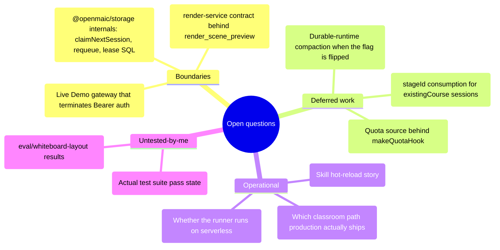

# Open questions

Things this survey could not determine from the code in the working tree, with
what was tried and why it did not resolve.

## Boundary questions (deliberately out of scope, but they gate real answers)

1. **`@openmaic/storage` semantics.** The whole lease/attempt/requeue protocol is
   implemented in `packages/@openmaic/storage` (`PgAgentSessionStore`), which
   this survey did not read. Concretely unresolved:
   `claimNextSession`'s ordering and fairness, whether `requeueSession` resets
   `attempt` to 0 or 1, what `claimSeq` is measured against, and whether
   `finishSession(..., expectedAttempt)` is a compare-and-set or an advisory
   check. Everything in `03-flows.md` and `05-failure-modes.md` describes what
   the *runner* does with these calls, not what the store guarantees.
   Consequence: the exact behaviour of two workers racing on the same session is
   asserted by the runner's comments and by
   `tests/agent-runtime/runner-*.test.ts`, not verified here.
2. **The durable event/entry SQL schema.** `ensureAgentSessionSchema(pool)`
   (`lib/server/agent-runtime/store.ts:47`) creates it inside the package. The
   `erDiagram` in `02-interfaces.md` is derived from `AgentSessionMeta` /
   `PersistedAgentSessionEvent` usage, not from DDL, and is labelled as such.
3. **The render service contract.** `render_scene_preview`
   (`scene-preview.ts:46`) is registered only when "the render capability is
   available"; the actual HTTP contract lives in `render-service/`, which is a
   different subsystem.
4. **Where `Authorization: Bearer <access-code>` is terminated for the Live
   Demo.** `skills/openmaic/references/live-demo.md:12-13` and
   `generate-flow.md:12` require that header on every request to
   `https://open.maic.chat`. `middleware.ts:60-85` is the only access gate in
   this tree and it reads a signed `openmaic_access` cookie;
   `grep -rn "Bearer" app/api middleware.ts` finds only outbound provider
   headers (`app/api/verify-pdf-provider/route.ts:102`, `:148`).
   *Inferred:* the hosted deployment sits behind a gateway or a fork that is not
   in this repository. Unresolved either way: what a **self-hosted** OpenMAIC
   with `ACCESS_CODE` set is supposed to do with a Bearer-only driver, and
   whether the `403 Daily quota exhausted` / 10-generations-per-day behaviour the
   skill documents (`live-demo.md:30-33`) exists anywhere in this codebase —
   nothing in `app/api/generate-classroom/` implements a quota.

## Deferred-work questions

5. **Does durable-runtime compaction work if the flag is enabled?**
   `OPENMAIC_AGENT_COMPACTION_ENABLED` and its two token knobs are read into
   `agentRuntimeConfig.compaction` (`config.ts:27-42`) and then never consumed
   (measured: zero references outside `config.ts`). The classroom director has a
   working compaction runtime (`lib/chat/pi/director-compaction.ts:106`) and the
   runner has the pieces that would be needed
   (`withToolCallIntegrityRepair`, `entry-tree-storage.ts`'s compaction-aware
   `contextEntries` mapping, `loadSessionEntryHistory`'s `firstKeptEntryId`
   validation). Whether flipping the flag is intended to be a one-line wiring of
   `transformContext` or requires the "later slice" the comment mentions cannot
   be answered from the code.
6. **What is supposed to consume `session.stageId`?** It is persisted and
   streamed but never read by the runner (see `06-quality-and-metrics.md` item
   12). The route's own comment says validation is deferred "until a later slice
   consumes stageId — the upstream document store has no owner partition yet"
   (`app/api/agent/sessions/route.ts:133-136`). Whether the intended consumer is
   a pre-seeded `read_stage` on the first turn, an owner-partition migration, or
   something else is not derivable.
7. **What will back `QuotaSource`?** `quota.ts:3` says "v0 stub; wire to the
   credit/quota system later" and `build-agent.ts:66` wires it open. There is no
   credit system in this repo's `lib/` that I found, so the intended source
   (per-owner credits? per-session token budget? the `usage/` normaliser?) is
   unknown.
8. **Is `import_pptx` / `generate_image` / `generate_video` missing from
   `tool-presentation.ts` an oversight or an intentional hide?** The i18n labels
   exist (`lib/i18n/workbench.ts:233-234`, `:244`, `:309-310`, `:318` and the
   Chinese equivalents), which argues strongly for oversight, and the stale note
   at `tool-presentation.ts:10-11` explains the mechanism. But `HIDDEN_TOOLS`
   (`tool-presentation.ts:85`) shows there *is* a deliberate hide mechanism and
   these three are not in it, so a third possibility (rows written, then lost in
   a rebase) cannot be ruled out from the tree alone. Git archaeology would
   settle it; it was not performed.

## Operational questions

9. **Which classroom path does a production deployment actually run?**
   `NEXT_PUBLIC_PI_CHAT_ENABLED` is commented out in `.env.example:324` and
   `OPENMAIC_ENABLE_PI_NATIVE_CHILD_RUNTIME` at `:298`, so the *shipped default*
   is the LangGraph path with the legacy JSON-action child. Whether that matches
   the deployed Live Demo, and whether the LangGraph path is scheduled for
   removal, is not stated anywhere I read.
10. **Can the durable runner run on a serverless platform?** `vercel.json`
    exists and both SSE routes set `maxDuration = 300` with a note that
    "self-hosted `next start` does not enforce maxDuration; it remains useful to
    Vercel's build adapter" (`[id]/events/route.ts:44-46`). But
    `startAgentRunner` is a `setInterval` in `instrumentation.ts`, which only
    makes sense on a long-lived Node process. Whether the intended production
    topology is a single always-on Node instance, several (the lease protocol
    supports it), or a separate worker deployment is not documented in the tree.
11. **Skill hot-reload.** `builtinCache` (`skills.ts:97`) never invalidates, so
    editing a builtin SKILL.md needs a restart. Whether `OPENMAIC_AGENT_SKILLS_DIR`
    is expected to point at a mounted volume that changes at runtime — in which
    case the cache is a bug rather than a choice — is unclear from
    `config.ts:43`'s "Overridable so a deployment can mount its own set".
12. **`materialExtraction` lifecycle events.** `HOST_AGENT_LIFECYCLE.materialExtraction`
    (`lifecycle.ts:66`) is declared here but written by
    `lib/server/material-extraction/runner.ts` (started alongside the agent
    runner at `instrumentation.ts:51`), which is a different subsystem. The
    interleaving guarantees between a material extraction event and a run event
    on the same session were not traced.

## Questions about my own measurements

13. **I did not run the test suite.** Every "tests cover X" statement in
    `06-quality-and-metrics.md` is derived from test *file and case names and
    imports*, not from a green run. Baseline pass/fail state: **unknown**.
14. **The 40-vs-17 tool counts are regex-derived.** They come from
    `/^\s*name: '([a-z_]+)'/m` over non-test `.ts` files plus three
    `*_TOOL_NAME` constants I found by inspection. A tool whose `name` is
    computed some fourth way would be missed. I cross-checked against
    `MINIMAL_AGENT_TOOL_NAMES`, `CURRICULUM_ALLOWLIST`, `GENERATION_TOOL_NAMES`,
    `MATERIAL_TOOL_NAMES`, `ROSTER_TOOL_NAMES`, `VOICE_CLONE_TOOL_NAMES`,
    `SKILL_EDIT_TOOL_NAMES`, `PERSONAL_HISTORY_TOOL_NAMES`,
    `DSL_COURSE_TOOL_NAMES`, `COURSE_AUDIO_DECK_TOOL_NAMES`,
    `MATERIAL_MEDIA_TOOL_NAME`, `RENDER_SCENE_PREVIEW_TOOL_NAME`,
    `IMPORT_PPTX_TOOL_NAME`, `GENERATE_IMAGE_TOOL_NAME`,
    `GENERATE_VIDEO_TOOL_NAME` and found no discrepancy, but that is a
    consistency check, not a proof.
15. **`lib/chat/pi/prompts.ts` (599 lines) was skimmed, not read in full.** The
    exported function list and the sanitizer are cited; the actual prompt text
    for the director and both child harnesses was not audited line by line, so
    claims about *what the prompts say* are limited to the constants I quoted
    (`CLASSROOM_COMPACTION_FOCUS`, `COURSE_SYSTEM_PROMPT`, `DSL_TOOLS_PROMPT`,
    `getActionDescriptions`).
16. **`lib/action/engine.ts` (902 lines) was structurally mapped, not read in
    full.** The action switch (`:234-283`) and the `wb_edit_code` operation set
    (`:766-786`) are verified; the per-action execution bodies (timing, widget
    iframe messaging, video-playability rules beyond `isPlayableVideoTask`) were
    not.
17. **`components/workbench/chat/` was read selectively** —
    `tool-presentation.ts` header + helper list, `chat-timeline.tsx` export list.
    The 5024 lines include a CSS-in-TS module (`chat-styles.ts`, 419 lines) and
    a stylesheet (`workbench-chat.css`, 453) that were not examined at all.
