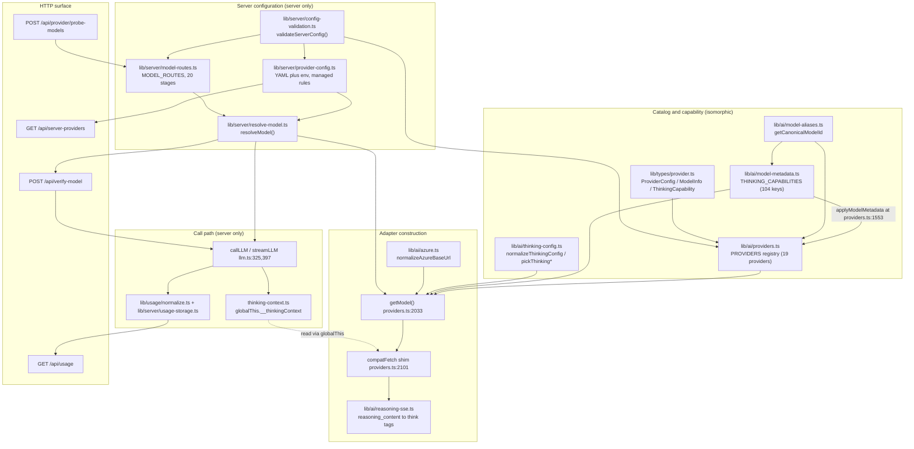

# AI Provider Layer — Overview

**Slug:** `ai-provider-layer`
**Surveyed at:** commit `c2c9553a` (branch `main`)
**Audience:** staff engineer joining the team

## What this subsystem is

The AI provider layer is the single seam between OpenMAIC's generation code and
every text-LLM vendor it can talk to. It owns four things:

1. **A static provider + model registry** — 19 providers, 104 model entries,
   declared as one object literal in `lib/ai/providers.ts:75`.
2. **A capability model** — per-model `streaming` / `tools` / `vision` booleans
   plus a rich `ThinkingCapability` record that describes how each model's
   reasoning control is wired on the wire (`lib/types/provider.ts:73`).
3. **Adapter construction** — `getModel()` (`lib/ai/providers.ts:2033`) turns a
   `(providerId, modelId, apiKey, baseUrl, proxy)` tuple into a Vercel AI SDK
   `LanguageModel`, choosing one of five transports and installing per-vendor
   `fetch` shims and reasoning middleware.
4. **Credential + routing resolution** — `lib/server/provider-config.ts` decides
   whose API key wins (operator's or the browser's),
   `lib/server/model-routes.ts` + `lib/server/resolve-model.ts` decide which
   model a generation *stage* uses.

Everything that actually calls a model funnels through `callLLM` / `streamLLM`
in `lib/ai/llm.ts:325` and `lib/ai/llm.ts:397`, which is where thinking options
are injected and token usage is recorded. That funnel is machine-enforced by an
ESLint rule (`eslint.config.mjs:620`) banning `generateText` / `streamText`
imports from `ai` everywhere except `lib/ai/llm.ts`, `eval/**` and `tests/**`.

## Charter boundaries

**In scope:** provider registration, model catalog, capability declaration,
thinking/reasoning transport adaptation, server-vs-client credential arbitration,
per-stage model routing, boot-time config validation, the `verify-*` and
`probe-models` handshakes, token/usage accounting.

**Explicitly not in scope:** TTS/ASR (`lib/audio/`), image/video generation
(`lib/media/`), PDF extraction (`lib/pdf/`), web search (`lib/web-search/`).
Those have their own provider catalogs and are only touched here because they
share the *same* server-config machinery in `lib/server/provider-config.ts`.

**`configs/` is not part of this subsystem.** The brief listed it, but every
file under `configs/` is whiteboard/DSL presentation data — `configs/theme.ts`
imports `@openmaic/dsl` presentation types, `configs/symbol.ts` is a glyph
table, `configs/mime.ts` is a MIME→extension map. There is no AI provider
content in `configs/`. It is documented here only as a negative finding.

## File inventory

Line counts measured with
`find … -name '*.ts' | xargs wc -l` (see `06-quality-and-metrics.md` for the
exact commands).

| Path | Lines | Role |
| --- | --- | --- |
| `lib/ai/providers.ts` | 2420 | Provider registry + `getModel()` adapter factory + per-vendor fetch shims |
| `lib/ai/model-metadata.ts` | 483 | `THINKING_CAPABILITIES` table; overlays thinking capability onto the registry |
| `lib/ai/llm.ts` | 424 | `callLLM` / `streamLLM`; thinking→`providerOptions` mapping; usage capture |
| `lib/ai/reasoning-sse.ts` | 237 | Rewrites `reasoning_content` into inline `<think>` blocks (stream + JSON) |
| `lib/ai/thinking-config.ts` | 213 | Pure normalization of `ThinkingConfig` against a `ThinkingCapability` |
| `lib/ai/azure.ts` | 28 | Azure portal URL → `@ai-sdk/azure` base URL |
| `lib/ai/thinking-context.ts` | 23 | `AsyncLocalStorage` carrier, published on `globalThis.__thinkingContext` |
| `lib/ai/model-aliases.ts` | 23 | Canonical-id aliasing (`openai:gpt-5.6-sol` → `gpt-5.6`) |
| `lib/types/provider.ts` | 195 | All public types for this layer |
| `lib/server/provider-config.ts` | 1116 | YAML + env server provider config; managed-vs-unmanaged credential rules |
| `lib/server/model-routes.ts` | 269 | `MODEL_ROUTES` parsing; the 20 routable `LLM_STAGES` |
| `lib/server/resolve-model.ts` | 191 | The single request-path resolver: stage route > `x-model` > `DEFAULT_MODEL` |
| `lib/server/config-validation.ts` | 213 | Boot-time warn-only validation, incl. the agent-driver route check |
| `lib/server/usage-storage.ts` | 211 | Append-only JSONL usage log under `data/usage/` |
| `lib/server/model-fetch.ts` | 164 | Multi-candidate `/models` discovery for OpenAI-compatible gateways |
| `lib/server/provider-capability-schema.ts` | 100 | Zod schema for operator-declared model capabilities |
| `lib/server/llm-error-response.ts` | 74 | Maps SDK `APICallError`/`RetryError` to a client-safe HTTP error |
| `lib/server/agent-runtime/agent-driver-model.ts` | 102 | Agent-driver route contract + pi-ai `Model` construction |
| `lib/config/apply-token-plan.ts` | 321 | Applies a one-key multi-modality token plan into the settings store |
| `lib/config/token-plan-presets.ts` | 212 | The two built-in token plans (MiniMax, Volcengine Ark) |
| `lib/config/feature-flags.ts` | 128 | `readBoolean` env flags, incl. the agent-runtime gates |
| `lib/usage/normalize.ts` | 66 | AI SDK `LanguageModelUsage` → 4-class `NormalizedUsage` |
| `lib/constants/agent-defaults.ts` | 40 | Agent colour/avatar palettes (not provider-related) |
| `lib/constants/generation.ts` | 16 | PDF/vision prompt caps (not provider-related) |
| `app/api/server-providers/route.ts` | 38 | `GET` — publishes which providers the server manages |
| `app/api/verify-model/route.ts` | 77 | `POST` — one-shot LLM connectivity probe |
| `app/api/provider/probe-models/route.ts` | 67 | `POST` — `/models` discovery, chat-model filter |
| `app/api/usage/route.ts` | 116 | `GET` — aggregates the usage JSONL by model / day / modality |
| `app/api/verify-pdf-provider/route.ts` | 185 | `POST` — PDF provider probe (AliDocMind AK/SK branch) |
| `app/api/verify-image-provider/route.ts` | 99 | `POST` — image provider probe |
| `app/api/verify-video-provider/route.ts` | 91 | `POST` — video provider probe |
| `instrumentation.ts` | 102 | Next `register()`; calls `validateServerConfig()` at boot |

## Internal structure

## The one-paragraph mental model

A request arrives at a generation route. The route calls
`resolveModelFromRequest()` (`lib/server/resolve-model.ts:183`), which picks a
model string with precedence **stage route > `x-model` header >
`DEFAULT_MODEL`**, then asks `lib/server/provider-config.ts` whether the
operator manages that provider. If managed, the operator's key/base URL are
authoritative and the client's are discarded wholesale; if unmanaged, the
client's are used and SSRF-validated in production. `getModel()` then builds the
SDK client, installs a `fetch` shim for OpenAI-compatible gateways and wraps the
model in `extractReasoningMiddleware`. The route hands the model to `callLLM`,
which resolves a `ThinkingConfig`, maps it to `providerOptions` for native
providers, publishes it on an `AsyncLocalStorage` for the `fetch` shim to pick
up (compatible providers strip unknown `providerOptions`), and records token
usage as a JSONL line after the call.

## Files in this pack

**Ten files — this pack now has every chapter `00`–`07`, the last of the ten packs to reach
that state.** `06-quality-and-metrics.md` and `07-open-questions.md` were missing through
most of this survey — the authoring agent for those two chapters died on an API error
mid-run — and have now been written. `01-modules` is split into `01a`/`01b` and
`02-interfaces` into `02`/`02b`, both to stay under the 350-line cap.

| File | Contents |
| --- | --- |
| `00-overview.md` | this file — charter, boundaries, source inventory, internal structure |
| [`01a-modules-catalog.md`](./01a-modules-catalog.md) | `lib/ai/*`, `lib/types/provider.ts`, `lib/config/*` — catalog, capability, call path |
| [`01b-modules-server.md`](./01b-modules-server.md) | `lib/server/*`, `lib/usage/*`, the HTTP routes |
| [`02-interfaces.md`](./02-interfaces.md) | verbatim signatures, isomorphic half: the type graph, `ProviderConfig`/`ModelInfo`/`ThinkingCapability`, `providers.ts`, `llm.ts`, `thinking-config.ts` |
| [`02b-interfaces-server-and-usage.md`](./02b-interfaces-server-and-usage.md) | verbatim signatures, server half: `resolve-model`, `model-routes` (the 20 `LLM_STAGES`), `provider-config`, `agent-driver-model`, usage types, `model-fetch` |
| [`03-flows.md`](./03-flows.md) | four traced end-to-end flows |
| [`04-dependencies-and-config.md`](./04-dependencies-and-config.md) | npm deps, full env-var inventory |
| [`05-failure-modes.md`](./05-failure-modes.md) | error handling and failure states |
| [`06-quality-and-metrics.md`](./06-quality-and-metrics.md) | measured registry/model/test counts, `any`/`eslint-disable` density, genuine strengths and real problems |
| [`07-open-questions.md`](./07-open-questions.md) | what this pack could not determine, including a self-caught false finding from its own first-pass method |

The measured registry counts (19 providers, 104 models, 20 stages) that
[`../../../04-ai-provider-layer/index.md`](../../../04-ai-provider-layer/index.md) and
[`../../../14-code-quality/index.md`](../../../14-code-quality/index.md) also cite are
re-derived independently in `06-quality-and-metrics.md` rather than only cross-referenced.
