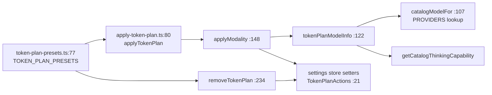

# Modules — Catalog, Capability, Call Path

Covers the isomorphic half of the subsystem: everything under `lib/ai/`,
`lib/types/provider.ts`, and `lib/config/`. Server-only modules and HTTP routes
are in `01b-modules-server.md`.

## `lib/ai/providers.ts` (2420 lines)

The largest module in the layer and, by line count, ~64 % pure data.

### The registry — `PROVIDERS` (`lib/ai/providers.ts:75`)

`Record<ProviderId, ProviderConfig>`, 19 keys. Registry order and per-provider
model counts (measured, see `06-quality-and-metrics.md`):

| Key | `type` | `requiresApiKey` | models | notes |
| --- | --- | --- | --- | --- |
| `openai` | `openai` | true | 8 | `lib/ai/providers.ts:76` |
| `azure` | `azure` | true | 0 | deployment names, not model ids (`:223`); `supportsModelDiscovery: false` |
| `atlascloud` | `openai` | true | 2 | `supportsModelDiscovery: true` (`:232`) |
| `anthropic` | `anthropic` | true | 9 | `:263` |
| `bedrock` | `bedrock` | **false** | 8 | `:418` — credential chain, not a key |
| `google` | `google` | true | 8 | `:483` |
| `glm` | `openai` | true | 10 | has `alternateBaseUrls` (CN / intl) `:627` |
| `qwen` | `openai` | true | 12 | |
| `deepseek` | `openai` | true | 2 | |
| `kimi` | `openai` | true | 6 | |
| `minimax` | `anthropic` | true | 2 | Anthropic-compatible endpoint `:1043` |
| `siliconflow` | `openai` | true | 7 | |
| `doubao` | `openai` | true | 8 | |
| `openrouter` | `openai` | true | 2 | |
| `grok` | `openai` | true | 10 | |
| `tencent-hunyuan` | `openai` | true | 1 | `:1372`, alternate CN/intl base URLs |
| `xiaomi` | `openai` | true | 5 | |
| `ollama` | `openai` | **false** | 3 | `http://localhost:11434/v1` `:1508` |
| `lemonade` | `openai` | **false** | 1 | `http://localhost:13305/v1` `:1540` |

Only five `ProviderType` values exist (`lib/types/provider.ts:38`), so 15 of the
19 providers share the `openai` transport. `minimax` reuses the `anthropic`
transport.

Immediately after the literal, `applyModelMetadata(PROVIDERS)` runs at module
load (`lib/ai/providers.ts:1553`) and **mutates** each `ModelInfo.capabilities`
in place to attach the thinking capability from `model-metadata.ts`. This is the
only mutation of the registry; everything downstream reads the merged shape.

### `getProviderConfig` (`lib/ai/providers.ts:1558`)

Built-in lookup first; if the id is unknown *and* `typeof window !== 'undefined'`,
it falls back to parsing `localStorage.getItem('providersConfig')`
(`:1567`). This is the custom-provider path — it only works in the browser, so a
server-side call for a `custom-*` provider returns `null` and `getModel` demands
an explicit `providerType`.

### `getModel` (`lib/ai/providers.ts:2033`)

The adapter factory. Ordered behaviour:

1. Reconcile `config.providerType` against the registry; mismatch throws
   (`:2039`).
2. Missing `providerType` with an unknown provider throws
   `Unknown provider: …` (`:2049`).
3. `requiresApiKey && !config.apiKey` throws `API key required for provider: …`
   (`:2054`).
4. Base URL precedence: `config.baseUrl` → `provider.defaultBaseUrl` →
   SDK default (`:2062`), passed through
   `normalizeMiniMaxAnthropicBaseUrl` (`:1755`) which forces the
   `…/anthropic/v1` suffix for MiniMax only.
5. `switch (providerType)` — five branches:
   - **`azure`** (`:2070`): `createAzure` with `normalizeAzureBaseUrl`.
   - **`openai`** (`:2079`): the complicated one, below.
   - **`anthropic`** (`:2233`): `sk-cp-` prefixed MiniMax keys go in `authToken`
     rather than `apiKey` (`:2237`); MiniMax also gets a `fetch` shim that
     injects `thinking: {type:'disabled'}` (`:2243`).
   - **`bedrock`** (`:2275`): `createAmazonBedrock` with region from
     `resolveBedrockRegion()` and a lazily-imported
     `fromNodeProviderChain()` credential provider (`:1793`).
   - **`google`** (`:2286`): optional `undici` `ProxyAgent` fetch when
     `config.proxy` is set (`:2294`).
   - default: throws `Unsupported provider type: …` (`:2318`).
6. Merge `config.modelInfo` (operator-declared) over the catalog entry, with
   `thinking` preferring the operator value (`:2322`–`:2335`).

### The OpenAI-compatible seam

Three predicates decide the transport for the `openai` branch:

- `shouldUseOpenAIResponsesApi` (`:1813`) — regex on model id: `gpt-5.N-pro`,
  `gpt-5.6*`, `gpt-5.5*`, `gpt-5.[3-9]-codex*` use the Responses API.
- `usesCustomOpenAIBaseUrl` (`:1824`) — anything whose origin isn't
  `https://api.openai.com` or whose path isn't `/v1`. An unparseable URL counts
  as custom.
- `shouldUseOpenAIStreamingChatCompat` (`:1838`) — `openai` slot + custom base
  URL + `OPENAI_COMPAT_USE_STREAMING_CHAT === 'true'`.

`usesCompatTransport` (`:2096`) is true for every non-`openai` provider id, and
for the `openai` id when its base URL is custom and it is not using Responses.
When true, `compatFetch` (`:2101`) is installed and the model is wrapped in
`extractReasoningMiddleware({ tagName: 'think' })` (`:2224`). Kimi `kimi-k3`
additionally gets `createKimiReasoningPreservationMiddleware()` prepended
(`:2221`).

`compatFetch` does, in order:

1. Read the current `ThinkingConfig` from `globalThis.__thinkingContext`
   (`:2103`) — never by importing `thinking-context.ts`, because this file is in
   the client bundle. For `lemonade` it falls back to the catalog default
   (`:2109`).
2. Ask `getCompatThinkingBodyParams` (`:1599`) for vendor body fields and merge
   them into the JSON body (`:2125`). For `lemonade` it also deletes
   `stream_options` (`:2122`).
3. For `kimi:kimi-k3`, restore encoded reasoning markers into
   `reasoning_content` (`:2141`).
4. Issue the request — via `fetchCustomOpenAIChat` when streaming-chat compat is
   on (`:2148`), otherwise `globalThis.fetch`.
5. On streaming responses, run `wrapResponseWithReasoning` (`:2164`); for
   `kimi-k3` non-streaming, `wrapJsonResponseWithReasoning` (`:2166`).
6. For `lemonade` only, clone and JSON-parse the body purely to emit a
   diagnostic warning on malformed JSON (`:2196`).

### `getCompatThinkingBodyParams` (`lib/ai/providers.ts:1599`)

A 12-way switch on `ThinkingCapability.requestAdapter` producing vendor body
fields. Notable shapes:

| adapter | emitted body |
| --- | --- |
| `openai` | `{ reasoning_effort }` |
| `kimi`, `xiaomi` | `{ thinking: { type: 'enabled' \| 'disabled' } }` |
| `glm` | `thinking` + optional `reasoning_effort` (`:1635`) |
| `deepseek` | `thinking` + `reasoning_effort` clamped to `high`/`max` (`:1662`) |
| `qwen` | `{ enable_thinking, thinking_budget }` |
| `siliconflow` | `{ enable_thinking?, thinking_budget }` |
| `doubao` | `reasoning_effort` (disable = `minimal`) or `thinking.type` |
| `openrouter` | `{ reasoning: { enabled, effort, max_tokens, exclude } }` |
| `hunyuan` | `{ chat_template_kwargs: { reasoning_effort } }` |
| `lemonade` | `{ chat_template_kwargs: { enable_thinking, thinking_budget } }` |

There is one hard-coded model special case ahead of the switch: the `openai`
slot serving `deepseek-v4-flash-vision-exp` needs
`chat_template_kwargs.thinking` (`:1609`).

### `fetchCustomOpenAIChat` (`lib/ai/providers.ts:1883`)

A non-streaming→streaming shim for gateways that only answer correctly with
`stream: true`. It forces `stream: true` + `include_usage`, reads the whole SSE
body, reassembles `id`/`created`/`model`/`content`/`tool_calls`/`usage` into a
synthetic `chat.completion` object (`:2007`), and surfaces in-stream `error`
objects with a status derived by `openAIStreamErrorStatus` (`:1873`).

### Model-string helpers

- `parseModelString` (`:2370`) splits on the **first** colon; a bare id silently
  defaults to `providerId: 'openai'` (`:2388`). Deliberately no warning here —
  the path is reachable with request-controlled strings.
- `warnBareModelIdDeprecation` (`:2359`) is the config-only warn-once helper;
  the message constant is at `:2347`.
- `getAllModels` (`:2397`), `getProvider` (`:2410`), `getModelInfo` (`:2417`),
  `isProviderKeyRequired` (`:2025`) — thin registry readers.

## `lib/ai/model-metadata.ts` (483 lines)

Five capability *constructors* (`effortCapability` `:15`, `levelCapability`
`:32`, `toggleCapability` `:48`, `toggleBudgetCapability` `:62`,
`budgetOnlyCapability` `:80`) plus a `fixedThinkingCapability` for models whose
reasoning cannot be controlled at all (`:97`).

`THINKING_CAPABILITIES` (`:264`) is a flat `Record<"provider:model",
ThinkingCapability>` with 104 keys. `getCatalogThinkingCapability` (`:456`) does
an exact canonical-id lookup with one wildcard: any unknown `lemonade` model
gets `lemonadeToggleBudget` (`:464`).

`applyModelMetadata` (`:471`) is the mutating overlay run once from
`providers.ts:1553`.

Anthropic capability nuances worth knowing: `anthropicManualEffort` (`:113`)
maps effort→`budgetTokens` via `anthropicManualBudgetByEffort` (`:106`), whereas
`anthropicAdaptiveEffort` (`:128`) sends `thinking: {type:'adaptive'}` and lets
the API pick. `anthropicFable5Effort` (`:154`) is non-toggleable and
non-budget-adjustable because the API rejects both.

## `lib/ai/llm.ts` (424 lines)

Two module-load lookup tables: `MODEL_THINKING_MAP` keyed
`provider:model` (`:64`) and `UNIQUE_MODEL_THINKING_MAP` keyed by bare model id,
populated only for ids that appear under exactly one provider (`:77`).

`normalizeProviderId` (`:117`) reverse-maps SDK provider strings back to
registry ids, with two special cases: `anthropic.messages` + a `MiniMax-*` model
id → `minimax`, and `amazon-bedrock` → `bedrock`.

`buildThinkingProviderOptions` (`:140`) handles only the three **native**
adapters (`openai`, `anthropic`, `google`) and returns `undefined` for everything
else, with the comment that compatible providers are handled in the `providers.ts`
fetch wrapper (`:210`).

`callLLM` (`:325`) resolves `thinking ?? getGlobalThinkingConfig()` (the
`LLM_THINKING_DISABLED` kill switch, `:99`), injects `providerOptions` unless the
caller set them (`:251`), runs inside `thinkingContext.run` (`:348`), records
`result.totalUsage ?? result.usage` **before** validating (`:361`) so a
validation-failed-but-billed attempt is still accounted, then retries per
`LLMRetryOptions` (`:268`).

`streamLLM` (`:397`) wraps the caller's `onFinish` to record
`event.totalUsage ?? event.usage` (`:415`).

`resolveThinkingProviderOptions` (`:223`) is exported with an explicit comment
that it has no production callers and exists for the SDK-integration tests.

## `lib/ai/thinking-config.ts` (213 lines)

Pure, dependency-free normalization. `getThinkingMode` (`:32`) collapses
`mode` + legacy `enabled` into `disabled|enabled|auto|undefined`.
`pickThinkingEffort` (`:42`) / `pickThinkingLevel` (`:63`) /
`pickThinkingBudget` (`:83`) each honour an explicit config value when the
capability allows it, otherwise derive from mode. `clampBudgetForCapability`
(`:20`) preserves `-1` only when `budgetRange.allowDynamic`.
`normalizeThinkingConfig` (`:144`) and `getThinkingDisplayValue` (`:191`) are
what the settings UI renders.

## `lib/ai/thinking-context.ts` (23 lines)

One `AsyncLocalStorage<ThinkingConfig | undefined>` (`:18`) published on
`globalThis.__thinkingContext` at module load (`:23`) precisely so
`providers.ts` can read it without importing `node:async_hooks` into the client
bundle. The file header spells out the constraint.

## `lib/ai/reasoning-sse.ts` (237 lines)

Recovers reasoning that `@ai-sdk/openai`'s chat schema drops.
`createReasoningContentRewriter` (`:112`) is a two-flag state machine that opens
`<think>` on the first `reasoning_content` delta and closes it at the first real
content / tool call / finish. `wrapResponseWithReasoning` (`:164`) applies it
over an SSE `TransformStream`, buffering partial lines.
`wrapJsonResponseWithReasoning` (`:203`) is the non-streaming equivalent.

Kimi needs the reverse trip too: `createKimiReasoningPreservationMiddleware`
(`:66`) encodes assistant reasoning parts as length-prefixed sentinel text
(`KIMI_REASONING_MARKER`, `:28`) and `restoreKimiReasoningInRequestBody` (`:88`)
decodes them back into `reasoning_content` after SDK serialization.

## `lib/ai/model-aliases.ts` (23 lines) and `lib/ai/azure.ts` (28 lines)

`MODEL_ID_ALIASES` currently holds exactly one entry:
`openai:gpt-5.6-sol → gpt-5.6` (`model-aliases.ts:1`). `findModelById` (`:13`)
resolves both directions so the wire id is never rewritten.
`normalizeAzureBaseUrl` (`azure.ts:9`) strips `/chat/completions`,
`/responses`, `/deployments/<name>`, and `/v1` for `*.openai.azure.com`,
defaulting the path to `/openai`.

## `lib/config/*`

`TOKEN_PLAN_PRESETS` (`lib/config/token-plan-presets.ts:77`) holds two entries:
`minimax` (`:80`) and `volcengine-ark` (`:139`). Each declares per-modality
targets across `llm|image|video|tts|webSearch`. `applyTokenPlan`
(`apply-token-plan.ts:80`) fills one key into every declared modality, isolating
failures per modality (`:94`). `tokenPlanModelInfo` (`:122`) overlays the
catalog thinking capability onto plan-seeded model ids so a seeded model does not
lose its reasoning control. `removeTokenPlan` (`:234`) restores built-in
registry defaults rather than just clearing the key — otherwise the shared
built-in provider would stay pointed at the plan endpoint (`:263`–`:285`).

`lib/config/feature-flags.ts` matters here only for
`isAgentRuntimeEnabled()` (`:18`), `isAgentRuntimeConfigured()` (`:23`) and
`isProWorkbenchEnabled()` (`:32`), which boot-time validation consults.
