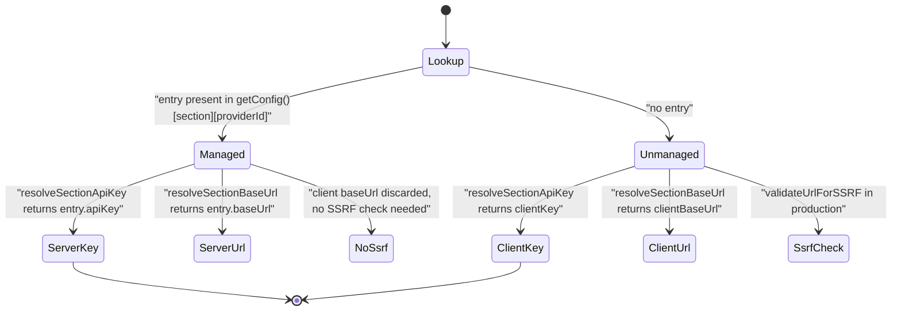
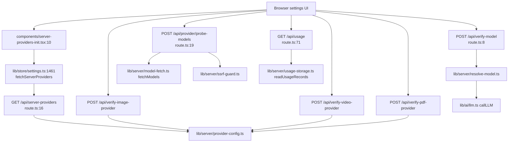

# Modules — Server Config, Routing, Usage, HTTP

The server-only half of the layer. Catalog/capability modules are in
`01a-modules-catalog.md`.

## `lib/server/provider-config.ts` (1116 lines)

The single source of truth for "what did the operator configure?". Header states
the contract outright: *"Keys never leave the server — only provider IDs and
metadata are exposed via API."* (`lib/server/provider-config.ts:5`).

### Shape

`ServerConfig` (`:52`) has seven capability sections — `providers` (LLM), `tts`,
`asr`, `pdf`, `image`, `video`, `webSearch` — plus `disabled`, a
`Record<CapabilitySection, Set<string>>` of force-off provider ids (`:61`).
`ServerProviderEntry` (`:30`) carries `apiKey`, `baseUrl`, `models`,
`modelCapabilities`, `proxy`, Aliyun `accessKeyId`/`accessKeySecret`, and
`enabled`.

### Env-prefix maps

`LLM_ENV_MAP` is exported (`:73`) because boot validation reads it. 21 prefixes
map to 19 provider ids — `TENCENT` and `TENCENT_HUNYUAN` both resolve to
`tencent-hunyuan` (`:88`–`:89`), `XIAOMI` and `MIMO` both to `xiaomi`
(`:90`–`:91`). Sibling maps: `TTS_ENV_MAP` (`:97`), `ASR_ENV_MAP` (`:109`),
`PDF_ENV_MAP` (`:117`), `IMAGE_ENV_MAP` (`:123`), `VIDEO_ENV_MAP` (`:133`),
`WEB_SEARCH_ENV_MAP` (`:142`).

### Load order

`getConfig()` (`:620`) is a process singleton cached in a `Map` keyed by YAML
filename (`:423`); the only key used is `''` for `server-providers.yml`
(`:417`). `buildConfig` (`:564`) composes each section through `loadEnvSection`
(`:294`), which applies YAML first as defaults and then lets env vars override
individual fields (`:334`–`:353`). Three post-processors patch sections that do
not fit the generic shape:

- `applyOpenAIImageFallback` (`:501`) — lights up `openai-image` from
  `OPENAI_API_KEY` alone.
- `applyAliDocMindFallback` (`:430`) — AK/SK pair instead of a single key;
  deletes a bare YAML-only entry so the provider stays *unmanaged* rather than
  managed-with-no-credentials (`:443`).
- `applyBedrockProviderConfig` (`:525`) — activates on any of
  `BEDROCK_REGION`, `BEDROCK_MODELS`, `BEDROCK_API_KEY`, `BEDROCK_BASE_URL`,
  `AWS_BEARER_TOKEN_BEDROCK`, or a YAML `bedrock` key (`:538`).

`collectDisabledProviders` (`:386`) reads YAML `enabled: false` and
`<CAP>_<PREFIX>_ENABLED` env vars. Unset/blank env is "no opinion" and never
overrides a YAML disable (`:405`); an explicit truthy env can re-enable
(`:406`). LLM and PDF deliberately have **no** force-off switch (`:162`).

### The managed/unmanaged rule

`resolveSectionApiKey` (`:669`) and `resolveSectionBaseUrl` (`:679`) implement
exactly two branches — there is no partial override. The header comment records
why: a tri-state where a client base URL could partially override server config
was the bug class patched route-by-route in issue #533 (`:636`–`:640`).

### The client-facing projection

`getServerProviders()` (`:698`) returns `Record<string, { models?: string[] }>` —
provider id + allowed model list only. The docstring is explicit that base URL is
withheld because it can reveal internal gateway infrastructure (`:696`).
The TTS/ASR/image/video/webSearch equivalents (`:749`, `:858`, `:920`, `:979`,
`:1038`) additionally publish `{ disabled: true }` for force-off providers so
admin surfaces can show them; `enabledProviderIds` (`:663`) is the helper every
capability consumer must use because disable wins (`:661`).

`getServerModelInfo` (`:709`) converts an operator `modelCapabilities` entry into
a `ModelInfo` that `getModel` can overlay onto the catalog.

## `lib/server/provider-capability-schema.ts` (100 lines)

Zod schema for the operator-declared per-model capabilities that can appear
inside `server-providers.yml` under `providers.<id>.models[]`. `.strict()`
(`:65`) rejects unknown keys; `.refine` requires at least one field (`:66`);
`.superRefine` cross-checks `defaultEffort ∈ effortValues`,
`defaultLevel ∈ levelValues`, and budget bounds (`:69`–`:85`).

Two compile-time assertions pin the schema and the hand-written
`ThinkingCapability` interface to each other in both directions
(`:87`–`:88`) — a genuinely nice trick: adding a field to one without the other
fails typecheck.

## `lib/server/model-routes.ts` (269 lines)

`MODEL_ROUTES` is a single JSON env var. `LLM_STAGES` (`:131`) enumerates the 20
routable stages; anything else is warned and dropped (`:224`).

Composite keys resolve most-specific-first: `getStageRoute` (`:253`) tries the
full key then strips trailing `:segment` groups, so
`scene-content:quiz` falls back to `scene-content`. The four routable
`scene-content:<type>` keys and four `pbl-v2-runtime:<route>` keys exist for that
purpose.

`StageRoute` (`:52`) carries `model`, `api`, `contextWindow` and `thinking`. The
docstring is honest that `api`/`dialect` and `contextWindow` are parsed for every
stage but consumed **only** by `maic-agent-driver` — inert everywhere else
(`:48`–`:51`).

`parseRouteValue` (`:160`) accepts a bare string or `{model, …}`. It tolerates
both `api` and `dialect` spellings, warns when both are set and disagree
(`:189`), and validates `contextWindow` as a finite integer ≥ 1 (`:196`).
`parseThinking` (`:75`) drops individual bad fields with a warning rather than
rejecting the route.

`loadRoutes` (`:214`) memoizes into a module-level `_routes` (`:157`), so
`MODEL_ROUTES` is effectively read once per process.

## `lib/server/resolve-model.ts` (191 lines)

The one function every generation route calls. `resolveModel` (`:41`):

1. Precedence — `getStageRoute(stage)?.model || params.modelString ||
   process.env.DEFAULT_MODEL` (`:65`). No hard-coded vendor fallback; nothing
   resolvable throws with a message naming all three knobs (`:66`–`:69`).
2. When a stage route wins, **all** client connection params are dropped
   (`:78`–`:81`) so a routed Anthropic model is never built with the browser's
   OpenAI key/type.
3. Server-managed providers ignore the client base URL entirely (`:104`);
   unmanaged client base URLs are SSRF-validated in production only (`:105`).
4. `providerType` mismatch against the registry throws (`:89`–`:97`).
5. Bedrock is gated: `effectiveProviderType === 'bedrock'` requires
   `providerId === 'bedrock'` **and** server-managed (`:101`).
6. Thinking arbitration mirrors model routing: routed + route thinking → route
   wins; routed + no route thinking → client thinking is *dropped*; unrouted →
   client thinking honoured (`:132`).

`resolveModelFromHeaders` (`:162`) reads `x-model`, `x-api-key`, `x-base-url`,
`x-provider-type`. `requiresApiKey` is never taken from a header — the docstring
calls this out as auth-bypass prevention (`:159`).
`resolveModelFromRequest` (`:183`) adds body `thinkingConfig` / `thinking`
via `getThinkingConfigFromBody` (`:148`).

## `lib/server/config-validation.ts` (213 lines)

Warn-only, non-throwing, run once from `instrumentation.ts:29`. Four checks:

| function | what it catches |
| --- | --- |
| `validateModelRoutes` (`:102`) | non-JSON `MODEL_ROUTES`, non-object, unknown stage keys, then per-route provider/key checks |
| `validateDefaultModel` (`:137`) | same checks for `DEFAULT_MODEL` |
| `validateModelsEnvPins` (`:148`) | `<PREFIX>_MODELS` set for a provider with no key (or no base URL for keyless) — dead config |
| `validateAgentRuntime` (`:177`) | agent-runtime flag without `DATABASE_URL`; the agent-driver route contract; public workbench flag without the server flag |

`checkModelString` (`:72`) distinguishes routed from unrouted sites: a routed
provider with no server key is a hard warning ("requests using it will fail"),
an unrouted one is only a note because a client key can still work
(`:89`–`:99`). Bare ids route to `warnBareModelIdDeprecation`, deduped per unique
id.

The whole thing is wrapped in a try/catch that itself only warns (`:208`).

## `lib/server/agent-runtime/agent-driver-model.ts` (102 lines)

`AGENT_DRIVER_STAGE = 'maic-agent-driver'` (`:6`).
`assertAgentDriverRouteConfig` (`:14`) is the boot-time contract, and it is
strict where the rest of the layer is permissive — it **throws**:

- no route configured at all (`:16`);
- a model id with no explicit `provider:` prefix, because `parseModelString`
  would silently default to `openai` (`:27`);
- `thinking.effort` set — the transport cannot combine `reasoning_effort` with
  function tools (`:34`);
- an `api` that is not `openai-completions` or `openai-responses`
  (`OPENAI_PI_APIS`, `:12`, checked at `:39`).

`buildPiDriverModel` (`:48`) constructs the pi-ai `Model`. Its context-window
chain is `route.contextWindow ?? modelInfo.contextWindow ?? 128_000` (`:73`),
and `maxTokens` falls back to `UNKNOWN_MODEL_RESERVED_OUTPUT_TOKENS = 8192`
(`:7`, used `:78`). `resolveAgentDriverModel` (`:83`) deliberately never consults
`DEFAULT_MODEL` and exposes `wireMaxOutputTokens` separately from
`reservedOutputTokens` so the 8192 estimate never becomes an API cap (`:94`–`:99`).

## `lib/server/model-fetch.ts` (164 lines)

`buildModelsUrlCandidates` (`:68`) generates an ordered candidate list from a
base URL: a `modelsUrlOverride` short-circuits to a single candidate; a base
ending in a version segment (`/v1`, `/paas/v4`) gets `…/models` plus a
`…/v1/models` fallback when the segment is not `/v1`; a base ending in one of
nine `KNOWN_COMPAT_SUFFIXES` (`:23`, ordered longest-first) also yields the
stripped root + `/v1/models` and `/models`. `fetchModels` (`:114`) tries each in
order with a 15 s timeout (`:35`), treats 404/405 as "wrong path" and continues,
rejects 3xx outright (`:132`), and surfaces any other non-2xx immediately as
`ModelFetchError` (`:156`) carrying the upstream status.

## Usage accounting

`lib/usage/normalize.ts` maps the AI SDK v6 `LanguageModelUsage` into a
four-class `NormalizedUsage` + `reasoningTokens` (`:10`), preferring nested
`inputTokenDetails`/`outputTokenDetails` and falling back to the deprecated flat
fields (`:41`–`:43`). Every missing field becomes 0, never `NaN`.
`hasBillableTokens` (`:59`) is the gate for writing a row.

`lib/server/usage-storage.ts` appends one JSON line per call to
`data/usage/<YYYY>-<MM>.jsonl` (`:14`, base dir `:9`). `recordUsage` (`:89`)
never throws (`:133`) and **returns early under test** unless an explicit
`baseDir` is passed (`:100`) — the comment records that tests were previously
polluting the live usage log. LLM rows require billable tokens; non-LLM rows
require `quantity > 0` (`:106`–`:110`). `recordGenerationUsage` (`:154`) is the
non-LLM wrapper. `readUsageRecords` (`:178`) skips malformed lines and defaults
legacy rows to `kind: 'llm'` (`:203`).

## HTTP surface

- `GET /api/server-providers` (`app/api/server-providers/route.ts:16`) returns
  all seven capability listings plus
  `generation.parallelSceneConcurrency` from
  `getParallelSceneConcurrency()` (`lib/server/provider-config.ts:1112`, clamped
  to `[0,10]`).
- `POST /api/verify-model` (`app/api/verify-model/route.ts:8`) resolves a model
  with no `stage`, then sends the literal prompt
  `Say "OK" if you can hear me.` with `maxOutputTokens: 64` and thinking forced
  off (`:39`–`:48`). Resolution failure → HTTP 401 (`:30`); upstream failure is
  string-matched into a friendlier message (`:60`–`:72`).
- `POST /api/provider/probe-models` (`app/api/provider/probe-models/route.ts:19`)
  SSRF-validates both `baseUrl` and `modelsUrl` (`:33`), fetches, then filters
  ids against `NON_CHAT_PATTERN` (`:10`) and reports `total`/`filtered`.
  A `ModelFetchError` 404 is re-emitted as HTTP 404 to signal "use manual model
  entry" (`:54`).
- `POST /api/verify-image-provider` and `…-video-provider` share one shape:
  provider default from `resolveServerImageProviderId()` /
  `resolveServerVideoProviderId()`, force-disable check → 403, managed check →
  discard client key/URL, SSRF in production, key/model presence checks, then a
  `test*Connectivity` probe. The image route also sets `maxDuration = 30`
  (`app/api/verify-image-provider/route.ts:37`).
- `POST /api/verify-pdf-provider` has an AliDocMind AK/SK branch that keeps
  managed and unmanaged credentials strictly separate — unmanaged *never* falls
  back to server env (`app/api/verify-pdf-provider/route.ts:46`).
- `GET /api/usage` (`app/api/usage/route.ts:71`) buckets by model, day and kind.
  `addTo` (`:47`) deliberately excludes cache read/write from `totalTokens`
  because provider-reported `inputTokens` already includes cached input (`:53`).
