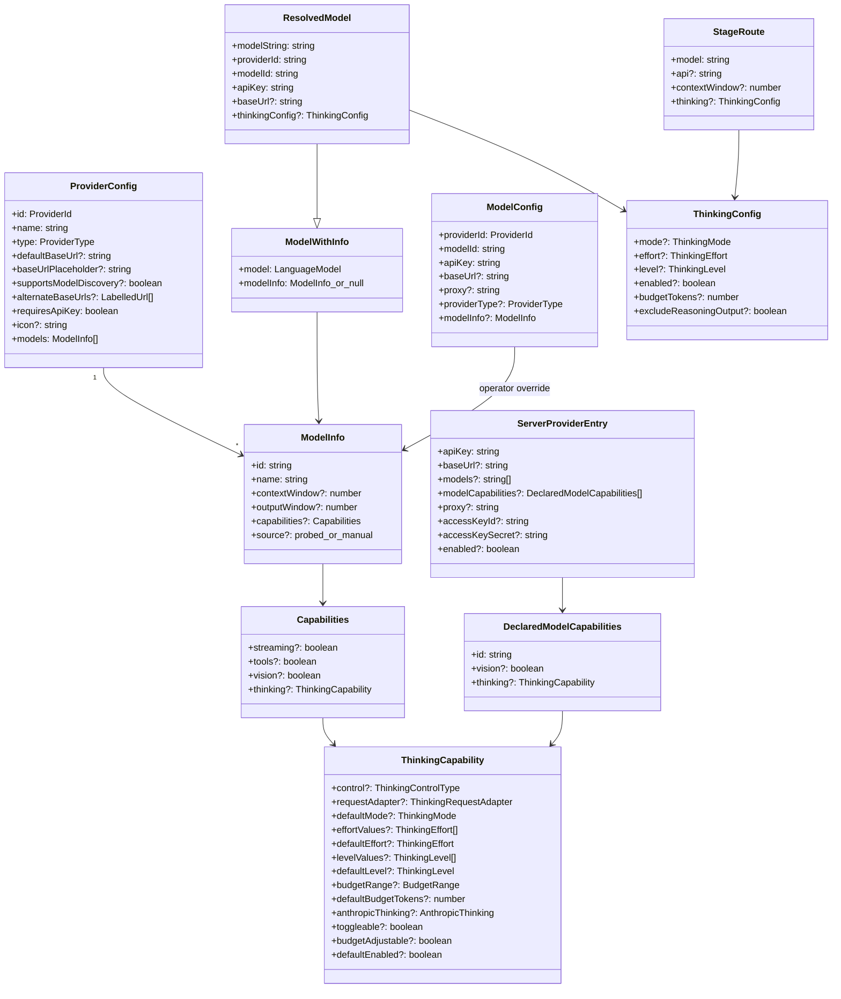

# Interfaces — Verbatim Types and Public Surface

Every signature below is copied verbatim from the source at the cited line. No
paraphrasing.

## Type graph



## `lib/types/provider.ts`

```ts
// :8
export type BuiltInProviderId =
  | 'openai'
  | 'azure'
  | 'atlascloud'
  | 'anthropic'
  | 'bedrock'
  | 'google'
  | 'deepseek'
  | 'qwen'
  | 'kimi'
  | 'minimax'
  | 'glm'
  | 'siliconflow'
  | 'doubao'
  | 'openrouter'
  | 'grok'
  | 'tencent-hunyuan'
  | 'xiaomi'
  | 'lemonade'
  | 'ollama';

// :33
export type ProviderId = BuiltInProviderId | `custom-${string}`;

// :38
export type ProviderType = 'openai' | 'azure' | 'anthropic' | 'bedrock' | 'google';

// :40
export type ThinkingControlType =
  | 'none'
  | 'toggle'
  | 'toggle-budget'
  | 'effort'
  | 'level'
  | 'mode'
  | 'budget-only';

// :49
export type ThinkingMode = 'default' | 'disabled' | 'enabled' | 'auto';
export type ThinkingEffort = 'none' | 'minimal' | 'low' | 'medium' | 'high' | 'xhigh' | 'max';
export type ThinkingLevel = 'minimal' | 'low' | 'medium' | 'high';

// :53
export type ThinkingRequestAdapter =
  | 'none'
  | 'openai'
  | 'anthropic'
  | 'google'
  | 'qwen'
  | 'deepseek'
  | 'kimi'
  | 'glm'
  | 'siliconflow'
  | 'doubao'
  | 'openrouter'
  | 'hunyuan'
  | 'xiaomi'
  | 'lemonade';
```

`ProviderId` is a union with a template-literal member, so
`Record<ProviderId, ProviderConfig>` at `lib/ai/providers.ts:75` behaves as an
index signature and does **not** force exhaustiveness over
`BuiltInProviderId`. All 19 built-ins happen to be present; the type does not
enforce it.

`ThinkingCapability` (`:73`), `ThinkingConfig` (`:115`), `ModelInfo` (`:141`),
`ProviderConfig` (`:164`) and `ModelConfig` (`:186`) are reproduced in the class
diagram above; the source comments on each field are worth reading in place.

Notable field docs:

```ts
// lib/types/provider.ts:152 (on ModelInfo.source)
  /**
   * Where this model entry came from. `'probed'` marks entries auto-discovered
   * by fetching the provider's /models endpoint — these are replaced wholesale
   * on a re-fetch (after a base-URL/key change) instead of accumulating stale
   * ids. Catalog and manually-added models leave this unset and are preserved.
   */
  source?: 'probed' | 'manual';
```

## `lib/ai/providers.ts` — public exports

```ts
// :67
export type { ProviderId, ProviderConfig, ModelInfo, ModelConfig };

// :70
export const MONO_LOGO_PROVIDERS: ReadonlySet<string> = new Set(['openai', 'openrouter', 'ollama']);

// :75
export const PROVIDERS: Record<ProviderId, ProviderConfig> = { /* 19 entries */ };

// :1594
export interface ModelWithInfo {
  model: LanguageModel;
  modelInfo: ModelInfo | null;
}

// :2025
export function isProviderKeyRequired(providerId: string): boolean;

// :2033
export function getModel(config: ModelConfig): ModelWithInfo;

// :2347
export const BARE_MODEL_ID_DEPRECATION_MSG =
  'bare model ids default to openai for backward compatibility; this fallback is deprecated — write provider:model';

// :2359
export function warnBareModelIdDeprecation(bareModelId: string, where?: string): boolean;

// :2370
export function parseModelString(modelString: string): {
  providerId: ProviderId;
  modelId: string;
};

// :2397
export function getAllModels(): {
  provider: ProviderConfig;
  models: ModelInfo[];
}[];

// :2410
export function getProvider(providerId: ProviderId): ProviderConfig | undefined;

// :2417
export function getModelInfo(providerId: ProviderId, modelId: string): ModelInfo | undefined;
```

## `lib/ai/llm.ts` — the single LLM entry point

```ts
// :268
export interface LLMRetryOptions {
  /** Max retry attempts when validate() fails or the response is empty (default: 0 = no retry) */
  retries?: number;
  /** Custom validation function. Return true to accept the result, false to retry.
   *  Default: checks that response text is non-empty. */
  validate?: (text: string) => boolean;
}

// :223
export function resolveThinkingProviderOptions(
  model: LanguageModel,
  thinkingConfig?: ThinkingConfig,
): ProviderOptions | undefined;

// :325
export async function callLLM<T extends GenerateTextParams>(
  params: T,
  source: string,
  retryOptions?: LLMRetryOptions,
  thinking?: ThinkingConfig,
): Promise<GenerateTextResult<any, any>>;

// :397
export function streamLLM<T extends StreamTextParams>(
  params: T,
  source: string,
  thinking?: ThinkingConfig,
): StreamTextResult<any, any>;
```

`source` is the label that lands in the usage log's `source` field
(`buildUsageMeta`, `lib/ai/llm.ts:287`) and in log grouping.

## `lib/ai/thinking-config.ts`

```ts
// :10
export function getThinkingConfigKey(providerId: string, modelId: string): string;

// :14
export function supportsConfigurableThinking(
  thinking?: ThinkingCapability,
): thinking is ThinkingCapability;

// :20
export function clampBudgetForCapability(
  thinking: ThinkingCapability,
  budgetTokens?: number,
): number | undefined;

// :32
export function getThinkingMode(
  config?: ThinkingConfig,
): 'disabled' | 'enabled' | 'auto' | undefined;

// :42
export function pickThinkingEffort(
  thinking: ThinkingCapability,
  config: ThinkingConfig,
): ThinkingEffort | undefined;

// :63
export function pickThinkingLevel(
  thinking: ThinkingCapability,
  config: ThinkingConfig,
): ThinkingLevel | undefined;

// :83
export function pickThinkingBudget(
  thinking: ThinkingCapability,
  config: ThinkingConfig,
): number | undefined;

// :112
export function getDefaultThinkingConfig(
  thinking?: ThinkingCapability,
): ThinkingConfig | undefined;

// :144
export function normalizeThinkingConfig(
  thinking: ThinkingCapability | undefined,
  config: ThinkingConfig | undefined,
): ThinkingConfig | undefined;

// :191
export function getThinkingDisplayValue(
  thinking: ThinkingCapability | undefined,
  config: ThinkingConfig | undefined,
): string | undefined;
```

---

**Continued in [`02b-interfaces-server-and-usage.md`](./02b-interfaces-server-and-usage.md)** —
the server-only half (`model-metadata`, `model-aliases`, `resolve-model`, `model-routes`
with the 20 `LLM_STAGES`, `provider-config`, `agent-driver-model`, the usage types,
`model-fetch`). Split from a single 598-line file; no signature was dropped.
Pack entry [`00-overview.md`](./00-overview.md) · all packs [`../index.md`](../index.md)
