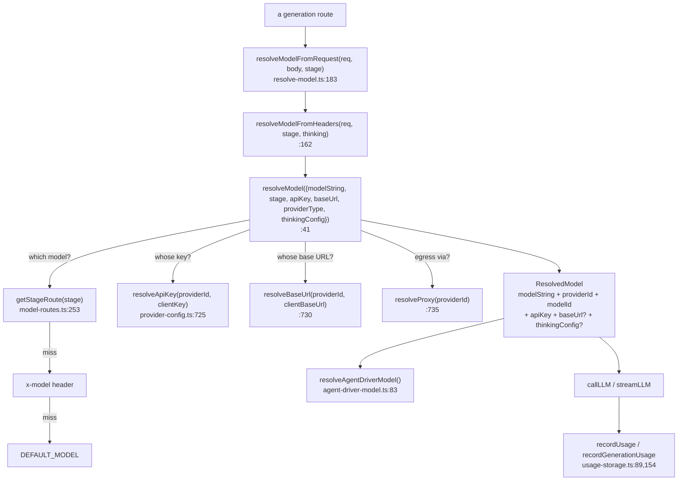

# Interfaces (b) — Server Resolution, Routing, Config and Usage

Second half of the interface transcription. [`02-interfaces.md`](docs/appendix/research/ai-provider-layer/02-interfaces.md)
carries the isomorphic half — the type graph, `lib/types/provider.ts`,
`lib/ai/providers.ts`, `lib/ai/llm.ts` and `lib/ai/thinking-config.ts`. This file carries
everything that only exists on the server, plus the two metadata helpers that bridge the
two.

Every signature below is copied verbatim from the source at the cited line. No
paraphrasing.

## Who calls whom across this half

The precedence chain is the reason these modules are split the way they are: three
independent resolvers each own one question, and only `resolveModel` composes them.



## `lib/ai/model-metadata.ts` and `lib/ai/model-aliases.ts`

The bridge: `applyModelMetadata` mutates the isomorphic registry in place at import time,
so a capability declared here is visible to every reader of `PROVIDERS`.

```ts
// model-metadata.ts:11
export function getModelMetadataKey(providerId: string, modelId: string): string;

// model-metadata.ts:456
export function getCatalogThinkingCapability(
  providerId: string,
  modelId: string,
): ThinkingCapability | undefined;

// model-metadata.ts:471
export function applyModelMetadata(providers: Record<ProviderId, ProviderConfig>): void;

// model-aliases.ts:4
export function getCanonicalModelId(providerId: string, modelId: string): string;

// model-aliases.ts:8
export function modelIdsMatch(providerId: string, left: string, right: string): boolean;

// model-aliases.ts:13
export function findModelById<T extends { id: string }>(
  providerId: string,
  models: readonly T[] | undefined,
  modelId: string,
): T | undefined;
```

## `lib/server/resolve-model.ts`

```ts
// :21
export interface ResolvedModel extends ModelWithInfo {
  /** Original model string (e.g. "openai/gpt-4o-mini") */
  modelString: string;
  /** Resolved provider ID (e.g. "openai", "ollama") */
  providerId: string;
  /** Resolved model ID (e.g. "gpt-4o-mini") */
  modelId: string;
  /** Effective API key after server-side fallback resolution */
  apiKey: string;
  /** Effective base URL after server/client resolution */
  baseUrl?: string;
  /** Optional per-request thinking configuration from the client. */
  thinkingConfig?: ThinkingConfig;
}

// :41
export async function resolveModel(params: {
  modelString?: string;
  stage?: LlmStage;
  apiKey?: string;
  baseUrl?: string;
  providerType?: string;
  thinkingConfig?: ThinkingConfig;
}): Promise<ResolvedModel>;

// :162
export async function resolveModelFromHeaders(
  req: NextRequest,
  stage?: LlmStage,
  thinkingConfig?: ThinkingConfig,
): Promise<ResolvedModel>;

// :183
export async function resolveModelFromRequest(
  req: NextRequest,
  body: unknown,
  stage?: LlmStage,
): Promise<ResolvedModel>;
```

`resolveModelFromHeaders` (`:162`) is exported but referenced by no other file in the
tree — see [`../../../14-code-quality/10-duplication-and-dead-code.md`](docs/14-code-quality/10-duplication-and-dead-code.md).

## `lib/server/model-routes.ts`

```ts
// :52
export interface StageRoute {
  model: string;
  api?: string;
  contextWindow?: number;
  thinking?: ThinkingConfig;
}

// :131
export const LLM_STAGES = [
  'scene-outlines-stream',
  'scene-content',
  'scene-content:slide',
  'scene-content:quiz',
  'scene-content:interactive',
  'scene-content:pbl',
  'scene-actions',
  'agent-profiles',
  'quiz-grade',
  'pbl-chat',
  'pbl-v2-runtime',
  'pbl-v2-runtime:instructor',
  'pbl-v2-runtime:open-task',
  'pbl-v2-runtime:evaluate',
  'pbl-v2-runtime:simulator',
  'chat-adapter',
  'generate-classroom',
  'web-search-query-rewrite',
  'maic-agent',
  'maic-agent-driver',
] as const;

// :154
export type LlmStage = (typeof LLM_STAGES)[number];

// :253
export function getStageRoute(stage?: string): StageRoute | undefined;

// :267
export function getStageModel(stage?: string): string | undefined;
```

Twenty members. `LlmStage` is the *routing* sense of the word "stage" and has nothing to
do with the `Stage` document or the pipeline steps — see
[`../../../glossary.md`](docs/glossary.md) for the four senses.

## `lib/server/provider-config.ts` — public API

```ts
// :73
export const LLM_ENV_MAP: Record<string, string>;

// :646
export function isServerConfiguredProvider(section: ProviderSection, providerId: string): boolean;
// :651
export function isServerProviderDisabled(section: CapabilitySection, providerId: string): boolean;
// :663
export function enabledProviderIds<T extends { disabled?: boolean }>(
  listing: Record<string, T>,
): string[];

// :698
export function getServerProviders(): Record<string, { models?: string[] }>;
// :709
export function getServerModelInfo(providerId: string, modelId: string): ModelInfo | undefined;
// :725
export function resolveApiKey(providerId: string, clientKey?: string): string;
// :730
export function resolveBaseUrl(providerId: string, clientBaseUrl?: string): string | undefined;
// :735
export function resolveProxy(providerId: string): string | undefined;
// :1112
export function getParallelSceneConcurrency(): number;
```

Capability-section siblings (same shape, different section):
`getServerTTSProviders` (`:749`), `enabledServerTTSProviderIds` (`:762`),
`resolveTTSApiKey` (`:768`), `isServerTTSProviderDisabled` (`:773`),
`resolveTTSBaseUrl` (`:777`), `resolveQwenVoiceCloneModel` (`:785`),
`TTSModelNotAllowedError` (`:789`), `resolveTTSModel` (`:805`),
`getServerASRProviders` (`:858`), `resolveASRApiKey` (`:866`),
`resolveASRBaseUrl` (`:870`), `resolveServerASRProviderId` (`:875`),
`resolveASRModel` (`:885`), `getServerPDFProviders` (`:899`),
`resolvePDFApiKey` (`:903`), `resolvePDFBaseUrl` (`:907`),
`getServerImageProviders` (`:920`), `resolveImageApiKey` (`:934`),
`resolveImageBaseUrl` (`:938`), `resolveServerImageProviderId` (`:951`),
`resolveImageModel` (`:961`), `getServerVideoProviders` (`:979`),
`resolveVideoApiKey` (`:993`), `resolveVideoBaseUrl` (`:997`),
`resolveServerVideoProviderId` (`:1010`), `resolveVideoModel` (`:1020`),
`getServerWebSearchProviders` (`:1038`), `resolveWebSearchApiKey` (`:1053`
overloads, impl `:1055`), `resolveWebSearchBaseUrl` (`:1062`),
`resolveWebSearchModel` (`:1074`), `resolveServerWebSearchProviderId` (`:1083`),
`resolveManagedAliDocMindCredentials` (`:469`),
`resolveServerMediaExtractorConfig` (`:484`).

`CapabilitySection` is `'tts' | 'asr' | 'image' | 'video' | 'webSearch'` (`:165`) and
`ProviderSection` is `'providers' | 'tts' | 'asr' | 'pdf' | 'image' | 'video' | 'webSearch'`
(`:643`) — seven sections, five of which have a disable switch.

## `lib/server/agent-runtime/agent-driver-model.ts`

```ts
// :6
export const AGENT_DRIVER_STAGE = 'maic-agent-driver' as const;
// :7
export const UNKNOWN_MODEL_RESERVED_OUTPUT_TOKENS = 8_192;

// :14
export function assertAgentDriverRouteConfig(route: StageRoute | undefined): string;

// :48
export function buildPiDriverModel(
  connection: ResolvedModel,
  configuredApi?: string,
  routeContextWindow?: number,
): Model<Api>;

// :83
export async function resolveAgentDriverModel(): Promise<{
  connection: ResolvedModel;
  piModel: Model<Api>;
  wireMaxOutputTokens?: number;
  reservedOutputTokens: number;
}>;
```

`assertAgentDriverRouteConfig` throws on four distinct bad states (`:16,27,34,40`). Its
boot-time caller downgrades the throw to a warning
([`lib/server/config-validation.ts:191-195`](lib/server/config-validation.ts#L191-L195)); a request-path caller does not.

## Usage types

```ts
// lib/usage/normalize.ts:10
export interface NormalizedUsage {
  inputTokens: number;
  outputTokens: number;
  cacheReadTokens: number;
  cacheCreationTokens: number;
  reasoningTokens: number;
}

// lib/server/usage-storage.ts:21
export type UsageKind = 'llm' | 'image' | 'video' | 'tts' | 'asr';
export type UsageUnit = 'token' | 'image' | 'second' | 'character';

// lib/server/usage-storage.ts:89
export async function recordUsage(
  input: UsageRecordInput,
  opts: RecordOptions = {},
): Promise<void>;

// lib/server/usage-storage.ts:154
export function recordGenerationUsage(input: GenerationUsageInput): Promise<void>;

// lib/server/usage-storage.ts:178
export async function readUsageRecords(opts: ReadOptions = {}): Promise<UsageRecord[]>;
```

`UsageKind` declares five modalities and four are written. `kind: 'asr'` appears nowhere
in the tree; the transcription path calls `experimental_transcribe` directly
(`lib/audio/asr-providers.ts:149,406`) and records nothing. See
[`../../../14-code-quality/09-architectural-consistency.md`](docs/14-code-quality/09-architectural-consistency.md).

## `lib/server/model-fetch.ts`

```ts
// :13
export interface FetchedModel {
  id: string;
  ownedBy?: string;
}

// :68
export function buildModelsUrlCandidates(
  baseUrl: string,
  opts: { modelsUrlOverride?: string } = {},
): string[];

// :114
export async function fetchModels(
  baseUrl: string,
  apiKey: string,
  opts: { modelsUrlOverride?: string } = {},
): Promise<FetchedModel[]>;

// :156
export class ModelFetchError extends Error {
  constructor(
    public readonly status: number,
    message: string,
  );
}
```

---

Previous: [`02-interfaces.md`](docs/appendix/research/ai-provider-layer/02-interfaces.md) · pack entry
[`00-overview.md`](docs/appendix/research/ai-provider-layer/00-overview.md) · all packs
[`../index.md`](docs/appendix/research/index.md)
